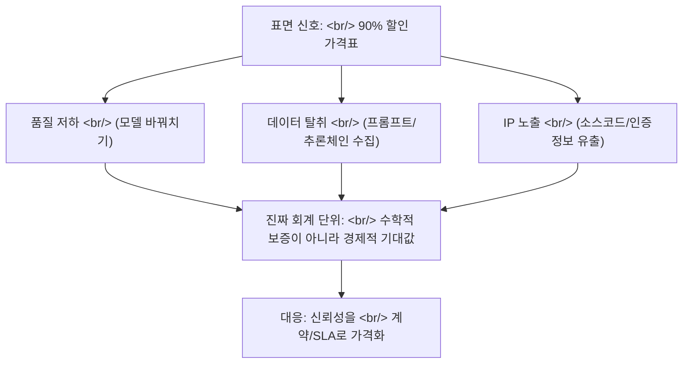

## 개요

[Claude API](https://www.anthropic.com/api)를 정가의 10% 가격에 판다는 중국발 프록시 시장이 드러났다. 표면은 단순한 가격 차익 거래처럼 보이지만, 한 꺼풀 벗기면 성능 저하와 [프롬프트](https://en.wikipedia.org/wiki/Prompt_engineering) 데이터 탈취가 묶인 파이프라인이다. 이 사건이 흥미로운 이유는 따로 있다 — **"모델 성능을 보장하라"는 요구에 답하려면 대화의 단위를 수학에서 경제학으로 옮겨야 한다**는 점을 가장 선명하게 보여주는 사례이기 때문이다.

<!--more-->

## 사건의 구조 — "싸다"는 신호 아래 무엇이 있었나

[코리아매니지먼트저널의 보도](https://www.kmjournal.net/news/articleView.html?idxno=11241)에 따르면, GitHub·Telegram·Taobao 같은 채널에서 Claude API가 정가 대비 약 90% 할인된 가격에 재판매되고 있었다. 할인의 출처는 정상적인 공급망이 아니다. 무료 체험 계정의 대량 생성, 도난당한 신용카드로 만든 구독, [Max 등급](https://www.anthropic.com/pricing) 계정 하나($200/월)를 여러 명이 쪼개 쓰는 방식, 그리고 가장 교묘한 **모델 바꿔치기** — 사용자는 [Claude Opus](https://www.anthropic.com/claude/opus)를 호출했다고 믿지만 실제로는 더 싼 [Haiku](https://www.anthropic.com/claude/haiku)나 오픈웨이트 모델의 응답을 받는다.

핵심 수치는 [CISPA 헬름홀츠 정보보안센터](https://cispa.de/en)가 17개 프록시 서비스를 분석한 결과에서 나온다. 공식 API가 의료 [벤치마크](https://en.wikipedia.org/wiki/Benchmark_(computing))에서 약 84% 정확도를 낸 반면, 프록시를 거치면 약 37%로 떨어졌다. **같은 가격표, 같은 API 형태, 절반 이하의 실질 성능.**

그리고 더 깊은 층 — 데이터 탈취. 프록시 운영자는 사용자의 프롬프트, 모델 응답, 그리고 [chain-of-thought](https://en.wikipedia.org/wiki/Prompt_engineering#Chain-of-thought) 추론 체인을 수집해 학습 데이터셋으로 재포장한다. 옥스퍼드 중국정책연구소의 Zhilan Chen 연구원은 이를 "API 프록시 경제(API Proxy Economy)"라 부른다. [Anthropic](https://www.anthropic.com/)은 2026년 2월 약 24,000개의 부정 계정이 1,600만 건 이상의 쿼리를 생성한 것을 탐지했다고 보고했고, [DeepSeek](https://en.wikipedia.org/wiki/DeepSeek)이 수천 개의 부정 계정으로 Claude와 수백만 건의 대화를 만들어 자사 모델 학습에 썼다고 지목한 바 있다.

## 왜 수학적 보장은 처음부터 불가능했나

"모델 성능을 100% 보장하라"는 요구는 직관적으로 합당해 보인다. 하지만 [LLM](https://en.wikipedia.org/wiki/Large_language_model)의 출력은 본질적으로 [확률적](https://en.wikipedia.org/wiki/Stochastic)이다. [temperature](https://en.wikipedia.org/wiki/Softmax_function) 샘플링, 컨텍스트 의존성, [할루시네이션](https://en.wikipedia.org/wiki/Hallucination_(artificial_intelligence))의 잔존 확률 — 어떤 단일 모델도 임의의 입력에 대해 정답률 1.0을 수학적으로 증명할 수 없다. [벤치마크](https://en.wikipedia.org/wiki/Benchmark_(computing)) 점수는 분포에 대한 추정치이지 보증서가 아니다. [MMLU](https://en.wikipedia.org/wiki/MMLU)에서 90%라는 숫자는 "이 데이터셋 분포에서 10번 중 1번은 틀린다"는 뜻이지, "당신의 다음 질문은 맞다"는 약속이 아니다.

이 사건은 그 한계를 악용한다. 프록시 사용자는 84%짜리 모델을 샀다고 믿었지만 37%짜리를 받았고, **그 차이를 스스로 측정할 방법이 없었다.** 수학적으로 "성능"을 정의해 보장받으려는 시도는 두 군데서 무너진다. 첫째, 보장의 대상(분포 전체)과 사용자가 신경 쓰는 것(내 다음 쿼리)이 다르다. 둘째, 공급망 중간에서 모델이 바꿔치기되면 사용자가 측정하는 숫자 자체가 신뢰할 수 없게 된다. 수학은 모델 카드 위에서는 작동하지만, 모델 카드와 사용자 사이의 [공급망](https://en.wikipedia.org/wiki/Supply_chain) 위에서는 작동하지 않는다.

## 대화의 단위를 경제학으로 옮기면

수학이 "이 모델은 얼마나 정확한가"를 묻는다면, 경제학은 "이 모델을 신뢰했다가 틀렸을 때 누가 얼마를 잃는가, 그리고 그 위험을 어떻게 가격화하는가"를 묻는다. 이 질문이 90% 할인 사건에 훨씬 잘 들어맞는다.

**기대값으로 본 할인.** 정가의 10%라는 가격은 공짜 점심이 아니라 [기대값](https://en.wikipedia.org/wiki/Expected_value) 계산의 한 변수다. 절약한 90%의 비용에 맞서, 절반으로 떨어진 정확도로 인한 의사결정 오류 비용, 프롬프트가 경쟁 모델 학습에 흘러 들어가는 전략적 손실, 소스코드·[API 키](https://en.wikipedia.org/wiki/API_key)·[인증 정보](https://en.wikipedia.org/wiki/Credential)가 검증되지 않은 서버에 노출되는 [기업 스파이](https://en.wikipedia.org/wiki/Industrial_espionage) 리스크가 반대편에 놓인다. 경제학의 언어로 보면 "90% 할인"은 가격이 아니라 **숨겨진 비용을 미래로 이연시킨 부채**다.

**[정보 비대칭](https://en.wikipedia.org/wiki/Information_asymmetry)과 레몬 시장.** 프록시 시장은 [조지 애컬로프의 레몬 시장](https://en.wikipedia.org/wiki/The_Market_for_Lemons)의 교과서적 재현이다. 판매자는 자기가 파는 게 Opus인지 Haiku인지 알지만 구매자는 모른다. 품질을 검증할 수 없으면 시장은 가격으로만 경쟁하고, 좋은 품질은 시장에서 밀려난다. 해법도 애컬로프가 제시한 것과 같다 — 신호(signaling)와 검증. 즉 공식 API의 [SOC 2](https://en.wikipedia.org/wiki/System_and_Organization_Controls) 같은 인증, 감사 가능한 로그, 그리고 계약.

**[SLA](https://en.wikipedia.org/wiki/Service-level_agreement)라는 번역기.** [서비스 수준 협약](https://en.wikipedia.org/wiki/Service-level_agreement)은 정확히 이 번역을 하는 도구다. SLA는 "100% 정확"을 약속하지 않는다. 대신 가용성·응답시간·품질 지표를 측정 가능한 목표로 정의하고, 위반 시 환불·계약 해지 같은 **금전적 결과**를 명시한다. 추상적인 "성능 보장"을 구체적이고 강제 가능한 경제적 약속으로 바꾸는 것이다. 모델이 확률적으로 틀릴 수 있다는 사실은 그대로 두되, 그 위험을 누가 떠안고 어떻게 보상하는지를 계약으로 정한다.

## 프로덕션 AI에 주는 함의

이 사건은 단순한 사기 사례 이상이다. [프로덕션 AI](https://en.wikipedia.org/wiki/MLOps)를 운영하는 모든 팀에게 세 가지를 강제한다.

첫째, **공급망 출처(provenance)가 모델 카드보다 먼저다.** 어떤 벤치마크 점수도 그 모델이 실제로 그 모델이라는 보장 없이는 의미가 없다. [모델 추출 공격](https://en.wikipedia.org/wiki/Model_extraction)과 바꿔치기가 가능한 세계에서, "어떤 모델인가"보다 "이 응답이 내가 계약한 그 경로에서 왔는가"가 먼저 검증돼야 한다.

둘째, **신뢰성 예산을 돈으로 환산하라.** 내부적으로 "이 워크플로우가 5% 틀리면 우리는 얼마를 잃는가"를 계산해 두면, 어떤 모델·어떤 가격·어떤 SLA를 살지가 신앙이 아니라 산수 문제가 된다. [Anthropic](https://www.anthropic.com/pricing)·[OpenAI](https://openai.com/api/)·[Google](https://ai.google.dev/) 같은 1차 공급자의 정가가 비싸 보일 때, 그 가격에 포함된 것은 토큰만이 아니라 출처 보증과 데이터 비유출 약속이다.

셋째, **데이터 유출은 일회성 비용이 아니라 전략적 자산 이전이다.** 프롬프트와 추론 체인이 경쟁 모델 학습에 쓰이면, 그것은 한 번의 정보 유출이 아니라 [지식 증류](https://en.wikipedia.org/wiki/Knowledge_distillation)를 통한 능력의 영구적 이전이다. 경제학의 언어로는 일회성 손실이 아니라 [자본 유출](https://en.wikipedia.org/wiki/Capital_flight)에 가깝다.

## 인사이트

90% 할인 클로드 사건의 진짜 교훈은 "싼 데는 이유가 있다"는 상식이 아니다. **모델 신뢰성이라는 문제가 수학적 보증의 영역에 머무는 한 답이 나오지 않는다**는 것이다. LLM은 확률적이고, 벤치마크는 분포의 추정치이며, 공급망은 모델 카드가 보증하지 않는 영역이다. "100% 보장하라"는 요구는 수학적으로는 영원히 충족 불가능하다. 그래서 성숙한 답은 보장의 단위를 바꾸는 것이다 — 정답률이라는 수학적 양에서, 기대값·정보 비대칭·계약 가능한 위험이라는 경제적 양으로.

이 전환은 패배 선언이 아니라 도구의 교체다. 경제학은 불확실성을 다루는 데 수학적 증명보다 훨씬 오래된 도구를 갖고 있다 — 보험, 계약, 신호, 평판, 감사. SLA가 가용성을 다루는 방식 그대로 품질과 출처를 다루면, "모델이 틀릴 수 있다"는 사실은 받아들이되 "그 위험을 누가 얼마에 떠안는가"는 명시할 수 있다. 90% 할인이라는 가격표가 위험한 이유도 바로 여기 있다 — 그것은 수학적으로는 매력적인 숫자처럼 보이지만, 경제학적으로는 측정되지 않은 부채를 미래로 떠넘기는 계약이기 때문이다. 프로덕션 AI를 운영하는 팀이 다음 분기에 던져야 할 질문은 "어떤 모델이 가장 정확한가"가 아니라 "우리의 신뢰성 예산은 얼마이고, 그것을 누구와 어떤 계약으로 사고 있는가"다.

## 참고

**원 사건 보도**
- [코리아매니지먼트저널 — Claude 90% 할인 프록시의 정체](https://www.kmjournal.net/news/articleView.html?idxno=11241) — 이 글이 다룬 1차 보도
- [CISPA Helmholtz Center for Information Security](https://cispa.de/en) — 17개 프록시 서비스의 성능 저하를 분석한 독일 정보보안 연구기관
- [Anthropic](https://www.anthropic.com/) — Claude 공급자, 부정 계정 탐지 보고의 출처
- [DeepSeek (Wikipedia)](https://en.wikipedia.org/wiki/DeepSeek) — Anthropic이 Claude 대화 데이터 무단 사용을 지목한 중국 AI 기업

**배경 개념 — 평가와 신뢰성**
- [Large language model](https://en.wikipedia.org/wiki/Large_language_model) · [Hallucination (AI)](https://en.wikipedia.org/wiki/Hallucination_(artificial_intelligence))
- [Benchmark (computing)](https://en.wikipedia.org/wiki/Benchmark_(computing)) · [MMLU](https://en.wikipedia.org/wiki/MMLU)
- [Stochastic process](https://en.wikipedia.org/wiki/Stochastic) · [Softmax / temperature](https://en.wikipedia.org/wiki/Softmax_function)
- [Model extraction](https://en.wikipedia.org/wiki/Model_extraction) · [Knowledge distillation](https://en.wikipedia.org/wiki/Knowledge_distillation)

**배경 개념 — 위험의 경제학**
- [Expected value](https://en.wikipedia.org/wiki/Expected_value) — 할인을 기대값의 한 변수로 보는 틀
- [The Market for Lemons](https://en.wikipedia.org/wiki/The_Market_for_Lemons) · [Information asymmetry](https://en.wikipedia.org/wiki/Information_asymmetry) — 검증 불가능한 품질이 시장을 무너뜨리는 메커니즘
- [Service-level agreement](https://en.wikipedia.org/wiki/Service-level_agreement) — 추상적 성능 보장을 경제적 계약으로 번역하는 도구
- [Industrial espionage](https://en.wikipedia.org/wiki/Industrial_espionage) · [Capital flight](https://en.wikipedia.org/wiki/Capital_flight) — 데이터 유출을 전략적 자산 이전으로 보는 관점
- [MLOps](https://en.wikipedia.org/wiki/MLOps) · [SOC 2](https://en.wikipedia.org/wiki/System_and_Organization_Controls) — 공급망 출처 검증의 실무 도구

**1차 공급자 가격 정보**
- [Anthropic API pricing](https://www.anthropic.com/pricing) · [OpenAI API](https://openai.com/api/) · [Google AI for Developers](https://ai.google.dev/)
