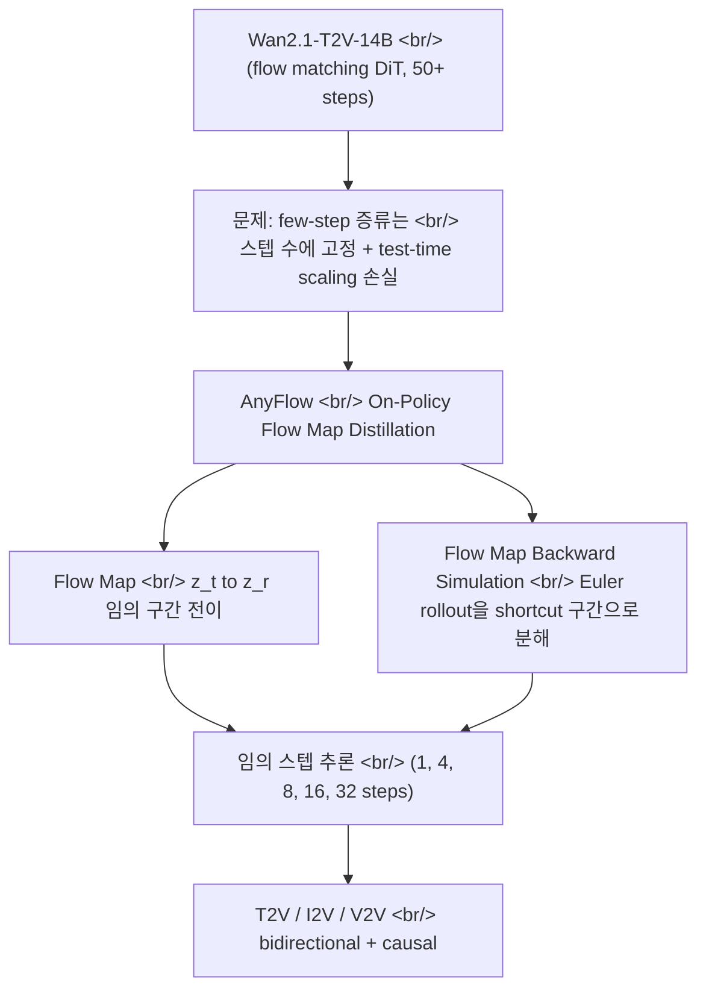

## 개요

[NVIDIA](https://www.nvidia.com/)가 공개한 [AnyFlow](https://nvlabs.github.io/AnyFlow)는 비디오 [디퓨전 모델](https://en.wikipedia.org/wiki/Diffusion_model)을 **추론 스텝 수에 묶이지 않게** 증류하는 프레임워크다. 기존 few-step 증류 모델은 4스텝이면 4스텝, 8스텝이면 8스텝에 고정돼 있었다 — AnyFlow는 같은 가중치 하나로 1스텝부터 수십 스텝까지 모두 돌아가고, 스텝을 늘릴수록 품질이 안정적으로 올라간다. 이 글은 [`nvidia/AnyFlow-Wan2.1-T2V-14B-Diffusers`](https://huggingface.co/nvidia/AnyFlow-Wan2.1-T2V-14B-Diffusers) 모델 카드를 출발점으로, 그 밑에 깔린 **온폴리시 플로우 맵 증류(On-Policy Flow Map Distillation)** 가 왜 기존 [컨시스턴시 증류](https://arxiv.org/abs/2303.01469)와 다른지를 본다.

<!--more-->



## 베이스 모델 — Wan2.1

AnyFlow는 처음부터 학습한 모델이 아니라, 알리바바의 오픈소스 비디오 생성 모델 [Wan2.1](https://github.com/Wan-Video/Wan2.1) 위에 올라간 증류 레이어다. 베이스가 되는 [`Wan-AI/Wan2.1-T2V-14B-Diffusers`](https://huggingface.co/Wan-AI/Wan2.1-T2V-14B-Diffusers)는 [Flow Matching](https://arxiv.org/abs/2210.02747) 프레임워크 위에 세운 14B 파라미터 [Diffusion Transformer](https://arxiv.org/abs/2212.09748)로, 다국어 [T5 인코더](https://huggingface.co/docs/transformers/model_doc/t5)로 텍스트를 받고 각 트랜스포머 블록에서 [cross-attention](https://en.wikipedia.org/wiki/Attention_(machine_learning))으로 조건을 주입한다. 시간 축 압축은 비디오 전용으로 설계된 **Wan-VAE** — 3D causal [VAE](https://en.wikipedia.org/wiki/Variational_autoencoder)가 담당한다.

Wan2.1의 약점은 디퓨전 모델 전반의 약점과 같다: **느리다**. 480P 5초 클립 한 편을 뽑는 데 50스텝 안팎의 [ODE](https://en.wikipedia.org/wiki/Ordinary_differential_equation) 적분이 필요하고, 14B 모델이라 한 스텝이 무겁다. 그래서 few-step 증류가 필요한데, 여기서 기존 방식의 한계가 드러난다.

## 문제 — few-step 증류는 왜 스텝 수에 묶이나

few-step 샘플링을 위한 표준 도구는 [컨시스턴시 모델](https://arxiv.org/abs/2303.01469) 계열의 증류다. 핵심 아이디어는 noise가 섞인 어느 시점 `z_t`에서든 곧장 깨끗한 출력 `z_0`로 가는 매핑을 학습시키는 것 — endpoint consistency mapping이다. 문제는 이 과정에서 **원래의 [probability-flow ODE](https://arxiv.org/abs/2011.13456) 궤적을 컨시스턴시 샘플링 궤적으로 통째로 갈아끼운다**는 점이다.

그 결과 두 가지가 깨진다. 첫째, 모델이 특정 스텝 수에 최적화돼 그 밖의 예산에서는 성능이 떨어진다. 둘째, 더 치명적으로 — **test-time scaling이 사라진다**. 일반 디퓨전 샘플링은 스텝을 늘리면 품질이 좋아지는데, 컨시스턴시 증류 모델은 스텝을 늘려도 좋아지지 않거나 오히려 나빠진다. ODE 궤적이 주는 "더 계산하면 더 정확해진다"는 성질을 버린 대가다. [AnyFlow 논문](https://arxiv.org/abs/2605.13724)은 바로 이 지점을 출발점으로 잡는다.

## AnyFlow의 답 — 온폴리시 플로우 맵 증류

AnyFlow의 전환은 한 줄로 요약된다: **endpoint mapping(`z_t → z_0`)을 버리고, 임의 시간 구간 전이 flow map(`z_t → z_r`)을 학습한다.** `z_0`라는 한 점이 아니라 궤적 위의 임의의 두 시점 사이 전이를 배우기 때문에, 추론 시 스텝을 어떻게 쪼개든 같은 모델이 대응한다. 이게 "any-step"의 기술적 근거다.

핵심 학습 기법은 **Flow Map Backward Simulation**이다. 전체 [Euler rollout](https://en.wikipedia.org/wiki/Euler_method)을 여러 개의 shortcut flow-map 구간으로 분해해서, 모델이 자기 자신이 만들어내는 중간 상태 위에서 학습하도록 — 즉 **온폴리시(on-policy)**로 — 만든다. 이 분해가 두 가지 오차원을 동시에 잡는다:

- **Discretization error** — few-step 샘플링에서 스텝을 크게 건너뛸 때 쌓이는 적분 오차
- **Exposure bias** — causal(자기회귀) 생성에서 학습 분포와 추론 분포가 어긋나며 누적되는 오차

[컨시스턴시 증류](https://arxiv.org/abs/2303.01469)와의 결정적 차이는 여기 있다. 컨시스턴시 증류는 원래 궤적을 **대체**하지만, AnyFlow는 원래 [ODE](https://en.wikipedia.org/wiki/Ordinary_differential_equation) 궤적을 **보존한 채 구간으로 분해**한다. 궤적을 그대로 두기 때문에 "스텝을 더 쓰면 더 정확해진다"는 성질이 살아남는다 — few-step 영역에서는 컨시스턴시 기반 방법과 비슷하거나 더 나으면서, 스텝을 늘리면 궤적 전체에 걸쳐 품질이 균일하게 올라간다.

## 무엇을 지원하나 — 아키텍처와 태스크

AnyFlow는 단일 모델이 아니라 [HuggingFace 컬렉션](https://huggingface.co/collections/nvidia/anyflow)으로 풀린 라인업이다.

| 모델 | 태스크 | 아키텍처 | 해상도 |
|---|---|---|---|
| [AnyFlow-Wan2.1-T2V-14B-Diffusers](https://huggingface.co/nvidia/AnyFlow-Wan2.1-T2V-14B-Diffusers) | T2V | bidirectional | 480P |
| [AnyFlow-Wan2.1-T2V-1.3B-Diffusers](https://huggingface.co/nvidia/AnyFlow-Wan2.1-T2V-1.3B-Diffusers) | T2V | bidirectional | 480P |
| [AnyFlow-FAR-Wan2.1-14B-Diffusers](https://huggingface.co/nvidia/AnyFlow-FAR-Wan2.1-14B-Diffusers) | T2V / I2V / V2V | causal | 480P |
| [AnyFlow-FAR-Wan2.1-1.3B-Diffusers](https://huggingface.co/nvidia/AnyFlow-FAR-Wan2.1-1.3B-Diffusers) | T2V / I2V / V2V | causal | 480P |

`FAR` 변형은 [Show Lab](https://sites.google.com/view/showlab)의 [FAR](https://github.com/showlab/FAR)(Long-Context Autoregressive Video Modeling, [arXiv 2503.19325](https://arxiv.org/abs/2503.19325)) — next-frame prediction 기반 causal 비디오 모델 — 위에 AnyFlow를 올린 것으로, [Text-to-Video](https://en.wikipedia.org/wiki/Text-to-video_model) 외에 Image-to-Video, Video-to-Video까지 한 모델에서 처리한다. bidirectional(Wan2.1 본체)과 causal(FAR) 양쪽에서 검증됐고, 스케일도 1.3B부터 14B까지 커버한다. exposure bias를 잡는 backward simulation이 특히 causal 쪽에서 의미가 크다.

## 써보기 — Diffusers

[🤗 Diffusers](https://github.com/huggingface/diffusers) 통합이 끝나 있어서 진입 장벽은 낮다. 표준 `DiffusionPipeline`으로도 로드되고, 스텝 수까지 제어하려면 전용 `WanAnyFlowPipeline`을 쓴다.

```python
import torch
from diffusers.utils import export_to_video
from far.pipelines.pipeline_wan_anyflow import WanAnyFlowPipeline

model_id = "nvidia/AnyFlow-Wan2.1-T2V-14B-Diffusers"
pipeline = WanAnyFlowPipeline.from_pretrained(model_id).to('cuda', dtype=torch.bfloat16)

video = pipeline(
    prompt="CG game concept digital art, a majestic elephant running towards a herd.",
    height=480, width=832, num_frames=81,
    num_inference_steps=4,           # 4 -> 8 -> 16으로 올리면 품질이 올라간다
    generator=torch.Generator('cuda').manual_seed(0)
).frames[0]

export_to_video(video, "output.mp4", fps=16)
```

핵심은 `num_inference_steps`다. 같은 체크포인트에서 이 값만 바꿔 속도-품질 곡선 위 어디든 고를 수 있다 — few-step 증류 모델이라면 불가능한 일이다. 학습·추론 스크립트와 [VBench](https://github.com/Vchitect/VBench) 평가 설정은 [NVlabs/AnyFlow](https://github.com/NVlabs/AnyFlow) 저장소에 있고, [accelerate](https://huggingface.co/docs/accelerate)·[transformers](https://huggingface.co/docs/transformers)와 함께 [`bfloat16`](https://en.wikipedia.org/wiki/Bfloat16_floating-point_format)으로 돌리는 게 권장된다.

라이선스는 주의가 필요하다. GitHub 코드는 [Apache 2.0](https://www.apache.org/licenses/LICENSE-2.0)이지만, HuggingFace에 올라간 **모델 가중치는 NVIDIA One-Way Noncommercial License (NSCLv1)** — 비상업 용도 한정이다. 베이스인 Wan2.1 자체는 Apache 2.0이라는 점과 대비된다.

## 인사이트

AnyFlow가 흥미로운 이유는 단순히 "더 빠른 비디오 모델"이라서가 아니다. 이 작업은 **증류라는 행위 자체의 디폴트를 다시 짠다**. 지난 몇 년간 few-step 증류의 암묵적 전제는 "추론 예산은 학습 시점에 정해진다"였다 — [LCM](https://arxiv.org/abs/2310.04378), [컨시스턴시 모델](https://arxiv.org/abs/2303.01469), 각종 step-distilled 체크포인트가 모두 그렇게 배포됐다. AnyFlow는 그 전제를 endpoint mapping 대신 flow map을 배우는 것만으로 풀어버린다. 결과적으로 "속도냐 품질이냐"가 배포 시점의 고정 선택이 아니라 **추론 시점의 슬라이더**가 된다.

더 깊은 통찰은 *무엇을 보존하느냐*에 있다. 컨시스턴시 증류는 원래 ODE 궤적을 버리는 대가로 속도를 샀고, 그 과정에서 test-time scaling이라는 디퓨전의 핵심 자산을 함께 잃었다. AnyFlow는 궤적을 보존하고 구간으로 쪼개는 쪽을 택해 그 자산을 지킨다 — "근사하려면 무엇을 버려도 되는가"가 아니라 "무엇을 반드시 지켜야 하는가"를 먼저 묻는 설계다. 온폴리시 backward simulation이 discretization error와 exposure bias를 한 메커니즘으로 동시에 잡는 것도 같은 맥락이다: 별도의 패치 두 개가 아니라, 궤적을 제대로 분해하면 자연히 따라오는 한 가지 성질이다.

남는 한계도 분명하다. 공개된 모델 카드와 프로젝트 페이지에는 정량 [VBench](https://github.com/Vchitect/VBench) 점수가 아직 명시돼 있지 않고 정성 비교와 상대 서술 위주이며, 해상도는 480P로 한정, 가중치 라이선스는 비상업이다. 그럼에도 방향은 분명하다 — 비디오 생성의 다음 라운드 차별화는 모델 크기가 아니라 **하나의 가중치가 얼마나 넓은 속도-품질 스펙트럼을 커버하느냐**에서 나온다. AnyFlow는 그 스펙트럼을 배포가 아니라 추론으로 옮긴 첫 사례다.

## 참고

**모델 & 코드**
- [nvidia/AnyFlow-Wan2.1-T2V-14B-Diffusers](https://huggingface.co/nvidia/AnyFlow-Wan2.1-T2V-14B-Diffusers) — 이 글이 다룬 모델 카드
- [AnyFlow HuggingFace 컬렉션](https://huggingface.co/collections/nvidia/anyflow) — 1.3B/14B, bidirectional/causal 전체 라인업
- [NVlabs/AnyFlow](https://github.com/NVlabs/AnyFlow) — 학습·추론·평가 코드 (Apache 2.0)
- [AnyFlow 프로젝트 페이지](https://nvlabs.github.io/AnyFlow) · [데모](https://nvlabs.github.io/AnyFlow/demo)
- [Wan-AI/Wan2.1-T2V-14B-Diffusers](https://huggingface.co/Wan-AI/Wan2.1-T2V-14B-Diffusers) · [Wan-Video/Wan2.1](https://github.com/Wan-Video/Wan2.1) — 베이스 모델

**논문**
- [AnyFlow: Any-Step Video Diffusion Model with On-Policy Flow Map Distillation (arXiv 2605.13724)](https://arxiv.org/abs/2605.13724) — Gu, Fang, Jiang, Mao, Han, Cai, Shou (NVIDIA / Show Lab NUS / MIT, 2026)
- [Long-Context Autoregressive Video Modeling with Next-Frame Prediction — FAR (arXiv 2503.19325)](https://arxiv.org/abs/2503.19325) — Gu, Mao, Shou (2025) — causal 변형의 베이스
- [Consistency Models (arXiv 2303.01469)](https://arxiv.org/abs/2303.01469) — AnyFlow가 대비하는 증류 패러다임
- [Latent Consistency Models (arXiv 2310.04378)](https://arxiv.org/abs/2310.04378) — few-step 증류의 대표 사례
- [Flow Matching for Generative Modeling (arXiv 2210.02747)](https://arxiv.org/abs/2210.02747) — Wan2.1·AnyFlow가 깔고 있는 생성 프레임워크
- [Score-Based Generative Modeling through SDEs (arXiv 2011.13456)](https://arxiv.org/abs/2011.13456) — probability-flow ODE의 원전
- [Scalable Diffusion Models with Transformers — DiT (arXiv 2212.09748)](https://arxiv.org/abs/2212.09748) — Wan2.1 백본 아키텍처

**배경 & 도구**
- [🤗 Diffusers](https://github.com/huggingface/diffusers) — 모델이 통합된 라이브러리
- [FAR](https://github.com/showlab/FAR) · [Self-Forcing](https://github.com/guandeh17/Self-Forcing) · [TiM](https://github.com/WZDTHU/TiM) — AnyFlow가 빌드 기반으로 밝힌 선행 작업
- [VBench](https://github.com/Vchitect/VBench) — 비디오 생성 평가 벤치마크
- [Diffusion model](https://en.wikipedia.org/wiki/Diffusion_model) · [Text-to-video model](https://en.wikipedia.org/wiki/Text-to-video_model) — 개념 배경
