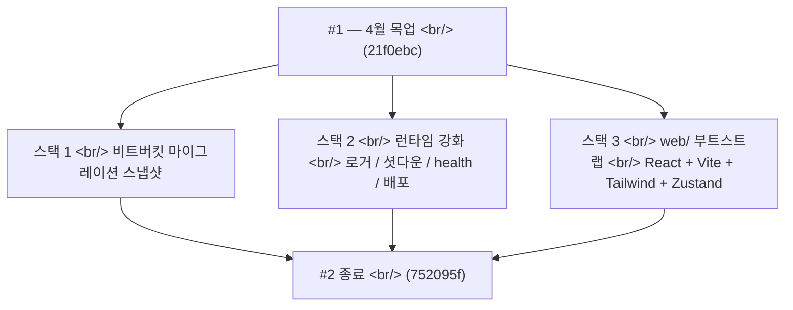

## 개요

[이전 글: #1 — 4월 목업 시절과 Creative Warmth 테마](/posts/2026-04-07-creative-agent-studio-dev1/)를 6주 전에 올렸다. 긴 잠복기를 지나, 2026-05-18이 **하루에 27커밋**으로 폭발했다 — 그리고 깔끔하게 세 스택으로 떨어졌다. 첫째, 레포 이전을 표시하는 비트버킷 마이그레이션 스냅샷. 둘째, **Node 런타임의 production-readying 패스** — 구조화 JSON 로거, `AbortSignal` 기반 graceful 워커 셧다운, `/api/health` + `/api/metrics`, 싱글 EC2 배포 자산(systemd, nginx, litestream), 그리고 모놀리식 큐를 쪼개는 세 리팩토링. 셋째, **72시간 안에 목업을 완전히 대체할 React+Vite+TypeScript 부트스트랩** — 4월에서 그대로 가져온 Creative Warmth 토큰의 Tailwind, 5개 빈 슬라이스의 Zustand 스토어, `<T>` i18n 컴포넌트, 그리고 첫 디자인 프리미티브.

<!--more-->



이 날의 관통 주제 — **더 이상 프로토타입처럼 다루지 마라.**

---

## 스택 1 — 비트버킷 마이그레이션 스냅샷

오늘의 첫 커밋(`9d414f2 chore: snapshot project state for bitbucket migration`)은 코드 변경이 아니라 마커였다. 레포는 엔지니어링 외의 이유로 옮겨가고, 스냅샷 커밋은 컷오버를 가독성 있게 만든다 — 이게 옛 집에서 가져온 상태고, 이후 모든 것은 새 집이다.

미래의 "뭐가 바뀐 거지?" 조사가 "이동에서 살아남은 코드" vs "이동 이후 추가된 코드"를 찾을 때 이 커밋에서 멈출 수 있다는 점에서 기록할 가치가 있다.

---

## 스택 2 — 런타임 production-readying

### 구조화 JSON 로거 + 채택

커밋 `ead6854`와 `d0b9ea4`가 구조화 JSON 로거를 도입하고 채팅 라우트 + 워커 라이프사이클 경로에 채택했다. 기존 패턴은 `console.log` 문자열이었는데, 로그 애그리게이터에 실제 배포되면 살아남지 못한다.

```js
// runtime/observability/logger.js (의역)
function createLogger({ component }) {
  return {
    info:  (msg, ctx) => emit({ level: "info",  component, msg, ...ctx, ts: Date.now() }),
    warn:  (msg, ctx) => emit({ level: "warn",  component, msg, ...ctx, ts: Date.now() }),
    error: (msg, ctx) => emit({ level: "error", component, msg, ...ctx, ts: Date.now() }),
  };
}
```

계약은 일부러 최소화 — 심각도 하나, 메시지 문자열 하나, 컨텍스트 객체 하나. 채팅 라우트가 첫 채택자였던 이유 — SSE 프레임이 발신되는 곳이고, 거기서 비구조화된 `console.log`는 stdout에서 프레임 헤더와 인터리브되어 로그를 망친다.

### AbortSignal 기반 graceful 워커 셧다운

커밋 `d9bf640`. 기존 워커 루프는 무한 `while (true)` 클레임 앤 런이었다. 워커 프로세스에 `kill -TERM`을 보내면 잡 중간에 죽고, SQLite `jobs` 행은 `running` 상태에 stale `worker_lock`을 들고 남았다 — 결국 stale-timeout 메커니즘으로 회수되지만 몇 분의 지연이 있었다.

`AbortSignal`을 루프에 꿰어 넣은 수정:

```js
// runtime/workers/worker-loop.js
export async function startWorkerLoop({ role, signal }) {
  while (!signal.aborted) {
    const job = await claimNextJob(db, role);
    if (!job) {
      await sleep(POLL_INTERVAL_MS, { signal });
      continue;
    }
    try {
      await runJob(job, { signal });
    } catch (err) {
      if (signal.aborted) {
        await releaseJobForReclaim(db, job.id);  // 명시적 잠금 해제
        return;
      }
      throw err;
    }
  }
}
```

`SIGTERM` 핸들러가 `controller.abort()`를 호출하고 워커가 안정될 때까지 기다리는 `server/index.js` 변경과 결합되면, 5분 회수 윈도우가 즉시 깔끔한 셧다운으로 바뀐다 — 롤링 배포에 중요하다.

### 일일 유지보수 + /api/health + /api/metrics

세 커밋이 운영 격차를 닫았다.

- `3ac2dfa` — 주기적 이벤트 로그 보존. SSE 프레임이 영속화되면서 `events` 테이블이 단조 증가한다. 보존 없이는 장기 실행 배포가 디스크를 채운다. cron 같은 잡이 매일 돌면서 N일보다 오래된 이벤트를 삭제한다.
- `89c7b05` — `/api/health`(부트 프로브)와 `/api/metrics`(Prometheus 스타일 카운터). 이제 로드 밸런서가 자기 일을 할 수 있고, Grafana 대시보드가 마침내 존재할 수 있다.
- `d0b9ea4` — 세 가지(셧다운, 유지보수, 로거)를 `server/index.js` 부트에 모두 꿰어 넣음.

Grafana 셋업 자체는 자기 문서를 받았다(`4236122 docs: add Grafana Cloud setup guide for EC2 deployment`) — 메트릭 셋이 한 번 배포하고 잊어버릴 만큼 작았기 때문이다. 런타임의 텔레메트리 관심사는 큐 깊이, 잡 지속시간, 게이트 승인까지의 시간뿐이었다.

### 싱글 EC2 배포 자산

커밋 `9ac967f`가 싱글 EC2 배포 스택 전체를 추가했다 — Node 서버 + 워커용 systemd 유닛 파일, TLS를 종료하고 `:7878`로 프록시하는 nginx 설정, 그리고 `data/runtime.sqlite`를 S3로 지속적으로 복제하는 Litestream 설정. Litestream이 핵심이다 — 애플리케이션 코드를 바꾸지 않고 지속적 시점 백업을 제공해서 소규모 팀 앱에 SQLite를 production 선택지로 옹호할 수 있게 한다.

### 런타임 리팩토링

다가올 PR0-PR4 폭주에 코드베이스를 준비시킨 세 동반 리팩토링.

- `1cf3bce refactor: split runtime/queue/jobs.js into runs/jobs/events modules` — `jobs.js`가 실행 라이프사이클, 잡 클레임, 이벤트 영속화를 뒤섞은 god-module이 됐었다. 단일 책임 세 모듈로 쪼갬.
- `4ee661e refactor: extract stage state machine + route events through persistEvent` — "실행이 어느 단계에 있고, 거기서 어디로 전이할 수 있는가" 로직이 워커 곳곳에 흩뿌려져 있었다. 단일 상태 머신 모듈로 추출. 모든 이벤트 쓰기는 `persistEvent`를 거치니 빠진 이벤트가 silent 버그가 될 수 없다.
- `c7291af refactor: consolidate Google AI SDK on @google/genai` — 코드베이스가 두 Google SDK 패키지를 동시에 사용하고 있었다. `@google/genai`로 통합.

런타임 SQLite는 `data/`로 이전됐다(`2e3ac8a`) — `.gitignore`-by-intent 파일이 WAL/SHM 저널 옆 전용 서브디렉토리에 살 수 있도록.

---

## 스택 3 — React 재작성 부트스트랩

목업의 날들은 카운트다운 중이었다. 디자인 스펙(`253f83d docs: add design spec for mockup → web/ (React + Vite + TS) rebuild`)과 구현 계획(`c81b248 docs: add PR0 implementation plan for web/ infra bootstrap`)이 타깃을 선언했다. 20개 커밋이 그것을 실체화했다.

### 패키지 + 툴링

```
web/package.json          React 18 + Vite + TypeScript
web/tsconfig.{json,app.json,node.json}   Vite 표준 3-파일 분할
web/vite.config.ts        /api 프록시 → :7878 (Express 포트와 매칭)
web/tailwind.config.ts    Creative Warmth 토큰
web/vitest.config.ts      jsdom + RTL 셋업
```

Tailwind 설정(`17aecd9`)은 짚을 가치가 있다 — 4월 목업 CSS의 모든 Creative Warmth 토큰이 손으로 Tailwind 확장으로 번역됐다.

```ts
// web/tailwind.config.ts (의역)
export default {
  theme: {
    extend: {
      colors: {
        'warm-white': '#FAF7F2',  // 본문 배경
        'warm-paper': '#F5F1EA',  // 떠올린 표면
        'text-primary': '#2A2622', // 순흑 아님
      },
      fontFamily: {
        display: ['"DM Serif Display"', 'serif'],
        hand: ['Caveat', 'cursive'],
      },
    },
  },
};
```

디자인 토큰은 하나도 재유도되지 않았다 — 그대로 끌어올렸다. 목업은 일회용 코드였지만, 디자인 시스템은 하중을 지탱하고 있었다.

### 스토어 스캐폴드

커밋 `0b469b8 feat(web): scaffold Zustand store with 5 empty slices`는 어떤 기능 코드보다 먼저 상태 아키텍처를 셋업했다.

```ts
// web/src/store/index.ts
type Store = UiSlice & ProjectsSlice & WorkspaceSlice & FeedSlice & PipelineSlice;

export const useStore = create<Store>()((set, get, api) => ({
  ...createUiSlice(set, get, api),
  ...createProjectsSlice(set, get, api),
  ...createWorkspaceSlice(set, get, api),
  ...createFeedSlice(set, get, api),
  ...createPipelineSlice(set, get, api),
}));
```

5개 슬라이스 — `ui`, `projects`, `workspace`, `feed`, `pipeline` — 가 1일차에 *빈* 상태로 선언됐고, 모양을 잠그는 테스트(`9543922 test(web): assert store init exposes all five slices`)가 따라붙었다. 그래야 후속 커밋들이 슬라이스를 잊지 않고 필드를 추가할 수 있다. 그 결정이 다음 3일 동안 100+ 커밋이 그 슬라이스들에 병렬로 필드를 추가할 때 보상을 줬다.

### `<T>` i18n 컴포넌트

커밋 `24ff23e feat(web): add <T> i18n component with KO/EN toggle + tests`. 앱의 주 언어는 한국어지만, 영어 지원을 시작부터 띄운다는 건 어떤 컴포넌트가 쓰이기 전에 이중언어 prop 패턴이 확립됐다는 뜻이다.

```tsx
<T ko="키 컨셉을 선택하세요" en="Select a key concept" />
```

작은 선택 — 두 props vs i18n 키 조회 — 이지만 소스 오브 트루스를 소비자와 같이 두는 효과가 있다. 단일 개발자 크리에이티브 도구에서는 어떤 프레임워크 레벨 i18n 추상화보다 나았다.

### 디자인 프리미티브

뒤에 오는 모든 것을 정착시킬 세 프리미티브가 1일차에 출시됐다.

- `bf3ebaa feat(web): add cn() helper + minimal Button primitive` — 조건부 classname을 위한 `cn()` 유틸 + 이미 Creative Warmth를 입은 Button.
- `a0cc67e feat(web): add Radix-backed Dialog primitive with warm scrim` — 접근성을 위한 Radix, 디자인 언어에 맞춘 따뜻한 scrim(`rgba(42, 38, 34, 0.4)` — `text-primary`의 반투명, 순흑 아님).
- `c2ee60f feat(web): add Input primitive with Creative Warmth styling` — soft-edged warm-paper 배경의 입력 필드.

### 공유 이벤트 스키마

커밋 `0c37093 feat(shared): add SSE event Zod schemas + type re-exports` — SSE 이벤트 타입을 `shared/events/index.mjs`로 옮겨서 백엔드(Express)와 프론트엔드(React)가 같은 Zod 스키마를 import할 수 있게 했다. 양쪽 모두 타입 안전 SSE, 파서 레이어에서 검증.

### PR1 전주곡

하루는 PR1 계획 문서(`558e7ec docs: add PR1 (Launcher) implementation plan`)와 첫 launcher 빌딩 블록 — `Project` 타입, 필터/정렬/진행 헬퍼(`752095f`) — 로 끝났다. Launcher 페이지 자체 — 사용자가 처음 보는 화면 — 의 구현은 내일이었다.

---

## 커밋 로그 (선별, 총 27개)

| 스택 | 커밋 |
|---|---|
| 비트버킷 마이그레이션 | snapshot project state |
| 런타임 강화 | structured JSON logger; AbortSignal 셧다운; event-log retention; /api/health + /api/metrics; boot에 셋 다 꿰기 |
| 배포 스택 | single-EC2 systemd/nginx/litestream; Node ≥ 22.5 engines 필드; SQLite를 data/로; @google/genai 통합 |
| 리팩토링 | queue/jobs를 runs/jobs/events로 분할; stage state machine 추출; agents snake_case 리네임; 4월 plan 아카이브 |
| 문서 | Grafana Cloud 셋업; web/ 재구축 디자인 스펙; PR0 구현 계획; PR1 launcher 계획 |
| web/ 부트스트랩 | package.json + Vite + tsconfig; Creative Warmth 토큰의 Tailwind; Vitest + jsdom + RTL; Zustand 5-슬라이스 스토어; T i18n 컴포넌트; cn() + Button + Dialog + Input 프리미티브; shared/의 SSE Zod 스키마; React Router 셸 |

---

## 인사이트

하루 27커밋이 커밋 메시지에서는 무관해 보일 세 가지를 했지만 결국 한 결정이었다 — **production 타깃에 commit하라.** 런타임은 배포에서 살아남는 데 필요한 관측성과 셧다운 시맨틱을 받았다. 배포 스택 자체가 위키 페이지가 아닌 코드로 그려졌다. 그리고 React 재작성은 production 버전이 필요한 같은 디자인 토큰, 타입 검증 SSE, 아키텍처 솔기로 0일차에 시작됐다.

가르치는 건 이 날 *일어나지 않은* 일들이다. 기능 코드 없음. 새 에이전트 없음. 프롬프트 튜닝 없음. 원칙은 — 바닥을 먼저 강화하고, 강화된 바닥 위에 기능을 다음에 짓는다. 다음 날 134커밋 메가푸시는 이게 없었으면 안전하지 않았을 것이다 — god-module 큐, `console.log` 코드베이스, 깔끔하게 셧다운하지 않는 워커 위에서 하루에 PR1 → PR4를 돌리는 건 진짜 버그를 운영 노이즈 아래에 묻었을 것이다.

다음 — 하루 134커밋. PR1 Launcher, PR2 Workspace 셸, PR3 SSE + 채팅 흐름, PR4 ApproveGate, 그리고 이 모든 것 아래의 데이터베이스 레이어.
