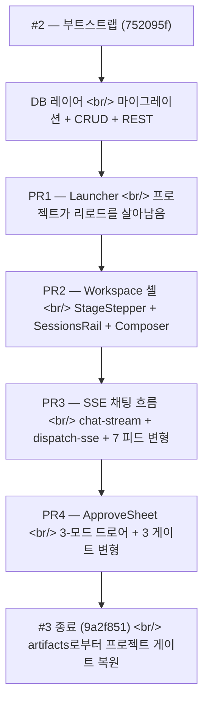

## 개요

[이전 글: #2 — 비트버킷 마이그레이션, production-readying, React 재작성 시작](/posts/2026-05-18-creative-agent-studio-dev2/)이 React 인프라가 부트스트랩된 상태로 끝났다 — 빈 Zustand 스토어, Vite + Tailwind + TS, 세 프리미티브, `<T>` i18n 컴포넌트, 그리고 PR1 계획. 24시간 뒤 **134개 비머지 커밋**이 네 PR을 순차적으로 떨어뜨려, 진짜 데이터베이스 영속화와 라이브 SSE 스트리밍을 갖춘 동작하는 React 프론트엔드를 만들어냈다.

작업은 네 PR과 그 아래 한 스택으로 떨어졌다.

- **PR1 — Launcher** (projects CRUD, ProjectCard, NewProjectCard, CreateProjectModal, ProjectGrid)
- **PR2 — Workspace 셸** (StageStepper, ProjectSubbar, SessionsRail, Composer, ChatPanel, CanvasPanel 플레이스홀더)
- **PR3 — SSE + 채팅 흐름** (chat-stream 파서, dispatch-sse 매퍼, useChatStream 훅, AgentAvatar, 7가지 FeedItem 변형 전체, ChatFeed)
- **PR4 — ApproveSheet + Gates** (3-모드 드로어, ApproveGateCopy / Scenario / ResearchInput 변형)
- **아래** — `projects`, `artifacts`, `diff_history` 테이블, CRUD 작업, 전체 REST API, 소프트 삭제 시맨틱

<!--more-->



관통하는 한 가지 주제 — **표면을 아래에서 위로 짓고, 어떤 커밋도 자기가 건너서는 안 되는 레이어를 건너지 않게 하라.**

---

## 데이터베이스 레이어 — UI와 같은 날

세 마이그레이션과 작은 CRUD 모듈들이 `projects`, `artifacts`, `diff_history`를 일급으로 만들었다. 첫 커밋(`feat(db): add projects, artifacts, diff_history tables via migrations`)이 모양을 잡았다.

```sql
CREATE TABLE projects (
    id          INTEGER PRIMARY KEY,
    title       TEXT NOT NULL,
    brand       TEXT,
    gate        TEXT,        -- 프로젝트가 마지막으로 멈춘 게이트
    created_at  INTEGER NOT NULL,
    updated_at  INTEGER NOT NULL,
    deleted_at  INTEGER      -- 소프트 삭제
);

CREATE TABLE artifacts (
    id            INTEGER PRIMARY KEY,
    project_id    INTEGER REFERENCES projects(id),
    stage         TEXT NOT NULL,
    kind          TEXT NOT NULL,
    payload       TEXT NOT NULL,   -- JSON
    evidence_uri  TEXT,            -- §8.2 — provenance
    created_at    INTEGER NOT NULL
);

CREATE TABLE diff_history (
    id            INTEGER PRIMARY KEY,
    project_id    INTEGER REFERENCES projects(id),
    gate          TEXT NOT NULL,
    before        TEXT,            -- JSON (첫 선택 시 null 가능)
    after         TEXT NOT NULL,   -- JSON
    created_at    INTEGER NOT NULL
);
```

세 커밋 뒤 CRUD 모듈이 떨어졌다 — `createProject`, `listProjects`(active만, updated_at desc), `getProject`(감사용으로 deleted 행도 반환), `renameProject`(부분 패치 시맨틱), `softDeleteProject`(idempotent — `deleted_at`을 두 번 플립하지 않음).

idempotency 규칙은 `fix(db): softDeleteProject preserves deleted_at on idempotent re-call`에서 명시적으로 테스트됐다. 원래 구현은 `UPDATE ... SET deleted_at = ?`를 호출해서 두 번 호출되면 이전 삭제 타임스탬프를 덮어썼다. 수정 — `UPDATE ... SET deleted_at = ? WHERE deleted_at IS NULL`. 작은 버그, 큰 원칙 — 소프트 삭제는 묘비지 플래그가 아니다.

그 다음 REST API가 다섯 커밋으로 위에 올라왔다.

```
POST   /api/projects        → createProject
GET    /api/projects        → listProjects
GET    /api/projects/:id    → getProject (deleted면 404 — fix(api))
PATCH  /api/projects/:id    → renameProject
DELETE /api/projects/:id    → softDeleteProject
```

별개의 수정이 GET과 PATCH에서 소프트 삭제된 프로젝트를 404로 처리하도록 했다(하위 CRUD 경로에서는 감사로 보이지만 REST 표면에서는 보이지 않음). diff_history 모듈은 `appendDiff`를 추가했고, `after`가 `null`일 때 리터럴 `'null'` 문자열을 저장하지 않도록 가드를 넣었다 — 누군가의 프로젝트 히스토리에서 UI에 `"null"` 문자열이 렌더되는 걸 발견할 때만 명백한 종류의 버그.

---

## PR1 — Launcher

사용자가 보는 첫 화면. 프로젝트 목록, 새로 만들기 어포던스, 검색.

페이지 아키텍처를 셋업한 구조적 커밋 몇 개.

- `feat(web): real projects slice (CRUD)` — sort-by-updated를 갖춘 `useProjects` 훅
- `feat(web): add userName + setUserName to ui slice` — 이중언어 인사말에 보이는 영속 사용자 이름
- `feat(web): add AppTopbar with logo + lang toggle` — 사이트 크롬
- `feat(web): add LauncherTopbar + LauncherHero with bilingual greeting`
- `feat(web): add SessionsRail hidden-mode stub (PR2 fills workspace mode)`

그 다음 실제 목록과 생성 흐름.

- `feat(web): add ProjectsSearch with bilingual placeholder and count kicker`
- `feat(web): add ProjectCard with progress bar and brand/status`
- `feat(web): add NewProjectCard with dashed border and accent hover`
- `feat(web): add CreateProjectModal with title + optional brand + validation`
- `feat(web): wire ProjectGrid — search filter, modal, navigation`

카드 진행 막대는 프로젝트가 진행한 같은 `gate` 필드를 읽는다 — 그래서 launcher 카드는 각 프로젝트가 어디까지 갔는지의 라이브 스냅샷이다. 클릭 → `/projects/:projectId`로 이동. 끝.

이 PR이 깔끔한 이유는 엄격한 레이어링이다 — 모든 인터랙티브 조각은 스토어에서 읽고, 스토어는 REST API에서 읽고, REST API는 CRUD 모듈에서 읽고, CRUD 모듈은 SQLite에서 읽는다. 지름길 없음. 컴포넌트 자체는 슬라이스만 안다.

---

## PR2 — Workspace 셸

사용자가 프로젝트 카드를 클릭한 뒤 도착하는 화면. 세 컬럼 — 왼쪽 sessions rail, 가운데 채팅, 오른쪽 canvas 플레이스홀더. 실제 단계별 워크플로는 이 셸 안에 산다.

11개 구조적 커밋.

- `feat(web): add stage-labels lib (gate ↔ stage + ko/en short/long labels)` — 단계의 이중언어 라벨로의 정전 매핑, stepper와 canvas 양쪽에서 사용
- `feat(web): add Session type` + `real workspace slice (sessions + composer)` + `store-init test`
- `feat(web): add sessionsPanelOpen + toggleSessionsPanel to ui slice` — 레일이 접힌다
- `feat(web): add StageStepper (6 dots + bilingual long-form label)` — 단계 진행 표시기
- `feat(web): add ProjectSubbar wrapping StageStepper`
- `feat(web): fill SessionsRail workspace mode (project header + sessions list + new + back)`
- `feat(web): add Composer (pill input + send button, console-log submit only)` — 채팅 입력, 아직 제출 와이어링 없음
- `feat(web): add ChatPanel skeleton (header + welcome bubble + Composer)`
- `feat(web): add CanvasPanel placeholder (PR5 fills variants)` — 명시적 연기
- `feat(web): assemble WorkspacePage (.shell grid) + swap workspace route`

플레이스홀더 패턴을 짚을 만하다. `CanvasPanel`이 커밋 메시지에 명시적으로 "PR5 fills variants"라고 적힌 플레이스홀더로 추가됐다. 그것은 레이아웃에 구멍을 남기지 않고 큰 작업을 연기했다 — 레이아웃은 끝났고, 슬롯은 와이어드됐고, 실제 콘텐츠는 사용자에게 아직 출시되지 않을 스텁이었다. PR5가 깔끔하게 떨어질 수 있었던 이유는 PR2가 그 주소를 예약해놨기 때문이다.

---

## PR3 — SSE 배관, 채팅 흐름, 그리고 7가지 피드 변형

이 PR이 정적 셸을 라이브 앱으로 바꿨다. 세 레이어에 걸친 20+ 커밋 — 스토어, 배관, 컴포넌트.

### 스토어 레이어

```ts
// web/src/store/slices/feed.ts (의역)
type FeedItem =
  | { kind: "user", text: string }
  | { kind: "assistant", text: string }
  | { kind: "streaming", text: string }
  | { kind: "agent_progress", agent: string, status: string }
  | { kind: "stage_complete", stage: string }
  | { kind: "system_error", message: string }
  | { kind: "task_update_note", text: string };

type FeedSlice = {
  feed: FeedItem[];
  appendChunk: (text: string) => void;      // 스트리밍
  splitParagraphs: () => void;              // 스트리밍 → 최종
  pushAgentProgress: (agent, status) => void;
  pushStageComplete: (stage) => void;
  // ...
};
```

일곱 가지 피드 아이템 타입에 대한 식별된 유니온, 슬라이스의 kind별 리듀서. 그리고 게이트/단계/컨텍스트/lastSubmit 상태를 위한 `pipeline` 슬라이스, `tasks` + `activeSubAgents`(agent_activity 봉투의 싱크)를 얻은 `workspace` 슬라이스.

### 배관 레이어

세 순수 모듈과 한 훅.

- `feat(web): add chat-stream lib (POST /api/chat + SSE parse + Zod-validated envelopes)` — 와이어 레벨 파서
- `feat(web): add dispatch-sse mapper (SSEEnvelope → store actions)` — 순수 매퍼, DOM 없음
- `feat(web): add useChatStream hook (submit/cancel + AbortController lifecycle)` — 라이프사이클 소유자

```ts
// web/src/hooks/use-chat-stream.ts (의역)
export function useChatStream() {
  const controllerRef = useRef<AbortController | null>(null);

  const submit = useCallback(async (text: string, context: ChatContext) => {
    controllerRef.current?.abort();
    const controller = new AbortController();
    controllerRef.current = controller;

    for await (const envelope of streamChat({ text, context, signal: controller.signal })) {
      dispatchSse(envelope);   // 스토어 액션
    }
  }, []);

  const cancel = useCallback(() => controllerRef.current?.abort(), []);

  return { submit, cancel };
}
```

분할은 — chat-stream은 파싱, dispatch-sse는 매핑, useChatStream은 라이프사이클 소유. 셋, 모듈 셋 — 어떤 모듈도 하나 이상의 일을 하지 않았다. 각각의 테스트(`tighten test fetch types` 등)가 같은 날 출시됐다.

### 컴포넌트 레이어

봉투가 스토어에 떨어질 수 있게 되자 컴포넌트가 렌더했다.

- `feat(web): add AgentAvatar + fix shared/events runtime exports`
- `feat(web): add User/Assistant/Streaming bubble components`
- `feat(web): add AgentProgress + StageComplete + SystemError + TaskUpdateNote`
- `feat(web): add FeedItem discriminated dispatcher (7 variants)`
- `feat(web): add AgentStrip ('Running now' active sub-agents)`
- `feat(web): add ChatFeed (auto-scroll + FeedItem map + welcome empty state)`
- `feat(web): wire ChatPanel to AgentStrip + ChatFeed (replaces static welcome bubble)`

`FeedItem` 디스패처는 식별된 유니온 패턴이 보답하는 모습이다 — 모든 변형을 자기 컴포넌트로 매핑하는 한 곳, TS가 강제하는 망라성.

`AgentStrip`은 `interaction-model.md`의 결정 2 — "한 줄 상태, 전체 대시보드 없음" — 의 실체화였다. 채팅 상단을 가로지르는 가로 스트립으로 현재 실행 중인 서브 에이전트만 표시한다. 사이드 패널 아니고, 대시보드 아니고, 그냥 작업이 일어날 때 나타났다 끝나면 사라지는 인라인 스트립.

---

## PR4 — ApproveSheet와 세 게이트 변형

채팅 전용 흐름을 채팅 + 승인 흐름으로 바꾼 조각.

ApproveSheet는 세 모드를 갖춘 하단 드로어다 — collapsed(게이트 프롬프트만), half-open(게이트 + 요약), full(게이트 + 전부). 포인터 이벤트로 드래그 리사이즈. Esc로 접힘. 세 게이트 변형이 같은 셸에 떨어진다 — 각 게이트 단계는 자기 변형 컴포넌트를 받는다.

12개의 구조적 커밋.

- `feat(web): add ApproveGate payload types`
- `feat(web): add approveSheetMode + setApproveSheetMode to ui slice`
- `feat(web): pipeline slice gains copy/scenario history + idx setters` — 과거 드래프트 사이를 전환하는 백포인터 상태
- `feat(web): projects slice gains bumpProjectGate + assert PR4 fields in store-init`
- `feat(web): dispatch-sse pushes copy/scenario history + bumps project gate on stage_complete` — 게이트 진행을 위한 SSE → 스토어 glue

그 다음 드로어 메커닉.

- `feat(web): add useApproveSheetDrag hook + PointerEvent jsdom polyfill` — 드래그 핸들 훅. PointerEvent는 jsdom에 기본으로 없으니 폴리필이 함께 출시.
- `feat(web): add ApproveSheet base (3-mode drawer + collapse toggle + drag handle)`

그리고 세 게이트 변형.

- `feat(web): add ApproveGateCopy (grid + select + approve / request-edit)` — 사용자가 N개 카피 드래프트 중 하나를 선택
- `feat(web): add ApproveGateScenario (acts list + approve / request-edit)` — 사용자가 다막 시나리오를 승인하거나 수정
- `feat(web): add ApproveGateResearchInput (question + answer + send)` — 다른 모양 — 에이전트가 사용자에게 리서치 질문을 하고 타이핑한 답을 기다림

`ApproveGate` 디스패처(변형 선택 + 제출 와이어링)로 함께 묶이고, `ChatPanel` 안에 마운트되고, `WorkspacePage`에서 submit이 forward된다. 사용자 흐름은 이제 — 채팅에서 묻고 → 에이전트가 돌고 → artifact와 함께 드로어가 올라오고 → 승인 또는 수정. `interaction-model.md`의 결정 3(단계 사이 게이트 기반 자동 실행)이 살아 있다.

---

## 하루 끝 상태

오늘의 마지막 커밋(`9a2f851 feat(web): restore project gate from artifacts on workspace mount (Slice K)`)이 중요한 루프를 닫았다 — 사용자가 workspace 페이지를 리로드하면, 프로젝트의 게이트 상태가 영속된 artifacts에서 복원된다. 오늘의 작업이 새로고침을 살아남는다.

아래 스택과 PR1-PR4 사이에서, React 프론트엔드는 하루 끝에 다음을 갖췄다.

- 동작하는 launcher (진짜 프로젝트, 리로드를 가로질러 영속)
- 3컬럼 레이아웃의 workspace 셸
- SSE 스트리밍 라이브 채팅
- 모든 7가지 피드 변형이 렌더링
- 3가지 게이트 변형을 가진 ApproveSheet 드로어
- 리로드를 살아남는 프로젝트 상태

목업은 아직 삭제되지 않았지만, 목업이 시연하려던 모든 것이 이제 React에서 돈다.

---

## 인사이트

이 날이 작동한 이유는 모든 커밋이 자기 레이어를 존중했기 때문이다. 스토어 슬라이스는 PR4가 필요로 할 모양으로 PR2에서 선언됐다. PR3의 SSE 배관은 세 모듈 — 파서, 매퍼, 라이프사이클 — 로 각각 독립적으로 테스트될 수 있었다. PR4의 ApproveGate 변형들은 PR3의 FeedItem 디스패처와 매칭되는 디스패처 패턴에 꽂혔다.

일어나지 *않은* 일 — 그리고 134커밋이 카오스가 아니었던 이유 — 는 *레이어 교차 커밋*이다. 어떤 커밋도 `<button>`과 SQL 컬럼을 같이 추가하지 않았다. 어떤 커밋도 CRUD 모듈에서 슬라이스로 손을 뻗지 않았다. 커밋이 레이어를 가로질러야 할 때는 한 레이어 아래의 기반 커밋이 선행하거나 한 레이어 위의 채택자 커밋이 뒤따랐다. 이 규율이 패치워크 스프린트가 됐을 것을 깔끔한 추가 스택으로 바꿨다.

새겨둘 멘탈 모델 — **빠르다는 건 지름길이 아니다.** 이 날이 네 PR을 출시한 이유는 각 PR이 존재하게 한 규율 때문이지, 그 규율을 무시했기 때문이 아니다.

다음 — canvas 패널, 5게이트 워크플로, key-concept planner, 그리고 사용자가 전체 단계가 아닌 단일 카드만 외과적으로 재실행할 수 있게 하는 revise-mode 다중 선택 패턴.
