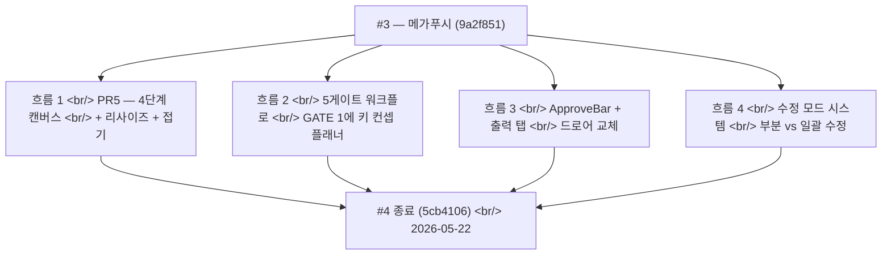

## 개요

[이전 글: #3 — 134커밋 메가푸시](/posts/2026-05-19-creative-agent-studio-dev3/)가 PR4(ApproveSheet + 세 게이트 변형)가 머지되고 프로젝트 상태가 리로드를 살아남는 상태로 끝났다. 3일 뒤 **153 커밋**이 더 떨어져 4단계 에이전트 워크플로의 남은 모든 조각을 완성했다 — 단계 출력을 실체화한 4변형 캔버스 패널(PR5), 새 GATE 1의 키 컨셉 플래너로 3게이트에서 **5**게이트로의 워크플로 통합, 하단 드로어 ApproveSheet를 슬림 ApproveBar + 출력 탭으로 대체한 UI 재설계, 그리고 사용자가 전체 단계를 다시 하는 대신 단일 키 컨셉, 카피 드래프트, 컷, 또는 콘티 패널을 외과적으로 재실행할 수 있게 하는 **수정 모드 다중 선택 시스템**.

아래에서는 런타임이 Planner-Generator-Evaluator 루프, 사용자 피드백으로부터 저작되는 연속성 앵커, 프롬프트에 주입되는 진화 노트, 기획 보고서와 콘티를 위한 HTML 템플릿 세트, 그리고 한 프로젝트가 여러 병렬 시도를 들고 갈 수 있도록 하는 세션 격리를 받았다.

<!--more-->



네 흐름, 반복되는 한 모양 — **워크플로가 만지는 모든 레이어에서 "전부 아니면 전무"가 되기를 멈췄다.**

---

## 흐름 1 — PR5: 4단계 변형의 캔버스 패널

PR2가 `CanvasPanel` 플레이스홀더를 예약했다. PR5가 그것을 채웠다. 캔버스는 workspace의 오른쪽 컬럼 — 현재 단계의 *현재 artifact*를 단계별 컴포넌트로 렌더링한다.

```ts
// web/src/components/canvas/stage-canvas.tsx (의역)
function StageCanvas({ stage }: { stage: PresentationStage }) {
  switch (stage) {
    case "research":   return <ResearchCanvas />;
    case "copy":       return <CopyCanvas />;
    case "scenario":   return <ScenarioCanvas />;
    case "storyboard": return <StoryboardCanvas />;
  }
}
```

각 변형은 `pipeline` 슬라이스에서 데이터를 읽고 단계에 맞는 레이아웃을 렌더한다.

| 단계 | 변형 | 보여주는 것 |
|---|---|---|
| research | `ResearchCanvas` | `pipelineContext`의 `AdBriefRecap` + `ResearchSummaryCards` + 활성 태스크 목록 |
| copy | `CopyCanvas` | `copyHistory`의 `CopyOptions`로 만든 `ConceptGrid` |
| scenario | `ScenarioCanvas` | Act별 `SceneStrip` + `scenarioHistory`의 `CutChip` 스트립 |
| storyboard | `StoryboardCanvas` | `storyboardImageUrls`에서 scene당 `StoryboardPage` 1개 |

콘티 이미지 처리는 작은 아키텍처 선택이 필요했다. base64 PNG 페이로드가 `storyboard_image` SSE 이벤트로 도착한다. 파이프라인 슬라이스가 각각을 blob URL(`URL.createObjectURL`)로 변환하고, 재생성이 이전 이미지를 누수하지 않도록 replace-on-revoke 단계를 둔다. `addStoryboardImage` 리듀서가 revoke 로직을 갖는다.

```ts
addStoryboardImage: (scene, base64) => set(s => {
  const old = s.storyboardImageUrls[scene];
  if (old) URL.revokeObjectURL(old);
  const blob = base64ToBlob(base64, "image/png");
  return { storyboardImageUrls: { ...s.storyboardImageUrls, [scene]: URL.createObjectURL(blob) } };
}),
```

### 리사이즈 + 접기

두 커밋이 리사이즈 어포던스를 추가했다.

- `feat(web): add useCanvasResizer hook (pointer capture + clamped delta -> ui.canvasWidth)` — `ui.canvasWidth`는 ui 슬라이스에서 360..800px로 클램프
- `feat(web): add CanvasResizer component (vertical drag handle + warm hover tint)` — 비주얼 핸들, 호버 틴트는 Creative Warmth를 따른다(미묘한 따뜻한 그라데이션, 순백 하이라이트 없음)
- `feat(web): WorkspacePage grid column reads ui.canvasWidth + respects canvasCollapsed` — 그리드가 실제로 너비에 반응

`CanvasHeader`는 접기 토글을 얻어서 파워 유저가 채팅에 집중하고 싶을 때 캔버스를 완전히 숨길 수 있다.

### PR6 — 폴리시 + 백엔드 스왑 + 목업 삭제

PR6은 "React로 모든 게 동작한다"와 "실제로 사용자에게 React를 서빙한다" 사이의 다리였다.

- `feat(web): ui slice gains fatalError + setFatalError`
- `feat(web): add ErrorScreen (vercel_unsupported + unexpected kinds, ko/en)`
- `feat(web): add AppErrorBoundary class component (catches descendants -> ErrorScreen)`
- `feat(web): useChatStream detects Vercel 503 -> ui.fatalError = vercel_unsupported`
- `feat(server): serve web/dist instead of mockup/ (MOCKUP_DIR -> WEB_DIST_DIR)`
- `feat(deploy): vercel buildCommand + outputDirectory point to web/dist`
- `chore: remove legacy mockup/ vanilla-JS SPA` — 목업이, 탄생 6주 만에, 한 커밋으로 삭제됐다

`vercel_unsupported` 에러는 특정 종류다 — Vercel의 서버리스 함수는 장기 SSE 연결을 호스트할 수 없으니, 거기 백엔드를 배포하면 채팅 라우트에서 503이 나온다. 프론트엔드가 이걸 명시적으로 감지하고 일반 네트워크 에러 대신 EC2 전용 제약을 설명하는 화면을 보여준다.

---

## 흐름 2 — 워크플로가 5게이트로 통합됨

PR4까지 워크플로는 승인 지점이 세 개였다 — 카피 뒤 하나, 시나리오 뒤 하나, 콘티 끝에 하나. 5월 21일이 **GATE 1(키 컨셉 선택)**을 도입하고 게이트 수를 다섯으로 만들었다.

### GATE 1이 존재해야 했던 이유

기존 흐름은 `research → copy로 직접` 실행했다. 사용자가 브리프를 제출하면 리서치가 일어나고, 그 다음 카피 단계가 네 가지 평행 드래프트(각각 감성/직설/유머/하이브리드 각도)를 발신했다. 문제 — 카피 드래프트는 사용자에게 *어느 방향*을 원하는지 묻지 않고 리서치 에이전트의 브리프 해석을 상속받았다. 프로젝트당 이틀의 수정이 사용자가 요청하지 않은 다른 각도로 카피 단계를 밀어내는 데 들어가고 있었다.

수정은 리서치와 카피 사이에 새 스페셜리스트.

```
research → [key_concept_planner가 10개 후보 컨셉 생성: 3-3-2-2 분배]
         → GATE 1 (사용자가 하나 선택)
         → 카피 단계가 선택된 컨셉에 앵커링되어 실행
```

3-3-2-2 분배(상업적 3, 감성적 3, 내러티브 2, 컨셉추얼 2)는 `CATEGORY_PLAN`에서 왔다. 뒤이은 리팩토링(`refactor(agents): derive key_concept distribution from CATEGORY_PLAN`)이 분배를 하드코딩에서 계획으로부터 계산되게 바꿔서, 한 곳의 믹스 조정이 전파된다.

### 프론트엔드 — ApproveGateKeyConcept

10카드 선택 UI가 `ApproveGateKeyConcept`로 출시됐다.

- `feat(web): add KeyConcept gate types`
- `feat(web): ApproveGateKeyConcept 10-card selection drawer`
- `feat(web): wire GATE 1 key-concept gate into ApproveGate`

백엔드 조각.

- `feat(runtime): emit GATE 1 key-concept gate after research stage`
- `fix(runtime): only block key_concept_planner re-enqueue while job is in flight` — 느린 재렌더 dispatch가 필터아웃되던 레이스 방지
- `feat(runtime): route selectedKeyConcept to copy and feedback re-entry` — 카피 단계가 선택된 컨셉을 받는다
- `feat(agents): copywriter_agent anchors copy to the selected key concept`
- `feat(runtime): persist key_concept_set artifacts` + `record GATE 1 key-concept selections in diff_history`

### GATE 3(컨셉 승인)와 GATE 5(최종 승인)

두 게이트가 더 워크플로를 채웠다.

- `feat(runtime): add GATE 3 컨셉 승인 — two-phase scenario stage` — 시나리오가 컨셉 승인 → 전체 시나리오로 쪼개졌다
- `feat: add GATE 5 (최종 승인) to the storyboard stage` — 프로젝트가 완료된 것으로 간주되기 전 최종 승인

GATE 2(카피)와 GATE 4(전체 시나리오)와 결합되면, 이게 이 시점부터 모든 UI 라벨이 참조할 정전 5게이트 흐름을 만들었다.

### gate_state — 12상태 라이브 전이

`feat(runtime): wire gate_state 12-state live transitions`가 게이트 라이프사이클을 잡 라이프사이클에서 분리했다. 12상태가 모든 의미 있는 전이를 인코딩(pending → emitted → awaiting_user → user_approved → user_revising → rerunning → reapproved → ...), 각각 프론트엔드로 표면화되어 UI가 추론된 상태를 폴링하지 않고 의미 있는 "이 게이트에 무슨 일이 일어나고 있는가"를 렌더할 수 있다.

### GATE 1의 기획 보고서

`feat: add report_writer agent + 리서치 분석 보고서 at GATE 1`이 key_concept_planner와 나란히 도는 두 번째 스페셜리스트를 추가했다 — 10개 키 컨셉 뒤의 *컨텍스트*를 사용자에게 주는 구조화된 리서치 분석 보고서를 생성한다. 이게 없으면 사용자는 컨셉을 차갑게 선택한다 — 있으면 기저 추론을 본다.

그 다음 후속 — `feat: add report_writer planning mode for 최종 기획 보고서` — 가 같은 에이전트에게 워크플로 끝에 다른 *종류*의 보고서(전체 프로젝트를 요약하는 기획 보고서)를 생성하도록 가르쳤다.

### HTML 템플릿 세트

보고서는 채팅 버블이 아니라 *문서처럼* 보여야 했다. 연속된 커밋들에서 HTML 템플릿 세트 전체가 도착했다.

- `feat: add base.css slide canvas and primitives`
- `feat: add storyboard cover and continuity-grid templates`
- `feat: add deck.css and four simple deck templates`
- `feat: add photo-caption and fullbleed-caption deck templates`
- `feat: add annotated-photo, product-lineup, info-card, creative-board templates`
- `feat: add report_writer HTML conversion design spec` + `implementation plan`
- `feat: add template gallery index` + `LLM-facing template catalog`

템플릿 카탈로그가 LLM 면 조각이다 — 다중 페이지 문서를 조립할 때 선택할 템플릿의 구조화된 리스트를 에이전트가 받는다. 그래야 페이지별 레이아웃을 핸드코딩하지 않고 콘티 커버, 연속성 그리드, 트리트먼트 그리드, 콘티 시퀀스를 한 프롬프트로 만들 수 있다.

---

## 흐름 3 — ApproveBar가 드로어를 교체하고, 출력 탭이 인라인 렌더를 교체

2026-05-21까지 하단 드로어 패턴(`ApproveSheet`)은 UX 문제가 됐다 — 열면 캔버스를 덮었고, 캔버스가 *결과*가 사는 곳이었다. 사용자는 승인 중인 콘티를 보기 위해 계속 드로어를 접어야 했다.

세 커밋이 드로어를 죽였다.

- `feat(web): add slim ApproveBar, replace ApproveGate in ChatPanel` — 채팅 패널 하단의 가로 바
- `refactor(web): remove ApproveSheet/StageCanvas drawer stack`
- `feat(web): show output panel on active gate + scenario gate advances`

ApproveBar는 두 버튼(승인 / 수정요청) + 게이트 컨텍스트뿐이다 — 미니멀, 드래그할 드로어 없음. 검사할 실제 artifact는 캔버스(오른쪽 컬럼)에 산다, 늘 그랬듯이.

### 출력 탭 — 캔버스가 "현재 단계 표시"에서 "모든 단계의 탭 히스토리"로 피벗

ApproveBar가 떨어진 직후, 캔버스 자체가 재설계됐다.

- `feat(web): add output-tabs definitions and visibility logic`
- `feat(web): add activeOutputTab to ui slice`
- `feat(web): add output fields to pipeline slice`
- `feat(web): hydrate output slots from artifacts`
- `feat(web): route gate/planning outputs into pipeline slice`
- `feat(web): add analysis/keyConcept/planning/concept tab bodies`
- `feat(web): add selectable copy tab body`
- `feat(web): add OutputTabs container`
- `feat(web): swap CanvasPanel body to OutputTabs`

이전엔 캔버스가 *현재* 단계의 artifact만 보여줬다. 이제 위쪽에 탭이 있다 — 분석, 키 컨셉, 컨셉, 카피, 시나리오, 콘티 — 그리고 사용자는 현재 단계에서 작업하면서도 이전 artifact를 되돌아볼 수 있다. 그게 UX를 완전히 바꾼다 — 캔버스가 단지 현재 상태 디스플레이가 아니라 프로젝트 작업면이 됐다.

### Planner-Generator-Evaluator 루프

이 UX 이동의 런타임 등가물이 **Planner-Generator-Evaluator 루프**다.

- `feat: Planner-Generator-Evaluator loop + BDI structure`
- `feat(web): register copy_evaluator in agent-copy map`
- `feat(runtime): extend the evaluator loop to the scenario stage (§3.4)`
- `feat(runtime): extend the evaluator loop to the storyboard stage (§3.4)`
- `fix(runtime): re-assess regenerations in the evaluator loop`

패턴 — 모든 생성 단계가 이제 Planner → Generator → Evaluator를 돈다. Evaluator는 출력이 품질 바를 만족하는지 결정한다 — 아니면 루프가 피드백과 함께 Generator를 재실행한다. 사용자는 루프가 수렴한(또는 최대 반복 상한을 친) 뒤 *최종* 출력을 본다. 이게 출력 탭이 가치 있어진 이유이기도 하다 — 각 단계의 기획 artifact와 평가 노트는 사용자가 파보고 싶을 때 보인다.

---

## 흐름 4 — 수정 모드 시스템

이게 이 윈도우에서 가장 큰 UX 약속이다. 이 작업 전에는 "카드 하나만 다시 하고 싶어요"는 "전체 단계를 다시 해주세요"를 의미했다 — 사용자가 재생성하고 싶은 조각 외 모든 걸 외과적으로 고정할 방법이 없었다.

### 의도 분류

첫 조각(`feat: add revision-intent — classify chat revision as bulk/partial`)이 채팅 입력의 작은 분류기다. 사용자가 게이트 컨텍스트에서 타이핑하면, 시스템이 묻는다 — 이게 *일괄* 요청("카피 전체를 더 감성적으로")인가 *부분* 요청("세 번째만 바꿔줘")인가? 출력이 다른 런타임 경로를 결정한다.

- **일괄** → 피드백을 컨텍스트로 두고 전체 단계 재실행
- **부분** → UI에서 "수정 모드"에 진입하고 사용자가 재생성할 항목을 고름

```js
// runtime/orchestration/revision-intent.js (의역)
function classifyRevisionIntent(message, gateContext) {
  if (hasPartialMarkers(message)) return { kind: "partial", confidence: high };
  if (hasBulkMarkers(message))    return { kind: "bulk",    confidence: high };
  return { kind: "ambiguous" };  // UI가 사용자에게 명확화를 nudge
}
```

### 수정 모드 UI

프론트엔드가 ApproveBar에 수정 모드 토글과 모든 선택 가능한 탭에 다중 선택 체크박스를 얻었다.

- `feat: pipeline store — reviseMode + reviseSelection state`
- `feat: add RevisionContext type + ChatContext.revision field`
- `feat: ApproveBar revise-mode toggle with selection count`
- `feat: KeyConceptTab multi-select checkboxes in revise mode`
- `feat: CopyTab multi-select checkboxes in revise mode`
- `feat: ScenarioCanvas cut-level revise checkboxes`
- `feat: StoryboardCanvas panel-level revise checkboxes`

`reviseSelection`은 artifact 종류별 `Set<id>`다. 사용자는 개별 카드를 토글한다 — 카운트가 ApproveBar에 라이브로 나타나 몇 개 항목이 재생성될지 항상 안다.

### Revision-merge — 인덱스 splice

런타임 측은 재생성된 부분집합을 기존 집합으로 *실제로 머지*할 방법이 필요했다. 그게 `revision-merge` 모듈이다.

```js
// runtime/orchestration/revision-merge.js (의역)
function mergeRevision(originalSet, regeneratedSubset, selectedIndices) {
  const merged = [...originalSet];
  regeneratedSubset.forEach((newItem, i) => {
    merged[selectedIndices[i]] = newItem;
  });
  return merged;
}
```

순수 함수 — 선택된 인덱스에서 splice, 나머지는 고정. 끝까지 테스트됨 — `test: end-to-end partial revision keeps frozen items + 3-3-2-2`.

### 각 에이전트가 부분 재생성을 배웠다

다섯 스페셜리스트 에이전트가 선택된 슬롯만 재생성하는 법을 배웠다.

- `feat: key_concept_planner regenerates selected slots (category-preserving)` — 3-3-2-2 분배를 보존
- `feat: copywriter_agent regenerates selected copy drafts`
- `feat: concept_anchor applies revision feedback (GATE 3, whole-doc)` — GATE 3은 컨셉 앵커 자체가 단일 artifact이기 때문에 whole-doc만
- `feat: scene_designer cut-level revision (structure + cut count preserved)` — 총 컷 수 보존
- `feat: storyboard_generator regenerates selected panels + images`

각 에이전트는 자기의 고정 항목 제약이 무엇인지 알아야 했다. 콘티는 컷 수를 재계산하지 않고 패널 3만 재생성할 수 있었지만, scene_designer는 시나리오의 구조적 계약이 컷 수이기 때문에 총 컷 수를 보존해야 했다.

### 라우팅 레이어

두 라우팅 커밋이 함께 묶었다.

- `feat: root-planner routes context.revision to single target agent` — 백엔드가 필요한 단일 스페셜리스트만 enqueue
- `feat: route chat revision intent — bulk runs, partial nudges revise mode` — 프론트엔드가 옳은 경로로 dispatch
- `feat: dispatch revise_mode_hint — open revise mode on partial chat intent` — 백엔드가 힌트 이벤트로 프론트엔드에 수정 모드를 *제안*할 수 있어서 부분 의도가 UI를 자동으로 연다

힌트 이벤트는 신중한 경계였다 — 백엔드는 결코 프론트엔드를 강제하지 않는다, 제안만 한다. 프론트엔드는 자기 로컬 상태가 이유가 있으면 오버라이드할 수 있다.

---

## 흐름 5 — 세션 격리 (프로젝트당 멀티 시도)

2026-05-22에 workspace가 프로젝트당 단일 세션에서 프로젝트당 멀티 세션으로 갔다. 프로젝트가 이제 병렬 시도를 들고 갈 수 있다 — 단일 크리에이티브 브리프를 세 가지 다른 방식으로 시도할 수 있고, 각각 자기 세션이고 자기 파이프라인 상태를 갖는다.

핵심 커밋.

- `Isolate workspace sessions and restore state per session`
- `server: project sessions list endpoint`
- `web: session restore and run recovery`
- `Start a fresh pipeline for a new session's first brief`
- `launcher: show per-session states on project cards`
- `launcher/workspace: deletable sessions + per-session gate`
- `web: scope workspace canvas to the active session`
- `web: honor session routes and preserve revision scopes`

Launcher 카드가 이제 세션별 게이트를 보여준다 — 세 세션을 가진 프로젝트, 둘은 콘티에, 하나는 카피에 있으면, 세 상태 모두 렌더한다. 세션은 개별로 삭제 가능. workspace 캔버스, 수정 모드, 게이트 상태가 모두 활성 세션으로 스코프된다.

가장 큰 보이지 않는 커밋 — `Lock the session after final storyboard approval`. GATE 5가 승인되면 세션은 읽기 전용이 된다. 봉인된 산출물에 우발적 편집을 막고, 사용자가 더 반복하고 싶으면 의식적으로 새 세션을 시작하도록 강제한다.

---

## 인사이트

3일에 네 흐름 — 하지만 반복되는 모양은 같다 — **"전부 아니면 전무"의 무언가 granular한 것으로의 붕괴.**

- 드로어-또는-캔버스 이진이 출력 탭 연속체가 됐다 (모든 artifact를 한 번에 볼 수 있다)
- 세 게이트가 다섯이 됐다 (새 게이트가 가장 비싼 하류 비용을 가드한다 — 카피 + 시나리오 + 콘티가 선택된 방향으로 실행)
- 전체 단계 재실행이 부분 수정이 됐다 (정확히 원하는 것만 재생성)
- 프로젝트당 단일 세션이 프로젝트당 멀티 세션이 됐다 (프로젝트가 병렬 아이디어를 들고 갈 수 있다)

이 이동들 각각은 이진 버전보다 더 많은 코드 비용이 들었다 — 부분 수정 하나만 해도 의도 분류, 다섯 에이전트의 고정 항목 보존 로직, 스토어의 Set-of-IDs, 인덱스 splice 머지 함수가 필요했다 — 하지만 각각이 사용자가 조용히 견디고 있던 한 부류의 좌절을 제거했다. 153커밋 카운트는 영웅적으로 보인다 — 관통하는 줄은 더 겸손하다 — 시스템이 "전부 아니면 전무"라고 말할 때마다, "당신이 의미한 것만 정확히"로 교체.

다음 — 폴리시 주간 — 관측성 계측, 새로고침 아래 프로젝트별 상태 격리, 채팅에서 인라인 과거 게이트 되감기, 그리고 모든 탭에서 비주얼 처리를 마침내 통일한 수정요청 어포던스 패스.
