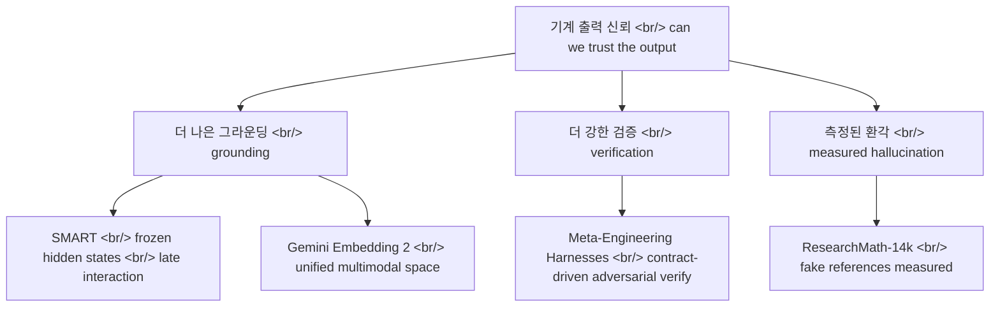

## 개요

이번 주 아카이브에 올라온 네 편의 논문은 표면적으로는 임베딩, 멀티모달 표현, 에이전트 엔지니어링, 수학 데이터셋으로 흩어져 있지만, 셋은 하나의 질문으로 모인다 — "모델이 만들어낸 것을 우리가 믿을 수 있는가?" [SMART](https://arxiv.org/abs/2605.24938)와 [Gemini Embedding 2](https://arxiv.org/abs/2605.27295)는 RAG를 떠받치는 검색·표현의 substrate를 다지고, [Meta-Engineering Harnesses](https://arxiv.org/abs/2605.25665)는 에이전트 출력을 적대적으로 검증하며, [ResearchMath-14k](https://arxiv.org/abs/2605.28003)는 조작된 인용이라는 실패 모드를 숫자로 드러낸다.

<!--more-->

## 그라운딩: 임베딩이 이미 알고 있던 것

[SMART](https://arxiv.org/abs/2605.24938)("Your Embedding Model is SMARTer Than You Think")의 주장은 도발적이다. 우리가 쓰는 표준 단일 벡터(single-vector) 임베딩 모델 안에는 이미 멀티 벡터(multi-vector) 능력이 잠들어 있고, 그걸 깨우는 데 재학습이 필요 없다는 것이다. 핵심은 모델을 추가로 학습시키는 대신 **동결된(frozen) 히든 스테이트** 위에서 추론 시점에 [ColBERT](https://github.com/stanford-futuredata/ColBERT) 계열의 late-interaction([원 논문](https://arxiv.org/abs/2004.12832))을 적용하는 것이다. 단일 벡터로 압축하기 전의 토큰 단위 표현을 그대로 끌어다 쓰면, 별도의 멀티 벡터 학습 없이도 [멀티모달 검색](https://en.wikipedia.org/wiki/Information_retrieval)에서 기존 SOTA 멀티 벡터 접근을 넘어선다는 결과다. 효율성도 유지했고, 코드와 가중치를 공개했다는 점에서 곧바로 재현·검증 가능한 주장이다.

이 결과가 흥미로운 이유는 "검색 품질을 높이려면 더 무거운 모델을 새로 학습해야 한다"는 통념을 흔들기 때문이다. RAG 파이프라인에서 retrieval 품질은 곧 그라운딩 품질이고, 그라운딩이 약하면 그 위에 무엇을 얹어도 환각으로 흘러간다. SMART는 "이미 배포된 임베딩 모델에서 공짜로 더 짜낼 수 있는 신호가 있다"고 말한다.

## 그라운딩: 하나의 공간에 비디오 오디오 이미지 텍스트

[Gemini Embedding 2](https://arxiv.org/abs/2605.27295)는 다른 길로 같은 substrate를 강화한다. SMART가 기존 모델에서 더 짜내는 쪽이라면, 이쪽은 비디오·오디오·이미지·텍스트를 **하나의 통합 표현 공간(unified representation space)** 에 native하게 매핑하는 멀티모달 임베딩 모델을 정면으로 학습시켰다. 대규모 contrastive 학습에 multi-task·multi-stage 학습 레시피를 얹어, [MSCOCO](https://cocodataset.org/) image-text에서 62.9 R@1, [MTEB](https://huggingface.co/spaces/mteb/leaderboard) multilingual에서 69.9를 기록하며 SOTA를 주장한다. [MTEB 벤치마크](https://github.com/embeddings-benchmark/mteb)는 임베딩 품질의 사실상 표준 잣대라, 이 숫자는 비교 가능한 좌표 위에 찍힌다.

특히 강조되는 건 zero-shot 일반화다. [Gemini](https://deepmind.google/models/gemini/) 계열의 이 모델은 학습에서 보지 못한 태스크·언어로도 표현이 잘 전이된다고 한다. SMART의 "동결 상태에서 잠재력 해제"와 Gemini Embedding 2의 "native 멀티모달 학습"은 방향은 반대지만 목적지가 같다 — RAG가 딛고 설 더 단단한 바닥.

## 검증: 계약을 컴파일하고 적대적으로 확인한다

그라운딩이 입력 쪽 신뢰라면, [Meta-Engineering Harnesses](https://arxiv.org/abs/2605.25665)는 출력 쪽 신뢰를 다룬다. 이 논문은 AI-native 소프트웨어 생산을 위한 **계약 기반 적대적 검증(contract-driven adversarial verification)** 아키텍처를 제안한다. 제품 요구사항을 명시적 계약(contract)으로 컴파일하고, 작업을 전문화된 [에이전트](https://huggingface.co/papers)들에게 라우팅한 뒤, 그 출력을 **독립적인 검증** 단계로 다시 확인한다. 생성 에이전트와 검증 에이전트를 분리해 서로를 적대적으로 견제시키는 구조다.

여기에 영속 메모리(persistent memory)와 실패 분류(failure classification)가 붙는다. 어떤 작업이 왜 실패했는지를 누적·분류해 다음 라우팅에 반영하는 셈이다. 논문은 이를 "CTO-as-a-service"로 표현하며 17개 기능에 걸친 초기 배포 사례를 보고한다. 핵심은 단일 에이전트의 자기 확신을 믿지 않고, 검증을 별도 단계로 외재화한다는 점이다 — LLM의 자기 평가가 신뢰하기 어렵다는 것을 시스템 설계로 받아들인 셈이다.

## 측정된 환각: 가짜 인용이라는 실패 모드

[ResearchMath-14k](https://arxiv.org/abs/2605.28003)([HF Papers](https://huggingface.co/papers/2605.28003))는 신뢰 문제를 가장 날카롭게 정량화한다. 멀티 에이전트 파이프라인으로 만든 14,056개의 연구 수준(research-level) 수학 문제로, 공개된 동종 데이터셋 중 최대 규모다([데이터셋](https://huggingface.co/datasets/amphora/ResearchMath-14k)). 여기에 22만 개의 교사 모델 트레이스로 구성된 ResearchMath-Reasoning이 따라온다.

가장 시선을 끄는 발견은 인용 행태다. 더 새로운 오픈 모델일수록 트레이스당 참조(reference)를 5.6배 더 많이 만들어내는데, 동시에 **가짜(fake) 참조도 5.0배 더 많이** 생성한다. 즉 더 똑똑해 보이는 모델이 더 그럴듯하게, 더 많이 지어낸다는 것이다 — 환각이 줄어드는 게 아니라 더 정교해진다는 경고다. 다행히 저자들은 에이전트 기반 필터링으로 이 가짜 참조를 걸러낸 뒤, [Qwen3](https://github.com/QwenLM/Qwen3) 4B~30B([Qwen](https://huggingface.co/Qwen))를 파인튜닝하면 베이스 대비 평균 +9.2점이 오른다고 보고한다. 검증과 필터링이 데이터 품질을 끌어올린 직접 증거다. 저자진은 [서울대학교](https://en.snu.ac.kr/), [OneLineAI](https://onelineai.com), 연세대학교다.

## 인사이트

네 논문을 나란히 놓으면 "기계 출력을 믿을 수 있는가"라는 한 질문이 세 층위로 분해된다. 첫째, 입력 그라운딩 — [SMART](https://arxiv.org/abs/2605.24938)는 이미 가진 임베딩에서 재학습 없이 더 강한 검색 신호를 뽑고, [Gemini Embedding 2](https://arxiv.org/abs/2605.27295)는 멀티모달을 하나의 공간으로 통합해 RAG가 딛는 바닥 자체를 넓힌다. 둘째, 출력 검증 — [Meta-Engineering Harnesses](https://arxiv.org/abs/2605.25665)는 생성과 검증을 분리해 단일 에이전트의 자기 확신을 신뢰하지 않는다. 셋째, 실패의 정량화 — [ResearchMath-14k](https://arxiv.org/abs/2605.28003)는 "가짜 인용이 5배 늘어난다"는 식으로 환각을 측정 가능한 수치로 못 박는다. 더 나은 그라운딩 + 더 강한 검증 + 측정된 환각이 같은 주에 나온 같은 답인 셈이다. 특히 SMART와 ResearchMath-14k의 교훈은 서로를 보완한다 — 전자는 "공짜로 더 짜낼 신호가 있다", 후자는 "그 신호 위에서도 출력은 여전히 지어낼 수 있다". 그래서 실무적 결론은 단순하다. 그라운딩을 강화하되, 검증을 외재화하고, 실패를 숫자로 추적하라. 단, 세 편의 SOTA·개선 수치는 모두 저자 자체 보고이므로 독립 재현 전까지는 방향성으로 읽는 게 안전하다.

## 참고

**검색 / 표현 (그라운딩)**
- [SMART — Your Embedding Model is SMARTer Than You Think](https://arxiv.org/abs/2605.24938) — 동결 히든 스테이트 위 late-interaction으로 멀티 벡터 능력 해제, 재학습 불필요
- [Gemini Embedding 2](https://arxiv.org/abs/2605.27295) — 비디오·오디오·이미지·텍스트 통합 표현 공간, MSCOCO 62.9 / MTEB 69.9
- [ColBERT (GitHub)](https://github.com/stanford-futuredata/ColBERT) · [ColBERT 원 논문](https://arxiv.org/abs/2004.12832) — late-interaction 검색의 기반
- [MTEB 리더보드](https://huggingface.co/spaces/mteb/leaderboard) · [MTEB (GitHub)](https://github.com/embeddings-benchmark/mteb) — 임베딩 평가 표준
- [MSCOCO](https://cocodataset.org/) — image-text 검색 벤치마크
- [Google DeepMind Gemini](https://deepmind.google/models/gemini/) — Gemini 모델 계열

**에이전트 검증**
- [Meta-Engineering Harnesses for AI-Native Software Production](https://arxiv.org/abs/2605.25665) — 계약 기반 적대적 검증, 전문 에이전트 라우팅, 영속 메모리·실패 분류

**환각 / 평가**
- [ResearchMath-14k (arXiv)](https://arxiv.org/abs/2605.28003) · [HF Papers](https://huggingface.co/papers/2605.28003) — 14,056 연구 수준 수학 문제, 가짜 인용 5배 증가 발견
- [ResearchMath-14k 데이터셋](https://huggingface.co/datasets/amphora/ResearchMath-14k) — 공개 데이터셋
- [Qwen3 (GitHub)](https://github.com/QwenLM/Qwen3) · [Qwen (Hugging Face)](https://huggingface.co/Qwen) — 파인튜닝 대상 베이스 모델
- [서울대학교](https://en.snu.ac.kr/) · [OneLineAI](https://onelineai.com) — 저자 소속
- [정보 검색 개요](https://en.wikipedia.org/wiki/Information_retrieval) — 배경
