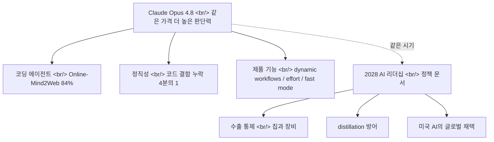

## 개요

[Anthropic](https://www.anthropic.com)이 [Claude Opus 4.8](https://www.anthropic.com/news/claude-opus-4-8)을 공개했다. 가격은 그대로($5/$25 per million input/output tokens) 두면서 코딩·추론·에이전트 작업 전반을 끌어올린 점진적 업그레이드다. 그런데 같은 시기에 Anthropic은 모델이 아니라 정책 문서 [2028: Two Scenarios for Global AI Leadership](https://www.anthropic.com/research/2028-ai-leadership)도 함께 내놨다. 성능 한 줄, 정책 한 줄 — 이 두 발표를 나란히 읽으면 프런티어 랩이 지금 어떤 게임을 하고 있는지가 더 또렷해진다.

<!--more-->

## 같은 가격, 더 높은 판단력

[Opus 4.8](https://www.anthropic.com/claude/opus)의 핵심 메시지는 "값은 안 올리고 판단력을 올렸다"다. [공식 발표](https://www.anthropic.com/news/claude-opus-4-8)는 코딩·추론·에이전트 작업 전반의 향상을 내세우면서도, 벤치마크 숫자보다 **정직성(honesty)** 을 앞세운다. 초기 테스터들은 모델이 불확실성을 스스로 표시하고 근거 없는 주장을 피한다는 점을 높이 샀고, 코드 결함을 놓치는 빈도가 직전 세대인 Opus 4.7 대비 약 4분의 1로 줄었다고 한다. 에이전트 코딩에서 "그럴듯하지만 틀린 답"은 잘못된 거절보다 비용이 크다 — 이 지점을 정조준한 개선이다.

가격이 유지된 것도 그 자체로 신호다. [Anthropic 가격표](https://www.anthropic.com/pricing)에서 Opus 등급은 백만 토큰당 입력 $5 / 출력 $25 — 4.7과 동일하다. 프런티어 랩들이 세대마다 가격을 올리던 흐름과 달리, 같은 가격에 능력을 얹는 전략은 [경쟁 모델](https://openai.com)들과의 토큰당 비용 비교를 의식한 포지셔닝으로 읽힌다.

## 에이전트로서의 Opus: 벤치마크와 새 기능

발표가 강조한 벤치마크 중 눈에 띄는 건 웹 에이전트 평가다. [Mind2Web](https://osu-nlp-group.github.io/Mind2Web/) 계열의 라이브 벤치마크인 [Online-Mind2Web](https://huggingface.co/datasets/osunlp/Online-Mind2Web)에서 84%를 기록했다고 한다. 실제 웹사이트를 대상으로 멀티스텝 작업을 수행하는 평가라, 정적 QA보다 "에이전트로서 얼마나 쓸 만한가"를 더 직접적으로 보여준다.

제품 레이어의 변화도 함께 왔다. [Claude Code](https://github.com/anthropics/claude-code)에는 대규모 작업을 병렬 서브에이전트로 쪼개 실행하는 **dynamic workflows** 가 추가됐다([Claude Code 문서](https://docs.claude.com/en/docs/claude-code/overview)). [claude.ai](https://claude.ai)에는 품질과 속도를 사용자가 직접 저울질하는 **effort 컨트롤** 이 생겼고, 이전보다 3배 저렴한 **fast mode** 도 도입됐다. 한 모델을 "더 깊게 생각하게" 또는 "더 빠르게 답하게" 돌리는 다이얼을 사용자 손에 쥐여준 셈이다.

발표는 Opus 4.8을 "완만한 개선"으로 스스로 규정하면서, 몇 주 내 더 넓게 풀릴 Mythos급 모델의 예고편 격으로 위치시킨다. 점진 릴리스를 명시적으로 깐다는 것 자체가 [Anthropic 뉴스룸](https://www.anthropic.com/news)의 최근 출시 리듬과 맞물린다.

## 나란히 놓인 정책 문서

성능 발표 옆에 [2028 AI 리더십 시나리오](https://www.anthropic.com/research/2028-ai-leadership) 문서가 놓였다는 점이 이번 주의 진짜 이야기다. 핵심 주장은 "가장 앞선 AI가 만들어지는 정치 체제가 그 기술의 규칙과 규범을 좌우한다"는 것. 문서는 두 갈래 미래를 제시한다 — 미국이 12~24개월의 지능 우위를 유지하며 민주주의 진영이 글로벌 AI 규범을 세우는 시나리오와, 격차가 사라져 권위주의적 감시가 대규모로 가능해지는 시나리오.

권고는 세 가지로 압축된다. 첫째, 첨단 반도체 칩과 제조 장비에 대한 [수출 통제](https://www.bis.doc.gov/) 강화. 둘째, 미국 모델을 불법적으로 추출해 능력을 복제하는 **distillation** 공격 대응. 셋째, 미국 AI 시스템의 글로벌 채택 촉진. 문서는 한 발 더 나아가 컴퓨트를 결정적 변수로 지목하며, 10년 넘게 "모델 능력이 컴퓨트에 따라 스케일해 왔다"는 점을 근거로 든다.

## 인사이트

두 발표를 나란히 읽으면 프런티어 랩의 전략이 단일 축이 아니라는 게 분명해진다. 한쪽에서는 [Opus 4.8](https://www.anthropic.com/news/claude-opus-4-8)처럼 가격을 묶고 정직성·에이전트 성능을 끌어올리는 **제품 경쟁**이 돌아가고, 다른 한쪽에서는 [수출 통제와 distillation 방어](https://www.anthropic.com/research/2028-ai-leadership)를 내세우는 **정책 경쟁**이 동시에 진행된다. 모델 카드의 honesty 개선과 정책 문서의 "민주주의 진영 우위" 주장은 같은 뿌리에서 나온다 — 신뢰할 수 있는 AI를 누가, 어떤 규범 아래 만드느냐의 문제다.

실무자 입장에서 더 중요한 건 제품 레이어의 다이얼이다. [effort 컨트롤](https://www.anthropic.com/claude/opus)과 [fast mode](https://www.anthropic.com/news/claude-opus-4-8), 그리고 [Claude Code](https://github.com/anthropics/claude-code)의 dynamic workflows는 "하나의 모델, 하나의 속도"라는 가정을 깬다. 앞으로의 비용·지연·품질 트레이드오프는 모델 선택이 아니라 같은 모델 안에서의 다이얼 세팅으로 옮겨갈 가능성이 크다. 코드 결함을 4분의 1로 덜 놓친다는 주장이 사실이라면, 에이전트 코딩 파이프라인에서 사람이 검토에 쓰는 시간의 분포 자체가 바뀐다. 다만 honesty·벤치마크 수치는 모두 벤더 자체 발표이므로, [Online-Mind2Web](https://huggingface.co/datasets/osunlp/Online-Mind2Web) 84% 같은 숫자는 독립 재현으로 확인되기 전까지는 방향성으로만 받아들이는 게 안전하다. 그리고 [2028 시나리오](https://www.anthropic.com/research/2028-ai-leadership)가 시사하듯, 그 다이얼이 어떤 [컴퓨트](https://deepmind.google/models/gemini/)·어떤 규범 위에서 돌아가는지는 점점 더 기술 외적인 변수에 좌우될 것이다.

## 참고

**공식 발표 / 제품**
- [Claude Opus 4.8 발표](https://www.anthropic.com/news/claude-opus-4-8) — 같은 가격, 향상된 코딩·추론·정직성, 새 기능(dynamic workflows / effort / fast mode)
- [Claude Opus 모델 페이지](https://www.anthropic.com/claude/opus) — Opus 등급 개요
- [Anthropic 가격표](https://www.anthropic.com/pricing) — Opus $5/$25 per million tokens
- [Claude Code](https://github.com/anthropics/claude-code) — dynamic workflows / 병렬 서브에이전트가 추가된 에이전트 코딩 CLI
- [Claude Code 문서](https://docs.claude.com/en/docs/claude-code/overview) — 기능·워크플로 레퍼런스
- [claude.ai](https://claude.ai) — effort 컨트롤이 노출되는 소비자 인터페이스

**정책 / 연구**
- [2028: Two Scenarios for Global AI Leadership](https://www.anthropic.com/research/2028-ai-leadership) — 수출 통제·distillation 방어·미국 AI 글로벌 채택
- [Anthropic Responsible Scaling Policy](https://www.anthropic.com/responsible-scaling-policy) — 능력·리스크 스케일링 정책 배경
- [미국 BIS 수출 통제](https://www.bis.doc.gov/) — 반도체·장비 통제 주관 기관

**벤치마크 / 배경**
- [Mind2Web](https://osu-nlp-group.github.io/Mind2Web/) — 웹 에이전트 평가 프로젝트
- [Online-Mind2Web 데이터셋](https://huggingface.co/datasets/osunlp/Online-Mind2Web) — 라이브 웹 멀티스텝 에이전트 벤치마크
- [Anthropic 뉴스룸](https://www.anthropic.com/news) — 최근 출시 리듬
- [OpenAI](https://openai.com) · [Google DeepMind Gemini](https://deepmind.google/models/gemini/) — 토큰당 비용·컴퓨트 비교 대상 프런티어 랩
