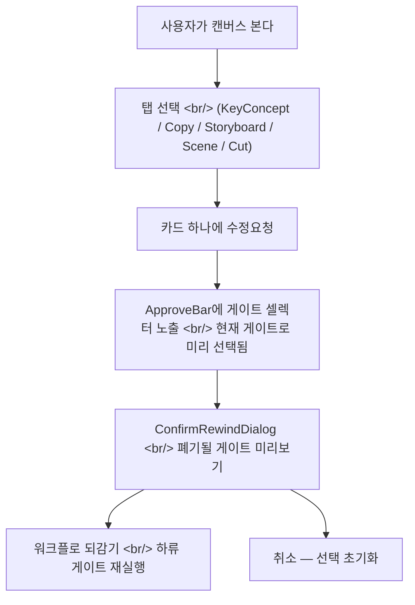

## 개요

**Creative Agent Studio**의 첫 번째 개발일지다. 이 도구는 카피 작성, 키 컨셉, 콘티, 컷 플래닝 에이전트를 하나의 승인 워크플로로 묶는 데스크톱 캔버스다. 각 에이전트는 자기 탭에 산출물을 떨군다 — 사용자는 단계마다 게이트를 통과시키거나, 특정 카드에 "수정요청"을 걸고 워크플로를 되감을 수 있다.

오늘 들어간 네 커밋은 모두 게이트/수정 인터랙션의 프론트엔드 다듬기다 — 마킹된 카드의 비주얼 통일, 되돌리기 다이얼로그 카피 완화, 그리고 게이트 셀렉터가 방금 누른 카드 위치를 기억하게 하는 작은 상태 관리 수정.

<!--more-->



네 커밋, 한 가지 일관된 주제 — **파괴적인 동작(워크플로 되감기)을 무섭지 않고 의도적으로 느껴지게 만든다.**

---

## 되돌리기 다이얼로그 카피 다듬기

첫 커밋(`e27316a`)은 앱에서 가장 거슬리던 카피를 손봤다. 카드에 수정요청을 걸고 확인하면 다음 다이얼로그가 떴다.

> "이 결정을 되돌릴까요?"
> "카피 검토 단계부터 다시 진행합니다."
> "아래 후속 결정이 새 버전으로 대체됩니다:"
> – 컨셉 확정 결정
> – 시나리오 검토 결정
> – 최종 승인 결정

화면 녹화를 보면 두 가지 문제가 도드라졌다.

1. 폐기 리스트에 *최종* 승인 게이트가 들어가 있다 — 하지만 그 게이트는 마지막에 다시 확정하는 단계지, 사라지는 단계가 아니다. "대체된다"고 표기하니 작업 자체가 날아갈 것처럼 읽혔다.
2. "결정"이라는 단어가 너무 기업스러웠다. 실제로는 초안에 대한 크리에이티브 판단이지, 이사회 안건이 아니다.

수정한 코드:

```tsx
// web/src/components/approve/ConfirmRewindDialog.tsx
// before
<ul data-testid="confirm-rewind-discard-list">
  {gates.map(g => <li key={g.id}>{g.title}</li>)}
</ul>

// after
<ul data-testid="confirm-rewind-discard-list">
  {gates
    .filter(g => g.kind !== 'final-approval')
    .map(g => <li key={g.id}>{g.softTitle}</li>)}
</ul>
```

두 가지 변경 — 폐기 미리보기에서 `final-approval` 게이트를 빼고, `softTitle`(예: "콘티 검토 결정" 대신 "콘티 검토")을 쓴다. 같은 `Gate` 인터페이스에서 가져오지만 파괴적 컨텍스트와 정보성 컨텍스트에서 다르게 렌더링한다.

---

## ApproveBar 게이트 미리 선택

두 번째 커밋(`c55891b`)은 작지만 짜증 나던 상태 버그를 해결했다. 카드의 수정요청을 누르면 ApproveBar가 게이트 셀렉터와 함께 슬라이드 업했는데, 셀렉터가 비어 있어서 사용자가 방금 마킹한 게이트를 다시 클릭해야 했다.

근본 원인은 `ApproveBar`가 `gateSelection`을 오로지 사용자 주도 상태로만 다뤘다는 것 — 카드 클릭에서 오는 암묵적 선택은 무시되고 있었다.

```tsx
// web/src/components/approve/ApproveBar.tsx
useEffect(() => {
  if (mode === '수정요청' && activeCard) {
    setGateSelection(activeCard.gateId);
  }
  if (mode === 'idle') {
    setGateSelection(null);  // 닫기 시 초기화
  }
}, [mode, activeCard]);
```

두 줄짜리 `useEffect`로 암묵적 컨텍스트(어떤 카드가 바를 열었는지)를 명시적 선택으로 동기화했다. `mode === 'idle'`(닫기 전이) 시점에 초기화하니 다음 인터랙션으로 오래된 선택이 새지 않는다.

이 변경은 커밋 전에 보안 리뷰를 한 번 돌렸다. 한 가지 노트가 나왔다 — 게이트 id가 사용자 제어 DOM 이벤트에서 서버 사이드 뮤테이션으로 흘러가는데, 서버에서 어차피 현재 워크플로의 게이트 집합과 대조 검증하니 추가 클라이언트 검증은 불필요. 다만 그 불변식이 리뷰를 통해 명시적으로 기록되었다.

---

## 되돌리기 다이얼로그의 게이트 타이틀

커밋 `4ddff68`은 한 파일짜리 변경이지만 이해도에 미치는 영향은 컸다. 되돌리기 다이얼로그는 그동안 기계 생성 게이트 id(`g-2`, `g-3`)를 타이틀로 쓰고 있어서, 사용자가 어느 단계로 되돌아가는지 추측해야 했다.

각 게이트를 단계 라벨로 매핑하는 식으로 고쳤다.

```ts
const GATE_LABELS: Record<GateKind, string> = {
  'concept-confirm':   '컨셉 검토',
  'scenario-review':   '시나리오 검토',
  'storyboard-approve':'콘티 검토',
  'cut-finalize':      '컷 검토',
  'final-approval':    '최종 승인',
};
```

이제 다이얼로그가 "콘티 검토 단계부터 다시 진행합니다"라고 읽힌다 — 캔버스 탭 라벨과 정확히 일치하는 표현이라, 사용자가 되감기 후 어느 탭에 도착할지 미리 알 수 있다.

---

## 수정요청 마킹 카드 비주얼 통일

가장 큰 커밋(`2804420`)은 다섯 개 탭 컴포넌트에 걸친 비주얼 통일 작업이다.

이 변경 전까지 각 탭은 자기만의 마킹 스타일을 구현하고 있었다.

| 탭 | 기존 마킹 스타일 |
|---|---|
| `CopyTab.tsx` | 노란 배경 + 수정요청 칩 |
| `KeyConceptTab.tsx` | 빨간 점선 테두리 |
| `StoryboardPage.tsx` | 파란 왼쪽 엣지 바 (이거 하나만) |
| `SceneStrip.tsx` | 비주얼 처리 없음 — 칩만 |
| `CutChip.tsx` | 인라인 아웃라인만 |

결과: 수정 모드가 활성화될 때마다 모든 탭이 미묘하게 다른 "느낌"을 줬다. 사용자가 계속 물었다 — *"왜 콘티에만 파란 마크가 뜨나요?"*

통일된 처리는 디자인 토큰 하나에 모았다.

```tsx
// design-system / marked-card.css
.marked-card {
  position: relative;
  outline: 2px solid var(--color-revision);
  outline-offset: -2px;
}
.marked-card::before {
  content: '';
  position: absolute;
  top: 0; bottom: 0; left: 0;
  width: 3px;
  background: var(--color-revision);
}
```

그리고 모든 탭 컴포넌트는 이제 카드를 이렇게 감싼다.

```tsx
<div className={cn('card', card.marked && 'marked-card')}>
  {card.marked && <RevisionLabel kind={card.kind} />}
  {/* 탭별 콘텐츠 */}
</div>
```

`RevisionLabel`도 추출했다 — 예전엔 각 탭이 자기 라벨을 인라인으로 만들면서 카피가 제각각이었다 ("수정 요청됨", "리비전", "Edit Pending"). 이제 컴포넌트 하나, 문자열 하나다.

---

## 인사이트

네 커밋, 몇 시간 작업, 전부 `web/src/components/approve`와 `web/src/components/canvas` 트리 안에서. 새 기능은 하나도 없다 — 에이전트 워크플로가 이미 하고 있던 일과 사용자가 그렇게 인식하는 것 사이의 격차를 메우는 작업이었다.

반복적으로 나온 교훈 — **파괴적인 워크플로 동작은 UI에서 세 겹의 명료함이 필요하다.**

1. **비주얼 일관성** — 같은 종류의 결정은 어디에 있든 같아 보여야 한다.
2. **정직한 카피** — 실제로 바뀌는 것을 나열하고, 바뀌지 않는 것은 빼라.
3. **상태 보존** — 앱이 이미 알고 있는 컨텍스트를 사용자가 다시 진술하게 만들지 마라.

Creative Agent Studio의 가치 제안은 어떤 결정이든 되감을 수 있고 하류 에이전트가 재실행된다는 것이다. 강력한 보장이지만, 확인을 요청하는 다이얼로그가 잃게 될 것에 대해 진실을 말할 때만 안전하게 느껴진다. 오늘은 그 진실과 다이얼로그가 말하던 것 사이의 격차를 메웠다.

다음 세션 — 채팅 사이드의 task update(`task-update-storyboard`, `task-update-cut`)에 동일한 패스를 적용한다. 아직 즉석 카피를 쓰고 있고 새 라벨 컴포넌트를 공유하지 못하고 있다.
