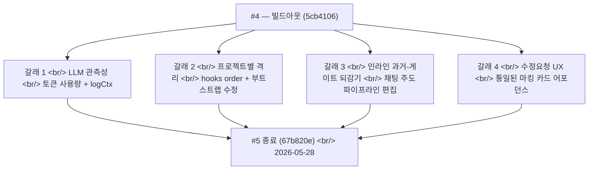

## 개요

[이전 글: #4 — 5개 게이트, 4개 캔버스, 수정 모드 시스템](/posts/2026-05-22-creative-agent-studio-dev4/)이 빌드아웃 푸시를 끝냈다. 6일 뒤, **4 작업일에 23커밋**이 폴리시 주간을 마무리했다 — 기능 완성된 시스템을 실제 사용자의 손 아래 production에서 버티는 무언가로 바꾸는 종류의 작업.

주중에 네 갈래가 병렬로 흘렀다. 첫째, **LLM 호출 관측성** — 모든 모델 호출이 이제 토큰 사용량과 전파된 logCtx를 갖춘 구조화 로그를 발신하고, 런타임은 `LOG_LEVEL` 임계 제어를 받았다. 둘째, **새로고침 아래 프로젝트별 상태 격리** — 2026-05-26의 여덟 커밋이 멀티세션 작업이 떨어진 뒤 표면화된 hooks-order 버그, 끊긴 부트스트랩, crypto.randomUUID 격차를 사냥했다. 셋째, **인라인 과거-게이트 되감기** — 단일 feat 커밋이 사용자가 활성 콘티 세션 안에서 "GATE 2의 세 번째 카피로 바꿔줘"라고 말하고 세션을 떠나지 않을 수 있는 어포던스를 출시했다. 넷째, **수정요청 어포던스 패스** — 다섯 커밋이 모든 캔버스 탭의 마킹 카드 비주얼을 통일하고, 되돌리기 다이얼로그 카피를 다듬고, 게이트 셀렉터가 사용자가 방금 클릭한 카드를 잊는 상태 버그를 수정했다.

<!--more-->



관통하는 한 주제 — **기능은 끝났다. 남은 건 새로고침, 부하, 그리고 혼란스러운 사용자 아래에서 정직하게 만드는 일이었다.**

---

## 갈래 1 — LLM 호출 관측성

#2에서 떨어진 구조화 로거가 토대였다 — 이번 주는 그것을 모든 LLM 호출 사이트에 꿰어서 production 텔레메트리가 실제로 의미를 갖게 했다.

두 커밋이 무거운 짐을 졌다.

- `feat(logger): add LOG_LEVEL threshold, silence node:sqlite warning` — `LOG_LEVEL` env var로 production이 `info` 잡담을 떨구고 `warn`/`error`만 유지할 수 있다. 동반 변경은 모든 워커 fork에서 출력되던 `node:sqlite` 실험적 경고를 억제했다.
- `feat(observability): emit structured logs across worker + lifecycle paths` — `runtime/workers/worker-loop.js`와 `runtime/orchestration/run-lifecycle.js`가 이제 각 의미 있는 전이(잡 클레임, 실행 시작, 게이트 발신, 단계 전진, 실행 완료/오류)에서 구조화 이벤트를 로깅.
- `feat(observability): instrument LLM calls with token usage + logCtx` — 이게 하중 지지 조각이다. 모든 모델 호출이 이제 다음을 로깅.

```js
// runtime/agents/_llm-instrument.js (의역)
async function callModelWithLogging(model, prompt, logCtx) {
  const start = Date.now();
  try {
    const result = await model.generate(prompt);
    logger.info("llm_call", {
      ...logCtx,
      model: result.model,
      prompt_tokens: result.usage?.input_tokens,
      output_tokens: result.usage?.output_tokens,
      duration_ms: Date.now() - start,
      cached_tokens: result.usage?.cached_input_tokens ?? 0,
    });
    return result;
  } catch (err) {
    logger.error("llm_call_failed", { ...logCtx, error: err.message, duration_ms: Date.now() - start });
    throw err;
  }
}
```

`logCtx`는 `worker-loop.js`에서 전파되며 `{ runId, projectId, stage, role }`를 들고 다닌다. 그래서 단일 LLM 호출의 로그 줄이 어느 프로젝트, 어느 세션, 어느 게이트, 어느 에이전트, 어느 모델, 토큰이 얼마나 들었는지를 말해준다. #2에서 셋업했던 Grafana 대시보드에 이제 실제 데이터가 흐른다.

인프라 측 동반은 `feat(terraform): widen EC2 start cron to every day` + `fix(terraform): update daily stop schedule to 03:00 KST`. EC2 인스턴스는 프로토타입 시절부터 평일 전용 스케줄로 돌고 있었다 — cron이 이제 매일 박스를 시작하고 03:00 KST에 멈춘다. 운영, 기능 작업 아님.

---

## 갈래 2 — 새로고침 아래 프로젝트별 상태 격리

#4의 멀티세션 작업이 새로고침 시점 버그의 전체 부류를 도입했다. 사용자가 workspace 안에서 하드 새로고침하면, React 트리는 어떤 데이터도 로드되기 전에 마운트된다 — 그리고 멀티세션 로직은 사용자가 launcher에서 workspace로 *들어왔을* 때만 성립하는 가정(부트스트랩이 이미 일어났다)을 만들고 있었다.

2026-05-26의 여덟 커밋이 엣지 케이스를 사냥했다.

**`fix(web): bootstrap projects on workspace refresh, fix hooks order`** — workspace 페이지가 `projects`가 이미 로드됐다고 가정했다. 새로고침 시에는 아니었다. 수정은 workspace effect 안에 부트스트랩 호출을 추가했다 — 하지만 그게 React hooks-order 위반을 트리거했다, 부트스트랩 호출이 `useEffect` 안에서 조건부였기 때문. 둘 다 한 커밋으로 수정됐다.

**`fix(web): isolate per-project state on switch, show loader during session hydration`** — 프로젝트 A에서 B로 전환할 때 A의 세션 목록이 B가 로딩되는 동안 보이고 있었다. 수정 — `projectId`가 바뀌면 즉시 프로젝트별 슬라이스를 비우고 로더를 보여준 다음 B의 데이터를 hydrate. 사용자는 잠깐의 로더를 보지, A의 세션을 B에 잘못 귀속시키지 않는다.

**`fix(web): don't strand /sessions bootstrap behind a stale ref guard`** — ref로 구현된 "이미 부트스트랩 중이면 재부트스트랩하지 마라" 가드가 있었다. ref가 `true`로 세팅된 뒤 특정 에러 경로에서 클리어되지 않아, 후속 네비게이션이 stranded됐다. 수정 — 부트스트랩 상태를 ref가 아니라 슬라이스에서 추적하고, 성공 *과* 실패 모두에서 클리어.

**`fix(web): make Composer first-brief-only, flip ApproveBar toggle label`** — Composer(채팅 입력)가 *모든* 사용자 턴의 진입점이었다. 하지만 세션이 첫 브리프 너머로 가면 게이트 기반 흐름이 인계한다 — Composer의 역할은 숨겨져야 했다. 수정은 첫 브리프가 제출되기 전에만 Composer를 보이게 만들었다 — 그 뒤로는 ApproveBar가 사용자의 표면.

**`fix(web): make bootstrap dep stable so /sessions can't be cancelled forever`** — `useChatStream`이 의존성 배열이 불안정한 AbortController를 사용하고 있어서 매 재렌더마다 abort됐다. 수정은 dep를 안정화해서 컨트롤러가 실제 사용자 취소 또는 언마운트에서만 abort되게 했다.

**`fix(web): polyfill crypto.randomUUID so HTTP prod can create projects/sessions`** — production EC2가 일부 클라이언트에 평문 HTTP로 서빙하고 있었고(중간 프록시가 HTTPS를 떼어냈다), `crypto.randomUUID`는 secure context에서만 사용 가능하다. 프로젝트와 세션이 생성될 수 없었다. 폴리필이 복원.

마지막이 이 주에서 가장 "production이 dev 환경이 숨겼던 걸 드러낸다" 케이스다. 로컬호스트는 secure context. 배포 타깃은 항상 그렇지는 않다. 한 줄 폴리필이 EC2 빌드를 사용 가능하게 유지했다.

**`fix: preserve 분석 보고서 across key-concept revisions`** — 런타임 수정 동반. 사용자가 GATE 1에서 키 컨셉 선택을 수정할 때, 분석 보고서가 함께 재계산되고 있었다 — 불필요한 작업이고 매번 약간 다른 보고서를 만들었다. 수정은 키 컨셉 수정에 걸쳐 원래 분석을 고정.

그리고 `docs(claude): register Diffs Runtime harness pointer in CLAUDE.md`가 Claude Code 세션이 런타임의 하네스 규약을 자동으로 찾을 수 있도록 포인터를 추가했다.

---

## 갈래 3 — 채팅에서 인라인 과거-게이트 되감기

단일 커밋이 큰 UX 이동을 출시했다 — `feat(web): add inline past-gate rewind for chat-driven pipeline edits`.

설정 — 폴리시 주간이 되자 사용자는 현재 게이트에 대한 수정 모드를 가진 ApproveBar를 갖췄고, 워크플로는 한 번에 한 단계씩 전진했다. 그런데 사용자가 *과거* 결정을 바꾸고 싶으면? "사실 두 번째 키 컨셉으로 가자" — 콘티 단계에 앉아서?

이전엔 캔버스를 떠나, 수동으로 GATE 1으로 돌아가고, 재선택하고, 후속 모든 게이트를 다시 걸어야 했다. 고통스럽고, 채팅 우선 원칙 위반.

인라인 되감기는 채팅에서 과거-게이트 의도를 감지한다.

```ts
// (의역 — 결합된 chat-stream + dispatch-sse 경로)
// 백엔드가 채팅 메시지를 분류:
//   "두 번째 키 컨셉으로 다시 가자" → rewind_intent: { gate: "GATE_1", selection: 2 }
// 프론트엔드가 rewind_proposal SSE 이벤트 수신:
{
  kind: "rewind_proposal",
  fromGate: "GATE_5",
  toGate: "GATE_1",
  affectedDownstreamGates: ["GATE_2", "GATE_3", "GATE_4", "GATE_5"],
}
// UI가 인라인 ConfirmRewindDialog 표시 (갈래 4에서 다듬은 것)
```

다이얼로그는 폐기될 것을 명시적으로 나열한다 — GATE 2의 카피 승인, GATE 4의 시나리오 승인 등 — 그래서 사용자가 확인 전 비용을 안다. 확인 시 런타임이 프로젝트를 타깃 게이트로 되돌리고, 하류 모든 것을 재생성하고, 사용자는 새 선택을 할 준비가 된 타깃 게이트의 승인 표면에 도착한다.

이건 게이트 기반 자동 실행 원칙(`interaction-model.md`의 결정 3)의 자연스러운 확장이다 — 단 *역방향*으로. 원칙은 — 각 단계는 사용자 승인에서 다음으로 전진. 되감기는 — 각 단계는 *되돌아갈* 수도 있고, 런타임은 무엇을 무효화할지 안다.

동반 `docs(claude): add triage-prod-bug skill trigger to enforce browser-first debugging`는 하네스 규칙이다 — 버그가 보고되면, 코드를 읽기 전에 브라우저를 먼저 본다(devtools, network, console). 채팅 우선 제품 원칙에는 디버깅 유사물이 있다 — 먼저 보고, 그 다음 코드.

---

## 갈래 4 — 수정요청 어포던스 패스

마지막 다섯 커밋이 모든 캔버스 탭의 수정요청 UI를 통일했다. 이 작업 전까지 모든 탭은 자기 마킹 카드 스타일을 구현하고 있었다 — Copy에는 노란 배경, KeyConcept에는 빨간 점선 테두리, Storyboard에는 파란 왼쪽 엣지 바(이거 하나만), Scene에는 비주얼 처리 전혀 없음 — 그리고 사용자가 계속 물었다 — *"왜 콘티에만 파란 마크가 뜨나요?"*

### 되돌리기 다이얼로그 카피 완화 + 폐기 리스트에서 최종 게이트 숨기기

커밋 `e27316a`. 첫 공격은 가장 거슬리던 카피였다. 되돌리기 다이얼로그가 이렇게 읽혔다.

> "이 결정을 되돌릴까요?"
> "카피 검토 단계부터 다시 진행합니다."
> "아래 후속 결정이 새 버전으로 대체됩니다:"
> – 컨셉 확정 결정
> – 시나리오 검토 결정
> – **최종 승인 결정** ← 이 리스트에 있으면 안 됨

두 문제 — 폐기 리스트에 *최종* 승인 게이트가 들어가 있었지만(그건 끝에 다시 확정하는 단계지 사라지는 단계가 아님), "결정"이라는 단어가 너무 기업스러웠다. 실제로는 초안에 대한 크리에이티브 판단이지 이사회 안건이 아니다.

```tsx
// web/src/components/approve/ConfirmRewindDialog.tsx
<ul data-testid="confirm-rewind-discard-list">
  {gates
    .filter(g => g.kind !== 'final-approval')
    .map(g => <li key={g.id}>{g.softTitle}</li>)}
</ul>
```

폐기 미리보기에서 `final-approval` 게이트를 빼고, `softTitle`(예: "콘티 검토 결정" 대신 "콘티 검토")을 쓴다. 같은 `Gate` 인터페이스에서 가져오지만 파괴적 컨텍스트와 정보성 컨텍스트에서 다르게 렌더링한다.

### 되돌리기 다이얼로그의 게이트 타이틀

커밋 `4ddff68`. 다이얼로그가 기계 생성 게이트 id(`g-2`, `g-3`)를 타이틀로 쓰고 있었다. 작은 라벨 맵이 이해도를 고쳤다.

```ts
const GATE_LABELS: Record<GateKind, string> = {
  'concept-confirm':   '컨셉 검토',
  'scenario-review':   '시나리오 검토',
  'storyboard-approve':'콘티 검토',
  'cut-finalize':      '컷 검토',
  'final-approval':    '최종 승인',
};
```

이제 다이얼로그가 "콘티 검토 단계부터 다시 진행합니다"라고 읽힌다 — 캔버스 탭 라벨과 정확히 일치하는 표현이라, 사용자가 되감기 후 어느 탭에 도착할지 미리 알 수 있다.

### 수정요청 진입 시 ApproveBar 게이트 미리 선택

커밋 `c55891b`. 카드의 수정요청을 누르면 ApproveBar가 게이트 셀렉터와 함께 슬라이드 업했는데, 셀렉터가 비어 있어서 사용자가 방금 마킹한 게이트를 다시 클릭해야 했다. 두 줄짜리 `useEffect`로 암묵적 컨텍스트를 명시적 선택으로 동기화했다.

```tsx
// web/src/components/approve/ApproveBar.tsx
useEffect(() => {
  if (mode === '수정요청' && activeCard) {
    setGateSelection(activeCard.gateId);
  }
  if (mode === 'idle') {
    setGateSelection(null);  // 닫기 시 초기화
  }
}, [mode, activeCard]);
```

이 변경의 보안 리뷰 패스가 한 가지 노트를 표면화했다 — 게이트 id가 사용자 제어 DOM 이벤트에서 서버 사이드 뮤테이션으로 흘러가는데, 서버에서 어차피 현재 워크플로의 게이트 집합과 대조 검증하니 추가 클라이언트 검증은 불필요. 다만 그 불변식이 리뷰를 통해 명시적으로 기록됐다.

### 다섯 탭에 걸친 마킹 카드 비주얼 통일

커밋 `2804420`. 비주얼 통일 패스. 통일된 처리는 디자인 토큰 하나에 모았다.

```tsx
// design-system / marked-card.css
.marked-card {
  position: relative;
  outline: 2px solid var(--color-revision);
  outline-offset: -2px;
}
.marked-card::before {
  content: '';
  position: absolute;
  top: 0; bottom: 0; left: 0;
  width: 3px;
  background: var(--color-revision);
}
```

그리고 모든 탭 컴포넌트는 이제 카드를 이렇게 감싼다.

```tsx
<div className={cn('card', card.marked && 'marked-card')}>
  {card.marked && <RevisionLabel kind={card.kind} />}
  {/* 탭별 콘텐츠 */}
</div>
```

`RevisionLabel`도 추출했다 — 예전엔 각 탭이 자기 라벨을 인라인으로 만들면서 카피가 제각각이었다 ("수정 요청됨", "리비전", "Edit Pending"). 이제 컴포넌트 하나, 문자열 하나다.

### 모든 게이트 마커를 한 번씩만 표시하고 라이브 게이트 상태 반영

이 날의 마지막 커밋(`67b820e`). workspace 상단의 StageStepper가 어떤 상태에서 중복 게이트 마커를 표시하고 있었다(재발신된 게이트 이벤트가 두 번째 점을 추가) 그리고 실제 gate_state 전이보다 뒤처져 있었다. 한 수정에 두 버그.

- 게이트 id로 중복 제거해서 각 게이트가 정확히 한 번 렌더
- 파이프라인 슬라이스의 라이브 `gate_state`(#4의 12상태 필드)를 와이어드해서 stepper가 방금 일어난 어떤 전이든 반영

12상태 gate_state 필드는 일주일 전부터 있었지만, stepper는 여전히 오래된 "마지막 완료 게이트" 추론을 쓰고 있었다. 이 커밋이 그 격차를 닫았다.

---

## 커밋 로그 (총 23개)

| 날짜 | 메시지 |
|---|---|
| 2026-05-25 | fix stale approve gates during storyboard runs |
| 2026-05-25 | feat(terraform): widen EC2 start cron to every day |
| 2026-05-25 | refactor(canvas): drop submit prop drilling, polish selected-copy card |
| 2026-05-25 | feat(logger): add LOG_LEVEL threshold, silence node:sqlite warning |
| 2026-05-25 | feat(observability): emit structured logs across worker + lifecycle paths |
| 2026-05-25 | feat(observability): instrument LLM calls with token usage + logCtx |
| 2026-05-25 | chore: refresh lockfile peer-dep flags |
| 2026-05-26 | fix(web): bootstrap projects on workspace refresh, fix hooks order |
| 2026-05-26 | docs(claude): register Diffs Runtime harness pointer in CLAUDE.md |
| 2026-05-26 | fix: preserve 분석 보고서 across key-concept revisions |
| 2026-05-26 | fix(web): isolate per-project state on switch, show loader during session hydration |
| 2026-05-26 | fix(web): don't strand /sessions bootstrap behind a stale ref guard |
| 2026-05-26 | fix(web): make Composer first-brief-only, flip ApproveBar toggle label |
| 2026-05-26 | fix(web): make bootstrap dep stable so /sessions can't be cancelled forever |
| 2026-05-26 | fix(web): polyfill crypto.randomUUID so HTTP prod can create projects/sessions |
| 2026-05-27 | docs(claude): add triage-prod-bug skill trigger to enforce browser-first debugging |
| 2026-05-27 | feat(web): add inline past-gate rewind for chat-driven pipeline edits |
| 2026-05-27 | fix(terraform): update daily stop schedule to 03:00 KST in variables |
| 2026-05-27 | fix(gitignore): add harnesskit session-logs to .gitignore |
| 2026-05-28 | fix(web): soften rewind dialog copy and hide final gate from discard list |
| 2026-05-28 | fix(web): update gate titles in ConfirmRewindDialog for clarity |
| 2026-05-28 | fix(web): preselect gateSelection on 수정요청 enter, clear it on 닫기 |
| 2026-05-28 | fix(web): unify 수정요청 marked-card visual and label across all tabs |
| 2026-05-28 | fix(web): show every gate marker once and reflect live gate state |

---

## 인사이트

폴리시 주간의 패턴 — **관측성과 격리 모두 조용히 가정되던 상태를 드러내는 일이었다.**

LLM 토큰 텔레메트리가 *실제로 돈을 쓰던 것*을 드러냈다 — 이전 대시보드는 큐 깊이와 잡 지속시간을 보여줬는데 둘 다 중요하지만, 느린 에이전트가 쌀 수도 있고 빠른 에이전트가 비쌀 수도 있다, 토큰 사용량에 따라. `logCtx`를 모든 호출에 꿰어 넣자 비용 분석이 필요로 하는 프로젝트별, 단계별, 에이전트별 분해가 표면화됐다.

멀티세션 새로고침 수정들이 *workspace가 자기 부트스트랩에 대해 가정하던 것*을 드러냈다. 사용자가 launcher에서 들어왔을 때 기능이 작동했던 이유는 launcher의 부트스트랩이 우연히 만족된 전제조건이었기 때문. 새로고침이 그 전제조건을 깨자 버그가 표면화됐다 — 하지만 내내 거기 있었다, 잠복해.

인라인 과거-게이트 되감기는 같은 아이디어를 사용자의 멘탈 모델에 적용한 것이다 — 사용자는 *"GATE 1로 돌아가서 뭔가 바꾸고 싶다"*고 생각한다. 되감기 기능은 그 의도를 시스템에 노출시켜 사용자가 네비게이션 단계로 번역하도록 강제하지 않는다. 채팅 우선 원칙은 단지 입력 메커니즘이 아니다 — 시스템이 의도를 이해할 것이라는 약속이다.

수정요청 어포던스 패스는 같은 빙산의 작은 보이는 끝이다. 세 겹의 명료함 — 비주얼 일관성, 정직한 카피, 상태 보존 — 이 파괴적 워크플로 동작에 적용되어, 확인을 요청하는 다이얼로그가 잃게 될 것에 대해 진실을 말한다.

다음 — 여기서부터 시스템은 기능적으로 완성됐으니, 미래 개발일지는 기능 추가보다 production 교훈으로 기울 것이다 — 에이전트 프롬프트 튜닝, 비용 추세, 실제 사용자 세션에서 떠오르는 다음 라운드의 UX 패턴. 5포스트 백필이 깔끔한 호를 닫는다 — 목업, production-readying, 메가푸시, 게이트 워크플로, 폴리시. 제품이 이제 진짜다.
