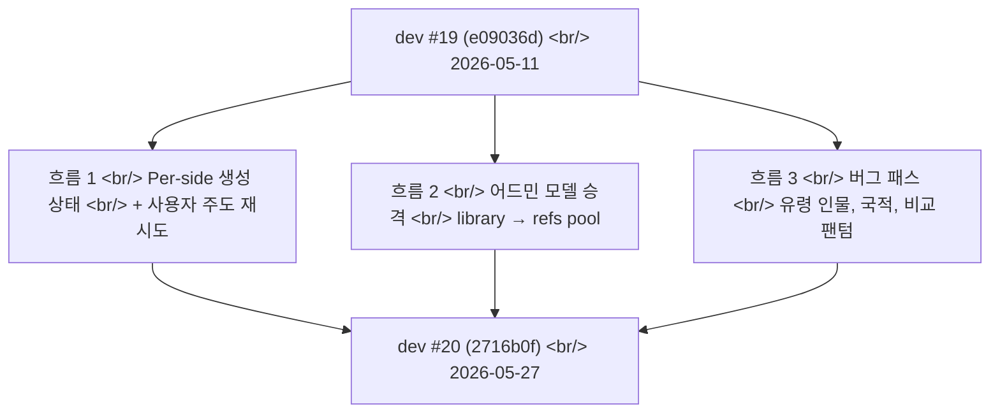

## 개요

[이전 글: #19 — 모델 풀 246개 통합, 어드민 권한, gpt-image-2 해상도, 그리고 에러 핸들링 Phase 1](/posts/2026-05-11-hybrid-search-dev19/)을 2026-05-11에 올렸다. 17일과 70개 커밋 뒤, 세 가지 큰 흐름이 이번 업데이트를 지배한다.

첫째, **페어 A/B 생성 파이프라인을 독립적으로 추적되는 두 사이드로 분리했다** — 각자 자기 상태, 재시도 예산, 그리고 사용자 주도 수동 재시도를 갖는다. #19의 모델 풀 통합 이후 가장 큰 아키텍처 변경이다. 둘째, **어드민이 생성된 이미지를 공용 모델 레퍼런스 풀로 한 번에 승격**할 수 있게 됐다 — "사용자가 실험으로 멋진 레퍼런스를 발견한다"와 "그 레퍼런스가 모두에게 이익이 된다" 사이의 루프를 닫는다. 셋째, **프롬프트 인젝션과 UI 버그의 긴 꼬리** — 유령 인물 환각, 국적 키워드 레이스 트리거, 비교 뷰의 팬텀 토글 버그, 실패 사이드를 무시하던 크레딧 회계.

<!--more-->



70개 커밋 — 하지만 모두 이 세 바구니 중 하나에 들어갔다.

---

## 흐름 1: Per-Side 생성 상태 + 사용자 주도 재시도

이 윈도우에서 가장 큰 작업(대략 2026-05-15)은 페어 A/B 생성 파이프라인의 상태 추적 방식을 다시 쓴 것이다.

### 배경

원래 파이프라인은 A와 B 사이드를 하나의 Celery 태스크 안에서 동시에 돌리고, `asyncio.gather(..., return_exceptions=True)`로 결과를 모은 다음, 두 사이드 모두 끝났을 때만 리턴했다. production에서 세 가지 실패 모드가 있었다.

1. **느린 사이드가 빠른 사이드를 막는다.** A가 4초에 끝나고 B가 80초 걸리면, 사용자는 아무것도 못 보고 80초를 기다렸다.
2. **재시도가 전부냐 전무냐다.** A가 성공하고 B가 정책 차단에 걸려도, 비교를 재시도하면 A도 재실행되어 크레딧이 낭비됐다.
3. **벽시계 폭주.** 하드 데드라인 없이는 막힌 OpenAI 호출 하나가 워커를 몇 분 동안 묶을 수 있었다.

### 구현

`FIRST_COMPLETED` 시맨틱을 중심으로 파이프라인을 재구조화하고 사이드별 상태를 서버 사이드에 고정했다.

```python
# backend/src/generation/pipeline.py
async def generate_pair(batch_id: str, prompts: tuple[str, str]) -> None:
    a_task = asyncio.create_task(_run_side(batch_id, 'A', prompts[0]))
    b_task = asyncio.create_task(_run_side(batch_id, 'B', prompts[1]))

    done, pending = await asyncio.wait(
        {a_task, b_task},
        return_when=asyncio.FIRST_COMPLETED,
        timeout=USER_BUDGET_SECONDS,  # 5분 캡
    )

    # 먼저 끝난 쪽: 즉시 표면화, 나머지는 서버 사이드에 고정
    for task in done:
        await mark_side_complete(batch_id, task.result())

    # pending 사이드는 계속 돌지만 프론트엔드는 더 이상 블록되지 않음
    for task in pending:
        await persist_pending_side(batch_id, task)
```

프론트엔드는 새 엔드포인트를 폴링한다.

```python
# backend/src/routes/generation.py
@router.get("/api/generation-status")
async def get_generation_status(batch_id: str) -> GenerationStatusItem:
    return await get_per_side_status(batch_id)
```

`GenerationStatusItem`은 타입드 데이터클래스다 — `side_a_state`, `side_b_state`, `retry_available`, `last_error_kind`. 프론트엔드가 사이드별 3상태 토글(pending / done / failed)을 렌더링하고 조건부로 재시도 버튼을 노출하기에 충분하다.

사용자 주도 재시도는 자체 엔드포인트를 받았다.

```python
@router.post("/api/generate-side")
async def regenerate_single_side(req: GenerateSideRequest) -> dict:
    """사용자 주도 단일 사이드 재시도. 이전 사이드가 성공했으면 과금하지 않음."""
    return await retry_one_side(req.batch_id, req.side, req.prompt_override)
```

대응되는 프론트엔드 조각은 `f4465ec`(`api.ts` 타입 + `getGenerationStatus` + `generateSide`), `ecb5596`(pending-side 폴링 + `beforeunload` 블록), `fc55dd3`(detail-modal 3상태 사이드 토글 + 재시도/로딩 패널)으로 들어갔다.

### 모서리 다듬기

남은 엣지 케이스를 닫은 세 후속 작업.

- `cc0a2d2` — 사용자 예산을 5분으로 캡, 늦게 도착하는 이미지 드롭, 두 사이드 모두 타임아웃 시 멈추던 로더 수정
- `a30feb8` — OpenAI 호출에 하드 270초 벽시계 타임아웃 강제. SDK 자체의 backoff 재시도가 없으면 300초를 넘길 수 있었다
- `f376973` / `00d94f8` — OpenAI SDK와 Gemini SDK의 자동 재시도를 모두 끈다. 사이드당 단일 시도, 재시도는 사용자가 명시적으로 주도한다

마지막이 개념적 잠금 해제였다 — 자동 재시도를 끄자 *모든* 실패가 보이고 *모든* 재시도가 사용자 결정이 됐다. 그 매핑이 새 per-side UI에 깔끔하게 맞아떨어졌다.

---

## 흐름 2: 어드민 모델 승격

두 번째 큰 가닥(2026-05-18)은 어드민이 생성된 이미지를 공용 모델 레퍼런스 풀로 승격하는 파이프라인이다.

### 배경

페르소나 인덱스는 "톤 레퍼런스"의 정전 — 디퓨전 모델에 스타일과 주제를 고정시키기 위해 보여주는 예제 이미지 — 의 출처다. 정적이고 수동으로 큐레이션된 집합이었다. 그런데 사용자들이 생성하는 이미지 중 *멋진 레퍼런스가 될 만한* 것들이 나오고 있었고, "멋진 생성 이미지"에서 "모두가 쓸 수 있는 공유 레퍼런스"로 가는 경로는 없었다.

### 구현

새 데이터베이스 테이블이 승격을 일급 엔티티로 잡았다 — 일반 `LibraryAsset` 행과는 별도로.

```sql
-- backend/src/db/migrations/2026-05-18_model_ref_entries.sql
CREATE TABLE model_ref_entries (
    id              BIGSERIAL PRIMARY KEY,
    source_asset_id BIGINT REFERENCES library_assets(id),
    promoted_by     BIGINT REFERENCES users(id),
    persona_slug    TEXT NOT NULL,
    s3_ref_key      TEXT NOT NULL,
    promoted_at     TIMESTAMPTZ DEFAULT NOW()
);

ALTER TABLE library_assets ADD COLUMN promoted_ref_filename TEXT;
```

승격 핸들러는 세 단계로 돌았다.

```python
# backend/src/admin/promote_model.py
async def promote_to_refs_pool(asset_id: int, persona_slug: str, admin_id: int) -> int:
    asset = await get_library_asset(asset_id)
    ref_key = build_ref_key(persona_slug, asset.id)

    # 1. S3 서버 사이드 복사 (다운로드/재업로드 없음)
    await s3_client.copy_object(
        bucket=REFS_BUCKET,
        key=ref_key,
        copy_source=f"{LIBRARY_BUCKET}/{asset.storage_key}",
    )

    # 2. 승격 행 삽입 + 소스 asset 마킹
    entry_id = await create_model_ref_entry(asset_id, admin_id, persona_slug, ref_key)
    await update_library_asset_ref_filename(asset_id, ref_key)

    # 3. 페르소나 인덱스 핫 리로드 — 서비스 재시작 없이
    await hot_load_model_ref_entries()
    return entry_id
```

S3 서버 사이드 복사(`f419171`)가 중요했다 — 승격 이미지는 수십 MB까지 갈 수 있고, 다운로드 후 업로드는 네트워크 비용을 두 배로 만든다. `copy_object` API는 AWS 네트워크 안에서 처리한다.

핫 로딩(`8efb27b`, `9a5c83f`)이 다른 승리였다 — `hot_load_model_ref_entries`는 시작 시점이 아니라 매 생성 요청마다 새 행을 읽으므로, 승격된 이미지는 재시작 없이 몇 초 안에 가용해진다. 같은 경로가 UI → 페르소나 어휘 번역도 처리하니, 어드민은 사용자가 보는 표시 이름에 대해 승격하고 백엔드는 정전 페르소나 slug로 해석한다.

### UX

프론트엔드 표면은 `PromoteModelModal`(`2837ff6`) — 페르소나 드롭다운, asset 미리보기, 그리고 `user.is_internal`(`2f46fb3`)로 게이팅된 "승격" 버튼. 라이브러리 카드에 "등록됨" 배지(`181ece6`)가 붙어서 어드민이 한눈에 어느 asset이 이미 refs 풀에 있는지 확인할 수 있다 — 중복 승격 회피.

asyncio 한 가지 꼬임을 `67b5c56`에서 고쳐야 했다 — 원래 핸들러는 핫 로드 호출에 `asyncio.new_event_loop()`를 쓰다가 FastAPI 워커 아래서 데드락이 났다. `asyncio.get_running_loop()`로 바꾸니 풀렸다.

---

## 흐름 3: 버그 픽스의 긴 꼬리

남은 ~40개 커밋은 작은 정밀 수정의 일정한 드럼비트였다. 영향이 가장 큰 다섯 가지.

### 유령 인물 환각

커밋 `91fb8a8`. 단일 주제를 언급한 프롬프트("걷고 있는 여자")가 가끔 배경에 두 번째 유령 같은 인물이 있는 이미지를 반환했다. 사용자 프롬프트가 여러 명을 언급하지 않을 때만 네거티브 프롬프트 문구를 *조건부로* 추가했다.

```python
# backend/src/generation/prompt_builder.py
def assemble_prompt(user_prompt: str, scene_kind: SceneKind) -> str:
    base = user_prompt
    if scene_kind == 'single-subject' and not mentions_multiple_people(user_prompt):
        base += " (single subject only, no other people in background)"
    return base
```

조건 없이 네거티브를 넣으면 배경 군중이 의도된 scene 타입 프롬프트가 망가졌다(바로 다음 커밋 `e00072b`에서 `scene` 컨텍스트의 ambient crowd는 *허용*하도록 따라붙었다).

### 국적 키워드 레이스 트리거

커밋 `4d6beed`. 파이프라인은 보통 톤 분석을 기반으로 한 모델을 고른다 — 하지만 프롬프트에 명시적 국적 키워드("Korean", "Japanese" 등)가 들어가면, 단일 모델 선택이 일관되지 않은 인종 결과를 만들었다. 그런 키워드가 나타나면 *모델 레이스*(여러 후보를 돌리고 최선을 선택)를 강제하도록 고쳤다.

```python
if has_nationality_keyword(prompt):
    return RaceStrategy.FORCE_MULTI_MODEL
```

### 비교 뷰 팬텀 토글

커밋 `7ea64d5`. 비교 뷰는 A와 B 사이드를 전환하는 토글이 있다. B 사이드가 실패한 뒤 재시도되면, 토글이 "팬텀" 상태에 갇혔다 — B를 가용한 것처럼 표시하지만 기저 상태에는 B 이미지가 없는 상태. 근본 원인 — 폴링 경로에서 stale local state가 무효화되지 않았다. 수정:

```ts
// frontend/src/components/Comparison.tsx
useEffect(() => {
  if (status.side_b_state === 'failed' && localState.side_b_visible) {
    setLocalState(s => ({ ...s, side_b_visible: false }));
  }
}, [status.side_b_state]);
```

자매 커밋 `e4473d8`이 토글과 히스토리 배지에 재시도 중 로딩 상태를 추가해서 사용자가 *B가 재시도 중임을* 볼 수 있게 했다.

### 헤더 크레딧 총량

커밋 `afa4fdc` + `1ddb784`. 헤더의 pill은 사용자의 평생 총량이 아니라 현재 페이지 세션에서 로드된 "오늘 생성 수"를 보여주고 있었다. 가입자가 하드 새로고침에서 숫자가 리셋된다고 불평한 뒤, 소스를 `generation_logs`에서 성공한 이미지(A+B 독립적으로)를 라이브로 카운트하는 방식으로 바꿨다.

```sql
SELECT COUNT(*) FROM generation_logs
WHERE user_id = $1
  AND (side_a_state = 'success' OR side_b_state = 'success');
```

### 톤 레퍼런스 위치 매칭 (오늘의 배포)

커밋 `2716b0f`(가장 최신). 톤 레퍼런스가 위치 컨텍스트와 무관하게 풀에서 균일하게 선택되고 있었다. 사용자가 "서울 거리 사진"을 요청하면, 맨해튼에서 온 톤 레퍼런스가 계속 끼어들었다. 위치 필터를 추가해서 고쳤다.

```python
# backend/src/generation/injection.py
def pick_tone_refs(prompt: str, available: list[ToneRef]) -> list[ToneRef]:
    location = extract_location_keyword(prompt)
    if location:
        matched = [r for r in available if r.location == location]
        if matched:
            return rank_by_relevance(matched)
    return rank_by_relevance(available)
```

위치가 매칭되지 않을 때 전체 풀로 폴백하면 커버리지가 보존된다 — 변경은 가산적이지 제한적이지 않다.

---

## 커밋 로그

| 날짜 | 메시지 | 파일 |
|---|---|---|
| 2026-05-27 | fix(generation): prefer location-matched tone refs | 3 |
| 2026-05-27 | fix(ui): keep pending comparison sides loading | 2 |
| 2026-05-22 | fix(auth): count each successful image live from generation_logs | — |
| 2026-05-22 | fix(injection): force model race when prompt has nationality keyword | — |
| 2026-05-22 | fix(history): show fresh comparison image on hover after retry | — |
| 2026-05-19 | fix(generation): enforce hard 270s wall-clock timeout on OpenAI calls | — |
| 2026-05-19 | fix(prompt): block ghost-person hallucination unless prompt mentions them | — |
| 2026-05-18 | feat(admin): POST /api/admin/library/promote-model + frontend client | — |
| 2026-05-18 | feat(storage): S3 server-side copy_object helper | — |
| 2026-05-18 | feat(db): add model_ref_entries table | — |
| 2026-05-15 | feat(generation): GET /api/generation-status — per-batch poll | — |
| 2026-05-15 | feat(generation): POST /api/generate-side — user-driven single-side retry | — |
| 2026-05-15 | feat(generation): return fast side immediately, pin slow side server-side | — |
| 2026-05-15 | fix(openai): disable SDK auto-retry — single attempt per side | — |
| 2026-05-15 | fix(generation): drop Gemini 503 auto-retry — single attempt per side | — |
| _(+55개 더)_ | | |

---

## 인사이트

17일 동안 70개 커밋, 그리고 관통하는 한 줄은 최근 배포와 같다 — **사용자에게 상태를 숨기는 짓을 멈춰라.** Per-side 생성 재작성이 가장 선명한 예다 — 두 달 동안 파이프라인은 A와 B가 독립된 생애주기를 가진다는 사실을 단일 "로딩" 스피너 뒤에 숨기고 있었고, 모든 하류 UX 버그는 그 거짓말의 결과였다. API가 사이드별 상태를 노출하자 UI는 마침내 진실을 말할 수 있었고, 사용자는 페이지를 새로 고치고 희망하는 대신 정보에 근거한 재시도 결정을 내릴 수 있게 됐다.

어드민 모델 승격 가닥은 같은 아이디어의 조용한 버전이다 — "사용자 생성 콘텐츠"와 "공유 인프라" 사이의 솔기를 노출해서 사람이 큐레이션 결정을 명시적으로 내릴 수 있게 한다. 이 작업 전에는 생성된 이미지가 refs 풀에 영향을 줄 수 있는 유일한 길이 백엔드 개발자의 수동 파일 복사였다. 이제 그 솔기에 버튼이 있다.

버그 픽스 패스는 돌이켜보면 영수증이다. Per-side와 승격 아키텍처가 깔끔하게 떨어진 뒤, 부차적인 버그들(유령 인물, 팬텀 토글, 헤더 총량)은 기저 상태가 마침내 신뢰할 만해진 덕에 싸게 고칠 수 있었다.

다음 초점 — per-side 재시도 모델을 사이드별 프롬프트 오버라이드 지원으로 확장한다. 지금은 재시도가 원래 실패한 것과 같은 프롬프트를 쓰는데, 일시적 에러에는 괜찮지만 프롬프트 자체가 정책 차단을 트리거한 경우엔 쓸모없다.
