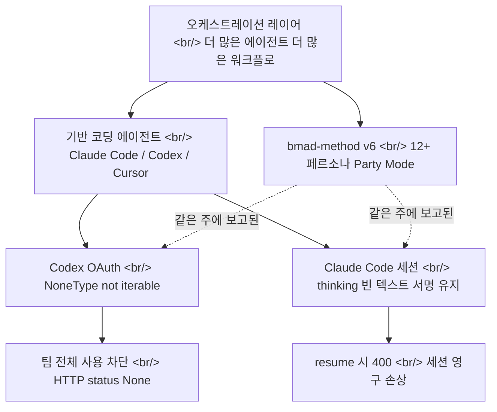

## 개요

에이전트 코딩 생태계는 지금 두 방향으로 동시에 움직인다. [bmad-method](https://github.com/bmad-code-org/bmad-method) 같은 프레임워크는 베이스 코딩 에이전트 위에 더 많은 페르소나와 워크플로를 얹어 오케스트레이션을 키운다. 그런데 같은 주에 보고된 두 개의 버그 — [OpenAI Codex](https://github.com/openai/codex)의 OAuth 크래시와 [Claude Code](https://github.com/anthropics/claude-code)의 세션 영구 손상 — 는 그 아래 깔린 기반 primitive가 여전히 깨지기 쉽다는 걸 보여준다.

<!--more-->



## 위로 쌓는 쪽: bmad-method의 오케스트레이션

[bmad-method](https://github.com/bmad-code-org/bmad-method)는 "Breakthrough Method for Agile AI-Driven Development"의 약자로, GitHub 스타 4만 8천 개가 넘는 MIT 라이선스 [JavaScript](https://nodejs.org) 프로젝트다. 핵심 아이디어는 단일 코딩 에이전트를 호출하는 대신, 역할이 나뉜 다수의 AI 페르소나를 협업시키는 것이다. PM, 아키텍트, 개발자, UX 등 12개 이상의 전문 페르소나가 정의돼 있고, 여러 페르소나가 한 세션에서 동시에 대화하는 **Party Mode**도 있다.

V6는 계획 깊이를 작업 규모에 맞춰 조정하는 **scale-adaptive planning**을 내세운다. 모듈 생태계도 넓다 — 34개 이상의 워크플로를 담은 BMM 코어, BMad Builder, Test Architect, Game Dev, Creative Intelligence Suite가 함께 배포된다. 설치는 `npx bmad-method install` 한 줄로 [Claude Code](https://github.com/anthropics/claude-code)나 [Cursor](https://cursor.com) 같은 기반 에이전트 안에 들어간다. 패키지는 [npm](https://www.npmjs.com/package/bmad-method)에 올라와 있고, 문서는 [docs.bmad-method.org](https://docs.bmad-method.org)에 정리돼 있다.

여기서 핵심은 bmad-method가 *기반 에이전트를 대체하지 않는다*는 점이다. 그 위에 얹히는 조정 레이어다. 페르소나 12개와 워크플로 34개가 잘 돌아가려면, 그 아래의 모델 호출과 세션 상태 관리가 먼저 견고해야 한다. 그런데 바로 그 아래에서 같은 주에 두 건의 고장이 보고됐다.

## 아래에서 깨지는 쪽 1: Codex OAuth가 토하는 NoneType

[OpenAI Codex 이슈 #24665](https://github.com/openai/codex/issues/24665)(현재 CLOSED)는 한 팀 전체가 [Codex](https://github.com/openai/codex)를 못 쓰게 된 사례다. 핵심은 인증 경로다 — API 키가 아니라 ChatGPT/Codex **OAuth**를 쓰는 구성이었다. 로그상 provider는 `openai-codex`, 모델은 `gpt-5.5`, 엔드포인트는 `["chatgpt.com/backend-api/codex"]`였고, 다음 에러가 떴다.

```
TypeError: 'NoneType' object is not iterable
HTTP status: None
Non-retryable client error (HTTP None). Aborting.
```

증상의 모양이 의미심장하다. HTTP status가 숫자가 아니라 `None`이고, 에러는 재시도 불가(non-retryable)로 분류돼 곧장 중단된다. 이건 전형적으로 **백엔드가 null/malformed 데이터를 돌려줬거나, 클라이언트가 누락된 필드를 처리하지 못해** 파싱 단계에서 `None`을 순회하려다 터지는 패턴이다. HTTP 레이어가 정상 응답 코드조차 못 채웠다는 건, 실패가 응답 본문 검증이 아니라 그 이전 — 응답 객체 자체를 만드는 단계 — 에서 났음을 시사한다.

가장 아픈 부분은 영향 범위다. 한 사용자가 아니라 OAuth를 공유하는 팀 전체가 동시에 막혔다. 오케스트레이션 프레임워크가 아무리 페르소나를 잘 나눠도, 그 모든 페르소나가 결국 같은 OAuth 백엔드를 통해 모델을 호출한다면, 백엔드가 `None` 하나를 잘못 흘리는 순간 위층 전체가 함께 멈춘다.

## 아래에서 깨지는 쪽 2: Claude Code가 세션을 영구히 오염시키는 법

기술적으로 더 흥미로운 건 [Claude Code 이슈 #63147](https://github.com/anthropics/claude-code/issues/63147)(현재 OPEN, Claude Code 2.1.153)이다. extended thinking과 tool call을 함께 쓴 세션을 **resume/continue 하면 영구적으로 망가진다.** 한번 시작되면 새 프롬프트는 물론 no-op조차 똑같은 400을 돌려준다.

```
API Error: 400 messages.1.content.5: `thinking` or `redacted_thinking` blocks in the
latest assistant message cannot be modified.
```

근본 원인은 transcript 영속화 방식에 있다. Claude Code는 thinking 블록을 세션 transcript jsonl(`["projects/<slug>/<id>.jsonl"]`)에 저장하는데, **`thinking` 텍스트는 빈 문자열 `""`로 비우면서 `signature` 필드는 원본 그대로 유지한다.** 디스크에 남는 블록은 이렇게 생겼다.

```json
{ "type": "thinking", "thinking": "", "signature": "<base64, 약 600~4000자>" }
```

resume 시 Claude Code는 이 블록을 그대로 API에 다시 보낸다 — `{type:"thinking", thinking:"", signature:<원본>}`. 그런데 signature는 **원래의 비어 있지 않던 thinking 텍스트에 대해 계산된 값**이다. API는 signature를 (지금은 빈) 텍스트에 대해 검증하고, 둘이 안 맞으니 400을 던진다. 원본 텍스트는 이미 디스크에서 사라졌기 때문에 요청을 유효한 형태로 복원할 길이 없다 — **세션은 영구히 오염된다.**

이슈 작성자는 `jq`로 깨진 transcript를 떠서, 모든 thinking 블록의 텍스트 길이는 0인데 signature 길이는 수백~수천 자임을 보여준다.

```
$ jq ... 'select(.type=="thinking")|[(.thinking|length),(.signature|length)]'
0    3932
0    1196
0    620
```

더 무서운 대목: 정상적으로 보이는 수많은 세션에서도 *맨 끝* thinking 블록은 똑같이 "빈 텍스트 + 서명 유지" 상태로 저장돼 있다. 즉 멀쩡해 보이는 세션 다수가 **나중에 resume되는 순간 터지는 잠재적 지뢰**다. 제안된 수정은 세 갈래다 — (1) 서명된 thinking 텍스트를 통째로 보존해 round-trip이 깨지지 않게 하거나, (2) 재구성된 과거 턴에서 thinking 블록을 아예 빼버리거나(API는 이전 턴 thinking 생략을 허용한다), (3) 요청 빌드 시 "빈 텍스트 + 서명" 블록을 감지해 보내기 전에 제거하는 방어 가드를 두는 것.

## 인사이트

두 버그를 나란히 놓으면 한 가지 긴장이 또렷해진다. 오케스트레이션 레이어는 빠르게 앞서가는데, 그게 올라타고 있는 primitive의 신뢰성은 그 속도를 못 따라간다. [bmad-method](https://github.com/bmad-code-org/bmad-method)는 페르소나 12개와 워크플로 34개를 조율하지만, 그 모든 호출은 결국 OAuth 토큰 하나와 transcript 파일 하나라는 가느다란 기반 위에서 돈다. [Codex](https://github.com/openai/codex)의 `None` 크래시는 *백엔드가 약속한 형태를 어겼을 때 클라이언트가 우아하게 죽지 못하는* 문제고, [Claude Code](https://github.com/anthropics/claude-code)의 thinking 버그는 *클라이언트가 자기 상태를 비가역적으로 잘못 직렬화하는* 문제다. 전자는 입력 검증, 후자는 상태 영속화 — 둘 다 화려한 에이전트 기능이 아니라 30년 된 소프트웨어 공학의 기본기다.

특히 Claude Code 버그는 분산 시스템의 고전적 함정을 압축해서 보여준다. 서명(signature)은 데이터에 대한 무결성 약속인데, 그 데이터를 지우면서 서명만 남기면 약속은 거짓이 된다. 게다가 실패가 *저장 시점이 아니라 resume 시점에* 드러나기 때문에, 사용자는 경고도 복구 경로도 없이 긴 작업 세션을 통째로 잃는다. 오케스트레이션이 길고 복잡한 세션을 권장할수록, 이런 잠재 지뢰의 폭발 반경은 커진다. 정직한 결론은 이렇다 — 에이전트를 더 쌓기 전에, 토큰을 새로고침하는 코드와 대화 기록을 직렬화하는 코드가 먼저 지루할 만큼 견고해져야 한다. 화려한 Party Mode보다, `None`을 만났을 때 죽지 않는 파서와 서명과 텍스트를 함께 round-trip하는 영속화 계층이 지금 더 시급하다.

## 참고

**프레임워크 / 오케스트레이션**
- [bmad-method (GitHub)](https://github.com/bmad-code-org/bmad-method) — 12+ 페르소나, Party Mode, scale-adaptive planning, MIT, 스타 4만 8천+
- [bmad-method 문서](https://docs.bmad-method.org) — 모듈·워크플로 레퍼런스
- [bmad-method (npm)](https://www.npmjs.com/package/bmad-method) — `npx bmad-method install`로 배포되는 패키지
- [bmad-code-org](https://github.com/bmad-code-org) — 프로젝트를 유지하는 조직

**버그 리포트 (같은 주)**
- [OpenAI Codex 이슈 #24665](https://github.com/openai/codex/issues/24665) — OAuth NoneType 크래시, 팀 전체 사용 차단 (CLOSED)
- [Claude Code 이슈 #63147](https://github.com/anthropics/claude-code/issues/63147) — thinking 빈 텍스트 + 서명 유지로 인한 세션 영구 손상 (OPEN, 2.1.153)

**기반 에이전트 / 런타임**
- [Claude Code](https://github.com/anthropics/claude-code) · [Claude Code 문서](https://docs.claude.com/en/docs/claude-code/overview) — extended thinking과 tool call을 지원하는 에이전트 CLI
- [OpenAI Codex](https://github.com/openai/codex) — gpt-5.5 기반 코딩 에이전트
- [Cursor](https://cursor.com) — bmad-method 설치 대상이 되는 에디터 기반 에이전트
- [Node.js](https://nodejs.org) · [uv](https://docs.astral.sh/uv/) — JS/Python 에이전트 도구 체인 런타임
- [Anthropic](https://www.anthropic.com) · [OpenAI](https://openai.com) — 기반 모델 제공자
