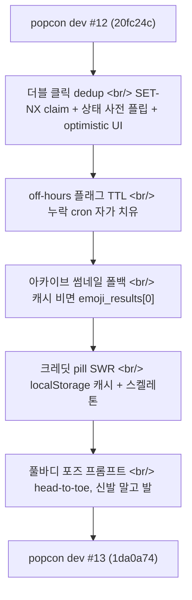

## 개요

[이전 글: #12 — 다운로드 zip 스트리밍, 액션 캐시 SQLite 영속화, 그리고 크레딧 표시](/posts/2026-05-11-popcon-dev12/)를 17일 전에 올렸다. 그 사이 다섯 개의 작은 커밋이 들어갔다 — 하지만 모두 production 인시던트에서 나왔다.

가장 큰 건 retry/regenerate/approve의 3계층 dedup. 두 번째는 off-hours 플래그에 TTL을 붙여 누락된 cron이 `/api/generate-set`를 429로 막는 대신 자가 치유되게 한 것. 나머지 셋은 정밀 수정 — 비정규화 캐시가 비었을 때 아카이브 카드 썸네일 폴백, 크레딧 pill의 stale-while-revalidate 캐싱, 그리고 풀바디 포즈 생성기의 한 단어 프롬프트 정밀화.

<!--more-->



다섯 커밋, 한 가지 관통하는 주제 — **여기 모든 수정은 지난 2주 동안 실제로 떨어진 production page에 대한 반응이다.**

---

## Retry / Regenerate / Approve 3계층 Dedup

가장 큰 커밋(`1da0a74`)이 이 윈도우에서 가장 비싼 버그였다 — Retry, Regenerate, Approve 버튼 빠른 더블 클릭이 매 클릭마다 크레딧을 차감하고 새 GPU 잡을 dispatch하고 있었다. popcon의 잡당 비용에서 사용자당 의도하지 않은 클릭 두 번은 실제 돈이다.

단일 status 체크 패턴으로는 부족했다. 작지만 안정적으로 맞는 레이스 윈도우가 있었기 때문이다.

```
T0: 사용자가 Retry 클릭 — 핸들러가 status='pending' 읽고, 과금 + dispatch 진행
T0+5ms: 사용자가 Retry 다시 클릭 — 두 번째 핸들러가 status='pending' 읽고(워커가 아직 안 뒤집음) 진행
T0+50ms: 워커가 잡 1 픽업, 'running'으로 플립
T0+55ms: 워커가 잡 2 픽업, 다시 'running'으로 플립 — 둘 다 이미 결제됨
```

세 계층이 이를 닫았다.

### 계층 1 — 원자적 Redis SET-NX claim

```python
# backend/job_store.py
async def try_claim_emoji_action(job_id: str, action: str) -> bool:
    """SET key value NX EX 30 원자적 claim. True = 획득, False = 중복."""
    key = f"popcon:claim:{job_id}:{action}"
    return await redis.set(key, "1", nx=True, ex=30)
```

`SET key value NX EX 30`은 "먼저 온 사람이 이긴다, 30초 후 만료"의 Redis 정전 프리미티브다. claim은 과금 *전에* 잡고 핸들러 전체에 걸쳐 유지한다. 30초 TTL은 안전망 — 핸들러가 도중에 죽으면 claim이 자가 클리어되어 사용자가 30초 안에 재시도할 수 있다.

### 계층 2 — 과금 후 동기적 상태 사전 플립

```python
# backend/main.py — /retry, /regenerate, /approve 안
@router.post("/retry/{job_id}")
async def retry_emoji(job_id: str, idx: int):
    if not await try_claim_emoji_action(job_id, f"retry-{idx}"):
        return {"status": "duplicate", "deduped": True}

    job = await get_job(job_id)
    if job.emoji_results[idx].status != "failed":
        return {"status": "wrong_state", "deduped": True}

    try:
        await charge_credits(job.user_id, RETRY_COST)
        # 동기 사전 플립 — 프론트엔드의 다음 폴이 즉시 'pending'을 본다
        await mark_emoji_pending(job_id, idx)
        await retry_emoji_task.delay(job_id, idx)
    except Exception:
        # dispatch 실패 시 보상 롤백
        await refund_credits(job.user_id, RETRY_COST)
        await release_claim(job_id, f"retry-{idx}")
        raise
```

사전 플립이 미묘한 조각이다. 이게 없으면 프론트엔드의 다음 폴(1-3초 후)이 여전히 status='failed'를 본다. Celery 워커가 아직 픽업하지 않았기 때문이다 — 그래서 사용자가 Retry를 *또* 누르고, 여전히 실패 상태 체크를 통과해서, 워커가 플립하기 전에 두 번째로 통과해버린다. 핸들러 안에서 동기적으로 플립하면 그 구멍이 막힌다.

### 계층 3 — Optimistic 프론트엔드 패치 + busy 가드

```tsx
// frontend/components/FramesAnimatePanel.tsx
const onRetry = async (idx: number) => {
  if (busy) return;  // React 커밋 레이스 가드
  setBusy(true);
  patchResult(idx, { status: "pending" });  // optimistic — await 전
  try {
    await api.retry(jobId, idx);
  } catch (err) {
    patchResult(idx, { status: "failed", error: String(err) });
  } finally {
    setBusy(false);
  }
};
```

`if (busy) return` 가드는 React 커밋 레이스를 닫는다 — `setBusy(true)`가 dispatch되고 다음 렌더가 커밋되기 전 사이에 두 번째 클릭이 통과할 수 있다. 백엔드 계층과 결합되면, 이건 세 개의 독립적인 dedup 지점이 된다. 하나가 실패해도 중복 잡을 만들기에는 부족하다.

`/approve` 엔드포인트는 런치 때부터 이 패턴을 부분적으로 갖고 있었다(커밋 본문에 "Frontend double-clicks used to spawn parallel Wan calls"라고 적혀 있다) — 하지만 status 체크만으로는 racy했다. 이제 같은 패턴이 균일하게 적용된다.

### 보상 롤백

또 다른 production 함정이 fly.io의 SIGTERM 동작이었다. `charge_credits`와 `retry_emoji_task.delay()` 사이에서 핸들러가 죽으면, 사용자는 결제됐는데 작업은 스케줄되지 않는다. `try/except`가 이제 재발생 전에 결제를 환불하고 claim을 해제하므로, 핸들러 중간 크래시가 사용자를 출발선으로 되돌려놓는다.

`test_retry_idempotency.py`의 테스트 커버리지는 9개 케이스 — 동시 더블 클릭, 상태 기반 dedup, claim 프리미티브 시맨틱, `.delay()` 실패 롤백, approve-all 벌크 dedup.

---

## Off-Hours 플래그 TTL — Cron 스킵에서 자가 치유

커밋 `4d131ba`는 실제 인시던트에서 나왔다. 매일 저녁 evening-down GitHub Actions cron이 14:55 UTC에 `popcon:off_hours=true`를 세팅해서 비싼 작업을 off-hour 동안 비활성화하고, evening-up cron이 09:30 UTC에 클리어한다. 2026-05-11에 아침 cron이 심각하게 지연됐고(GHA scheduled trigger는 부하 아래 가끔 스킵된다), 누군가 수동으로 플래그를 클리어할 때까지 `/api/generate-set`가 몇 시간 동안 429를 반환했다.

수정 — 플래그 자체에 TTL.

```python
# backend/job_store.py
_OFF_HOURS_TTL_SECONDS = 20 * 3600  # 20시간

async def set_off_hours(value: bool) -> None:
    if value:
        await redis.set("popcon:off_hours", "true", ex=_OFF_HOURS_TTL_SECONDS)
    else:
        await redis.delete("popcon:off_hours")
```

두 쓰기 경로 모두 TTL을 받았다 — 백엔드 어드민 엔드포인트(`job_store.py`)와 스케줄러 GHA 경로(`.github/scripts/scheduler.py`). 의도된 off-window가 18h 35m(14:55 → 09:30 UTC)이니 20h가 cron 지연을 위한 ~85분 버퍼를 준다. evening-up이 완전히 누락돼도 플래그가 다음 날 ~10:55 UTC경 자가 클리어된다 — API를 무기한 막는 대신.

회귀 테스트는 `set_off_hours(True)`가 `set(...)`을 `ex=_OFF_HOURS_TTL_SECONDS`로 호출하는지 어서트한다. 수정 전에는 `Expected: set('popcon:off_hours', 'true', ex=72000); Actual: set('...', 'true')`로 실패한다 — 조용히 회귀시키는 게 불가능해야 하는 정확한 모양의 버그.

이 수정의 모양을 짚어둘 만하다 — **플래그를 세팅하는 시스템과 클리어하는 시스템이 다르고(어드민 엔드포인트 vs 스케줄러 cron), 그래서 독립적으로 실패할 수 있다. TTL이 둘을 잇는다.** 두 독립적으로 실패하는 시스템 사이에 생애주기가 걸쳐 있는 플래그는 모두 최대 허용 wedge 시간으로 묶인 TTL을 가져야 한다.

---

## 아카이브 카드 썸네일 폴백

커밋 `252569f`. 아카이브 리스트가 일부 잡에서 깨진 이미지를 렌더링하고 있었다.

근본 원인 — `jobs.thumbnail_path`와 `jobs.thumbnail_key`는 벌크 start-frame 태스크가 채우는 비정규화 캐시다. SQLite 레이스(이모지 인덱스 0 — 썸네일 소스 — 동시 regenerate) 아래서 벌크 태스크가 두 컬럼 모두 쓰지 못할 수 있다. 둘 다 비면, `list_jobs`가 `/api/job/{id}/reference`를 반환했다 — *죽은* URL, 서빙할 행이 없는 — 그리고 아카이브 카드가 깨진 이미지를 렌더했다.

캐시가 비어 있으면 `emoji_results[0]`을 정전 소스로 읽도록 읽기 경로를 바꿨다.

```python
# backend/db/operations.py
def get_thumbnail_url(job: Job) -> str:
    if job.thumbnail_path:
        return job.thumbnail_path
    if job.thumbnail_key:
        return r2_signed_url(job.thumbnail_key)
    # 캐시 미스 — 첫 이모지를 정전 소스로 폴백
    if job.emoji_results and job.emoji_results[0].url:
        return job.emoji_results[0].url
    return PLACEHOLDER_THUMBNAIL_URL
```

비정규화 캐시는 남는다 — 쿼리 성능 때문에 있으니 — 하지만 폴백 체인 덕에 캐시 쓰기 실패가 더 이상 깨진 UI로 표면화되지 않는다. 끝의 placeholder가 바닥이다 — 이모지 결과가 아직 없는 신선한 잡도 뭔가는 렌더한다.

---

## 크레딧 Pill: Stale-While-Revalidate

커밋 `5f785aa`. 헤더의 크레딧 잔액 pill이 매 리로드마다 API 호출이 진행 중인 동안 깜빡였다 — 작지만 끈질긴 UX 짜증.

두 가지 연결된 수정:

```tsx
// frontend/components/CreditPill.tsx
function CreditPill() {
  const cached = localStorage.getItem("popcon:credits");
  const [balance, setBalance] = useState<number | null>(
    cached ? Number(cached) : null
  );

  useEffect(() => {
    api.getCredits().then(b => {
      setBalance(b);
      localStorage.setItem("popcon:credits", String(b));
    });
  }, []);

  if (balance === null) return <PulsingSkeleton width={40} />;
  return <span>{balance}</span>;
}
```

캐시된 값을 즉시 렌더, 네트워크가 돌아오면 신선한 값으로 교체 — 클래식 stale-while-revalidate. 진짜 첫 방문(캐시 없음)에는 펄싱 스켈레톤을 보여서 옆의 `SignInButton`이 잔액 도착 시 튀지 않게 한다. 동반 `AuthProvider.tsx` 변경은 사인 아웃 시 캐시가 무효화되도록 해서, 다른 사용자가 이전 사용자의 잔액을 잠깐이라도 보지 않게 했다.

---

## 풀바디 포즈 프롬프트 — Head-to-Toe, 신발 말고 발

커밋 `cad14bc`은 한 줄짜리 변경에 비해 효과가 컸다. 풀바디 포즈 생성기가 자주 발을 잘라내거나 — 사용자가 맨발을 원할 때 신발을 렌더하는 이미지를 만들고 있었다. 프롬프트 문구 조정:

```python
# backend/pipeline/pose_generator.py
# before
"full body shot of the subject"
# after
"head-to-toe shot of the subject, feet visible (not shoes)"
```

"Head-to-toe"가 디퓨전 모델에는 "full body"보다 더 문자적이다 — 모호한 의도가 아니라 명시적인 프레이밍 지시로 해석한다. "Feet visible (not shoes)"가 수정의 후반부였다 — "full body" 프롬프트는 발이 의도됐을 때 기본값으로 신발이 나오고 있었다.

이 윈도우에서 가장 작은 커밋이지만 — "왜 항상 신발이 나오나요?"라는 불평의 홍수를 닫는 종류의 변경이다.

---

## 커밋 로그

| 날짜 | 메시지 | 변경 |
|---|---|---|
| 2026-05-13 | fix: dedup retry/regen/approve to prevent duplicate-click GPU spend | 4개 파일, +664/-37 |
| 2026-05-11 | fix(off-hours): add 20h TTL to popcon:off_hours flag | 3개 파일, +48/-3 |
| 2026-05-11 | fix(archive): fall back to first emoji row when jobs.thumbnail_* is empty | 2개 파일, +22/-2 |
| 2026-05-11 | fix(credits): cache balance in localStorage, show skeleton on first paint | 2개 파일, +57/-9 |
| 2026-05-11 | fix(pose): tighten full-body prompt wording (head-to-toe, feet not shoes) | 1개 파일, +1/-1 |

---

## 인사이트

다섯 커밋, 네 개의 production 균열. 그중 두 개 — dedup과 off-hours TTL — 가 깊은 모양을 공유한다. **시스템이 실패하는 이유는 lockstep으로 가정된 두 컴포넌트가 실제로는 그렇지 않기 때문이다.** retry 핸들러는 워커가 이미 상태를 플립했다고 가정했다 — 아니었다. off-hours-set cron은 off-hours-clear cron이 항상 제때 돌 거라 가정했다 — 아니었다.

첫 번째 실패 모드는 동기 직렬화(claim + 사전 플립)로 수정된다. 두 번째는 타임아웃(TTL)로 수정된다. 둘 다 같은 모양이다 — 이전에 희망을 통해 암묵적으로 조율되던 두 시스템 사이의 격차를 명시적으로 처리하는 것.

아카이브 썸네일과 크레딧 pill 수정도 더 작은 스케일의 같은 아이디어다 — 비정규화 캐시와 네트워크 호출이 best-effort로 다뤄져야 했는데 정전으로 다뤄지고 있었다. 명시적 폴백(emoji_results[0])과 stale-while-revalidate 패턴(localStorage 캐시)을 추가하니 optimistic 경로가 여전히 빠르되, 풀리지 않을 때의 실패 모드는 사라졌다.

포즈 프롬프트 수정은 아웃라이어지만 — 같은 요점을 미니어처로 만들기 때문에 이 포스트에 넣을 가치가 있다. 모호한 프롬프트("full body")가 디퓨전 모델의 의도 *해석*에 의존했다. 그걸 문자적 프레이밍 지시로 교체하니 해석 단계가 사라졌다 — 정확히 암묵적 조율을 명시적 직렬화로 교체하는 것과 같다.

다음 세션 — 벌크 액션 dedup도 같은 감사를 받아야 한다(`/approve-all`은 dedup이 있지만 optimistic-frontend 계층이 없다). 그리고 애초에 `jobs.thumbnail_*`를 비게 만든 벌크 start-frame 태스크의 SQLite 레이스를 추적해서 근원에서 고쳐야 한다.
