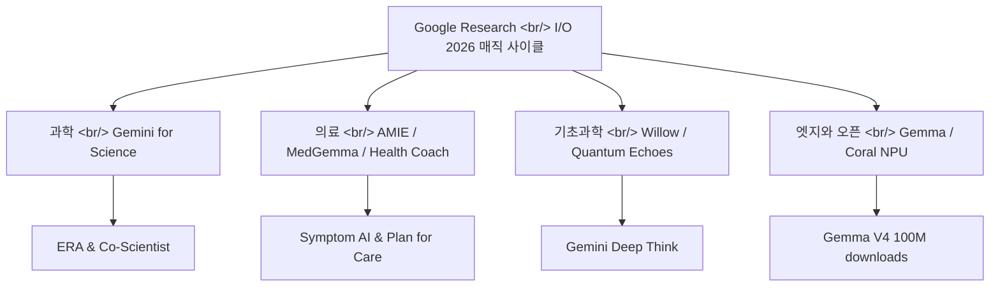

## 개요

[Google Research](https://research.google)가 [I/O 2026](https://io.google)에서 한 해의 연구 성과를 묶어 [A new era of innovation](https://research.google/blog/a-new-era-of-innovation-google-research-at-io-2026)이라는 글로 정리해 내놨다. 핵심 프레임은 "연구에서 현실로 이어지는 매직 사이클(magic cycle)"이 [Gemini](https://deepmind.google/models/gemini/) 같은 모델의 발전에 힘입어 점점 빨라지고 있다는 것이다. 과학, 의료, 양자 컴퓨팅, 엣지 디바이스까지 한 화면에 펼쳐진 발표를 주제별로 읽어본다.

<!--more-->

## 과학을 위한 Gemini: 연구를 자동화하는 에이전트들

가장 무게가 실린 발표는 과학 연구를 돕는 에이전트 묶음이다. [Gemini for Science](https://research.google/blog/a-new-era-of-innovation-google-research-at-io-2026)는 실험적 도구 모음으로 공개됐고, 그 중심에 두 개의 [Nature](https://www.nature.com/articles/s41586-026-10658-6) 논문이 있다. 하나는 코드를 스스로 최적화하며 과학적 문제를 푸는 연구 엔진 **ERA(Empirical Research Assistance)**이고, 다른 하나는 다중 에이전트 연구 파트너 [Co-Scientist](https://www.nature.com/articles/s41586-026-10644-y)다.

이 위에 실제 사용자가 쓸 수 있는 도구들이 올라간다. [labs.google/science](https://labs.google/science)에서 제공되는 Computational Discovery는 ERA와 AlphaEvolve를 활용하는 에이전트형 연구 엔진이고, Hypothesis Generation은 여러 에이전트가 아이디어 토너먼트를 벌여 가설을 추려내며, Literature Insights는 방대한 과학 문헌을 합성한다. 연구의 "도구"가 검색·요약을 넘어 가설 생성과 코드 최적화까지 직접 수행하는 단계로 넘어가고 있다는 신호다.

학술 생태계 쪽에서는 [Paper Assistant Tool(PAT)](https://research.google/blog/gemini-provides-automated-feedback-for-theoretical-computer-scientists-at-stoc-2026/)이 눈에 띈다. ICML, STOC, NeurIPS에서 1만 편이 넘는 논문에 자동 피드백을 제공했다고 한다. 동료 평가의 부하를 AI가 일부 흡수하는 실험이다.

## 의료 AI: 진단 대화에서 일상 코칭까지

의료 분야는 발표 밀도가 가장 높았다. 다중 에이전트 진단 시스템 [AMIE](https://www.nature.com/articles/s41591-026-04371-0)가 Nature Medicine에 실렸고, 증상 추론용 대화형 에이전트 [Symptom AI](https://arxiv.org/abs/2605.04012)는 [Fitbit](https://blog.google/products-and-platforms/products/google-health/google-health-coach/) 앱을 통해 약 1만 4천 명이 참여한 연구로 검증됐다. 같은 대화 기록을 검토한 독립 임상의보다 진단 정확도가 유의하게 높았다(OR = 2.56, p < 0.001)는 것이 핵심 주장이다.

기반 모델 쪽에서는 의료 영상 해석용 [MedGemma](https://research.google/blog/next-generation-medical-image-interpretation-with-medgemma-15-and-medical-speech-to-text-with-medasr/)가 누적 500만 회 이상 다운로드를 기록했고, 의료 음성 전사용 MedASR도 함께 공개됐다. 제품 레이어에서는 [Google Health Coach](https://blog.google/products-and-platforms/products/google-health/google-health-coach/)가 Fitbit 사용자에게 개인화 코칭을 제공하며 확대 중이다. Plan for Care 파일럿에서는 "15% 더 많은 사용자가 더 잘 준비됐다고 느꼈고", "13% 더 많은 사용자가 자신감을 느꼈다"는 수치가 제시됐다.

## 기초과학: 양자 컴퓨팅과 수학적 발견

기초과학 트랙에서는 양자 컴퓨팅이 헤드라인을 가져갔다. 오류 정정을 입증한 양자 칩 [Willow](https://www.nature.com/articles/s41586-025-09526-6)와, OTOC 알고리즘으로 검증 가능한 양자 우위(verifiable quantum advantage)를 보였다는 [Quantum Echoes](https://blog.google/innovation-and-ai/technology/research/quantum-echoes-willow-verifiable-quantum-advantage/)가 함께 발표됐다. Willow는 해당 OTOC 알고리즘에서 고전 슈퍼컴퓨터 대비 "1만 3천 배 빠르다"는 주장이 붙었다.

수학·과학적 발견 쪽에서는 고급 에이전트 추론 모델 [Gemini Deep Think](https://deepmind.google/blog/accelerating-mathematical-and-scientific-discovery-with-gemini-deep-think/)가 자리했다. 환경·기후 영역에서는 사이클론 예보를 돕는 [WeatherNext](https://deepmind.google/blog/how-weathernext-helped-the-national-hurricane-center-better-predict-hurricane-melissas-historic-landfall-in-jamaica)가 허리케인 멜리사 상륙 예측에 기여했고, 뉴스 보도를 홍수 예측 데이터로 변환하는 [Groundsource](https://research.google/blog/introducing-groundsource-turning-news-reports-into-data-with-gemini/)는 260만 건의 도시 홍수 기록을 만들어냈다. 이 데이터는 150개국 20억 명을 대상으로 하는 Flood Hub와 맞물린다.

## 엣지와 오픈 모델: 작아지고 넓어지는 배포

마지막 축은 모델을 더 작고 더 널리 퍼뜨리는 흐름이다. 오픈 모델 [Gemma V4](https://deepmind.google/models/gemma/gemma-4/)는 추론·코딩 능력을 끌어올리며 한 달 만에 1억 다운로드를 돌파했고, 엣지 디바이스용 초소형 모델 [Gemma 3 270M](https://developers.googleblog.com/en/introducing-gemma-3-270m)도 함께 공개됐다. 하드웨어 쪽에서는 엣지 AI용 ML 가속기 [Coral NPU](https://developers.google.com/coral/guides/intro)와, Synaptics가 만드는 엣지 AI 프로토타이핑 보드 Coralboard(2026년 여름 출시 예정)가 발표됐다.

[Gemini](https://deepmind.google/models/gemini/)는 230개국 이상에서 70개 넘는 언어로 확장됐고, 아프리카 음성 기술을 위한 오픈 데이터셋 WAXAL도 언급됐다. 클라우드의 거대 모델과 손바닥 위 초소형 모델이 같은 발표 안에 공존하는 그림이다.

## 인사이트

이번 발표의 진짜 메시지는 개별 모델이 아니라 "사이클"이다. [Google Research](https://research.google)는 연구(Nature 논문)에서 도구([labs.google/science](https://labs.google/science))를 거쳐 제품([Health Coach](https://blog.google/products-and-platforms/products/google-health/google-health-coach/), [Ask Maps](https://blog.google/products-and-platforms/products/maps/ask-maps-immersive-navigation/))로 이어지는 흐름을 하나의 서사로 묶었다. 특히 과학 도구가 검색·요약을 넘어 [ERA](https://www.nature.com/articles/s41586-026-10658-6)·[Co-Scientist](https://www.nature.com/articles/s41586-026-10644-y)처럼 가설 생성과 코드 최적화를 직접 수행하는 단계로 올라선 점이 두드러진다. 의료에서는 [Symptom AI](https://arxiv.org/abs/2605.04012)의 OR=2.56 같은 구체적 통계가 제시됐는데, 이는 Fitbit이라는 대규모 사용자 기반 위에서만 가능한 검증이라는 점에서 데이터 접근성이 곧 경쟁력이 되는 구조를 보여준다.

다만 발표에 등장하는 수치 상당수는 Google 자체 발표라는 점을 감안해야 한다. Willow의 "1만 3천 배" 같은 양자 우위 주장은 [Nature](https://www.nature.com/articles/s41586-025-09526-6) 게재로 일정 수준 검증됐지만, OTOC 같은 특정 알고리즘에 한정된 비교라는 단서를 함께 읽어야 한다. 실무자 입장에서 더 즉시 와닿는 변화는 [Gemma V4](https://deepmind.google/models/gemma/gemma-4/)의 1억 다운로드와 [Gemma 3 270M](https://developers.googleblog.com/en/introducing-gemma-3-270m)·[Coral NPU](https://developers.google.com/coral/guides/intro)로 대표되는 엣지 배포 흐름이다. 거대 모델 경쟁이 여전히 헤드라인을 가져가지만, 손바닥 위에서 도는 작은 오픈 모델이 실제 배포 폭을 결정하는 시대가 함께 오고 있다.

## 참고

**과학 연구 도구**
- [A new era of innovation — Google Research at I/O 2026](https://research.google/blog/a-new-era-of-innovation-google-research-at-io-2026) — 발표 전체를 묶은 원문
- [ERA (Empirical Research Assistance) — Nature](https://www.nature.com/articles/s41586-026-10658-6) — 코드 최적화형 연구 엔진
- [Co-Scientist — Nature](https://www.nature.com/articles/s41586-026-10644-y) — 다중 에이전트 연구 파트너
- [labs.google/science](https://labs.google/science) — Computational Discovery / Hypothesis Generation / Literature Insights
- [Paper Assistant Tool (PAT)](https://research.google/blog/gemini-provides-automated-feedback-for-theoretical-computer-scientists-at-stoc-2026/) — STOC 2026 자동 피드백

**의료 AI**
- [AMIE — Nature Medicine](https://www.nature.com/articles/s41591-026-04371-0) — 다중 에이전트 진단 시스템
- [Symptom AI — arXiv](https://arxiv.org/abs/2605.04012) — 증상 추론 대화형 에이전트
- [MedGemma 1.5 & MedASR](https://research.google/blog/next-generation-medical-image-interpretation-with-medgemma-15-and-medical-speech-to-text-with-medasr/) — 의료 영상·음성 모델
- [Google Health Coach](https://blog.google/products-and-platforms/products/google-health/google-health-coach/) — Fitbit 개인화 코칭

**기초과학 / 환경**
- [Willow — Nature](https://www.nature.com/articles/s41586-025-09526-6) — 오류 정정 양자 칩
- [Quantum Echoes — blog.google](https://blog.google/innovation-and-ai/technology/research/quantum-echoes-willow-verifiable-quantum-advantage/) — 검증 가능한 양자 우위
- [Gemini Deep Think](https://deepmind.google/blog/accelerating-mathematical-and-scientific-discovery-with-gemini-deep-think/) — 수학·과학 발견용 추론 모델
- [WeatherNext](https://deepmind.google/blog/how-weathernext-helped-the-national-hurricane-center-better-predict-hurricane-melissas-historic-landfall-in-jamaica) — 사이클론 예보
- [Groundsource](https://research.google/blog/introducing-groundsource-turning-news-reports-into-data-with-gemini/) — 뉴스 기반 홍수 데이터

**엣지 / 오픈 모델 / 배경**
- [Gemma V4](https://deepmind.google/models/gemma/gemma-4/) — 한 달 만에 1억 다운로드
- [Gemma 3 270M](https://developers.googleblog.com/en/introducing-gemma-3-270m) — 엣지용 초소형 모델
- [Coral NPU](https://developers.google.com/coral/guides/intro) — 엣지 AI ML 가속기
- [Gemini](https://deepmind.google/models/gemini/) · [Google DeepMind](https://deepmind.google) · [AI for Developers](https://ai.google.dev) · [blog.google](https://blog.google) · [Ask Maps](https://blog.google/products-and-platforms/products/maps/ask-maps-immersive-navigation/) · [Ask YouTube](https://blog.youtube/news-and-events/youtube-news-google-io-2026/)
