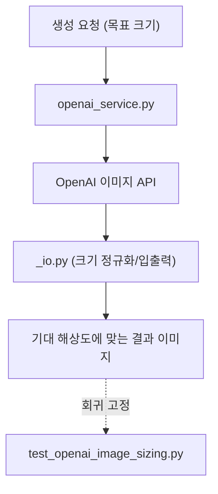

## 개요

오늘 hybrid-image-search-demo는 코드 세션 없이 커밋만 들어온 가벼운 날이었다(따라서 이 글은 대화 서사 없이 커밋 기준으로 정리한다). 핵심은 두 건의 PR — **OpenAI 생성 이미지 크기 정합**(#43, `fix/openai-b-side-resolution`)과 **위치 기반 톤 레퍼런스 우선**(#42, `fix/location-aware-tone-refs`) — 그리고 그 사이의 직접 커밋 "Fix OpenAI generated image sizing"이다.

[이전 글: #20](/posts/2026-05-28-hybrid-search-dev20/)

<!--more-->

---

## OpenAI 생성 이미지 크기 정합

직접 커밋 "Fix OpenAI generated image sizing"은 생성 백엔드의 세 파일을 건드렸다.

```
backend/src/generation/_io.py
backend/src/generation/openai_service.py
backend/tests/test_openai_image_sizing.py
```

브랜치 이름(`fix/openai-b-side-resolution`)과 파일 구성으로 보면, OpenAI 이미지 서비스가 돌려주는 결과물의 해상도·크기가 기대값과 어긋나는 문제를 `openai_service.py`에서 바로잡고, 입출력 보조 로직(`_io.py`)을 맞춘 뒤, 그 동작을 고정하는 전용 테스트(`test_openai_image_sizing.py`)를 새로 추가한 형태다. 별도의 사이즈 회귀 테스트를 둔 것은, 이 계열의 버그가 조용히 재발하기 쉽다는 신호다.



## 위치 기반 톤 레퍼런스 우선 (#42)

PR #42(`fix/location-aware-tone-refs`, "prefer location-matched tone refs")는 생성 시 참조하는 톤 레퍼런스를 **위치에 맞는 것**을 우선하도록 바꿨다. 톤 레퍼런스가 여러 후보 중 무작위/일반 매칭이 아니라 대상 위치와 정합되는 쪽을 고르게 함으로써, 생성 결과의 색·분위기 일관성을 높이려는 의도로 읽힌다. (PR 본문은 이번 실행에서 가져오지 못했다 — Bitbucket PR 페치가 404를 반환했다. 위 해석은 브랜치 이름·커밋 메시지·변경 파일에 기반한다.)

---

## 커밋 로그

| 메시지 | 변경 |
|--------|------|
| Merged in fix/openai-b-side-resolution (PR #43) | 생성 경로 병합 |
| Fix OpenAI generated image sizing | _io.py, openai_service.py, +사이즈 테스트 |
| Merged in fix/location-aware-tone-refs (PR #42) | 톤 레퍼런스 선택 병합 |

---

## 인사이트

세션 없이 커밋만 들어온 날이라 서사는 얇지만, 두 수정의 결은 분명하다 — 둘 다 *생성 결과의 정합성*을 다룬다. 하나는 기하학적 정합(이미지 크기가 기대값과 맞는가), 다른 하나는 의미적 정합(톤 레퍼런스가 위치와 맞는가). 이미지 생성 파이프라인의 품질 부채는 대개 이런 "조용한 어긋남"에서 쌓이고, 전용 회귀 테스트(`test_openai_image_sizing.py`)를 박아 두는 것이 재발을 막는 가장 값싼 방어다.
