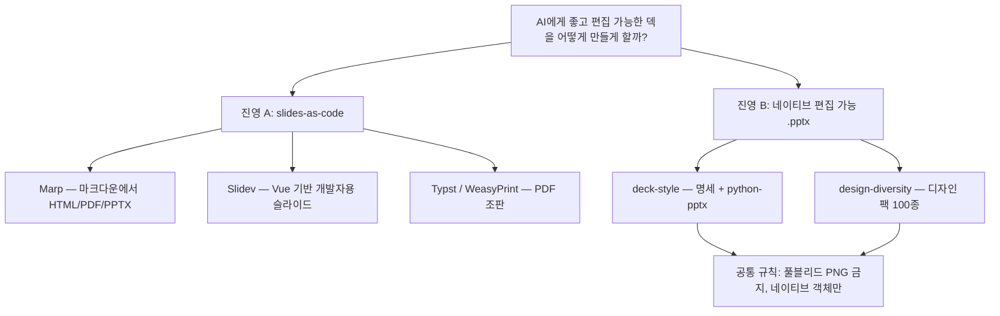
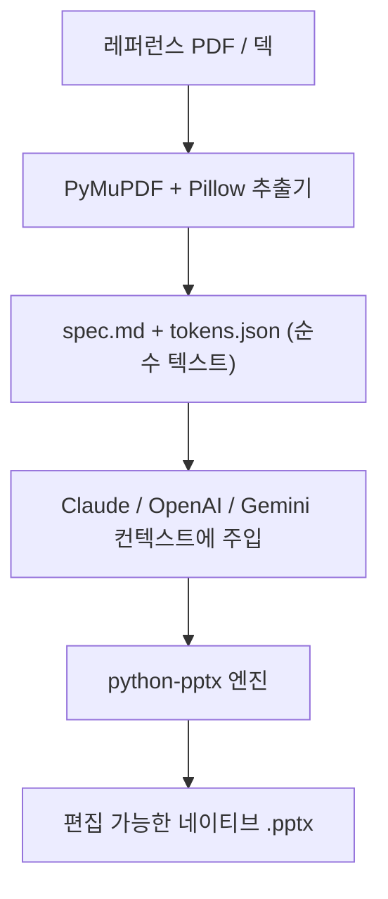
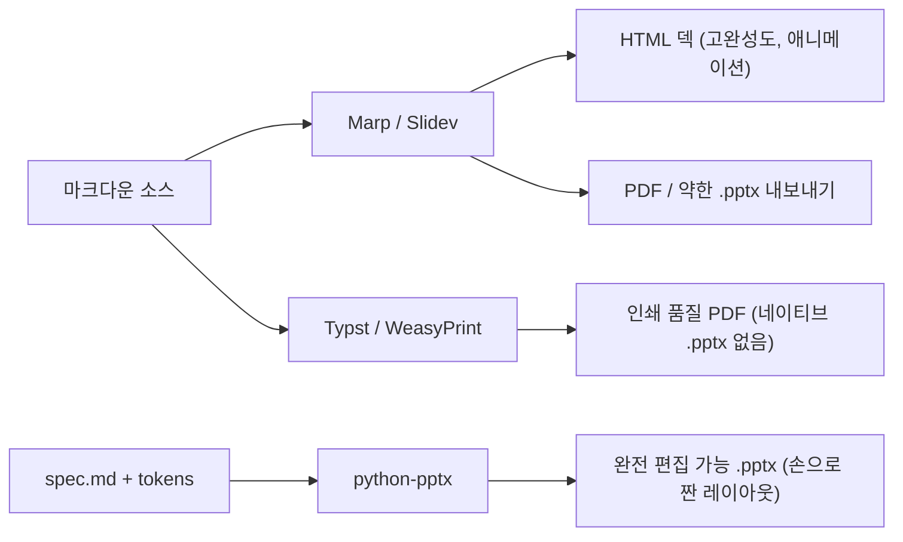

## 개요

오늘은 한 가지 질문만 집요하게 쫓았다. AI가 *제대로 된* 슬라이드 덱을 만들게 하려면 어떻게 해야 할까 — 프레젠테이션인 척하는 스크린샷이 아니라, 진짜로 열어서 고칠 수 있는 덱 말이다. 그 길은 내 레포 두 개, 별 123개짜리 디자인 팩 카탈로그, Marp와 Slidev 생태계, 렌더링 백엔드로서의 Typst와 WeasyPrint, 그리고 PowerPoint를 버리고 HTML/CSS로 가라고 주장하는 한국 개발 유튜버까지 이어졌다. 도구는 제각각이었지만, 그 밑에는 똑같은 균열선 하나가 계속 드러났다.

<!--more-->

## 오늘의 탐색 지도



## 균열선: 풀블리드 PNG 대 네이티브 객체

오늘 살펴본 모든 도구는 두 진영으로 갈렸는데, 그 경계는 "마크다운이냐 GUI냐"가 아니라 **최종 산출물에 실제로 무엇이 담기느냐**였다. 한 진영은 슬라이드를 통짜 풀블리드 이미지(또는 HTML 캔버스)로 렌더링한다 — 픽셀 단위로 완벽해 보이지만, 누군가 오타 하나 고치려는 순간 죽은 파일이 된다. 다른 진영은 *네이티브 객체* — 진짜 텍스트 프레임, 도형 노드, 편집 가능한 표 — 를 뱉는다. 대신 디자인 완성도를 맞추기가 더 어렵다.

이 차이는 사람보다 AI 생성에서 훨씬 더 중요하다. "슬라이드 만들어줘"라는 요청을 받은 언어 모델의 실패 양상은 늘 "안전한 평균"으로 수렴하는 것이기 때문이다 — 그라디언트 배경, 둥근 카드, 산세리프 한 종, 그리고 가능하면 슬라이드당 통이미지 하나. 바로 그 이미지가 함정이다. 데모로는 아름답지만 산출물로는 쓸모가 없다.

인상적이었던 건, 오늘 읽은 두 레포가 서로 다른 사람이 만들었는데도 이 문제를 막으려고 *완전히 똑같은 규칙*을 독립적으로 명문화해 뒀다는 점이다. 풀블리드 PNG는 금지, 네이티브 객체는 의무. 이 수렴이야말로 오늘의 진짜 이야기다.

## deck-style: 스타일은 텍스트로, 출력은 python-pptx로

[`ice-ice-bear/deck-style`](https://github.com/ice-ice-bear/deck-style)은 레퍼런스의 디자인을 **명세(spec) + 토큰(tokens)** 으로 증류해 편집 가능한 네이티브 `.pptx`(기획서·콘티)를 생성하는 내 플랫폼이다. 아키텍처가 명시적으로 2계층인데, 바로 그 분리가 핵심이다.

- **계층 1 — 스타일**: `styles/{slug}/spec.md` + `tokens.json`. 순수 텍스트와 데이터. Claude·OpenAI·Gemini 어디든 컨텍스트에 넣기만 하면 동작한다 — 모델 종속성 0.
- **계층 2 — 엔진**: python-pptx 코드. 로컬에선 Claude Code 스킬이 그때그때 작성·실행하고, 앱에선 코드 실행 샌드박스가 돌린다.

스타일이 *텍스트*이고 엔진이 *코드*이기 때문에, 같은 덱 정의가 로컬 Claude Code 세션에서 OpenAI나 Gemini 기반 자체 앱으로 그대로 이식된다. 레포는 두 트랙에 걸쳐 6개 팩을 제공한다 — 기획서(`planning-doc`, `planning-dark-bold-red`)와 콘티(`storyboard-sketch-bw`, `storyboard-accent-orange`, `storyboard-treatment-photo`, `storyboard-cinematic-dark`) — 각 팩은 `spec.md`, `tokens.json`, `preview.png`, 그리고 비공개 `reference/` 폴더로 구성된다. 스택은 네이티브 생성용 python-pptx, 레퍼런스 PDF에서 스타일을 추출하는 PyMuPDF(`fitz`) + Pillow다.



흥미로운 설계 결정은 스타일 명세를 코드 설정이 아니라 *프롬프트 산출물*로 다룬다는 점이다. 덕분에 비개발자도 `spec.md`를 채팅에 붙여넣어 로컬 엔진과 똑같은 출력을 얻을 수 있다 — 명세가 계약이고, 엔진은 교체 가능하다.

## design-diversity: 100개의 팩, 그리고 "풀블리드 금지" 규칙

[`epoko77-ai/design-diversity`](https://github.com/epoko77-ai/design-diversity) (123★, 포크 20, TypeScript)는 같은 문제의 다른 각을 공략한다. "편집 가능한가?"가 아니라 "왜 AI 덱은 죄다 *똑같이* 생겼는가?"다. README의 진단이 날카롭다 — 생성 모델은 안전한 평균으로 수렴하므로, 해법은 더 좋은 모델이 아니라 *어떤* 디자인으로 만들지 알려주는 것이다. 레포는 공개 디자인 시스템을 증류해 **프롬프트형 디자인 팩 100종**(PPT 50 + 웹 50, 그중 20개는 상세 다중 페이지 명세를 갖춘 프리미엄)으로 만들고, 이를 `design-pick`이라는 Claude Code 소비자 스킬로 노출한다.

```bash
# 프로젝트에 스킬 설치
cp -r skills/design-pick YOUR_PROJECT/.claude/skills/
# 또는 전역 설치
cp -r skills/design-pick ~/.claude/skills/
```

팩 슬러그를 직접 지정하거나(`web-velvet-dark-boutique`), 느낌만 말하면("고급스러운 다크 톤 덱") 스킬이 2~3개를 추천한다. 100개 팩 명세가 스킬 안에 `references/`로 번들돼 있어 설치 후엔 오프라인으로도 동작한다. 스킬 없이 쓰는 길도 있다 — 팩의 `prompt.md`를 원본 자료와 함께 [claude.ai](https://claude.ai) 채팅에 붙여넣고 편집 가능한 네이티브 `.pptx`를 요청하면 된다.

여기서 앞서 짚은 수렴이 나온다. 최근 커밋을 보면 design-diversity가 deck-style이 기반으로 삼은 *바로 그 규칙*을 단단히 굳히고 있다. 커밋 `3c017ab`("PPT 팩 네이티브 .pptx 출력 규칙")과 `3127592`("README: 네이티브 .pptx 출력 사양 공지")는 풀블리드 PNG 슬라이드 금지, 네이티브 객체 의무, 이미지는 *보조* 자산만 허용을 명문화한다 — 모델이 간헐적으로 슬라이드를 통째로 PNG로 박아버렸기 때문이다. 두 레포, 같은 적, 같은 규칙. 독립된 프로젝트들이 하나의 제약으로 수렴할 때, 그 제약은 보통 구조를 떠받치는 핵심이다.

## slides-as-code 진영: Marp, Slidev, Typst

오늘의 나머지 절반은 마크다운 우선 진영이었다. [`marp-team/marp`](https://github.com/marp-team/marp) (11.8k★)는 "마크다운 프레젠테이션 생태계"의 입구로, 디렉티브가 붙은 CommonMark를 작성하면 **HTML, PDF, PowerPoint**로 내보낸다. 플러그형 아키텍처(Marp Core, Marpit 프레임워크, Marp CLI, VS Code 확장)를 갖췄다. [Slidev](https://sli.dev)는 같은 마크다운 네이티브 발상을 개발자에게 정조준해, Vue 컴포넌트 모델로 인터랙티브하고 코드 친화적인 덱을 만든다.

[WeasyPrint](https://weasyprint.org)와 Typst는 이 진영의 *렌더링 백엔드*로 등장했다 — 마크다운/HTML을 인쇄 품질 PDF로 어떻게 바꿀 것인가의 문제다. 내가 계속 당긴 실마리는 트레이드오프 삼각형이었다. Marp/Slidev는 HTML 완성도와 애니메이션을 주지만 `.pptx` 내보내기가 약하고, python-pptx는 진짜 편집 가능한 PowerPoint를 주지만 레이아웃을 손으로 짜야 하며, Typst는 마크다운 같은 문법으로 빼어난 PDF 조판을 주지만 네이티브 PowerPoint는 없다. 헤드리스 `.pptx`→PDF 변환기로 [LibreOffice](https://ko.libreoffice.org)도 건드려 봤지만 의존하기엔 너무 무겁다고 결론지었다 — 복선이지만, 오늘 Creative Agent Studio 작업에서도 똑같은 결론에 도달했다.



## 코딩애플: "그냥 HTML/CSS로 슬라이드를 코딩해라"

한국 개발 채널 [코딩애플](https://www.youtube.com/watch?v=2kdo2ZLTG_E)("관종이 될 수 있는 PPT")은 slides-as-code 주장을 가장 순수한 형태로 편다. 슬라이드는 결국 데이터를 예쁘게 보여주는 문서일 뿐이니, PowerPoint 고정관념을 벗고 AI에게 HTML/CSS로 슬라이드를 코딩시키라는 것이다. 그의 포인트는 Marp/Slidev의 주장과 정확히 겹친다 — 높은 애니메이션 자유도, 쉽고 다양한 차트(라인·파이 차트엔 **Chart.js**를 쓰라고 모델에 명시한다), 실시간 인터랙티브 입력, 심지어 3D 모델과 시뮬레이션까지, 페이지 스냅과 브라우저 전체화면으로 발표 시엔 PowerPoint와 구별되지 않는다. 그가 솔직하게 짚은 단점은 내가 계속 부딪히는 것과 같다 — 모델은 한글 폰트를 명시하지 않으면 모르고, 이미지를 넣기 시작하면 레이아웃과 색을 직접 지시해야 한다. HTML 쪽에서 본 똑같은 "편집 가능성 세금"이다.

## 곁가지: 구글 제품 발표회

같은 채널의 [구글 발표회 정리](https://www.youtube.com/watch?v=xmxq-y2-26s)는 오늘의 덱 주제에선 벗어났지만 기록해 둘 만하다 — *월드 모델*(물리 법칙을 이해하는 영상 모델)에 영상 생성을 이어붙인 Gemini Omni로, 한 영역만 빼고 전부 고정한 채 표적 편집이 가능해진다는 점, 공식 자기 복제 기능(얼굴·목소리 업로드로 영상 속 나를 생성), Gemini CLI를 접고 Antigravity 2.0으로 전환, 월간 10억 명을 넘긴 AI 검색 모드와 기본 검색창을 AI 검색으로 교체하려는 움직임. 발표자의 날카로운 마무리 우려는 — AI가 폴드 위 모든 것을 요약해 버리면 순수 정보성 콘텐츠는 AI들만 읽게 된다는 것.

## 빠른 링크

- [marp.app](https://marp.app) — Marp 웹사이트, 라이브 마크다운→덱 예제
- [design-diversity.vercel.app](https://design-diversity.vercel.app) — 100개 디자인 팩 시각 카탈로그
- [ice-ice-bear/harnesskit](https://github.com/ice-ice-bear/harnesskit) — 제로 베이스 버전 워크플로를 관리하는 Claude Code 플러그인 (오늘 재방문, 22회)
- [ice-ice-bear/log-blog](https://github.com/ice-ice-bear/log-blog) — 이 글을 쓴 블로그 자동화 도구
- AI 챗 두 건(스토리보드 생성 레포 이름을 짓는 Gemini 스레드, 파일을 내용별로 분할하는 Claude 스레드)은 이번 실행에서 본문을 가져오지 못했다 — Gemini는 로그인 벽 스텁에 막혔고 Claude는 HTTP 403을 반환했다.

## 인사이트

오늘의 표면은 도구 십수 개였지만, 본질은 어디서나 반복된 단 하나의 결정이었다 — **산출물이 편집 가능한 상태로 남는가?** 내 deck-style 레포와 무관한 design-diversity 프로젝트가 독립적으로 같은 금지 규칙을 적어 뒀다는 사실은 — 풀블리드 PNG 금지, 네이티브 객체만 — 이것이 AI 생성 덱의 *바로 그* 실패 양상이지 사소한 불편이 아님을 강하게 시사한다. slides-as-code 진영(Marp, Slidev, 코딩애플의 HTML/CSS 주장)은 소스 자체를 코드로 만들어 편집 가능성을 해결하지만 깔끔한 PowerPoint 내보내기를 포기하고, 네이티브-pptx 진영(deck-style, design-diversity, python-pptx)은 PowerPoint를 목표로 유지하되 손으로 짜는 레이아웃이라는 대가를 치른다. 내가 계속 돌아오는 가장 깔끔한 종합은 deck-style의 2계층 분리다 — *스타일*은 모델 비종속 텍스트로 유지하고 *엔진*은 교체 가능하게 둬서, 같은 의도가 그때그때 맞는 백엔드로 렌더링되게 하는 것(오늘은 python-pptx, 내일은 Typst). 가장 재사용성 높은 교훈은 메타적이다 — 독립된 두 코드베이스가 같은 단단한 제약으로 수렴할 때, 그것을 취향이 아니라 그 도메인의 법칙으로 대해야 한다.
