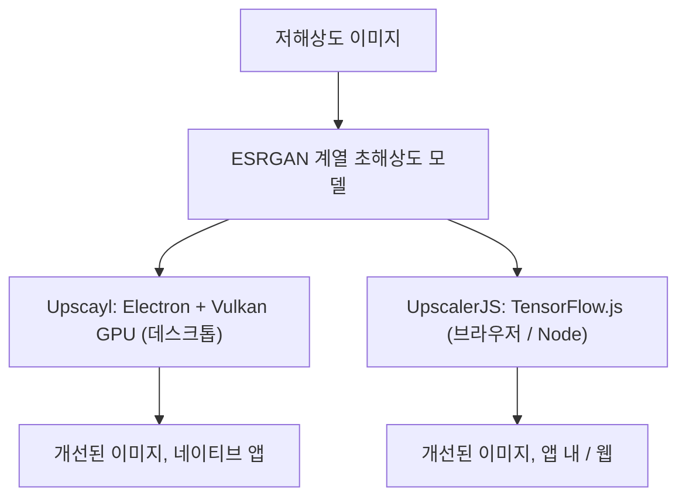

## 개요

두 오픈소스 프로젝트가 같은 문제 — 저해상도 이미지를 AI로 확대·개선하기 — 를 정반대 방향에서 푼다. [Upscayl](https://github.com/upscayl/upscayl)(46.5k★)은 잘 다듬어진 크로스 플랫폼 데스크톱 앱이고, [UpscalerJS](https://github.com/thekevinscott/upscalerjs)(890★)는 브라우저나 Node에서 도는 자바스크립트 라이브러리다. 둘 다 ESRGAN 계열 초해상도 모델에 기대지만, 전달 수단이 누가 어떻게 쓰는지를 전부 결정한다.

<!--more-->



---

## Upscayl: 데스크톱 강자

[Upscayl](https://github.com/upscayl/upscayl)은 Linux·macOS·Windows용 "1위 무료 오픈소스 AI 이미지 업스케일러"이고, 46,480개의 스타는 이 용도에 데스크톱 앱 공식이 얼마나 잘 맞는지를 보여준다. **TypeScript + Electron**으로 만들어졌고, 중요한 모든 채널로 배포된다(Linux의 Flathub·AppImage·AUR·Snap, macOS의 Mac App Store와 Homebrew `brew install --cask upscayl`). 이 배포 폭 자체가 하나의 기능이다 — 비개발자도 다른 앱 설치하듯 설치할 수 있다.

유일한 강한 요구사항은 **Vulkan 호환 GPU**이고, 이는 구조를 말해준다. 샌드박스가 아니라 그래픽 카드에 대고 업스케일링 모델을 네이티브로 돌린다. 그래서 기가픽셀 규모 확대를 다룰 수 있다(토픽 목록에 `gigapixel`, `esrgan`, `topaz` — 유료 도구 Topaz Gigapixel의 무료 대안으로 자리매김). 최근 커밋 로그는 대중용 앱을 건강하게 유지하는 화려하지 않은 유지보수가 대부분이다: 현지화 추가(폴란드어), electron-updater 수정, README·언어 스위처 다듬기. 큰 비개발자 사용자층을 잘 모시는 데 드는 세금이다.

---

## UpscalerJS: 의존성으로서의 초해상도

[UpscalerJS](https://github.com/thekevinscott/upscalerjs)는 같은 문제를 **앱이 아니라 라이브러리**로 공략한다. MIT 라이선스, 브라우저·Node 호환, **TensorFlow.js** 기반이다. 전체 API 표면이 스니펫 하나에 들어갈 만큼 작다:

```javascript
import Upscaler from 'upscaler';
const upscaler = new Upscaler();
upscaler.upscale('/path/to/image').then(upscaledImage => {
  console.log(upscaledImage); // 이미지 src의 base64 표현
});
```

이 `new Upscaler().upscale(...)` 의 단순함이 전부다. 초해상도가 사용자가 실행하는 프로그램이 아니라 `npm install` 하는 의존성이 된다. 다양한 작업용 **사전학습 모델**을 제공한다 — 해상도 증가뿐 아니라 노이즈 제거, 디블러, 디헤이즈, 빗줄기 제거, 저조도 개선, 리터칭(토픽 목록이 복원 작업 카탈로그다) — 그리고 커스텀 모델 통합도 지원한다. 주목할 엔지니어링 디테일은 **패치 기반 처리**다. 이미지를 타일 단위로 업스케일해 UI가 멈추지 않고 큰 이미지에서 메모리가 터지지 않는다. 사용자 자신의 기기에서 웹 페이지 안에서 추론을 돌릴 때 매우 중요한 부분이다.

트레이드오프는 Upscayl의 정확한 거울상이다. UpscalerJS는 자바스크립트가 도는 어디든 닿는다 — 웹 앱에 심으면 사용자가 아무것도 설치하지 않고 업스케일한다 — 지만 TensorFlow.js 성능과 브라우저 연산에 묶여, 기가픽셀 작업에서 네이티브 Vulkan 앱을 따라가지 못한다. 최근 커밋(Node 20–22 고정, `shared/`를 `core/`로 이동, Dependabot 쿨다운)은 *라이브러리*의 유지보수 서명이다 — 인스톨러와 현지화가 아니라 의존성 위생과 모듈 경계.

---

## 인사이트

같은 모델 계열, 두 개의 전달 결정, 완전히 다른 두 제품. **Upscayl은 최종 사용자에 최적화한다**: 설치하고, 폴더를 가리키고, 기가픽셀 결과를 얻는다 — 대신 쓸 만한 GPU와 플랫폼별 패키징이 필요하다. **UpscalerJS는 개발자에 최적화한다**: 어떤 JS 프로젝트에든 넣어 업스케일링을 기능으로 출시한다 — 대신 브라우저에 묶인 성능을 감수한다. 이 갈림길은 응용 AI에서 모델이 차별점인 경우는 드물고 *전달 표면*이 차별점이라는 깔끔한 상기다. GPU 접근을 가진 네이티브 앱과 TensorFlow.js 위의 이식 가능한 라이브러리 사이의 선택은 사실 "내 사용자가 누구이고 연산이 어디서 도는가"의 선택이며, 그 결정이 배포 채널부터 커밋 로그의 모양까지 전부로 번져간다.
