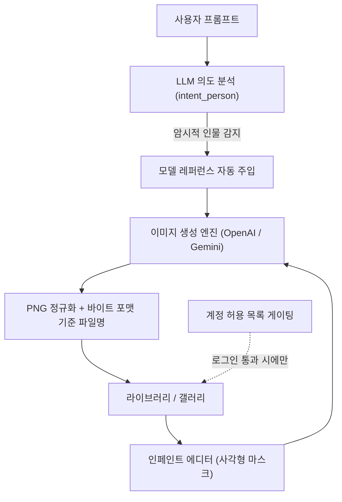
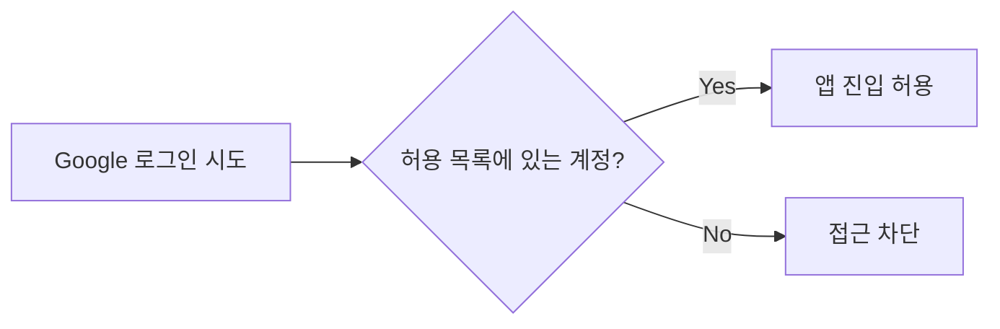

## 개요

이번 사이클은 이미지 생성 데모를 "단발성 생성기"에서 "편집까지 가능한 워크스테이션"으로 끌어올린 작업이 핵심이었다. 인페인트 에디터에 사각형 마스크 도구를 붙이고, 사용자가 말로 표현하지 않은 인물(암시적 인물)을 LLM이 추론해 모델 레퍼런스를 자동으로 끼워 넣고, 외부 사용자에게 데모를 열기 위해 계정 허용 목록 기반 로그인 게이팅을 도입했다. 54개 커밋을 인페인트 / 모델 주입 / 블록 프롬프트 / 인증 / 라이브러리 UX / 인프라 6개 줄기로 묶어 정리한다.

[이전 글: #21 — hybrid-image-search-demo dev21](/posts/2026-05-29-hybrid-search-dev21/)

<!--more-->

---

## 인페인트 에디터: 부분 재생성을 위한 마스크 도구

가장 큰 기능 추가는 인페인트(inpaint) 에디터였다. 생성된 이미지의 일부 영역만 다시 그리려면 "어디를 다시 그릴지"를 지정하는 마스크가 필요한데, 이번에 **사각형 마스크 도구**를 에디터에 추가했다. 액션 바에도 인페인트 진입 버튼을 넣어, 갤러리에서 이미지를 고른 뒤 곧바로 부분 수정 흐름으로 넘어갈 수 있게 했다.

### 문제 해결

인페인트 진입 버튼을 붙이는 과정에서 **재업로드 버그**가 같이 잡혔다. 이미지를 다시 올렸을 때 이전 상태가 깨끗하게 초기화되지 않던 문제였다. 또 한 번은 `InpaintEditor`의 JSX 블록이 짝이 맞지 않아 빌드가 깨지는 일이 있었는데(`fix(frontend): close unbalanced InpaintEditor JSX block`), 컴포넌트가 커지면서 조건부 렌더링 분기가 늘어난 탓이었다. 이후 인페인트 비교 뷰와 갤러리 컨트롤을 다듬어, 원본과 인페인트 결과를 A/B로 나란히 비교할 수 있도록 마무리했다.

---

## 암시적 인물 모델 주입: LLM 의도를 신뢰하기

이번 사이클에서 가장 "AI다운" 작업은 **암시적 인물(implied person) 모델 주입**이었다. 사용자가 "이 사람을 ~한 배경에 놓아줘"처럼 명시적으로 모델을 지정하지 않고, "카페에 앉아 있는 모습"처럼 인물의 존재를 암시만 해도, LLM이 그 의도(`intent_person`)를 읽어 적절한 모델 레퍼런스를 프롬프트에 자동으로 끼워 넣도록 했다.

### 구현

세 단계로 발전했다. 먼저 암시적 인물 프롬프트에 대해 모델 레퍼런스를 자동 주입하는 기본 로직을 넣었고(`feat: auto-inject model ref for implied-person prompts`), 다음으로 LLM이 반환한 `intent_person` 판단을 **그대로 신뢰**하도록 바꿨다(`fix: trust LLM intent_person for model injection`). 초기에는 휴리스틱으로 한 번 더 검증했는데, 오히려 LLM 판단을 막는 경우가 있어 신뢰 쪽으로 정리한 것이다. 마지막으로 `intent_person` 정의 자체를 넓혀, 좀 더 다양한 암시 표현을 인물로 인식하게 했다(`fix: broaden LLM intent_person definition for implied-person prompts`).

이 작업의 교훈은 "LLM의 구조화된 출력을 신뢰할지, 규칙으로 한 번 더 거를지"의 트레이드오프였다. 결국 LLM의 의도 판단을 신뢰하되 정의를 넓히는 쪽이 사용자 경험에 더 자연스러웠다.

---

## 블록 기반 프롬프트와 듀얼 엔진 프리뷰

프롬프트 작성 UX도 크게 바뀌었다. **블록 기반 프롬프트**를 도입해, 프롬프트를 하나의 긴 문자열이 아니라 재사용 가능한 블록들의 조합으로 다루게 했다(`feat(model-gen): block-based prompts + dual-engine preview/select`). 여기에 OpenAI와 Gemini 두 엔진의 프리뷰를 동시에 띄워 사용자가 골라 쓰는 듀얼 엔진 선택 흐름을 붙였다.

이어서 블록을 템플릿처럼 쓰는 UX와 한국어 현지화, 백그라운드 생성 라이프사이클을 정리하고(`block-as-template UX + KO localization + bg lifecycle`), 프리뷰 대기 화면에 "최종적으로 해석된 프롬프트"를 보여주도록 했다(`show resolved prompt on preview wait screen`). 여러 페어를 한꺼번에 생성할 때는 재개된 프리뷰를 페어별 요약 블록으로 묶고(`group resumed previews into per-pair summary blocks`), 페어마다 해석된 블록을 접을 수 있는 요약(collapsible)으로 정리했다.

---

## 로그인 게이팅: 데모를 외부에 여는 작업

데모를 외부 사용자에게 열기 위해 인증 흐름을 손봤다. 핵심은 **계정 허용 목록(allowlist) 기반 로그인 게이팅**이다. Google 로그인 자체는 허용하되, 명시적 허용 목록에 있는 계정만 실제 앱에 들어올 수 있도록 게이트를 세웠다(`feat(auth): gate Google login behind an explicit account allowlist`). 특정 디자이너 계정(joonghodesign)을 허용 목록에 추가하는 작업도 함께 들어갔다.

부수적으로 두 개의 계정으로 분리돼 있던 구조를 정리하고(`get rid of two accounts`), 명시적 로그아웃 흐름을 추가했으며(`feat(ui): add confirmed logout flow`), UI에서 기본으로 박혀 있던 한국어 인종(race) 지시문을 제거했다(`chore: remove default Korean race directive`). 데모가 더 이상 특정 지역/인종을 기본값으로 가정하지 않도록 한 정리 작업이다.

---

## 라이브러리·갤러리 UX와 인프라 정리

라이브러리를 별도 패널에서 떼어내 **General 모드 안의 탭 스위처**로 합쳤고(`merge library panel into General mode with tab switcher`), 모델 레퍼런스와 제품 레퍼런스가 하나의 General 탭에서 공존하도록 했다. 생성 이미지에 대한 프롬프트 검색을 붙였고(`add prompt search for generated images`), 실패한 모델 생성을 라이브러리에서 그 자리에서 재생성하는 흐름도 넣었다(`regenerate failed model generations in place from the library`).

인프라 쪽에서는 시작 시 S3 레퍼런스 키 캐시를 백그라운드로 빌드해 **앱 시작이 멈추지 않도록** 고쳤고(`build S3 ref-key cache in background so startup doesn't hang`), Gemini 세마포어의 acquire 대기 시간을 계측하는 텔레메트리를 추가했다(`instrument Gemini semaphore acquire-wait time`). 생성 이미지는 하드코딩된 확장자가 아니라 실제 바이트 포맷 기준으로 파일명을 붙이고, 전부 PNG로 정규화했다(`normalize generated images to PNG`). 비용 측면에서는 OpenAI 이미지 품질을 high에서 medium으로 낮춰(`lower OpenAI image quality from high to medium`) 비용/속도를 조정했다.

---

## 커밋 로그

| 영역 | 주요 작업 |
|------|-----------|
| 인페인트 | 사각형 마스크 도구, 액션 바 진입 버튼 + 재업로드 버그 수정, 비교/갤러리 컨트롤 |
| 모델 주입 | 암시적 인물 모델 레퍼런스 자동 주입, LLM `intent_person` 신뢰, 정의 확장 |
| 블록 프롬프트 | 블록 기반 프롬프트 + 듀얼 엔진 프리뷰, 템플릿 UX, 페어별 요약 |
| 인증 | 허용 목록 기반 Google 로그인 게이팅, 확정 로그아웃, 기본 인종 지시문 제거 |
| 라이브러리 UX | General 탭 통합, 프롬프트 검색, 실패 생성 재생성, 좋아요 갤러리 동기화 |
| 인프라 | S3 캐시 백그라운드 빌드, Gemini 세마포어 계측, PNG 정규화, OpenAI 품질 조정 |

---

## 인사이트

이번 사이클을 관통하는 두 흐름이 있다. 하나는 **편집 가능성**이다. 인페인트 마스크, 블록 프롬프트, 실패 생성의 즉시 재생성 — 모두 "한 번 생성하고 끝"이 아니라 "결과를 붙잡고 계속 다듬는" 방향으로 가고 있다. 생성형 도구의 가치가 단발 품질보다 반복 편집 루프의 매끄러움으로 옮겨가는 흐름과 일치한다.

다른 하나는 **외부 공개를 위한 단단함**이다. 허용 목록 게이팅, 확정 로그아웃, 시작을 막지 않는 S3 백그라운드 캐싱, 세마포어 대기 계측은 모두 "내가 쓰는 데모"에서 "남에게 보여주는 데모"로 넘어갈 때 필요한 작업이다. 특히 LLM의 `intent_person`을 신뢰하기로 한 결정은, 휴리스틱으로 한 번 더 거르는 대신 모델의 구조화된 판단을 받아들이는 — 요즘 에이전트 설계에서 반복적으로 마주치는 — 트레이드오프를 잘 보여준다.
