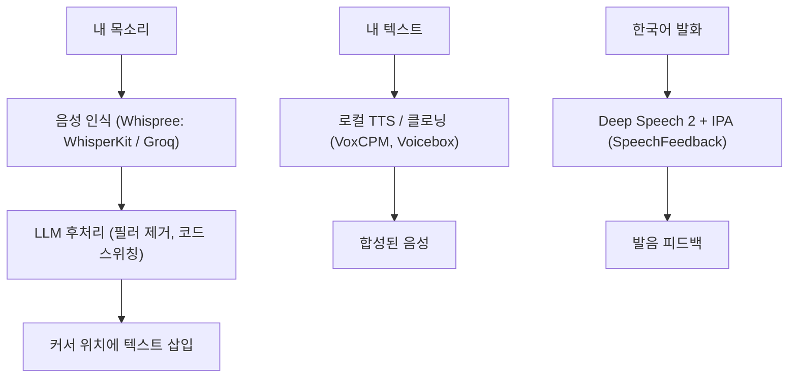

## 개요

최근 마주친 음성 프로젝트들은 한 가지 전제를 공유한다. 모델을 남의 서버가 아니라 내 컴퓨터에서 돌린다는 것. Whispree는 macOS에서 음성을 AI 프롬프트로 바꾸고, VoxCPM과 Voicebox는 TTS와 음성 클로닝을 로컬에서 처리하며, SpeechFeedback은 Deep Speech 2 ASR 모델 위에 한국어 발음 교정 시스템을 올린다. 이 넷을 보면 로컬 음성이 얼마나 왔는지 — 그리고 어디서는 여전히 클라우드가 이기는지 — 가 보인다.

<!--more-->

---

## Whispree: Apple Silicon용 음성-투-프롬프트

[Whispree](https://github.com/Arsture/whispree)(113★, 대부분 Swift)는 완전 로컬로 도는 macOS 메뉴바 앱으로, 오픈소스 SuperWhisper 대안을 표방한다. 핵심은 "타이핑 대신 AI에게 말하기"다. Cursor, Claude, ChatGPT 등 어떤 프롬프트 입력창이든 커서를 두고 `Ctrl+Shift+R`을 눌러 말하면, 교정된 텍스트가 커서가 있던 그 자리에 정확히 붙는다. 녹음 중 창을 바꿔도 원래 포커스 위치를 기억한다.

단순 받아쓰기를 넘어서게 하는 건 **LLM 후처리 레이어**다. 네 가지 교정 모드 — Standard(STT 오류 수정), Filler Removal("음/어" 제거), Structured(중구난방 발화를 프롬프트용 불릿으로 정리), Custom — 가 원시 인식과 붙여넣기 사이에 들어간다. 한국 개발자에게 백미는 **코드 스위칭 최적화**다. 한영 혼용 기술 발화를 제대로 고쳐준다. 예: `"밸리데이션 해야 되거든"` → `"validation 해야 되거든"`, `"깃허브에 PR 올려놨어"` → `"GitHub에 PR 올려놨어"`. 녹음 시작 시 포커스 화면 스크린샷을 자동 캡처해 함께 붙여, 비전 지원 모델이 수식·기술 용어를 맥락으로 교정하게 한다.

영리한 부분은 프로바이더 구조다. STT는 Groq(무료), LLM 교정은 기존 **Codex CLI OAuth 토큰**을 빌려 쓴다 — "OpenAI 계정만 있으면 추가 비용 거의 없이 고품질 STT + LLM 교정"이 된다. 로컬 옵션도 있다(CoreML+ANE 위의 WhisperKit, MLX Audio, 로컬 LLM 6종). Raycast·Stream Deck·AppleScript에서 트리거할 URL 스킴(`whispree://toggle`)까지 있다. 커밋 로그에서 보이는 인상적인 릴리스 규율 하나: Claude 구독 프로바이더를 릴리스 직전 되돌리고 피처 브랜치에 보존했다 — "출시한 것"과 "만든 것"은 다르다는 좋은 예다.

---

## VoxCPM과 Voicebox: TTS와 클로닝, 전부 로컬로

합성 쪽에서는 두 프로젝트가 눈에 띄었다. **VoxCPM**("아침드라마 대사를 완벽히 구현한 오픈소스 TTS" 쇼츠의 주인공)은 Apache 2.0으로 음성 디자인과 클로닝을 하는 멀티링궐 음성 모델인데, 데모의 핵심은 감정 표현력이었다 — 밋밋한 로봇 TTS가 아니라 설득력 있는 신파조로 전달되는 한국어 대사.

**Voicebox**는 "ElevenLabs를 내 PC에 통째로 다운받은 것"으로 소개된다. 무료, 오픈소스, 인터넷 없이 모든 작업이 로컬에서 돈다. 정체성은 *로컬 우선*이고, 구조는 **다섯 개의 교체 가능한 엔진**을 가진 스위스 군용칼이다 — 멀티링궐·지시 따르기("조금 더 천천히 말해줘")에는 Qwen-TTS 계열을, 빠르고 감정 태그가 되는 합성에는 Chatterbox Turbo를(대본에 `(웃음)`이나 `(한숨)`을 인라인으로 표기) 골라 쓴다. 단순 TTS가 아니라 다중 캐릭터 신, 리버브 효과, 편집, 자동화용 API까지 갖춘 완성형 오디오 프로덕션 스튜디오다.

리뷰어가 말한 솔직한 트레이드오프는, 로컬 합성이 "수동 변속기 차량"이라는 점이다 — 통제력은 크지만 설치, GPU 요구사항, 학습 곡선을 직접 감당해야 한다. 1분 안에 결과가 필요하고 빠른 GPU가 없다면 클라우드 구독이 여전히 합리적이다. 로컬이 *명확히* 이기는 지점: 사용료 없이 수천 줄의 NPC 대사를 뽑는 게임 개발자, 대본을 외부 서버에 보내지 않는 콘텐츠 제작자, 민감 데이터를 다루는 파이프라인에 TTS를 통합하는 회사.

---

## SpeechFeedback: 발음 튜터가 된 ASR

[SpeechFeedback](https://github.com/DevTae/SpeechFeedback)은 ASR을 다른 방향으로 끌고 간다 — 받아쓰기 자체가 아니라 **한국어 발음 교정**이다. KoSpeech 툴킷 위에 Deep Speech 2 구조(Baidu 논문대로 3-layer CNN + 양방향 GRU 7층 + CTC loss)를 구현한 Docker + FastAPI 시스템이다.

영리한 설계는 **IPA(국제음성기호) 변환**이다. 표준 표기를 인식하는 대신 실제 발음 그대로를 인식하게 했더니, 출력 단어사전이 **2000개 클래스에서 44개로** 줄었다 — 훨씬 작고 학습하기 쉬운 타깃이다. 덕분에 단어가 "어떻게 발음되어야 하는가" 대비 "어떻게 발음됐는가"에 대한 피드백이 가능해진다. 프로젝트의 엔지니어링 로그는 데이터에 묶인 ML의 좋은 사례다: (R 기반 한글→IPA 변환기를 파이썬으로 포팅해) 라벨 데이터를 1만 개에서 60만 개로 늘리자 epoch당 스텝 수가 약 60배 커졌고, 소스 데이터셋을 강의 오디오에서 대화 음성으로 바꾸니 일상 발화에 더 잘 일반화됐다.

---

## 인사이트

공통 줄기는 **음성이 이미지·텍스트 모델이 밟은 로컬 우선 궤적을 그대로 따라가고 있다**는 것이다. 쓸 만한 오픈 모델, 온디바이스 추론, 그리고 뒤늦은 부가 기능이 아니라 전면에 내건 프라이버시. 동시에 네 프로젝트는 스펙트럼을 깔끔하게 그린다. Whispree는 실용적 하이브리드 — 로컬 앱이지만 지금 비용 대비 품질이 가장 좋은 Groq와 Codex 토큰을 기꺼이 빌린다. Voicebox는 순수 로컬 — 편의를 통제력과 제로 데이터 유출과 맞바꾼다. VoxCPM은 합성 품질 기준(감정·멀티링궐)이 "로컬 = 당연히 열등"이 더는 아닐 만큼 올라왔음을 보여준다. SpeechFeedback은 ASR이 받아쓰기만을 위한 게 아니라는 점 — IPA로 재구성하면 같은 모델이 튜터가 된다는 점 — 을 상기시킨다. 만드는 사람을 위한 반복되는 교훈: 흥미로운 작업은 점점 음성 모델 *그 자체*가 아니라 *그 주위 레이어*에 있다 — LLM 후처리, 프로바이더 라우팅, IPA 재구성, 다중 엔진 선택.
