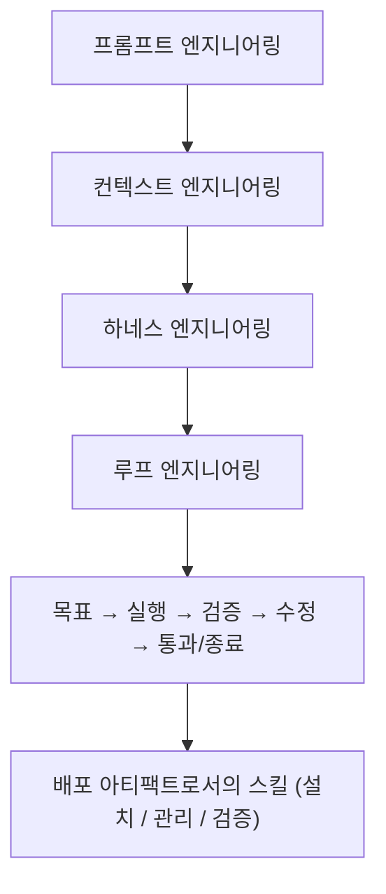
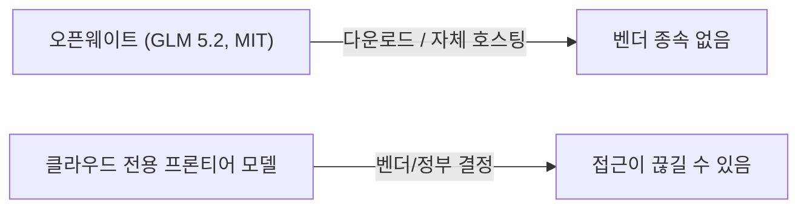

## 개요

한국 개발 유튜브에서 본 세 영상이 같은 질문으로 모인다. 프론티어 모델이 길고 자율적인 작업을 실제로 끌고 갈 수 있게 된 지금, *우리는 그 모델을 어떻게 운전해야 하는가?* 하나는 프롬프트 시대가 끝나고 "루프 엔지니어링"으로 넘어간다고 말하고, 하나는 오픈웨이트 모델 GLM 5.2를 Claude Code 안에서 Opus 4.8과 직접 비교하며, 하나는 스킬(Skill)을 설치·관리·검증해야 하는 배포 아티팩트로 재정의한다. 모델이 더 이상 병목이 아니게 된 시대의 에이전트 코딩 윤곽이 이 셋에 담겨 있다.

<!--more-->

---

## 루프 엔지니어링: 에이전트가 프롬프트를 쓴다

출발점은 Claude Code를 만든 보리스 체르니의 인터뷰 클립이다. *"나는 더 이상 클로드에서 프롬프트를 쓰지 않는다 — 내 일은 이제 루프를 쓰는 것이다."* 이 클립이 터지고 이틀 뒤 Fable 5가 출시됐고, Anthropic 엔지니어 랜스 마틴이 "Fable 5를 사용한 루프 설계" 글을 올렸다. 영상은 이를 묶어, 에이전트 작업의 단위가 다시 한 번 이동했다고 본다: **프롬프트 → 컨텍스트 → 하네스 → 루프 엔지니어링.**

루프 자체는 단순하다. (1) 목표를 정하고, (2) 에이전트가 실행하고, (3) 에이전트가 검증하고, (4) 실패하면 고치고, (5) 통과하면 종료한다. 수동 프롬프팅과의 차이는 "만들어 줘 → 확인해 줘 → 고쳐 줘"를 사람이 하나씩 치지 않는다는 점이다. 루프를 설계하면 그 사이클이 사람 없이 돈다. 영상은 루프가 진짜인지 가리는 두 질문을 제시한다. *AI가 자기 결과를 신뢰할 만하게 평가할 수 있는가?*(아니라면 루프는 환상이다), 그리고 *루프 한 바퀴마다 에이전트에게 남는 게 있는가?*(없다면 그냥 반복 자동화다).

마틴의 두 실험이 정확히 그 두 질문에 대응한다. **파라미터 골프**(16MB 안에 들어가는 모델을 10분 안에 학습시키는 OpenAI 챌린지)에서 Fable 5는 Opus 4.7 대비 벤치마크를 약 6배 개선했는데, 수치보다 흥미로운 건 *구조적* 변화를 크게 밀어붙이며 중간의 성능 회귀를 버텨낸 점이다. Opus 4.7은 스칼라값을 조정하고 긍정적 결과만 유지하는 보수적 패턴이었다. 결정적 발견은 **별도의 검증자 서브에이전트가 자기 평가보다 더 우수**했다는 것. 사람처럼 모델도 자기 작업물에는 후하다. 생성자와 검증자를 분리하는 것이 핵심이다. 두 번째 실험(세션을 넘나들며 학습하는지 보는 continual-learning 벤치)에서 Fable 5는 실패 처리 5단계를 끝까지 완주하며 검증 커버리지 약 73%를 기록했고, Opus 4.7은 약 17%(Sonnet 4.6은 1단계에서 멈춤)였다.

다만 솔직한 단서: 루프는 토큰 소각로다. 영상의 데모 — "새 언어를 만들어 그걸로 3D 마인크래프트 게임을 만들어라" — 는 완주했지만 금지 제약에도 불구하고 슬쩍 `pygame`을 썼다. 명확한 종료/검증 기준 없는 루프는 "자기 규정이 아니라 토큰 소각로"라는 경고다. 실용적 조언은 Fable 5를 *리드 엔지니어*로만 쓰는 것 — 펜아웃과 단순 작업은 Opus/Sonnet에, 복잡한 설계와 긴 검증 루프만 Fable 5에 — 으로 비용을 1/3 이하로 줄인다.

---

## Claude Code 안의 GLM 5.2: 쓸 만한 오픈웨이트 모델

두 번째 영상은 같은 Claude Code 하네스, 같은 프롬프트, 같은 작업으로 **Opus 4.8 vs GLM 5.2**를 비교한다. 결론은 단도직입적이다. "드디어 쓸 만한 오픈웨이트 모델이 나왔다." 프론트엔드 디자인 — 랜딩 페이지, SVG만으로 만든 로딩 스피너, 기후 대시보드, DDL→ER 다이어그램 도구, 3D 장면, 마인크래프트 클론 — 에서 둘은 종종 구분이 안 됐고, GLM 쪽이 오히려 호버/애니메이션을 더 입히기도 했다.

차이는 복잡도와 디테일에서 드러났다. GLM의 대시보드는 외부 API 데이터를 원샷으로 렌더링하지 못했고, FK 체인 뷰에서 Opus가 제대로 그린 관계를 일부 빠뜨렸다(후속 프롬프트로는 해결 가능). 같은 하네스에서 일관되게 더 느리고 토큰도 더 썼다 — 기후 대시보드는 Opus 5분03초/약 85.4k 토큰 vs GLM 9분24초/약 99k, SVG 스피너는 2분34초/68k vs 6분55초/83k. 다만 GLM이 Claude Code 하네스와 궁합이 덜 맞을 수 있다는 단서가 붙는다.

진짜 논점은 **벤치마크가 아니라 전략**이다. GLM 5.2는 오픈*웨이트*(MIT 라이선스)다 — 학습 데이터를 공개하지 않으니 오픈*소스*는 아니지만, 다운로드해 자체 호스팅하고 파인튜닝하고 상업적으로 재배포할 수 있다. LMArena 에이전트 랭킹에서 오픈웨이트 중 1위(전체는 Fable 5)이고, 웹 개발에서는 Opus 4.7/4.8보다 위다. 가격은 출력 기준 약 6배 저렴하고(GLM 약 $1.4 in / $4.4 out vs Opus $5 / $25), Z.ai 코딩 플랜(라이트 월 $12.6~16.2)을 Claude Code에 바로 붙여 5시간·주간 리밋으로 쓸 수 있다. 영상의 핵심: 모델이 남의 서버에만 있으면, 기업/정부의 결정 하나(출시 며칠 만에 Fable 5/Mythos에 걸린 수출 통제 제한처럼)로 접근이 통째로 끊길 수 있다. 오픈웨이트는 벤더 종속에 대한 보험이다 — "맥 스튜디오에서 2비트 양자화로 GLM 5.2를 100% 로컬로 돌렸다"는 사례가 여전히 비싸고 느려 클라우드가 기본값으로 남더라도.

---

## 배포 아티팩트로서의 스킬: "스킬은 두껍게, 하네스는 얇게"

세 번째 영상은 *"스킬은 두껍게, 하네스는 얇게"*라는 구호에서 출발해, 덜 다뤄진 질문을 던진다. 스킬을 어떻게 *관리*할 것인가? 근거는 2026년 논문 셋이다. Microsoft Research는 긴 작업을 위임하면 **작업 문서가 오염된다**는 것을 보였다 — 프론티어 모델(Claude 4.6 Opus, GPT 5.4)도 작업 종료 시 평균 약 25% 문서 오염, 원인은 문서가 클수록·대화가 길수록·*관련 없는 파일이 옆에 있을수록*. 멘탈 모델: 컨텍스트는 참고 선반이 아니라 작업대다 — 물건이 많을수록 필요한 걸 찾기 어렵다. 두 번째 논문은 메모리를 *더* 줘도 28개 설정 중 18개에서 협력이 떨어졌지만, 길이는 두고 내용을 큐레이션된 합성 기록으로 바꾸면 회복됐다고 한다: 얼마나가 아니라 무엇을 기억하느냐의 문제다.

보안 논문("skills in the wild")은 약 31,000개 스킬을 분석해 **26.1%에 취약점**(프롬프트 인젝션, 데이터 탈취, 권한 상승, 공급망 위험)이 있음을 찾았고, 실행 스크립트를 포함한 스킬은 인스트럭션 온리 스킬보다 2.12배 취약했다. 결론: 스킬은 좋은 프롬프트 묶음이 아니라 설치·관리·검증해야 하는 **배포 아티팩트**다.

Claude Code의 제어면은 구체적이다. Claude Code와 Codex 모두 **프로그레시브 디스클로저**를 쓴다 — 스킬은 이름과 설명만 로드돼 있다가 모델이 필요하다고 판단하면 본문 전체가 로드된다. 그래서 설명(description)이 곧 자동 호출 기준이다. 설명이 애매하면 트리거도 애매해진다. Claude Code에는 Codex에 없는 세밀한 제어 셋이 있다: `disable-model-invocation`(프런트매터 플래그로 명시적 `/skill` 호출에만 실행), 스킬 오버라이드(`settings.json`에서 스킬별 노출 수준, v2.16+), 컨텍스트 포크(서브에이전트 컨텍스트에서 실행하고 결과만 가져옴). 결정적으로, 스킬 본문이 한 번 대화에 들어오면 외과적으로 제거할 수 없다 — "화이트보드가 아니라 종이"다.

제안된 답은 **사이드카**다: 설치된 스킬의 라이프사이클을 추적하고(상태/출처/신뢰 레지스트리 + 명시적 사용 로그), 위험한 스킬의 자동 호출을 제한하며, 몇 달간 안 쓴 스킬을 퇴역시키는 레이어. *무엇*을 스킬로 만들지 가르는 기준: "이 작업은 매번 같은 결과를 내야 하는가?" 예 → 스킬 후보(릴리스 노트, API 컨벤션, 보안 스캔). 아니오 → 모델 판단에 맡김(아키텍처 결정, 미묘한 코드 리뷰). 이를 뒷받침하는 네 번째 논문이 Microsoft의 **SkillUp**이다: 모델 가중치가 아니라 스킬 *파일*만 최적화(롤아웃 → 별도 옵티마이저 모델로 리플렉트 → 점수가 안 오르는 편집은 게이팅)했더니 6개 벤치마크 × 7개 모델 × 3개 하네스(52개 조합)에서 best-or-tied를 달성했고, Codex에서 최적화한 스킬을 Claude Code로 옮겨도 성능이 유지됐다. 스킬이 하네스를 넘어 전이된다는 것 — 이것이 스킬이 아티팩트라는 실증이다.

---

## 인사이트

세 영상을 관통하는 한 줄은 **모델이 더 이상 병목이 아니게 되자, 엔지니어링이 한 단계 위로 올라갔다**는 것이다. 루프 엔지니어링, 하네스 설계, 스킬 관리는 모두 같은 상황에 대한 답이다 — 이제 자율적으로 돌 만큼 똑똑해진 모델에는 *구조*가 필요하다. 명확한 목표, 분리된 검증자, 깨끗한 컨텍스트, 검증된 스킬. 그렇지 않으면 환상을 좇으며 토큰을 태운다. 반복되는 모티프는 *실행*과 *판단*의 분리다: 자기 평가를 이긴 마틴의 검증자 서브에이전트, 스킬 실행과 스킬 거버넌스를 나눈 사이드카, 어디서 모델을 신뢰하고 어디서 통제를 쥘지의 문제인 GLM-vs-Opus까지. 오픈웨이트 흐름은 전략적 차원을 더한다 — 이 모든 구조는 벤더가 회수할 수 있는 토대 위에 세워지지 않았을 때 더 값지다. 2025년이 모델에 프롬프트를 잘 쓰는 해였다면, 2026년은 이미 작동하는 모델 주위의 *루프·하네스·스킬 레이어*를 엔지니어링하는 해다.
