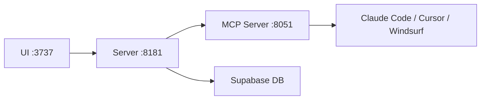

## 개요

AI 코딩 도구가 점점 강력해지고 있지만, 프로젝트 맥락을 체계적으로 관리하고 주입하는 것은 여전히 어렵다. Cole Medin의 Archon은 이 문제를 MCP 서버 패턴으로 해결하려는 도구다.

## Archon이란?

[Archon](https://github.com/coleam00/Archon)은 AI 코딩 어시스턴트를 위한 **커맨드 센터**다. GitHub 스타 13,700개 이상을 기록 중인 이 프로젝트는 Claude Code, Cursor, Windsurf 같은 AI 코딩 도구에 **커스텀 지식 베이스와 태스크 관리** 기능을 MCP(Model Context Protocol) 서버로 제공한다.

사용자에게는 지식과 태스크를 관리하는 깔끔한 웹 인터페이스이고, AI 코딩 어시스턴트에게는 같은 지식과 태스크에 접근할 수 있는 MCP 서버다.

## 아키텍처



세 개의 마이크로서비스로 구성된다:

- **Server** (Python): 핵심 API와 비즈니스 로직. 웹 크롤링, PDF 업로드, RAG(Retrieval-Augmented Generation) 검색을 처리
- **MCP Server**: AI 코딩 어시스턴트가 연결하는 프로토콜 인터페이스
- **UI** (TypeScript): 지식 베이스 관리, 프로젝트/태스크 관리를 위한 웹 인터페이스

Docker Compose로 원커맨드 셋업이 가능하고, Supabase를 백엔드 DB로 사용한다.

## 주요 기능

- **문서 관리**: 웹사이트 크롤링, PDF/문서 업로드로 지식 베이스 구축
- **스마트 검색**: 고급 RAG 전략으로 관련 문서를 검색
- **태스크 관리**: 지식 베이스와 통합된 프로젝트/태스크 관리
- **실시간 업데이트**: 콘텐츠 추가 시 즉시 AI 어시스턴트에 반영

## 기술 스택

| 영역 | 기술 |
|------|------|
| Backend | Python (2.3M+ LOC) |
| Frontend | TypeScript (1.8M+ LOC) |
| Database | Supabase (PostgreSQL + PLpgSQL) |
| Infra | Docker, Make |
| LLM | OpenAI, Gemini, Ollama, OpenRouter |

최근 OpenRouter 임베딩 지원이 추가되어 벤더 종속 없이 자유롭게 모델을 선택할 수 있다.

## 셋업

```bash
git clone -b stable https://github.com/coleam00/archon.git
cd archon
cp .env.example .env
# .env에 Supabase 자격 증명 추가
docker compose up --build -d
```

셋업 후 `http://localhost:3737`에서 온보딩 플로우를 따라 API 키를 설정하면 바로 사용할 수 있다.

## 참고 자료

- [The OFFICIAL Archon Guide (23분)](https://www.youtube.com/watch?v=DMXyDpnzNpY) — 설치부터 실제 워크플로우까지
- [GitHub Discussions](https://github.com/coleam00/Archon/discussions) — 커뮤니티
- [Archon Kanban Board](https://github.com/users/coleam00/projects/1) — 개발 현황

## 인사이트

Archon이 보여주는 MCP 서버 패턴은 AI 코딩 도구의 미래 방향을 보여준다. 단순히 코드를 생성하는 것을 넘어, **프로젝트 맥락과 지식을 체계적으로 관리하고 AI에 주입하는 것**이 핵심이다. "Context Engineering"이라는 개념이 점점 중요해지고 있으며, Archon은 이를 실용적으로 구현한 좋은 사례다.
