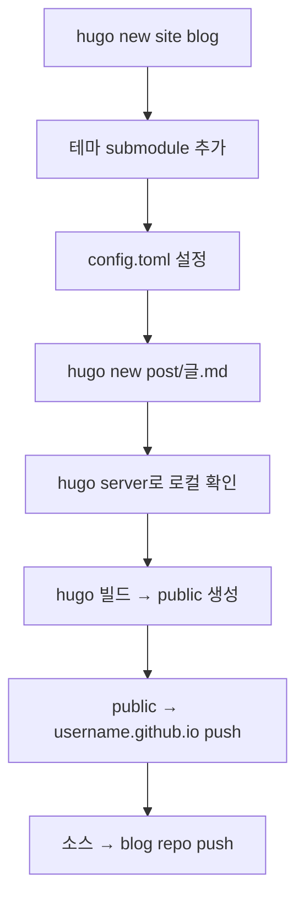

## 개요

Hugo 블로그 테마를 본격적으로 비교하고, GitHub Pages로 블로그를 구축하는 과정을 정리했다. PaperMod와 Stack을 중심으로 8개 이상의 테마를 살펴보며, Hugo + GitHub Pages 조합의 셋업 워크플로우를 파악했다.

## Hugo 테마 비교

[themes.gohugo.io](https://themes.gohugo.io/)에서 다양한 테마를 탐색하고 비교했다.

### PaperMod — 가장 인기 있는 선택

[hugo-PaperMod](https://github.com/adityatelange/hugo-PaperMod) | 스타 13,100+ | 포크 3,300+

Hugo 생태계에서 가장 인기 있는 테마다. "Fast, Clean, Responsive"를 표방하며, webpack이나 Node.js 의존성 없이 순수 Hugo 기능만으로 동작한다.

**핵심 특징:**
- Regular / Home-Info / Profile 세 가지 모드
- Fuse.js 기반 클라이언트 사이드 검색
- 다국어 지원 + SEO 최적화
- 라이트/다크 테마 자동 전환
- 코드 블록 복사 버튼, 목차 자동 생성
- Breadcrumb 내비게이션

**최근 주목할 변경:**
- `llms.txt` 파일 지원 추가 — LLM이 블로그 콘텐츠를 효율적으로 인덱싱할 수 있게 해주는 업계 표준
- 테마 결정 로직을 `head.html`로 리팩토링하여 스크립트 실행 속도 개선

[라이브 데모](https://adityatelange.github.io/hugo-PaperMod/) | [설치 가이드](https://github.com/adityatelange/hugo-PaperMod/wiki/Installation)

### Stack — 카드 스타일 블로거 테마

[hugo-theme-stack](https://github.com/CaiJimmy/hugo-theme-stack) | 스타 6,200+ | 포크 1,900+

**카드 스타일 레이아웃**이 특징인 블로거 전용 테마. 시각적으로 풍부한 블로그를 원하는 경우 좋은 선택이다.

**최근 주목할 변경:**
- Markdown Alert 지원 (GitHub 스타일 `> [!NOTE]`, `> [!WARNING]` 등)
- Generic taxonomy widget 리팩토링으로 확장성 향상
- 커스텀 canonical URL 설정 기능 추가
- i18n 지원 확대

[라이브 데모](https://demo.stack.cai.im/) | [문서](https://stack.cai.im)

### 테마 비교 요약

| 테마 | 스타 | 특징 | 적합한 용도 |
|------|------|------|-------------|
| **PaperMod** | 13.1K | 미니멀, 빠름, SEO 최적화 | 기술 블로그, 포트폴리오 |
| **Stack** | 6.2K | 카드 UI, 풍부한 시각 | 일반 블로그, 사진 블로그 |
| **Coder** | - | 극도로 미니멀 | 개발자 포트폴리오 |
| **Book** | - | 문서 사이드바 | 기술 문서 사이트 |
| **Docsy** | - | Google 후원, 대규모 | 기업 기술 문서 |
| **Terminal** | - | 레트로 터미널 스타일 | 개성 있는 개발 블로그 |
| **Blox-Tailwind** | - | Tailwind CSS 기반 | 현대적 디자인 블로그 |
| **Compose** | - | 깔끔한 다목적 | 범용 블로그 |

## Hugo + GitHub Pages 구축 가이드

[Integerous의 가이드](https://github.com/Integerous/Integerous.github.io)를 참고하여 구축 워크플로우를 정리했다.

### Static Site Generator 선택 배경

```
Jekyll  — Ruby 기반, 가장 인기, 한글 레퍼런스 많음, 빌드 느림
Hexo    — Node.js 기반, 중국어 자료 많음, 메인 개발 부진
Hugo    — Go 기반, 빌드 가장 빠름, 문서화 잘됨, 한글 레퍼런스 적음
```

Hugo는 런타임 의존성 없이 빌드 시간이 가장 빠르고, 문서화가 잘 되어 있어 선택했다.

### 구축 흐름



### 핵심 포인트

**1. 저장소 2개 준비**
- `blog` — Hugo 소스 파일 관리
- `username.github.io` — 빌드된 정적 사이트 배포

**2. 테마는 반드시 submodule로**
```bash
# clone보다 submodule이 권장됨
git submodule add https://github.com/테마/레포.git themes/테마이름
```
업데이트된 테마를 쉽게 가져올 수 있고, 환경이 바뀌어도 테마를 잃지 않는다. 테마 레포를 먼저 Fork한 후 submodule로 추가하는 것이 가장 좋은 방법이다.

**3. deploy.sh로 배포 자동화**
빌드 → public 커밋/푸시 → 소스 커밋/푸시를 쉘 스크립트 하나로 처리.

**4. Utterances 댓글 시스템**
GitHub Issues API를 활용한 댓글 시스템. 별도 서버 없이 GitHub 계정으로 댓글을 달 수 있다.

## 빠른 링크

- [Hugo Themes Gallery](https://themes.gohugo.io/)
- [PaperMod Wiki](https://github.com/adityatelange/hugo-PaperMod/wiki)
- [Stack Documentation](https://stack.cai.im)
- [Homebrew](https://brew.sh/) — macOS 패키지 매니저 (`brew install hugo`로 설치)
- [VS Code Homebrew Cask](https://formulae.brew.sh/cask/visual-studio-code#default)

## 인사이트

Hugo 테마 선택에서 가장 중요한 건 "지금 당장 예쁜가"보다 **"커뮤니티가 활발한가, 꾸준히 업데이트되는가"**다. PaperMod의 llms.txt 지원 추가처럼, 활발한 프로젝트는 시대 변화에 맞춰 계속 진화한다. 테마를 submodule로 관리하는 패턴은 Hugo에 국한되지 않고, 외부 의존성을 프로젝트에 안전하게 통합하는 보편적인 방법이다.
