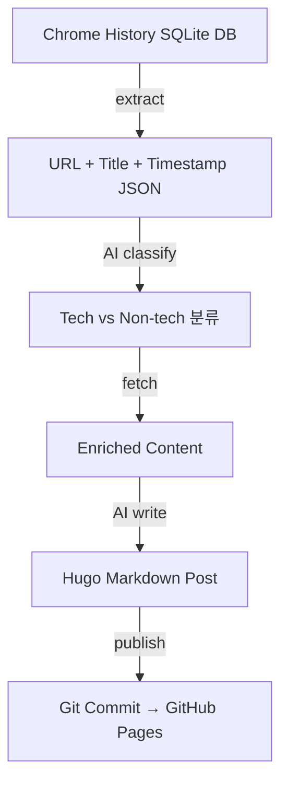

## 개요

매일 브라우저에서 수많은 기술 문서와 GitHub 레포를 탐색하지만, 그 과정은 기록되지 않고 사라진다. log-blog는 Chrome 브라우저 히스토리를 읽어서 Hugo 호환 블로그 포스트로 자동 변환하는 Python CLI 도구다.

## log-blog란?

[ice-ice-bear/log-blog](https://github.com/ice-ice-bear/log-blog)는 "탐색 → 정리 → 공유"의 사이클을 자동화하는 도구다. Chrome의 SQLite 히스토리 DB에서 데이터를 추출하고, Playwright로 각 URL의 콘텐츠를 수집한 후, Hugo 호환 마크다운으로 변환하여 블로그 레포에 커밋한다.

## 파이프라인 구조



### 1단계: Extract — 히스토리 추출

```bash
log-blog extract --json --hours 24
```

Chrome의 SQLite 히스토리 DB에서 최근 N시간의 방문 기록을 추출한다. URL, 제목, 방문 횟수, 마지막 방문 시간을 JSON으로 출력한다.

### 2단계: Classify — AI 분류

Claude Code의 skill 시스템과 결합하여, AI가 URL을 tech/non-tech으로 분류하고 YouTube, GitHub, Docs/Web으로 그룹핑한다.

### 3단계: Fetch — 콘텐츠 수집

```bash
log-blog fetch --json "URL1" "URL2" "URL3"
```

URL 타입에 따라 다른 전략으로 콘텐츠를 수집한다:

| URL 타입 | 수집 내용 |
|----------|----------|
| **YouTube** | 전체 자막 텍스트 (한국어 우선) |
| **GitHub 레포** | 설명, 스타, 언어, README, 최근 커밋 |
| **GitHub PR** | 제목, 상태, 본문, diff 통계, 댓글 |
| **GitHub 이슈** | 제목, 상태, 라벨, 본문, 댓글 |
| **웹 페이지** | 전체 텍스트, 헤딩 구조, 코드 블록 |

### 4단계: Write & Publish — 포스트 생성 및 배포

AI가 수집된 콘텐츠를 바탕으로 기술 블로그 포스트를 작성하고, `publish` 명령으로 블로그 레포에 커밋한다.

```bash
log-blog publish post.md        # 로컬 커밋
log-blog publish post.md --push # 커밋 + 푸시
```

## 기술 스택

```
src/log_blog/
  cli.py             # CLI 진입점 (extract, fetch, publish)
  config.py          # YAML 설정 로더
  history_reader.py  # Chrome SQLite 히스토리 리더
  content_fetcher.py # Playwright 기반 콘텐츠 추출기
  post_generator.py  # Hugo 마크다운 포스트 생성기
  publisher.py       # Git commit/push
```

- **Python 3.12+** — 메인 언어
- **Playwright** — 브라우저 자동화로 동적 페이지 콘텐츠 수집
- **SQLite** — Chrome 히스토리 DB 직접 읽기
- **Claude Code Skill** — AI 분류/요약/작성 자동화

## 설정

```yaml
chrome:
  profiles: ["Default"]
  history_db_base: "~/Library/Application Support/Google/Chrome"

time_range_hours: 24

blog:
  repo_path: "~/Documents/github/ice-ice-bear.github.io"
  content_dir: "content/posts"
  language: "auto"

playwright:
  headless: true
  timeout_ms: 15000
  max_concurrent: 5
```

## 빠른 링크

- [mindai/mega-code PR #26](https://bitbucket.org/mindai/mega-code/pull-requests/26) — add_behavioral_validation (Upskill)
- [mindai/megaupskill](https://bitbucket.org/mindai/megaupskill/src/main/) — MegaUpskill 프로젝트

## 인사이트

log-blog의 핵심 가치는 **"탐색 자체를 콘텐츠로 만든다"**는 것이다. 매일 브라우저에서 일어나는 기술 탐색은 이미 학습 과정이지만, 기록하지 않으면 사라진다. 이 도구는 그 과정을 자동으로 포착하고 구조화한다. 바로 지금 이 글이 그 파이프라인으로 만들어졌다 — Chrome 히스토리 추출 → AI 분류 → 콘텐츠 수집 → AI 작성 → 블로그 배포.
