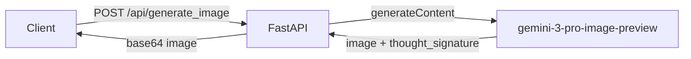
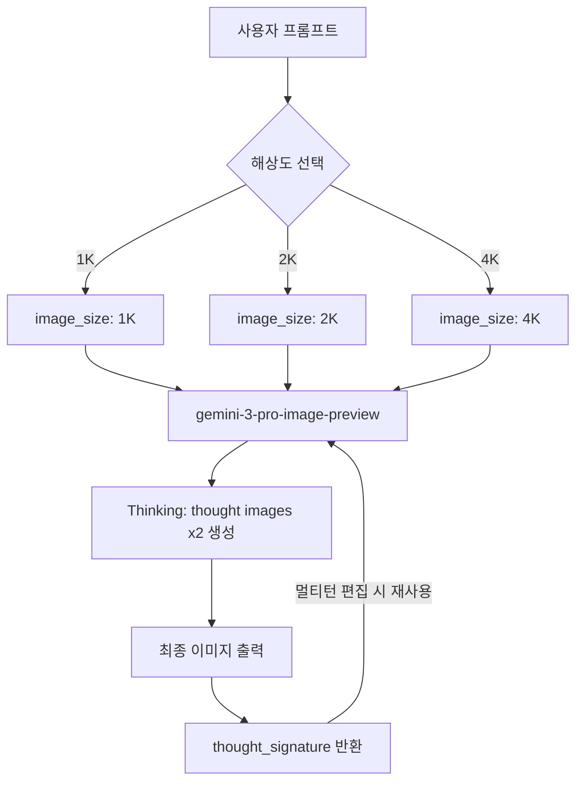

## 개요

오늘은 두 가지 주제를 집중적으로 탐구했다. 첫째, `gemini-3-pro-image-preview` 모델로 이미지 생성 API를 직접 구축하면서 생긴 궁금증들 — 해상도 비용 구조, Thought Signatures, 신규 파라미터 등을 Gemini 3 공식 문서로 정리했다. 둘째, 아키텍처 문서화 도구로 Mermaid.js를 탐색하며 주요 다이어그램 타입별 문법을 정리했다.

## Gemini 3 모델 패밀리와 가격

Gemini 3는 현재 프리뷰 상태이지만 실제로 쓸 수 있는 수준이다. 모델별 스펙은 다음과 같다.

| 모델 ID | 컨텍스트 (In/Out) | 가격 (입력/출력) |
|---|---|---|
| `gemini-3.1-pro-preview` | 1M / 64k | $2 / $12 (200k 이하) |
| `gemini-3-pro-preview` | 1M / 64k | $2 / $12 (200k 이하) |
| `gemini-3-flash-preview` | 1M / 64k | $0.50 / $3 |
| `gemini-3-pro-image-preview` | 65k / 32k | $2 (텍스트 입력) / $0.134 (이미지 출력)** |

이미지 모델의 경우 **출력 이미지 1장당 $0.134**가 기준이지만, 해상도에 따라 달라진다. 1K가 기본이고 4K로 갈수록 비용이 증가한다. 정확한 해상도별 비용은 별도 pricing 페이지를 참조해야 한다.

## Nano Banana Pro — Gemini 3 이미지 생성의 핵심

Google이 공식적으로 "Nano Banana"라는 코드명을 쓰는 게 독특한데, 이 이름은 Gemini의 네이티브 이미지 생성 기능 전체를 가리킨다. 두 가지 모델이 있다:

- **Nano Banana**: `gemini-2.5-flash-image` — 속도·효율 중심, 대량 처리에 적합
- **Nano Banana Pro**: `gemini-3-pro-image-preview` — 프로 에셋 생산용, Thinking 기반 고품질

Gemini 3 Pro Image가 기존 Imagen과 다른 점은 **추론(Thinking) 과정이 이미지 생성에 통합**된다는 것이다. 복잡한 프롬프트를 받으면 모델이 내부적으로 "thought images"를 최대 2장 생성해 구도와 로직을 검증한 뒤 최종 이미지를 출력한다. 이 중간 이미지는 과금되지 않는다.

### 주요 신기능

**1. 최대 14개 레퍼런스 이미지**

`gemini-3-pro-image-preview`는 레퍼런스 이미지를 최대 14개까지 받을 수 있다:
- 오브젝트 고해상도 이미지: 최대 6개
- 인물 캐릭터 일관성 유지: 최대 5개

이를 활용하면 특정 제품이나 캐릭터의 일관성을 유지하면서 다양한 씬을 생성할 수 있다.

**2. 해상도 제어 — 1K / 2K / 4K**

기본은 1K 출력이며, `generation_config`에서 `image_size`를 지정해 올릴 수 있다. 주의할 점은 **반드시 대문자 K**를 써야 한다는 것 — `1k`로 쓰면 에러가 난다.

```python
generation_config = {
    "image_size": "2K"  # "1K", "2K", "4K" 가능. 소문자 불가!
}
```

**3. Google Search Grounding**

`google_search` 툴을 연결하면 실시간 정보 기반 이미지를 생성할 수 있다. 날씨 예보 차트, 주가 그래프, 최근 뉴스 기반 인포그래픽 등이 가능하다. 단, 이미지 기반 검색 결과는 생성 모델에 전달되지 않으며 응답에서도 제외된다.

### Hybrid Image Search API — FastAPI로 감싸기

오늘 `localhost:8000`에서 실행 중인 **Hybrid Image Search API**의 Swagger UI를 통해 직접 테스트했다. `gemini-3-pro-image-preview`를 백엔드로 쓰는 FastAPI 서버로, `/api/generate_image` 엔드포인트가 핵심이다. 이미지 프롬프트를 받아 Gemini API를 호출하고 결과를 반환하는 구조다.



Swagger UI로 엔드포인트를 직접 실행해보면 응답 스키마에서 `thought_signature` 필드를 확인할 수 있는데, 멀티턴 편집 세션을 유지하려면 이 값을 다음 요청에 포함시켜야 한다.

## Thought Signatures — 멀티턴 편집의 핵심 메커니즘

이미지 생성 API를 처음 쓸 때 가장 헷갈리는 부분이 **Thought Signatures**다. 이게 뭔지 이해하면 멀티턴(대화형) 이미지 편집이 왜 그렇게 동작하는지 명확해진다.

Thought Signature는 모델의 내부 추론 과정을 암호화한 문자열이다. 모델이 이미지를 생성하면 응답에 `thought_signature` 필드가 포함되는데, **다음 요청을 보낼 때 이 값을 그대로 돌려줘야** 한다. 그래야 모델이 이전 이미지의 구도·로직을 기억하면서 편집할 수 있다.

```
이미지 생성 요청 → 응답에 thought_signature 포함
→ "배경을 석양으로 바꿔줘" 요청 시 thought_signature 같이 전송
→ 모델이 구도 컨텍스트를 유지하며 편집
```

이미지 생성/편집에서는 **strict validation**이 적용된다 — signature를 빼먹으면 400 에러가 발생한다. 공식 Python/Node/Java SDK를 쓰고 chat history를 그대로 넘기면 자동 처리되니, SDK 없이 raw REST를 쓸 때만 직접 관리해야 한다.

### Gemini 2.5에서 마이그레이션 시 주의사항

기존 Gemini 2.5 conversation trace를 그대로 쓰거나 커스텀 function call을 주입할 경우 유효한 signature가 없다. 이때는 dummy 값으로 우회할 수 있다:

```json
"thoughtSignature": "context_engineering_is_the_way to_go"
```

## Gemini 3의 새 API 파라미터들

**`thinking_level`** — 모델 추론 깊이 제어

| 레벨 | 설명 |
|---|---|
| `minimal` | Flash만 지원. thinking 최소화, 지연 최소 |
| `low` | 간단한 지시 따르기, 고처리량 앱에 적합 |
| `medium` | 균형잡힌 추론 |
| `high` | 기본값. 추론 최대화, 응답이 느릴 수 있음 |

`thinking_level`과 구형 `thinking_budget` 파라미터를 동시에 쓰면 400 에러가 발생한다.

**`media_resolution`** — 멀티모달 비전 처리 정밀도 제어

이미지 분석은 `media_resolution_high` (1120 토큰/이미지), PDF는 `media_resolution_medium` (560 토큰)이 권장값이다. 비용과 품질의 트레이드오프를 명시적으로 제어할 수 있게 됐다.

**Temperature 주의사항**: Gemini 3는 기본값 1.0에 최적화되어 있다. 기존 코드에서 결정론적 출력을 위해 낮은 temperature를 설정했다면 **반드시 제거**해야 한다. 낮은 temperature에서 루프나 성능 저하가 발생할 수 있다.

## LLM 토큰 & 비용 계산 도구

이미지 생성 비용을 예측할 때 텍스트 토큰뿐 아니라 이미지 출력 비용을 함께 고려해야 한다. 유용한 도구들:

- [token-calculator.net](https://token-calculator.net/) — GPT, Claude, Gemini 등 주요 LLM 토큰 수 계산 및 비용 추정. 2026년 기준 최신 모델까지 반영됨.
- [OpenAI Tokenizer](https://platform.openai.com/tokenizer) — OpenAI 공식 토크나이저. 텍스트가 실제로 어떤 토큰으로 분할되는지 시각화.

Gemini 3 Pro Image의 경우 이미지 1장 출력이 $0.134이고 해상도에 따라 추가 과금된다. 고해상도 이미지를 대량 생성하는 프로덕션 환경이라면 Batch API를 활용하면 더 높은 rate limit을 대신 최대 24시간 지연을 허용하는 방식으로 비용을 관리할 수 있다.

## Mermaid.js — 텍스트로 다이어그램 그리기

[Mermaid.js](https://mermaid.js.org/)는 Markdown처럼 텍스트로 다이어그램을 정의하는 JavaScript 라이브러리다. GitHub, GitLab, Notion, 그리고 이 블로그처럼 Hugo에서도 코드 블록 하나로 SVG 다이어그램을 렌더링할 수 있다. 별도 드로잉 도구 없이 코드베이스에 아키텍처 문서를 함께 관리할 수 있다는 점이 핵심 장점이다.

사용법은 간단하다. ` ```mermaid ` 코드 블록 안에 다이어그램 정의를 쓰면 된다.

### Flowchart — 가장 범용적인 다이어그램

흐름도, 의사결정 트리, 시스템 아키텍처 등에 쓰인다. 첫 줄에 방향을 선언한다.

```
graph TD        %% Top → Down
graph LR        %% Left → Right
graph BT        %% Bottom → Top
graph RL        %% Right → Left
```

**노드 모양**

```
A[사각형]
B(둥근 모서리)
C([스타디움])
D[[서브루틴]]
E[(실린더 / DB)]
F((원형))
G{마름모 / 결정}
H{{육각형}}
I[/평행사변형/]
J[\역평행사변형\]
```

**연결선 종류**

```
A --> B          %% 화살표
A --- B          %% 선만
A -.- B          %% 점선
A ==> B          %% 굵은 화살표
A -->|레이블| B   %% 레이블 있는 화살표
A --o B          %% 원 끝
A --x B          %% X 끝
```

**서브그래프 (영역 묶기)**

```
graph LR
    subgraph Backend
        API --> DB
    end
    subgraph Frontend
        UI --> API
    end
```

실제 예시 — Gemini 이미지 생성 흐름:



### Sequence Diagram — 서비스 간 통신 흐름

API 호출 시퀀스, 인증 플로우, 마이크로서비스 간 메시지 흐름을 표현할 때 쓴다.

**기본 문법**

```
sequenceDiagram
    participant A as 클라이언트
    participant B as 서버
    participant C as DB

    A->>B: 요청 (실선 화살표)
    B-->>A: 응답 (점선 화살표)
    A-)B: 비동기 (열린 화살표)
```

**화살표 타입 10가지**

| 문법 | 의미 |
|---|---|
| `->` | 실선, 화살촉 없음 |
| `-->` | 점선, 화살촉 없음 |
| `->>` | 실선, 화살촉 있음 |
| `-->>` | 점선, 화살촉 있음 |
| `<<->>` | 실선, 양방향 화살촉 |
| `-x` | 실선, X 끝 (비동기) |
| `-)` | 실선, 열린 화살촉 (비동기) |

**활성화 박스 (Activation)**

```
sequenceDiagram
    A->>+B: 요청 시작
    B-->>-A: 응답 (B의 활성 구간 표시)
```

**루프, 조건, 병렬**

```
loop 재시도 3회
    A->>B: 요청
end

alt 성공
    B-->>A: 200 OK
else 실패
    B-->>A: 500 Error
end

par 병렬 처리
    A->>B: 작업 1
and
    A->>C: 작업 2
end
```

**Note와 배경 강조**

```
Note right of A: 여기서 토큰 검증
Note over A,B: 두 참여자에 걸친 노트
rect rgb(200, 220, 255)
    A->>B: 강조 영역
end
```

### Class Diagram — OOP 설계 문서화

클래스 구조, 상속 관계, 인터페이스를 표현한다.

**클래스 정의와 멤버**

```
classDiagram
    class Animal {
        +String name
        -int age
        #String species
        +speak() String
        +move()* void       %% abstract
        +clone()$ Animal    %% static
    }
```

멤버 가시성: `+` public, `-` private, `#` protected, `~` package
분류자: `*` abstract, `$` static

**제네릭 타입**

```
class Stack~T~ {
    +push(item: T)
    +pop() T
    +peek() T
}
```

**관계 타입**

| 문법 | 관계 | 설명 |
|---|---|---|
| `A <\|-- B` | 상속 (Inheritance) | B는 A를 상속 |
| `A *-- B` | 합성 (Composition) | B는 A의 일부 |
| `A o-- B` | 집합 (Aggregation) | B는 A에 포함 |
| `A --> B` | 연관 (Association) | A가 B를 사용 |
| `A ..> B` | 의존 (Dependency) | A가 B에 의존 |
| `A ..\|> B` | 실현 (Realization) | A가 B 인터페이스 구현 |

**카디널리티**

```
classDiagram
    Customer "1" --> "0..*" Order : places
    Order "1" *-- "1..*" OrderItem : contains
```

### ER Diagram — 데이터베이스 스키마

엔티티-관계 다이어그램으로 DB 설계를 문서화한다.

**기본 문법**

```
erDiagram
    CUSTOMER ||--o{ ORDER : places
    ORDER ||--|{ LINE-ITEM : contains
    CUSTOMER {
        string name PK
        string email UK
        int age
    }
    ORDER {
        int id PK
        date created_at
        int customer_id FK
    }
```

**관계 카디널리티 기호**

| 왼쪽 | 오른쪽 | 의미 |
|---|---|---|
| `\|o` | `o\|` | 0 또는 1 |
| `\|\|` | `\|\|` | 정확히 1 |
| `}o` | `o{` | 0 이상 |
| `}\|` | `\|{` | 1 이상 |

식별 관계(실선 `--`)와 비식별 관계(점선 `..`)로 구분한다.

### 주요 활용 팁

- `%%` 는 모든 다이어그램 타입에서 주석
- `direction TB/LR` 으로 대부분의 다이어그램 방향 변경 가능
- 노드 ID에는 공백 불가 — 레이블은 `[텍스트]`로 분리
- 복잡한 다이어그램은 [Mermaid Live Editor](https://mermaid.live)에서 실시간 미리보기 가능

## 빠른 링크

- [Gemini API — Nano Banana Image Generation](https://ai.google.dev/gemini-api/docs/image-generation) — 공식 이미지 생성 가이드 (프롬프팅 전략, 코드 예제 포함)
- [Gemini 3 Developer Guide](https://ai.google.dev/gemini-api/docs/gemini-3) — Gemini 3 전체 API 가이드 (pricing, 파라미터, 마이그레이션)
- [Token Calculator](https://token-calculator.net/) — LLM 토큰 수 및 비용 계산기
- [OpenAI Tokenizer](https://platform.openai.com/tokenizer) — 토크나이저 시각화 도구
- [Mermaid.js](https://mermaid.js.org/) — 공식 문서 (Flowchart, Sequence, Class, ER 등 다이어그램 타입별 문법 레퍼런스)
- [Mermaid Live Editor](https://mermaid.live) — 브라우저에서 실시간 미리보기

## 인사이트

오늘 탐색한 두 주제는 사실 한 가지 공통점을 가진다 — **텍스트로 복잡한 것을 표현하기**. Gemini 3 Pro Image는 텍스트 프롬프트로 이미지를 생성하되, Thought Signatures라는 메커니즘으로 편집 세션의 컨텍스트를 텍스트로 직렬화해 보존한다. Mermaid.js는 아키텍처나 데이터 흐름 같은 시각적 개념을 텍스트 문법으로 표현해 코드와 함께 버전 관리할 수 있게 한다. 특히 FastAPI 서버에 Gemini 이미지 생성을 래핑하면서 아키텍처가 복잡해지는 시점에 Mermaid의 Flowchart와 Sequence Diagram은 팀 커뮤니케이션 비용을 줄이는 실용적인 선택이다. 다이어그램 타입별로 용도가 뚜렷이 나뉘므로 — 흐름도는 Flowchart, API 통신은 Sequence, 데이터 모델은 ER — 상황에 맞게 골라 쓰는 것이 핵심이다.
