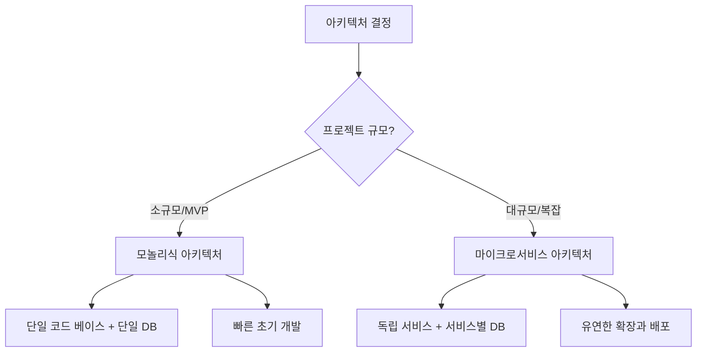
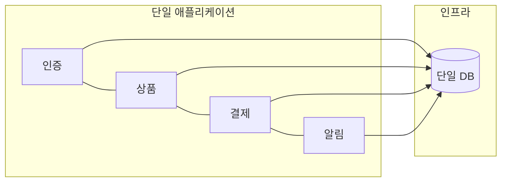
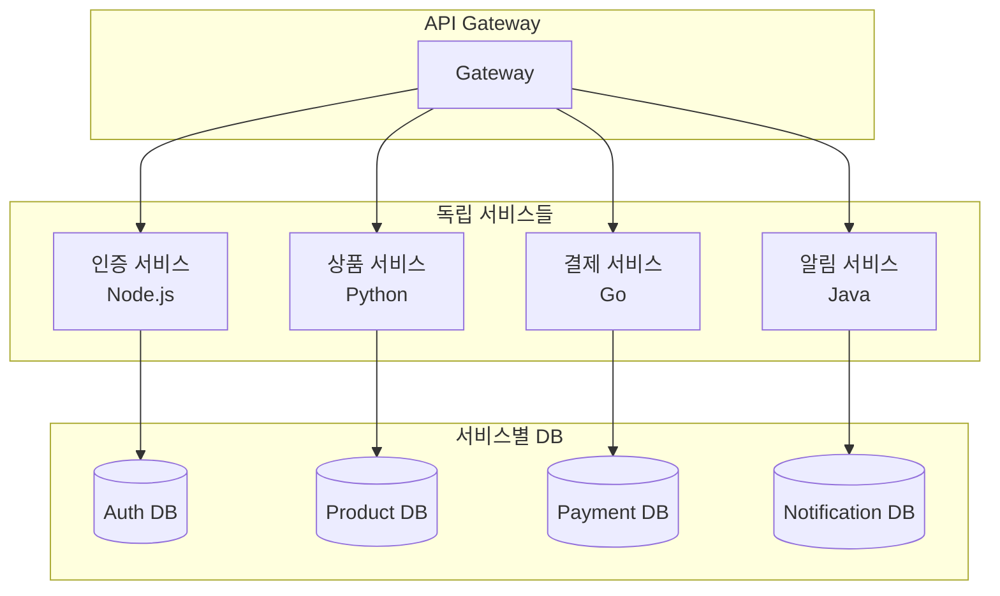

## 개요

소프트웨어 아키텍처 선택은 프로젝트의 성패를 좌우하는 핵심 결정이다. 모놀리식 아키텍처(MA)와 마이크로서비스 아키텍처(MSA)는 각각의 장단점이 뚜렷하며, "어느 쪽이 더 좋다"가 아니라 **"지금 상황에 무엇이 맞는가"**가 올바른 질문이다.

## 모놀리식 아키텍처 (Monolithic Architecture)

모놀리식 아키텍처는 모든 비즈니스 로직이 **하나의 통합된 코드 베이스**에 존재하는 전통적인 구조다. 단일 애플리케이션 안에 인증, 결제, 알림 등 모든 기능이 포함되어 있다.

### 장점

| 장점 | 설명 |
|------|------|
| **빠른 개발** | 코드베이스가 단순하고 통합이 쉬워 초기 개발 속도가 빠르다 |
| **간단한 유지보수** | 단일 코드 베이스에서 변경 사항 적용이 쉽다 |
| **낮은 인프라 비용** | 단일 애플리케이션으로 운영하므로 인프라 복잡성이 낮다 |
| **쉬운 디버깅** | 모든 코드가 한 곳에 있어 문제 추적이 용이하다 |
| **네트워크 지연 없음** | 서비스 간 통신이 함수 호출이므로 네트워크 오버헤드가 없다 |
| **기술 스택 통일** | 팀 전체가 같은 기술을 사용하므로 온보딩이 쉽다 |

### 단점

| 단점 | 설명 |
|------|------|
| **부분 확장 불가** | 특정 기능만 확장할 수 없고 전체를 확장해야 한다 |
| **전체 재배포 필요** | 작은 변경도 전체 앱을 다시 배포해야 한다 |
| **기술 스택 제한** | 새로운 기술 도입이 어렵다 |
| **복잡성 증가** | 프로젝트 성장 시 코드베이스가 방대해진다 |
| **팀 간 충돌** | 같은 코드에서 작업하므로 병합 충돌이 빈번하다 |

**적합한 경우**: 소규모 프로젝트, 빠른 MVP 개발, 복잡한 비즈니스 로직이 불필요할 때, 변경이 적은 시스템

> 모놀리식 아키텍처의 장점은 주로 소규모 프로젝트에서 부각되며, 프로젝트 규모가 커질수록 이 장점들이 오히려 단점으로 전환된다.

## 마이크로서비스 아키텍처 (Microservices Architecture)

마이크로서비스 아키텍처는 애플리케이션을 **여러 작고 독립적인 서비스**로 분리하는 구조다. 각 서비스는 특정 비즈니스 기능을 담당하고, API를 통해 통신한다. 대규모 개발팀의 조직 구조에 맞게 설계된 아키텍처다.

### 장점

- **독립적 배포**: 각 서비스를 개별적으로 개발, 테스트, 배포 가능
- **기술 다양성**: 서비스별로 최적의 기술 스택 선택 가능
- **선택적 확장**: 수요가 높은 서비스만 독립적으로 스케일링 — 예를 들어 뉴스 서비스 사용자가 1명이고 웹툰 서비스 사용자가 1억 명일 때 웹툰 서비스만 확장 가능
- **장애 격리**: 한 서비스의 장애가 전체 시스템에 영향을 미치지 않음
- **쉬운 유지보수**: 특정 서비스 변경이 다른 서비스에 미치는 영향이 적음

### 단점

- **운영 복잡성**: 서비스 디스커버리, 로깅, 분산 추적 관리 필요
- **데이터 일관성**: 분산 트랜잭션 처리가 어려움
- **테스트 어려움**: 통합 테스트와 E2E 테스트의 복잡도 증가
- **시스템 전반 복잡성**: 전체 시스템을 이해하는 데 추가적인 노력 필요
- **전환 비용**: 기존 모놀리식에서 MSA로의 전환에 상당한 비용과 시간 소요
- **네트워크 지연**: 서비스 간 통신으로 인한 지연 발생

**적합한 경우**: 대규모 및 복잡한 시스템, 독립적인 개발 팀 존재, 유연한 확장 필요

## 핵심 비교 정리

| 항목 | 모놀리식 | 마이크로서비스 |
|------|----------|----------------|
| **구조** | 단일 코드 베이스, 기능 간 강한 의존 | 독립 서비스 + API 통신, 분산 시스템 |
| **배포** | 전체 재배포 | 서비스별 독립 배포 |
| **기술 스택** | 전체 통일 | 서비스별 자유 선택 |
| **확장** | 전체 확장만 가능 | 서비스별 선택적 확장 |
| **지연 시간** | 없음 (내부 함수 호출) | 네트워크 통신 지연 존재 |
| **디버깅** | 단일 코드에서 추적 용이 | 분산 추적 도구 필요 |
| **팀 구조** | 소규모 팀에 적합 | 독립 팀 조직에 적합 |

## 빠른 링크

- [모놀리식 vs MSA 비교 (Korean)](https://memodayoungee.tistory.com/155) — 장단점 상세 정리
- [Martin Fowler: Microservices](https://martinfowler.com/articles/microservices.html) — MSA 개념 정의의 원조

## 인사이트

아키텍처 선택에서 가장 흔한 실수는 "MSA가 최신이니까 무조건 MSA"라는 생각이다. 소규모 프로젝트에서 MSA를 적용하면 서비스 간 통신, 분산 트랜잭션, 로깅 등 불필요한 복잡성만 늘어난다. 반대로, 사용자가 급증하는 대규모 시스템에서 모놀리식을 고수하면 특정 기능만 확장할 수 없어 전체 인프라를 키워야 하는 비효율이 발생한다. 핵심은 **"지금 우리 팀의 규모와 프로젝트의 복잡도에 맞는 선택"**이며, 많은 성공적인 프로젝트가 모놀리식으로 시작해서 필요 시점에 MSA로 전환하는 점진적 접근을 택한다.
