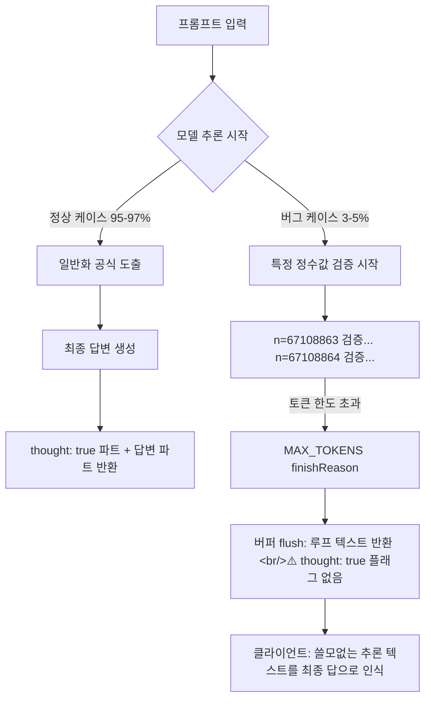

## 개요

`gemini-3-flash-preview`를 프로덕션에서 사용 중이라면 지금 당장 방어 코드를 추가해야 할 버그가 보고됐다. 동시 요청 100개 이상을 보낼 때 3~5%의 확률로 모델이 무한 추론 루프에 빠져 maxOutputTokens를 전부 소진하고, 내부 추론 과정을 최종 응답으로 반환하는 두 가지 장애가 동시에 발생한다. 이전 포스트에서 Gemini 3의 Thought Signatures와 `thinking_level` 파라미터를 정리했는데, 이 버그는 정확히 그 Thinking 메커니즘의 stop condition 오류다.

> 이전 포스트 참고: Gemini 3 이미지 생성 API, Thought Signatures, `thinking_level`, `media_resolution` 파라미터 → [2026-02-20 포스트](https://ice-ice-bear.github.io/posts/2026-02-20-tech-log/)

## 버그 상세: 무슨 일이 벌어지는가

### 트리거 조건

비트 연산, 수학적 검증, 논리 퍼즐 등 **단계적 증명이 필요한 문제**에서 발생한다. 예시 프롬프트: "Bitwise Toggle algorithm" 같은 유형.

모델이 정답을 바로 도출하지 않고 특정 정수값에 대해 검증을 시작하면 수렴하지 않는다:

```
n = 67108863 검증... 맞음
n = 67108864 검증... 맞음
n = 134217727 검증... 맞음
n = 134217728 검증... (계속)
```

2배씩 증가하는 값을 순차적으로 검증하는 루프가 끝없이 이어지다 토큰 한도에 걸린다.

### API 응답의 두 가지 동시 실패

```json
{
  "response": {
    "usageMetadata": {
      "totalTokenCount": 16233,
      "thoughtsTokenCount": 15356,   // ← 전체 토큰의 94.6%가 내부 추론에 소진됨
      "candidatesTokenCount": 640
    },
    "candidates": [{
      "content": {
        "parts": [
          {
            "text": "**Algorithm for Bitwise Toggle**\n\nOkay, here's my line of thinking...",
            "thought": true     // ← 정상적인 내부 추론 (숨겨져야 함)
          },
          {
            // ⚠️ BUG: 내부 추론 루프인데 thought: true 플래그가 없음
            "text": "Wait, let's check n = 67108863... Correct. Wait, let's check n = 67108864...",
            "thoughtSignature": "....."
            // thought: true 빠짐 → 파서가 최종 응답으로 처리
          }
        ]
      },
      "finishReason": "MAX_TOKENS"   // ← 정상 종료가 아닌 토큰 강제 종료
    }]
  }
}
```

**실패 1 — 토큰 소진**: 16,233 토큰 중 15,356개(94.6%)가 `thoughtsTokenCount`에 잡힌다. 실제 응답에 사용 가능한 토큰은 640개뿐이고, 제대로 된 답은 생성되지 않는다.

**실패 2 — 내부 로직 노출**: `finishReason: MAX_TOKENS`로 강제 종료될 때 현재 버퍼의 내용이 flush된다. 문제는 이 루프 텍스트 파트에 `"thought": true` 플래그가 없다는 것이다. SDK 파서가 이걸 최종 사용자 응답으로 처리해 반환한다.



## 영향 범위

- **모델**: `gemini-3-flash-preview` (확인됨)
- **재현률**: 100개 이상 동시 요청 시 3~5%
- **토큰 설정**: `maxOutputTokens` 16k, 32k 모두 동일하게 발생
- **실행 모드**: Batch mode와 일반 API 호출 모두 영향

## 현재 가능한 방어 코드

공식 수정 전까지 클라이언트 측에서 방어할 수 있는 방법:

### 1. finishReason 체크

```python
response = model.generate_content(prompt)

for candidate in response.candidates:
    if candidate.finish_reason == "MAX_TOKENS":
        # 유효하지 않은 응답 — 재시도 또는 에러 처리
        raise ValueError("Response was truncated due to token limit")
```

### 2. thoughtsTokenCount 비율 체크

```python
usage = response.usage_metadata
thoughts_ratio = usage.thoughts_token_count / usage.total_token_count

if thoughts_ratio > 0.9:
    # 추론에 토큰의 90% 이상 사용 → 무한 루프 가능성
    logger.warning(f"Possible reasoning loop detected: {thoughts_ratio:.1%} tokens in thoughts")
    raise ValueError("Model entered a reasoning loop")
```

### 3. thought 플래그 검사

```python
for part in response.candidates[0].content.parts:
    # thought: true가 없고 thoughtSignature가 있는 파트는 의심
    if hasattr(part, 'thought_signature') and not getattr(part, 'thought', False):
        logger.error("Leaked reasoning detected in response parts")
        # 이 파트를 응답에서 제거하거나 전체를 재시도
```

### 4. thinking_level 조정

이전 포스트에서 정리한 `thinking_level` 파라미터를 `"low"` 또는 `"medium"`으로 내리면 발생 빈도를 줄일 수 있다. 단, 추론 품질도 같이 낮아진다:

```python
generation_config = {
    "thinking_config": {
        "thinking_budget": 4096,  # thinking_level 대신 토큰 예산 직접 제한
    }
}
```

## 왜 Flash Preview인가?

Gemini 3 Flash는 속도와 비용 효율을 위해 추론 과정을 경량화했다. Pro 모델에 비해 수렴 조건(stop condition)의 안전망이 약한 것으로 보인다. 비트 연산이나 수학적 증명처럼 "모든 케이스를 검증해야 안심"하는 문제 유형에서 취약점이 드러난다.

**실용적 권고**: 프로덕션에서 `gemini-3-flash-preview`를 쓴다면:
- 로직/수학 문제는 가능하면 `gemini-3-pro-preview`로 라우팅
- Flash를 쓸 때는 `finishReason + thoughtsTokenCount` 방어 코드 필수
- 대량 배치 처리 시 응답 검증 레이어 추가

## 빠른 링크

- [Google AI Developers Forum — 버그 리포트 원문](https://discuss.ai.google.dev/t/gemini-3-flash-preview-infinite-reasoning-loop-causing-max-token-exhaustion-raw-logic-leak/114528)
- [Gemini 3 Developer Guide — thinking_level 파라미터](https://ai.google.dev/gemini-api/docs/gemini-3)

## 인사이트

이 버그는 "추론 능력이 강해질수록 새로운 종류의 장애가 생긴다"는 것을 보여준다. Gemini 3 이전의 모델은 그냥 틀린 답을 내놨지만, Thinking 모델은 "정답을 찾아야 한다"는 드라이브가 강해서 수렴하지 않으면 무한 루프에 빠진다. 추론 모델을 프로덕션에 도입할 때는 `maxOutputTokens`를 낮추는 것보다 **응답 유효성 검증 레이어**를 별도로 두는 게 더 안전하다. `finishReason: MAX_TOKENS`인 응답은 항상 의심하자.
