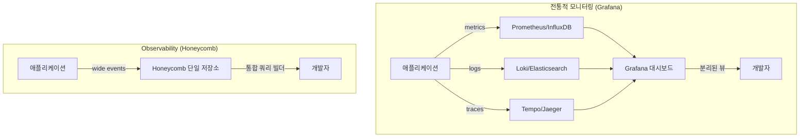
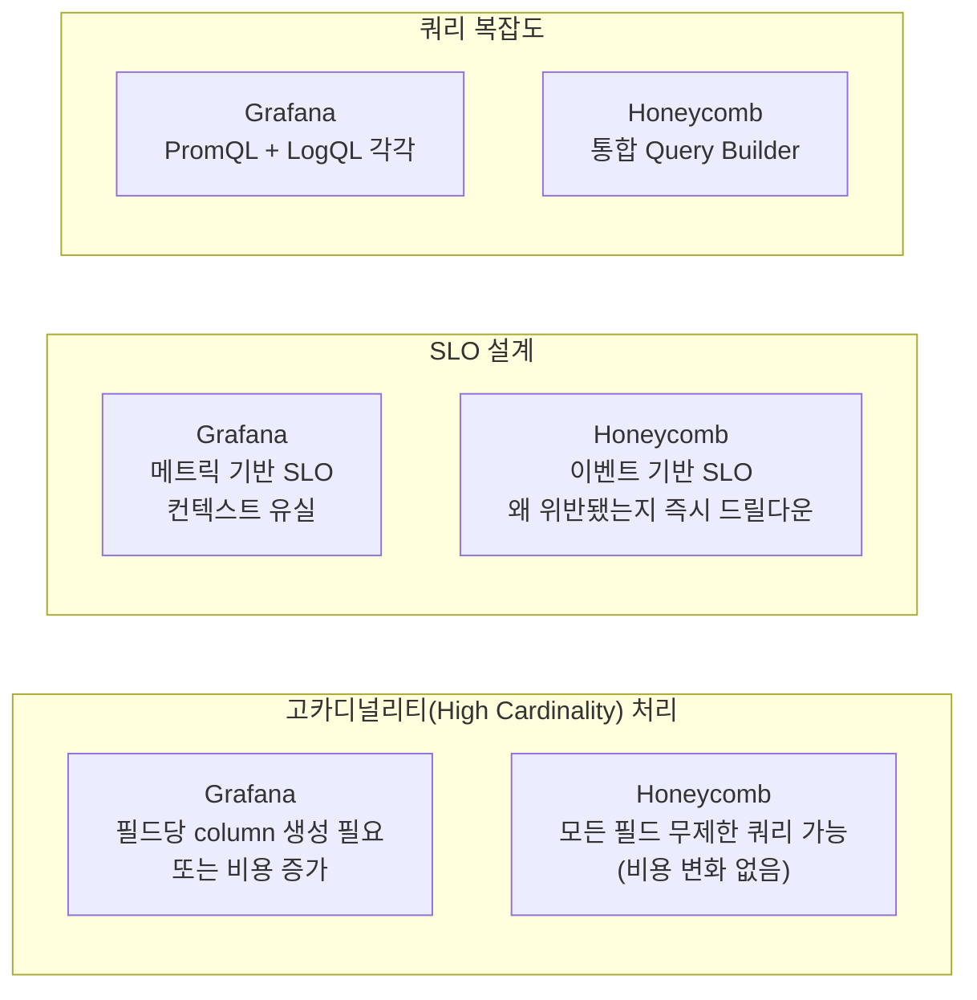
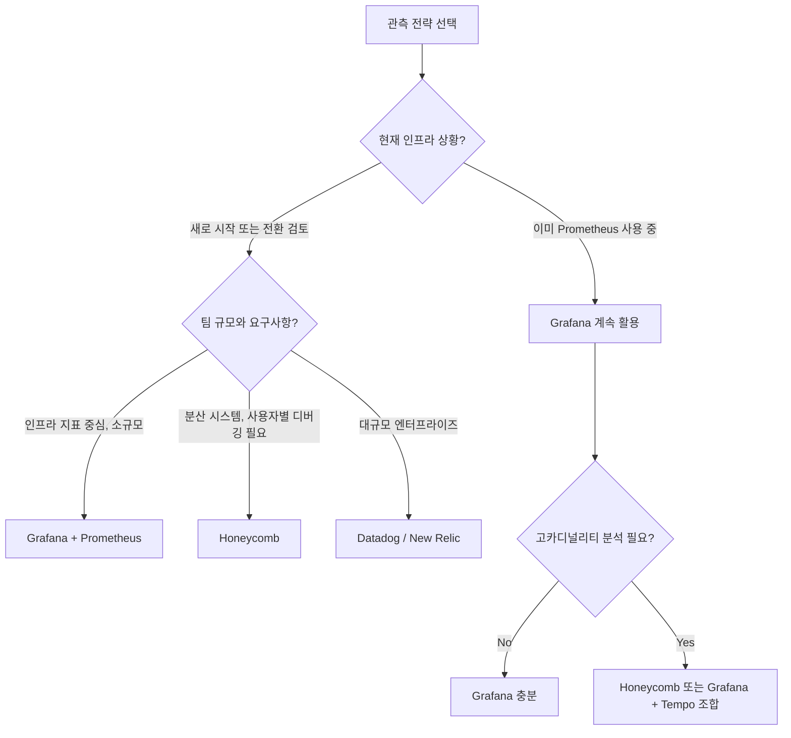

## 개요

DevOps 엔지니어 포지션을 탐색하면서 한국 APM 시장 리더인 와탭랩스(WhaTap Labs) 채용 공고를 보게 됐고, 자연스럽게 Observability 툴 생태계를 깊이 파보게 됐다. Honeycomb vs Grafana 비교를 보면 단순한 "어느 툴이 더 좋냐"를 넘어서 **모니터링(Monitoring)과 관측 가능성(Observability)이라는 두 가지 패러다임의 차이**가 드러난다. 오늘은 그 차이를 데이터 모델, 쿼리 방식, SLO 설계 측면에서 정리한다.



## 패러다임의 차이: 데이터 모델이 전부다

### 모니터링 (Grafana 방식)

전통적 모니터링은 **미리 정의된 질문**에 답하기 위해 설계됐다. 알고 싶은 지표를 미리 정해서 시계열 데이터로 집계한다.

- **Metrics**: CPU 사용률, 응답시간 P99, 에러율 — 숫자로 집계된 시계열
- **Logs**: 개별 이벤트 텍스트 — Loki나 Elasticsearch에 별도 저장
- **Traces**: 분산 요청 추적 — Tempo나 Jaeger에 별도 저장

각 신호(signal)가 **다른 저장소에 분리**되어 있다. "에러가 났는데 어느 사용자에서 발생했고 어느 서버였는지"를 파악하려면 세 개의 탭을 오가며 시간 범위를 맞춰 수동으로 연관 분석을 해야 한다.

Grafana의 강점은 **가시화 유연성**이다. 어떤 데이터 소스든 연결해서 대시보드를 만들 수 있다. 이미 Prometheus, MySQL, CloudWatch 등을 쓰고 있다면 Grafana는 통합 뷰어 역할을 한다.

### Observability (Honeycomb 방식)

Observability의 핵심 개념은 **Wide Events**다. 요청 하나가 처리될 때 관련된 모든 컨텍스트를 하나의 이벤트로 기록한다:

```json
{
  "timestamp": "2026-02-25T10:30:00Z",
  "service": "payment-api",
  "user_id": "u_12345",
  "tenant_id": "enterprise_co",
  "request_path": "/api/charge",
  "duration_ms": 2340,
  "db_query_count": 12,
  "cache_hit": false,
  "region": "ap-northeast-2",
  "k8s_pod": "payment-6c8b7d9-xk2p4",
  "feature_flag": "new_checkout_flow",
  "error": null
}
```

이 이벤트 하나에 메트릭(`duration_ms`), 로그 컨텍스트(`error`), 트레이스 컨텍스트(`k8s_pod`, `region`)가 모두 담겨 있다. Honeycomb은 이걸 **단일 저장소에서 단일 쿼리 빌더로** 분석한다.

## 핵심 기능 비교



### High Cardinality 문제

카디널리티(Cardinality)는 특정 필드가 가질 수 있는 고유값의 수다. `user_id`는 수백만 개의 값을 가질 수 있는 고카디널리티 필드다.

- **Grafana (Prometheus)**: 각 고유값마다 시계열 하나가 생성된다. `user_id` 기준으로 집계하면 수백만 개의 시계열이 생겨 저장소가 폭발한다. 이를 피하려면 미리 집계하거나 인덱싱 전략을 세워야 한다. "특정 사용자의 느린 요청 패턴"을 사후에 분석하기 어렵다.

- **Honeycomb**: Wide Events에 `user_id`를 그냥 넣으면 된다. 이벤트 기반 저장이라 카디널리티 제약이 없다. 문제가 발생한 후에도 `user_id = "u_12345"`로 필터링해서 해당 사용자의 모든 이벤트를 즉시 조회할 수 있다.

### SLO 비교

SLO(Service Level Objective)를 잘못 설계하면 알람은 울리는데 무엇을 고쳐야 하는지 모르는 상황이 발생한다.

| 기준 | Grafana | Honeycomb |
|---|---|---|
| 데이터 소스 | 집계된 메트릭 | 원시 이벤트 |
| 위반 컨텍스트 | 없음 (숫자만) | 위반된 이벤트 바로 드릴다운 |
| 알람 정확도 | False positive 가능 | 이벤트 기반이라 높은 정밀도 |
| "왜 위반됐나?" | 수동으로 로그/트레이스 교차 분석 | 같은 UI에서 즉시 분석 |

예: P99 응답시간 SLO 위반 시
- Grafana: 알람 → 메트릭 대시보드 → Loki에서 로그 검색 → Tempo에서 트레이스 분석 (3개 탭)
- Honeycomb: 알람 → SLO 위반 이벤트 목록 → `feature_flag = "new_checkout_flow"` 패턴 발견 (1개 UI)

### 가격 모델

| 항목 | Grafana Cloud | Honeycomb |
|---|---|---|
| 기본 단위 | 바이트 + 시계열 수 + 사용자 수 | 이벤트 수 |
| 고카디널리티 | 추가 비용 | 포함 |
| 쿼리 비용 | 일정량 초과시 추가 | 포함 |
| 예측 가능성 | 낮음 (다변수) | 높음 (이벤트 단위) |

Grafana가 더 저렴한 경우: 이미 Prometheus를 쓰고 있고, 메트릭 수가 적고, 추가 분석이 필요 없을 때.

Honeycomb이 더 저렴한 경우: 고카디널리티 분석이 필요하거나, 여러 신호(metrics/logs/traces) 통합에 엔지니어링 비용이 드는 경우.

## 언제 무엇을 선택할까?



**Grafana가 적합한 경우:**
- 이미 Prometheus/Loki 스택을 운영 중
- 인프라 메트릭 대시보드가 주된 용도
- 비용 민감도가 높고 트래픽이 예측 가능
- 오픈소스 셀프호스팅 요건

**Honeycomb이 적합한 경우:**
- 마이크로서비스/분산 시스템에서 "어느 요청이 왜 느린지" 빠르게 파악해야 할 때
- 고카디널리티 속성(user_id, tenant_id, feature_flag)으로 분석하는 케이스가 많을 때
- SRE 팀이 DORA 메트릭 / SLO 관리에 집중하는 조직

## 한국 시장 맥락: 와탭랩스와 APM

오늘 채용 공고를 보면서 흥미로운 점을 발견했다 — WhaTap Labs는 한국 자체 개발 APM(Application Performance Monitoring) 도구를 제공하는 회사다. Honeycomb/Datadog 같은 글로벌 툴의 한국형 대안으로 포지셔닝하며 에이전트 기반 자동 계측, 한국어 지원, 온프레미스 배포 옵션을 강점으로 한다.

DevOps/Observability 엔지니어를 채용 중인 한국 회사들(코인원, 야놀자 등)이 Grafana + 내부 도구 조합을 쓰는 경우가 많은데, Honeycomb 같은 "개발자 중심 observability" 패러다임으로의 전환이 글로벌에서는 가속화되고 있다. 이 공간의 전문성이 커리어 관점에서도 흥미롭다.

## 빠른 링크

- [Honeycomb vs Grafana — Honeycomb 공식 비교](https://www.honeycomb.io/why-honeycomb/comparisons/grafana)
- [Gartner Peer Insights — Grafana vs Honeycomb](https://www.gartner.com/reviews/market/observability-platforms/compare/grafana-labs-vs-honeycomb)
- [WhaTap Labs DevOps 채용](https://www.wanted.co.kr/wd/40159)

## 인사이트

모니터링과 Observability의 차이는 "질문을 미리 알고 있느냐 아니냐"에 있다. 전통적 모니터링은 미리 정의한 지표가 임계값을 넘으면 알린다 — 알고 있는 장애에 강하다. Observability는 "왜 이 사용자의 요청이 느린가"처럼 **사전에 정의하지 않은 질문을 사후에 탐색**할 수 있게 한다. 시스템이 복잡해질수록, 그리고 알 수 없는 미지의 장애가 많아질수록 Observability 패러다임의 가치가 커진다. Grafana를 이미 쓰고 있다면 Loki + Tempo + Grafana를 조합해 Observability를 흉내낼 수 있지만, 데이터가 분리된 이상 쿼리 UX의 한계는 피할 수 없다.
