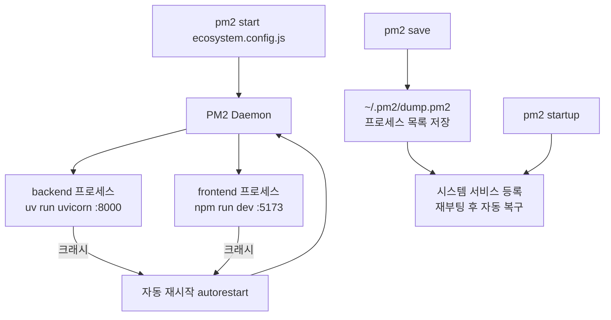
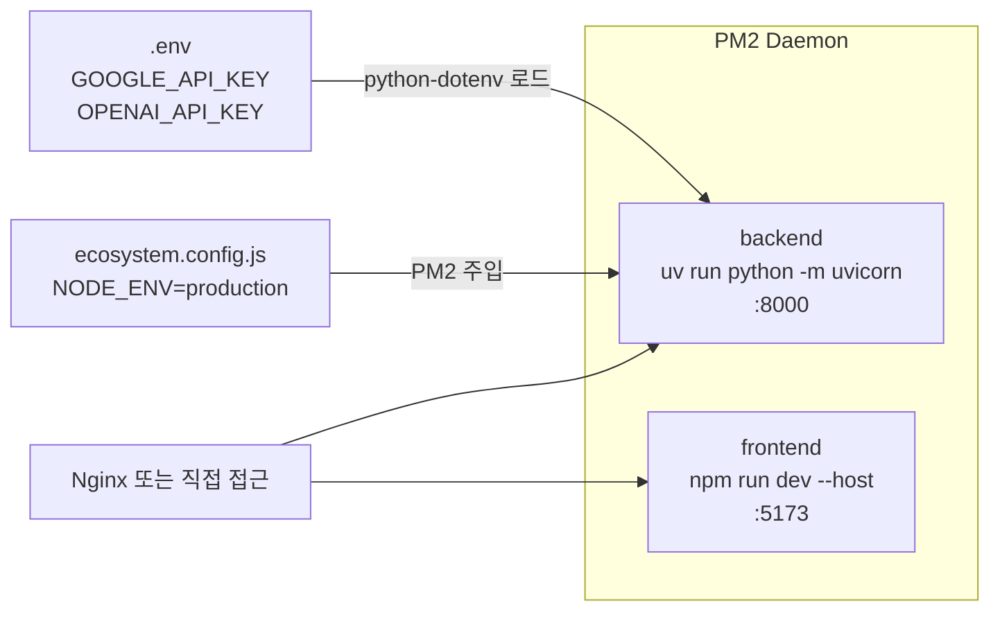

## 개요

EC2에서 FastAPI 백엔드와 Vite 프론트엔드를 동시에 운영해야 할 때, `nohup python ... &` 같은 방법은 프로세스가 죽어도 모르고, 재부팅하면 날아가고, 로그 관리도 어렵다. PM2(Process Manager 2)는 Node.js 생태계에서 나왔지만 **어떤 언어로 만든 프로세스도 관리할 수 있는 프로덕션 프로세스 매니저**다. 오늘은 PM2 기본 명령어부터, Python(uvicorn) + Node.js(Vite)를 `ecosystem.config.js` 하나로 관리하는 실전 패턴, 그리고 dotenv 문제 해결까지 정리한다.



## PM2 기본 명령어 치트시트

```bash
# 설치 (전역)
npm install pm2 -g

# 단일 프로세스 시작
pm2 start app.js
pm2 start server.py --interpreter python3  # Python

# 프로세스 목록 조회
pm2 list

# 상세 정보
pm2 show <name>

# 로그 실시간 확인
pm2 logs            # 전체
pm2 logs backend    # 특정 프로세스만
pm2 logs --lines 200  # 최근 200줄

# 재시작 / 정지 / 삭제
pm2 restart <name>
pm2 stop <name>
pm2 delete <name>   # 목록에서 완전 제거

# 리소스 모니터 (CPU/메모리 실시간)
pm2 monit

# 현재 프로세스 목록 저장 → 재부팅 시 복구
pm2 save
```

`pm2 stop`과 `pm2 delete`의 차이: `stop`은 목록에 남아있고 `delete`는 목록 자체에서 제거한다. 다시 쓸 프로세스라면 `stop`, 완전히 치우려면 `delete`.

## ecosystem.config.js — 여러 프로세스를 하나로

`pm2 start app.js --name backend --watch --max-memory-restart 1G ...` 처럼 플래그가 늘어나면 관리가 힘들다. `ecosystem.config.js`로 모든 설정을 코드로 관리하자.

```bash
# 자동 생성 (예시 파일 만들어줌)
pm2 ecosystem
```

생성된 파일을 프로젝트에 맞게 수정한다:

```javascript
module.exports = {
  apps: [
    {
      name: 'my-api',
      script: 'server.js',
      instances: 1,
      autorestart: true,   // 크래시 시 자동 재시작
      watch: false,        // 파일 변경 감지 재시작 (dev 환경에서만 true)
      max_memory_restart: '1G',
      env: {               // 기본 환경 변수
        NODE_ENV: 'development',
        PORT: 3000
      },
      env_production: {    // --env production 시 적용
        NODE_ENV: 'production',
        PORT: 8080
      }
    }
  ]
};
```

환경별로 다른 변수를 쓰려면 `env_<이름>` 키를 추가하고 시작 시 `--env` 플래그로 선택한다:

```bash
pm2 start ecosystem.config.js              # env 적용
pm2 start ecosystem.config.js --env production  # env_production 적용
```

## dotenv(.env)와 PM2의 충돌 문제

**PM2를 쓸 때 가장 흔히 겪는 문제**: 로컬에서 `node server.js`로 실행하면 잘 되는데 PM2로 돌리면 환경 변수가 없다고 에러가 난다.

원인은 단순하다. `dotenv`는 프로세스가 시작될 때 `.env` 파일을 읽어 `process.env`에 주입한다. 그런데 PM2는 독립적인 데몬(백그라운드 서비스)으로 동작하기 때문에 **현재 쉘의 환경 변수가 자동으로 상속되지 않는다**.

해결책 두 가지:

**방법 1 — ecosystem.config.js에 직접 선언 (권장)**

```javascript
env: {
  NODE_ENV: 'production',
  DATABASE_URL: 'postgresql://...',
  API_KEY: 'your-key-here'
}
```

단점: `ecosystem.config.js`가 git에 올라가면 시크릿이 노출된다. `.gitignore`에 추가하거나, 시크릿만 별도 파일로 분리해서 `require('./secrets')`로 불러오는 방식을 쓴다.

**방법 2 — 애플리케이션 코드에서 dotenv 직접 로드**

Python이라면 `python-dotenv`가 앱 실행 시 직접 `.env`를 읽으므로 PM2 환경과 무관하게 작동한다:

```python
# main.py
from dotenv import load_dotenv
load_dotenv()  # 이 코드가 있으면 PM2 하에서도 .env 로드됨
```

Node.js도 마찬가지:
```javascript
require('dotenv').config();  // 코드 첫 줄에 있으면 PM2 무관하게 작동
```

## Non-Node.js 프로세스 실행 — interpreter: "none"

PM2는 기본적으로 `.js` 파일을 Node.js로 실행하려 한다. Python, Go, 쉘 스크립트 등 다른 런타임의 프로세스를 실행하려면 두 가지 방법이 있다:

**방법 1 — interpreter 명시**

```javascript
{
  name: 'flask-api',
  script: 'app.py',
  interpreter: 'python3'
}
```

**방법 2 — interpreter: "none" + script에 실행파일 직접 지정 (권장)**

```javascript
{
  name: 'backend',
  script: 'uvicorn',        // 또는 절대경로: '/usr/local/bin/uvicorn'
  args: 'main:app --host 0.0.0.0 --port 8000',
  interpreter: 'none'       // Node.js 래핑 없이 바이너리 직접 실행
}
```

`interpreter: "none"`이 더 유연하다. `uv`, `gunicorn`, `go`, 쉘 스크립트 등 어떤 실행파일이든 `script`에 넣고 `args`로 인자를 넘길 수 있다.

## 실전: Hybrid Image Search Demo 설정

실제로 운영 중인 프로젝트(`hybrid-image-search-demo`)의 `ecosystem.config.js`다. FastAPI 백엔드(Python + uv)와 Vite 프론트엔드(Node.js)를 함께 관리한다:

```javascript
module.exports = {
  apps: [
    {
      name: "backend",
      cwd: "./",              // 리포 루트에서 실행 — Python 모듈 경로 해결에 중요
      script: "uv",           // uv (Python 패키지 매니저)를 직접 실행
      args: "run python -m uvicorn backend.src.main:app --host 0.0.0.0 --port 8000",
      interpreter: "none",    // uv는 Node.js가 아니므로 반드시 설정
      env: {
        NODE_ENV: "production",
        // GOOGLE_API_KEY, OPENAI_API_KEY는 .env에서 python-dotenv가 로드
      }
    },
    {
      name: "frontend",
      cwd: "./frontend",      // npm 명령은 package.json이 있는 폴더에서 실행
      script: "npm",
      args: "run dev -- --host",  // '--host'는 Vite가 0.0.0.0 바인딩하도록 (외부 접근 허용)
      interpreter: "none",
    }
  ]
};
```

이 설정의 핵심 포인트:

1. **`cwd: "./"`** — 백엔드는 리포 루트에서 실행해야 `backend.src.main`처럼 점 표기 모듈 경로가 작동한다. `cwd`를 생략하거나 `./backend`로 설정하면 `ModuleNotFoundError`가 난다.

2. **`args: "run dev -- --host"`** — npm 스크립트에 추가 인자를 넘길 때 `--`로 구분한다. `--host`는 npm이 아닌 Vite에 전달된다.

3. **시크릿은 `.env` + python-dotenv** — `GOOGLE_API_KEY`와 `OPENAI_API_KEY`는 ecosystem 파일에 없다. FastAPI 앱이 시작될 때 `.env` 파일을 직접 읽어 처리한다.



## 서버 재부팅 후 자동 복구

PM2 프로세스 목록은 서버를 재시작하면 사라진다. 두 단계로 영구 등록한다:

```bash
# 1단계: 현재 실행 중인 프로세스 목록 저장
pm2 save
# → ~/.pm2/dump.pm2 파일에 기록됨

# 2단계: 시스템 서비스에 PM2 등록 (재부팅 시 자동 시작)
pm2 startup
# 이 명령을 실행하면 시스템에 맞는 명령어를 출력해준다:
# [PM2] To setup the Startup Script, copy/paste the following command:
# sudo env PATH=$PATH:/usr/bin /usr/lib/node_modules/pm2/bin/pm2 startup systemd -u ubuntu --hp /home/ubuntu

# 출력된 sudo 명령을 그대로 실행
sudo env PATH=$PATH:/usr/bin ...
```

`pm2 startup`은 시스템 init 방식(systemd, SysV 등)을 자동 감지한다. AWS EC2 Ubuntu 기준으로는 systemd 서비스 파일을 생성한다.

## 주의: 폴더 경로 고정 문제

PM2는 한 번 등록된 서비스명(예: `main`)에 스크립트 경로를 고정해서 기억한다. `/home/project1/server.js`로 시작한 `main` 서비스는 이후 `/home/project2/`에서 같은 이름으로 시작해도 여전히 `/home/project1/server.js`를 실행한다.

```bash
# 현재 연결된 경로 확인
pm2 show main  # script path 항목 확인

# 해결: 기존 서비스 완전 삭제 후 재등록
pm2 delete main
cd /home/project2/
pm2 start server.js --name main
```

`ecosystem.config.js`를 쓰면 이 문제가 자연스럽게 해결된다 — `cwd`와 `script`를 명시적으로 선언하기 때문이다.

## 빠른 참고 — 자주 쓰는 패턴

```bash
# ecosystem으로 시작/재시작/정지
pm2 start ecosystem.config.js
pm2 restart ecosystem.config.js
pm2 stop ecosystem.config.js

# 특정 앱만
pm2 restart backend
pm2 logs frontend --lines 100

# 상태 한눈에 보기
pm2 list

# 전체 클린 재시작
pm2 delete all && pm2 start ecosystem.config.js && pm2 save
```

## 빠른 링크

- [PM2 공식 문서 — ecosystem.config.js](https://pm2.keymetrics.io/docs/usage/application-declaration/)
- [PM2 ecosystem.config.js 환경 변수 설정 (한국어)](https://bloodstrawberry.tistory.com/1333)
- [PM2 백그라운드 실행/중지/재시작 (한국어)](https://itadventure.tistory.com/432)

## 인사이트

PM2를 처음 쓸 때 가장 헷갈리는 지점은 "Node.js 도구인데 왜 Python에서도 쓰나?"다. `interpreter: "none"`으로 설정하면 PM2는 단순히 **프로세스 감시자**가 된다 — 언어와 무관하게 어떤 프로세스든 크래시를 감지하고 재시작한다. 실제로 이 프로젝트처럼 Python 백엔드와 Node.js 프론트엔드를 동시에 운영할 때, PM2 하나로 두 프로세스의 로그를 `pm2 logs`로 통합 확인할 수 있다는 것이 운영 편의성에서 큰 차이를 만든다. `.env`와 PM2의 충돌은 "프로세스 실행 컨텍스트"의 차이에서 오는데, 이를 이해하면 비슷한 문제(Docker 컨테이너에서 환경 변수가 안 보일 때 등)도 같은 원리로 해결할 수 있다.
