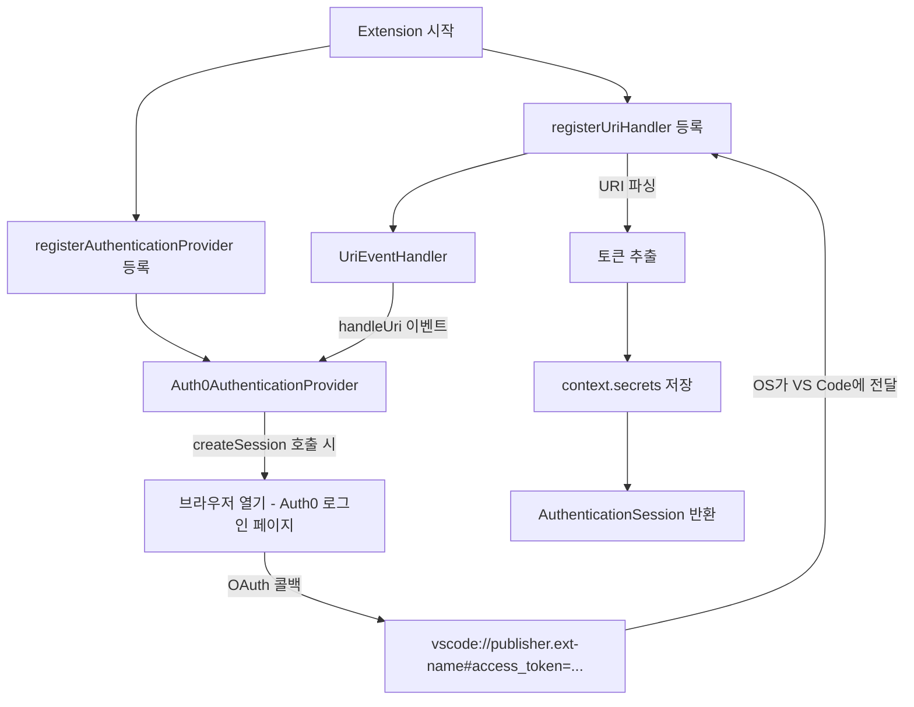
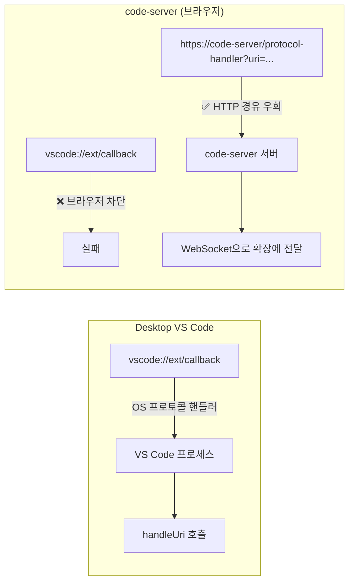

## 개요

VS Code 확장에서 외부 OAuth 서비스(GitHub, Auth0 등)로 로그인하려면 브라우저를 열고 콜백을 받아야 한다. 일반 웹앱은 `http://localhost:3000/callback` 같은 로컬 서버가 콜백 URI지만, VS Code 확장은 로컬 포트 없이 `vscode://publisher.extension-name` 프로토콜로 직접 콜백을 받을 수 있다. 오늘은 `registerUriHandler`와 `AuthenticationProvider` API를 조합해 OAuth 흐름을 구현하는 방법, code-server(브라우저 기반 VS Code)에서의 프로토콜 제약, 그리고 Remote Tunnels의 OAuth 메커니즘을 살펴본다.



## registerUriHandler — 외부 콜백의 진입점

`vscode.window.registerUriHandler()`는 OS 수준의 URI 핸들러를 등록해서 외부에서 `vscode://` 링크를 열면 확장이 해당 URI를 받도록 한다. VS Code가 여러 창이 열려 있으면 최상위 창이 처리한다.

구현은 단순하다. `UriHandler` 인터페이스를 구현하고 `EventEmitter`로 이벤트를 전파한다:

```typescript
class UriEventHandler extends EventEmitter<Uri> implements UriHandler {
  public handleUri(uri: Uri) {
    this.fire(uri);  // 구독자들에게 URI 전달
  }
}

// extension.ts의 activate() 안에서:
const uriHandler = new UriEventHandler();
context.subscriptions.push(
  vscode.window.registerUriHandler(uriHandler)
);
```

이 핸들러에 URI가 들어오는 URL 형식은:

```
vscode://<publisher>.<extension-name>[/path][?query=value][#fragment=value]
```

예: `vscode://mycompany.my-ext?code=abc123` 또는 `vscode://mycompany.my-ext#access_token=xyz`

중요한 구분이 있다. Auth0는 OAuth implicit flow에서 토큰을 **URI fragment(`#`)** 에 담아 보내고, Azure AD는 **query string(`?`)** 에 담는다. 코드에서 어느 쪽을 파싱하는지 OAuth 제공자에 따라 달라진다.

## AuthenticationProvider 인터페이스

VS Code 1.54부터 `authentication.registerAuthenticationProvider()`로 커스텀 인증 프로바이더를 등록할 수 있다. 이렇게 하면 VS Code의 Account 메뉴에 표시되고, 다른 확장이 `vscode.authentication.getSession()`으로 세션을 요청할 수 있다.

구현해야 할 인터페이스:

```typescript
export class Auth0AuthenticationProvider implements AuthenticationProvider, Disposable {
  private _sessionChangeEmitter = new EventEmitter<...>();

  // VS Code가 세션 변경을 구독하는 이벤트
  get onDidChangeSessions() {
    return this._sessionChangeEmitter.event;
  }

  // 저장된 세션 반환 (secrets store에서 읽기)
  async getSessions(scopes?: string[]): Promise<readonly AuthenticationSession[]> {
    const stored = await this.context.secrets.get(SESSIONS_KEY);
    return stored ? JSON.parse(stored) : [];
  }

  // 로그인 → 토큰 획득 → 세션 생성
  async createSession(scopes: string[]): Promise<AuthenticationSession> {
    const token = await this.login(scopes);
    const userinfo = await this.getUserInfo(token);
    const session: AuthenticationSession = {
      id: uuid(),
      accessToken: token,
      account: { label: userinfo.name, id: userinfo.email },
      scopes: []
    };
    await this.context.secrets.store(SESSIONS_KEY, JSON.stringify([session]));
    this._sessionChangeEmitter.fire({ added: [session], removed: [], changed: [] });
    return session;
  }

  // 로그아웃
  async removeSession(sessionId: string): Promise<void> {
    const sessions = JSON.parse(await this.context.secrets.get(SESSIONS_KEY) || '[]');
    const idx = sessions.findIndex((s: AuthenticationSession) => s.id === sessionId);
    const [removed] = sessions.splice(idx, 1);
    await this.context.secrets.store(SESSIONS_KEY, JSON.stringify(sessions));
    this._sessionChangeEmitter.fire({ added: [], removed: [removed], changed: [] });
  }
}
```

`context.secrets`는 VS Code의 내장 시크릿 스토어(macOS Keychain, Windows Credential Manager, Linux libsecret)에 암호화 저장한다. 토큰을 평문으로 `globalState`에 저장하면 안 되는 이유가 이것이다.

## OAuth 로그인 플로우 상세

`createSession`에서 호출하는 `login()` 메서드가 실제 OAuth 흐름의 핵심이다:

```typescript
private async login(scopes: string[]) {
  return await window.withProgress({ location: ProgressLocation.Notification, ... }, async () => {
    const stateId = uuid();  // CSRF 방지용 state 파라미터
    this._pendingStates.push(stateId);

    // OAuth 인가 URL 구성
    const params = new URLSearchParams({
      response_type: 'token',
      client_id: CLIENT_ID,
      redirect_uri: `vscode://${PUBLISHER}.${EXT_NAME}`,
      state: stateId,
      scope: scopes.join(' ')
    });
    await env.openExternal(Uri.parse(`https://auth0.com/authorize?${params}`));

    // URI 핸들러가 콜백을 받을 때까지 대기 (60초 타임아웃)
    return await Promise.race([
      promiseFromEvent(this._uriHandler.event, this.handleUri(scopes)).promise,
      new Promise((_, reject) => setTimeout(() => reject('Timeout'), 60000))
    ]);
  });
}

private handleUri = (scopes) => async (uri, resolve, reject) => {
  const fragment = new URLSearchParams(uri.fragment);  // Auth0는 fragment
  const token = fragment.get('access_token');
  const state = fragment.get('state');

  if (!this._pendingStates.includes(state)) {
    reject(new Error('Invalid state'));  // CSRF 방어
    return;
  }
  resolve(token);
};
```

`Promise.race()`를 쓰는 이유가 흥미롭다 — 정상 흐름(URI 콜백), 타임아웃(60초), 사용자 취소(Cancellation token) 세 가지 중 가장 먼저 도착하는 걸 처리한다.

## 사용 측 코드

등록된 프로바이더를 다른 확장이나 같은 확장 내에서 사용할 때:

```typescript
// 세션이 있으면 가져오고, 없으면 로그인 요청 (createIfNone: true)
const session = await vscode.authentication.getSession('auth0', ['openid', 'profile'], {
  createIfNone: true
});

if (session) {
  vscode.window.showInformationMessage(`환영합니다, ${session.account.label}!`);
  // session.accessToken으로 API 호출
}
```

## code-server에서의 프로토콜 제약

여기서 중요한 현실 제약이 있다. code-server는 브라우저에서 VS Code를 실행하는 오픈소스 프로젝트(★76k)인데, `vscode://` 프로토콜이 **브라우저에서는 작동하지 않는다**.

브라우저 보안 정책상 `navigator.registerProtocolHandler()`로 등록 가능한 스킴이 제한되어 있고, `vscode://`는 허용 목록에 없다. code-server 메인테이너 답변:

> "I do not think browsers allow handling vscode:// anyway, at best we could do `web+vscode://` or `web+code-server://`."

제안된 우회책:

```
https://code-server-url/protocol-handler?uri=vscode://my-plugin/path
```

code-server 자체가 `/protocol-handler` 라우트를 처리해서 연결된 클라이언트 확장에 URI를 전달하는 방식이다. 이 방법은 알림/확인 팝업이 없어서 UX가 더 깔끔하다는 장점도 있다.

PWA(Progressive Web App)로 설치된 경우엔 `manifest.json`의 `protocol_handlers`로 부분 해결도 가능하다 (`https://` 스킴 필수).



## Remote Tunnels의 OAuth 메커니즘

VS Code Remote Tunnels는 SSH 없이 원격 머신에 접속하는 기능이다. 내부적으로 GitHub OAuth를 사용해 터널 서비스를 인증한다:

1. `code tunnel` 명령 실행 → VS Code Server가 원격 머신에 설치됨
2. Microsoft Azure 기반 dev tunnels 서비스에 연결
3. `vscode.dev/tunnel/<machine_name>` URL 생성
4. 클라이언트가 이 URL 접속 시 `github.com/login/oauth/authorize...` 리다이렉트

터널 보안은 AES-256-CTR로 E2E 암호화되며, VS Code는 리슨 포트를 열지 않고 아웃바운드 연결만 한다. 방화벽 설정이 필요 없는 이유다.

## 실용 가이드: 어떤 방식을 선택할까?

| 상황 | 권장 방식 |
|---|---|
| Desktop VS Code + 외부 OAuth | `registerUriHandler` + `AuthenticationProvider` |
| code-server + OAuth | `/protocol-handler` 라우트 우회 또는 localhost 서버 |
| 사내 Remote 환경 접근 | Remote Tunnels (GitHub 계정만 있으면 됨) |
| 여러 GitHub 계정 관리 | GitShift 확장 (`mikeeeyy04.gitshift`) |

프로덕션 AuthenticationProvider를 만든다면 두 가지를 추가해야 한다:
- Refresh token만 저장하고 Access token은 매번 갱신 (보안)
- Refresh token 만료 감지 → 자동 세션 제거 → 재로그인 유도

## 빠른 링크

- [Elio Struyf — Authentication Provider 만들기](https://www.eliostruyf.com/create-authentication-provider-visual-studio-code/)
- [Elio Struyf — 외부에서 VS Code 확장으로 콜백](https://www.eliostruyf.com/callback-extension-vscode/)
- [VS Code API — UriHandler 레퍼런스](https://code.visualstudio.com/api/references/vscode-api#UriHandler)
- [VS Code — Remote Tunnels 공식 문서](https://code.visualstudio.com/docs/remote/tunnels)
- [coder/code-server — registerUriHandler 이슈 논의](https://github.com/coder/code-server/discussions/3891)
- [RFC 6750 — OAuth 2.0 Bearer Token](https://datatracker.ietf.org/doc/html/rfc6750)

## 인사이트

VS Code 확장의 OAuth 구현을 파고들면서 "플랫폼 경계"가 얼마나 중요한지 다시 실감했다. `vscode://` 프로토콜은 네이티브 데스크탑에서는 완벽히 작동하지만, 브라우저라는 경계를 넘는 순간 OS 수준의 프로토콜 핸들링이 막힌다. code-server가 제안한 `/protocol-handler` 우회책은 문제를 HTTP 레이어로 내려서 브라우저 제약을 피하는 영리한 접근이다. 한편 Remote Tunnels가 동일한 OAuth 문제를 `vscode.dev` 도메인 하나로 우아하게 해결하는 방식을 보면, 플랫폼 설계자가 미리 OAuth 리다이렉트를 중앙화한 덕분임을 알 수 있다. `AuthenticationProvider` API가 확장 개발자에게 노출하는 `context.secrets` 스토어는 단순해 보이지만, 플랫폼마다 다른 Keychain/Credential Manager를 추상화해준다는 점에서 잘 설계된 인터페이스다.
