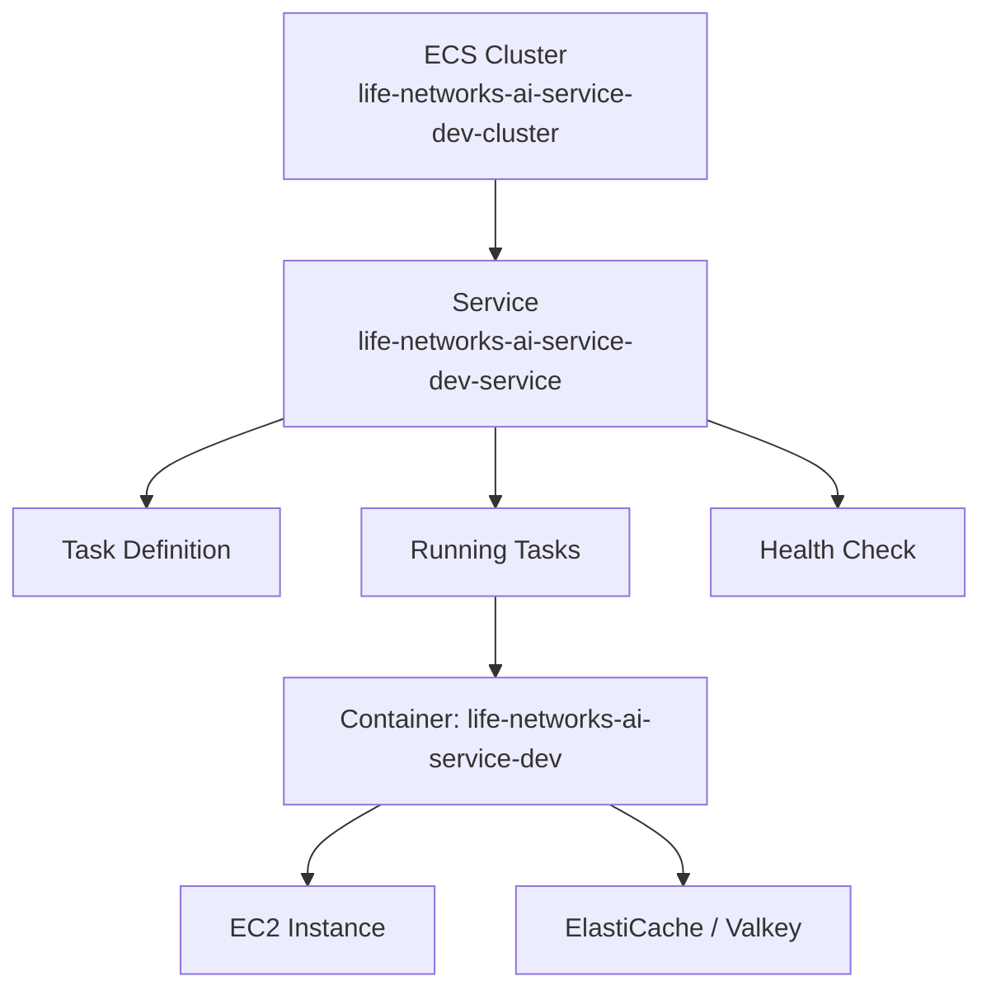
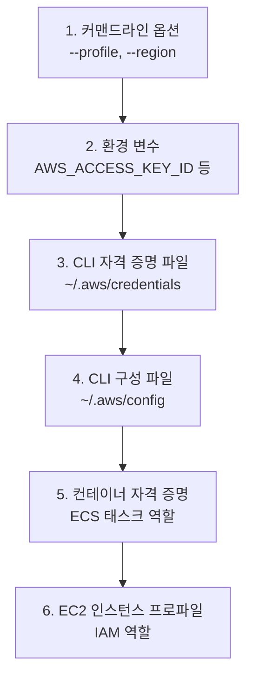

## 개요

LIFE Networks AI 서비스의 dev 환경 인프라를 관리했다. ECS 서비스 업데이트, EC2 인스턴스 확인, ElastiCache(Valkey) 모니터링, IAM 액세스 키 생성, 그리고 AWS CLI 자격 증명 설정까지 일련의 DevOps 작업을 수행했다.

## ECS 서비스 관리

`life-networks-ai-service-dev-cluster` 클러스터에서 `life-networks-ai-service-dev-service`의 태스크 상태 확인, 헬스 체크, 서비스 업데이트를 진행했다. ECS 콘솔에서 확인한 항목들:

- **Service tasks**: 실행 중인 태스크의 컨테이너 상태와 로그
- **Health and metrics**: 서비스 헬스 체크 결과와 CPU/메모리 메트릭
- **Service update**: 태스크 정의 업데이트 후 롤링 배포

ECS Express Mode도 확인했는데, 이는 간단한 서비스를 빠르게 배포할 수 있는 모드다.

## EC2 인스턴스와 ElastiCache

EC2 인스턴스 두 개(`i-046477af095789716`, `i-08519a8bc99687528`)의 상태를 확인했다. ElastiCache에서는 Valkey(Redis 호환 인메모리 데이터스토어) 클러스터를 모니터링했다. Valkey는 Redis의 오픈소스 포크로, AWS가 공식 지원하는 인메모리 캐시 엔진이다.

## IAM 액세스 키 생성과 CLI 설정

`life-networks-lsr` IAM 사용자의 보안 자격 증명 탭에서 새 액세스 키를 생성했다. 이후 [AWS CLI 설정 문서](https://docs.aws.amazon.com/ko_kr/cli/v1/userguide/cli-chap-configure.html)를 참조해 `aws configure`로 로컬 환경을 설정했다.

AWS CLI의 자격 증명 우선순위:

`aws configure` 실행 시 네 가지를 입력한다:
- AWS Access Key ID
- AWS Secret Access Key
- Default region name (예: `ap-northeast-2`)
- Default output format (json, yaml, text, table)

설정 결과는 `~/.aws/credentials`(자격 증명)와 `~/.aws/config`(리전, 출력 형식)에 각각 저장된다. 프로필을 여러 개 설정하려면 `aws configure --profile 프로필명`을 사용한다.

## 인사이트

오늘의 AWS 작업은 일상적인 DevOps 루틴이지만, 몇 가지 포인트가 있다. ECS 서비스 업데이트는 콘솔에서 직접 했지만, 반복적인 작업이라면 CI/CD 파이프라인이나 Terraform으로 자동화하는 것이 맞다. IAM 액세스 키 생성 후 CLI 설정까지의 흐름은 새로운 개발 환경 세팅 시 항상 거치는 과정인데, 자격 증명 우선순위를 정확히 이해하고 있어야 환경변수와 파일 설정이 충돌할 때 디버깅이 쉬워진다. Valkey(Redis 포크)를 ElastiCache에서 관리형으로 사용하는 것은 라이선스 변경 이후의 실용적인 선택이다.
