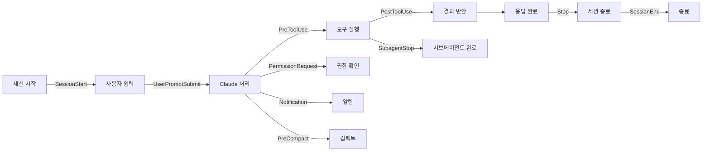

## 개요

Claude Code는 LLM이 도구를 "선택"해서 실행하는 구조다. 하지만 특정 작업은 선택이 아니라 **항상** 실행되어야 할 때가 있다 — 파일 저장 후 포맷팅, 명령어 로깅, 프로덕션 파일 수정 차단 같은 것들. [Claude Code 훅](https://code.claude.com/docs/ko/hooks-guide)은 이런 요구를 충족하는 라이프사이클 셸 명령 시스템이다.

## 훅 이벤트 종류

Claude Code는 워크플로우의 다양한 지점에서 실행되는 10가지 훅 이벤트를 제공한다:



| 이벤트 | 시점 | 제어 |
|---|---|---|
| `PreToolUse` | 도구 호출 전 | 차단 가능 |
| `PostToolUse` | 도구 호출 후 | 피드백 제공 |
| `PermissionRequest` | 권한 대화상자 | 허용/거부 |
| `UserPromptSubmit` | 프롬프트 제출 시 | 전처리 |
| `Notification` | 알림 발생 시 | 커스텀 알림 |
| `Stop` | 응답 완료 시 | 후처리 |
| `SubagentStop` | 서브에이전트 완료 | 후처리 |
| `PreCompact` | 컴팩트 실행 전 | 전처리 |
| `SessionStart` | 세션 시작/재개 | 초기화 |
| `SessionEnd` | 세션 종료 | 정리 |

## 실전 예제: Bash 명령어 로깅

가장 기본적인 훅 — 모든 셸 명령을 파일에 기록한다. `PreToolUse` 이벤트에 `Bash` 매처를 걸고, `jq`로 도구 입력을 파싱한다:

```json
{
  "hooks": {
    "PreToolUse": [
      {
        "matcher": "Bash",
        "hooks": [
          {
            "command": "jq -r '\"\\(.tool_input.command) - \\(.tool_input.description // \"No description\")\"' >> ~/.claude/bash-command-log.txt"
          }
        ]
      }
    ]
  }
}
```

설정은 `/hooks` 슬래시 명령으로 접근하며, User settings(전역) 또는 Project settings(프로젝트별)로 저장 범위를 선택할 수 있다.

## 활용 패턴

**자동 포맷팅**: `PostToolUse`에서 파일 확장자별로 포맷터를 실행한다. `.ts` 파일이면 prettier, `.go` 파일이면 gofmt, `.py` 파일이면 black을 자동 적용하면 Claude가 생성하는 코드가 항상 프로젝트 스타일을 따른다.

**파일 보호**: `PreToolUse`에서 특정 경로 패턴(예: `production/`, `.env`)에 대한 수정을 차단한다. LLM이 실수로 프로덕션 설정을 건드리는 것을 원천적으로 방지할 수 있다.

**커스텀 알림**: `Notification` 이벤트에 시스템 알림, Slack 웹훅, 소리 재생 등을 연결한다. Claude가 입력을 기다리거나 작업이 완료되었을 때 원하는 방식으로 알림을 받을 수 있다.

**코드 품질 피드백**: `PostToolUse`에서 lint 결과를 Claude에게 돌려주면, Claude가 자동으로 수정 사항을 반영한다. 프롬프트 지시사항이 아닌 코드 레벨의 강제다.

## 보안 고려사항

훅은 현재 환경의 자격 증명으로 에이전트 루프 중 자동 실행된다. 이것은 강력한 기능이지만 동시에 위험하다 — 악의적인 훅 코드가 환경변수를 읽어 외부로 전송하거나, 파일을 삭제하거나, 임의의 명령을 실행할 수 있다. 반드시 훅 구현을 등록 전에 검토하고, 프로젝트 레벨 훅은 `.claude/settings.json`의 변경사항을 코드 리뷰에 포함시켜야 한다.

## 인사이트

훅의 핵심 가치는 "제안을 코드로 변환"하는 것이다. 프롬프트에 "항상 prettier를 실행해줘"라고 써도 LLM은 가끔 잊는다. 하지만 훅으로 등록하면 100% 실행된다. 이것은 LLM 기반 개발 도구의 근본적인 한계 — 비결정론적 행동 — 를 결정론적 셸 명령으로 보완하는 패턴이다. `PreToolUse`로 차단, `PostToolUse`로 후처리, `Stop`으로 마무리라는 세 가지 포인트만 잘 활용하면 Claude Code의 동작을 프로젝트 요구사항에 정확히 맞출 수 있다.
