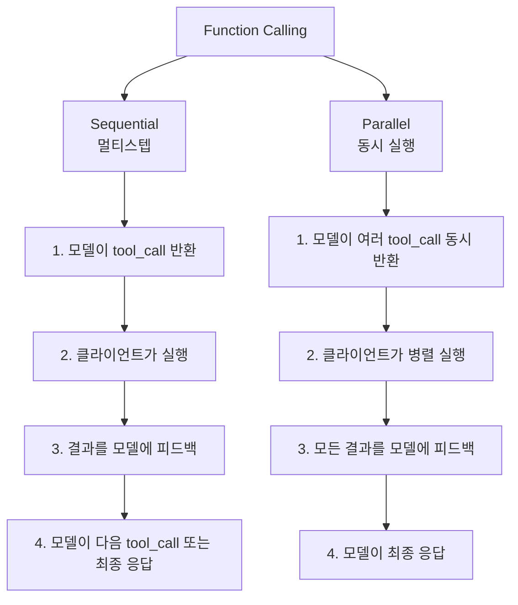

## 개요

이전 포스트에서 Gemini 3의 모델 라인업, 가격, Thought Signatures, thinking_level/media_resolution 파라미터, 이미지 생성(Nano Banana Pro), Flash Preview 버그까지 다뤘다. 오늘은 [Gemini 3 Developer Guide](https://ai.google.dev/gemini-api/docs/gemini-3)에서 아직 정리하지 않은 **Function Calling strict validation**, **Structured Outputs with tools**, **Code Execution with images**, **Multimodal function responses**, **OpenAI 호환 API** 기능을 살펴본다.

> 이전 포스트: [Gemini 3 이미지 생성 API + Mermaid.js](https://ice-ice-bear.github.io/posts/2026-02-20-tech-log/), [Gemini 3 Flash Preview 무한 루프 버그](https://ice-ice-bear.github.io/posts/2026-02-25-gemini-3-flash-infinite-loop-bug/)

## Gemini 3.1 Pro Preview 발표

Gemini 3.1 Pro가 프리뷰로 공개되었다. 3 Pro 대비 성능, 행동, 지능 개선이 이루어졌으며, 모델 ID는 `gemini-3.1-pro-preview`다. 가격과 컨텍스트 윈도우(1M/64k)는 3 Pro와 동일하다. Google AI Studio에서 무료로 시도할 수 있다.

## Function Calling — Strict Validation

Gemini 3에서 Function Calling에 strict validation이 도입되었다. 이전 모델에서는 도구 호출 시 스키마를 느슨하게 검증했지만, 이제 **이미지 생성/편집**과 **Function Calling** 모드에서는 Thought Signatures를 포함한 엄격한 검증이 적용된다.

두 가지 호출 패턴을 지원한다:

**Sequential (멀티스텝)**: 모델이 한 번에 하나의 도구를 호출하고, 결과를 받은 뒤 다음 도구를 호출한다. 이전 도구의 결과에 따라 다음 행동이 달라지는 에이전트 워크플로우에 적합하다.

**Parallel**: 모델이 독립적인 여러 도구 호출을 한 번에 반환한다. 클라이언트가 병렬로 실행하고 결과를 모아서 피드백하면 모델이 종합 응답을 생성한다. 지연 시간을 크게 줄일 수 있다.

주의사항: 텍스트/스트리밍과 인컨텍스트 추론(In-Context Reasoning)에서는 strict validation이 적용되지 않는다. 즉, 이미지 생성 모드에서는 Thought Signature 없이 도구를 호출하면 400 에러가 발생하지만, 일반 텍스트 모드에서는 기존처럼 동작한다.

## Structured Outputs with Tools

Function Calling과 Structured Output을 결합할 수 있다. 도구 정의 시 응답 스키마를 지정하면, 모델이 도구 호출 결과를 구조화된 JSON으로 반환하도록 강제할 수 있다. 이전에는 모델이 자유 형식으로 응답했는데, 이제 프로덕션 파이프라인에서 파싱 에러 없이 안정적으로 처리할 수 있다.

## Code Execution with Images

Gemini 3의 코드 실행 기능이 이미지 출력을 지원한다. 모델이 Python 코드를 실행하고, matplotlib 같은 라이브러리로 생성한 차트나 그래프를 이미지로 반환할 수 있다. 데이터 분석 → 시각화 → 설명이라는 파이프라인을 단일 API 호출로 처리할 수 있다는 점이 핵심이다.

## Multimodal Function Responses

도구 호출의 결과로 텍스트뿐 아니라 이미지, 오디오 등 멀티모달 데이터를 반환할 수 있다. 예를 들어 "이 주소의 위성 사진을 가져와"라는 도구 호출 결과로 실제 이미지를 반환하면, 모델이 이미지를 분석해서 종합 응답을 생성한다. 에이전트가 외부 API에서 가져온 비텍스트 데이터를 모델의 멀티모달 이해 능력과 결합할 수 있는 것이다.

## OpenAI 호환 API

Gemini 3는 OpenAI 호환 엔드포인트를 제공한다. 기존에 OpenAI API를 사용하는 코드베이스에서 모델명과 API 키만 바꾸면 Gemini 3를 사용할 수 있다. 마이그레이션 비용을 최소화하는 전략적 선택이다.

## Gemini 2.5에서 마이그레이션

기존 Gemini 2.5 사용자가 3으로 넘어갈 때 주의할 점:
- 모델 ID 변경 (`gemini-2.5-*` → `gemini-3-*-preview`)
- Thought Signatures가 새로 도입됨 — Function Calling에서 strict validation 적용
- temperature 기본값 1.0에 최적화 — 낮은 temperature 코드가 있다면 반드시 제거
- `thinking_level`과 `thinking_budget` 동시 사용 불가 (400 에러)

## 인사이트

Gemini 3의 새 기능을 보면 Google이 "에이전트 파이프라인의 신뢰성"에 집중하고 있음을 알 수 있다. Function Calling의 strict validation, Structured Outputs, Parallel 호출 패턴은 모두 프로덕션 에이전트에서 발생하는 파싱 에러와 지연 문제를 해결하는 기능이다. Code Execution with images와 Multimodal function responses는 텍스트 중심이던 도구 호출을 멀티모달로 확장한다. OpenAI 호환 API는 경쟁 모델 간 전환 비용을 낮추는 전략인데, 이는 Claude의 OpenAI 호환 모드와도 비슷한 방향이다. 모델 간 API 호환성이 높아질수록 개발자는 벤더 종속 없이 성능과 비용 기준으로 모델을 선택할 수 있게 된다.
