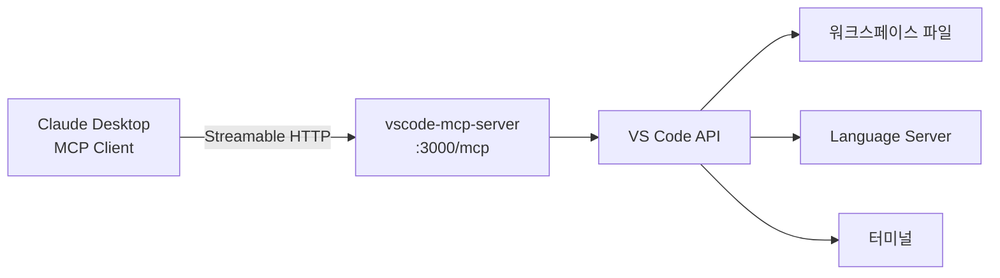

## 개요

[juehang/vscode-mcp-server](https://github.com/juehang/vscode-mcp-server)는 VS Code의 내장 편집 기능(파일 조작, 심볼 검색, 진단 등)을 MCP 프로토콜로 노출하는 확장이다. Claude Desktop이나 다른 MCP 클라이언트가 VS Code에서 직접 코딩할 수 있게 해준다. Serena에서 영감을 받았지만, VS Code의 네이티브 API를 활용한다는 점이 차별화된다.

## 아키텍처

확장은 Streamable HTTP API(`http://localhost:3000/mcp`)를 제공하며, SSE가 아닌 새로운 MCP 전송 방식을 사용한다. Claude Desktop에서는 `npx mcp-remote@next`로 연결한다:

```json
{
  "mcpServers": {
    "vscode-mcp-server": {
      "command": "npx",
      "args": ["mcp-remote@next", "http://localhost:3000/mcp"]
    }
  }
}
```



## MCP 도구 목록

다섯 카테고리, 총 7개 이상의 도구를 제공한다:

**File Tools** — 파일 시스템 조작
- `list_files_code`: 디렉토리 파일 목록 조회
- `read_file_code`: 파일 내용 읽기
- `create_file_code`: 파일 생성 (overwrite 옵션)

**Edit Tools** — 코드 수정
- `replace_lines_code`: 특정 라인 범위 교체. 원본 내용과 정확히 일치해야 동작

**Diagnostics Tools** — 코드 진단
- `get_diagnostics_code`: Language Server의 진단 결과(에러, 경고) 반환

**Symbol Tools** — 코드 탐색
- `search_symbols_code`: 워크스페이스 전체에서 함수/클래스 검색
- `get_document_symbols_code`: 파일 내 심볼 아웃라인

**Shell Tools** — 터미널 명령 실행

## Claude Code와의 차이점

Claude Code도 파일 읽기/쓰기를 지원하지만, vscode-mcp-server는 **VS Code 고유 기능**을 노출한다는 점이 다르다. Language Server 기반의 심볼 검색, 문서 아웃라인, 코드 진단은 Claude Code의 grep/ripgrep 기반 검색보다 의미론적으로 정확하다. 두 도구를 조합하면 Claude Code의 강력한 파일 조작 + VS Code의 의미론적 코드 이해를 함께 활용할 수 있다.

권장 워크플로우는 프로젝트 README에서 제시하는 것처럼:
1. `list_files_code`로 프로젝트 구조 파악
2. `search_symbols_code`로 수정 대상 함수/클래스 찾기
3. `read_file_code`로 현재 내용 확인
4. 소규모 수정은 `replace_lines_code`, 대규모 변경은 `create_file_code` with overwrite
5. **매번 수정 후** `get_diagnostics_code`로 에러 확인

## 보안 주의사항

Shell Tools가 포함되어 있어 셸 명령 실행이 가능하다. MCP 인증 스펙이 아직 확정되지 않아 인증이 구현되지 않은 상태이므로, 포트가 외부에 노출되지 않도록 주의해야 한다. 신뢰할 수 있는 MCP 클라이언트만 연결하는 것이 권장된다.

## 인사이트

이 확장은 MCP 생태계가 "도구 표준화"를 넘어 "환경 통합"으로 진화하고 있음을 보여준다. 기존에는 LLM이 파일을 직접 읽고 쓰는 방식이었지만, vscode-mcp-server를 통하면 Language Server의 타입 체크, 심볼 인덱싱, 진단 기능까지 활용할 수 있다. 특히 `get_diagnostics_code`를 매번 수정 후 호출하는 패턴은 "코드를 쓰고 → 컴파일러에게 물어보고 → 수정하는" 인간 개발자의 워크플로우를 LLM에게도 적용하는 것이다. MCP 인증 스펙이 확정되면 더 안전하게 활용할 수 있을 것이다.
