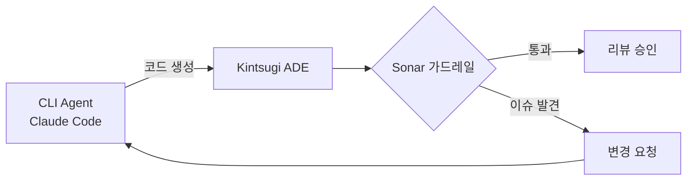
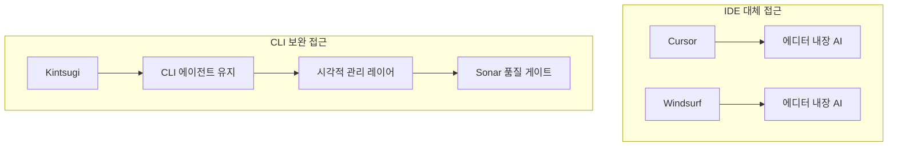

## 개요

SonarSource에서 실험 중인 **Kintsugi**는 CLI 에이전트 사용자를 위한 Agentic Development Environment(ADE)다. IDE를 대체하는 것이 아니라 Claude Code 같은 CLI 에이전트를 시각적으로 보완하는 새로운 접근이다.

## Kintsugi란 무엇인가

Kintsugi는 기존 IDE와 완전히 다른 개념의 개발 환경이다. 스스로를 **Agentic Development Environment(ADE)**라고 정의하며, 코드를 직접 작성하는 대신 AI 에이전트가 생성한 코드를 **오케스트레이션하고 리뷰**하는 데 초점을 맞춘다. 현재는 Claude Code만 지원하며, Gemini CLI와 Codex 지원도 계획 중이다.

핵심 기능은 크게 세 가지다:

- **멀티스레드 개발** — 여러 AI 세션을 병렬로 관리하면서 각 태스크의 상태를 시각적 큐로 추적할 수 있다. CLI에서 `claude` 명령어를 여러 터미널에 띄워 놓고 컨텍스트를 잃어버리는 문제를 해결한다.
- **플랜 리뷰와 변경 요청** — 에이전트가 제안한 구현 계획을 시각적으로 확인하고, 코드를 쓰기 전에 방향을 수정할 수 있다.
- **Sonar 기반 가드레일** — SonarQube/SonarCloud의 정적 분석 엔진을 통합하여, AI가 생성한 코드의 보안 취약점과 품질 이슈를 매 단계마다 자동 검사한다.

## 프라이버시와 시스템 요구사항

프라이버시 측면도 인상적이다. Kintsugi는 로컬 데스크톱 앱으로, 소스 코드를 Sonar 서버로 전송하지 않는다. 익명 사용 데이터만 수집하며 설정에서 옵트아웃 가능하다.

시스템 요구사항:
- macOS 전용 (현재)
- Claude Code 2.0.57+
- Git, Node.js, Java 17+

아직 초기 단계라 초대 기반으로 접근을 열고 있으며, [SonarCloud](https://sonarcloud.io/) 계정과 연동하여 사용할 수 있다.

## Cursor/Windsurf와의 차이

Cursor나 Windsurf가 에디터 자체에 AI를 내장하여 IDE를 대체하려는 반면, Kintsugi는 CLI 에이전트의 파워를 그대로 유지하면서 시각적 관리 레이어만 얹는다. "AI가 코드를 짜고, 사람은 리뷰한다"는 워크플로우에 SonarQube의 정적 분석 가드레일까지 자동으로 적용된다는 점이 차별점이다.

## 인사이트

Kintsugi가 던지는 메시지는 명확하다 — AI가 생성한 코드도 품질과 보안을 보장해야 한다. CLI 에이전트의 생산성은 유지하면서 "리뷰 없이 머지되는 AI 코드"라는 리스크를 구조적으로 차단하려는 시도다. 개발자의 역할이 "코드 작성자"에서 "AI 오케스트레이터"로 이동하는 흐름에서, 그 오케스트레이션을 위한 전용 도구가 등장한 셈이다.
