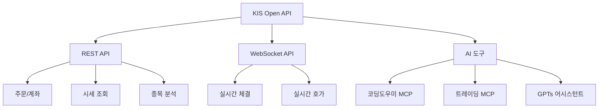

## 개요

한국투자증권의 KIS Developers 포털은 국내 증권사 중 가장 적극적으로 Open API를 제공하는 플랫폼이다. REST/WebSocket API는 물론, MCP(Model Context Protocol)를 통해 LLM에서 직접 트레이딩 API를 호출할 수 있는 인프라까지 갖추고 있다.

## API 구조

KIS Open API는 REST와 WebSocket 두 가지 방식으로 제공된다. 국내주식만 해도 주문/계좌, 기본시세, ELW, 업종/기타, 종목정보, 시세분석, 순위분석, 실시간시세로 세분화되어 있다. 해외주식, 선물옵션, 채권까지 포함하면 수백 개의 엔드포인트가 존재한다.

인증은 OAuth 방식으로, `appkey`와 `appsecret`을 발급받아 접근토큰을 생성한다. WebSocket은 별도의 접속키를 발급받아 실시간 데이터를 수신한다. GitHub에 Python 샘플코드(REST, WebSocket)가 공개되어 있어 빠르게 프로토타이핑할 수 있다.

## MCP 연동 — LLM에서 직접 트레이딩

가장 눈에 띄는 것은 **AI 도구** 섹션이다. KIS Developers는 MCP를 공식 지원하며 두 가지를 제공한다:

- **코딩도우미 MCP** — API 사용법, 샘플코드 생성, 오류 해결을 LLM 대화로 처리
- **트레이딩 MCP** — ChatGPT나 Claude에서 직접 주문, 시세 조회 등 트레이딩 기능 호출

24시간 GPTs 기반 1:1 지원 어시스턴트도 운영 중이다. 국내 증권사가 MCP를 공식 지원하는 사례는 아직 드물어, API 기반 자동매매를 구축하려는 개발자에게는 상당히 매력적인 환경이다.

## 보안 유의사항

최근 KIS에서 올린 보안 관련 공지 두 가지가 있다:

1. **appkey/appsecret 노출 주의** — 발급받은 보안코드와 접근토큰을 외부에 공유하거나 웹에 게시하지 말 것. 이상 징후 발견 시 즉시 서비스(보안코드) 해지.
2. **WebSocket 무한 연결 차단** — 연결→즉시종료를 반복하거나, 구독 등록/해제를 무한 반복하는 비정상 패턴이 감지되면 IP 및 앱키가 일시 차단된다.

정상 패턴: `연결 → 종목 구독 → 데이터 수신 → 구독 해제 → 연결 종료`

## 인사이트

KIS Developers가 MCP를 공식 지원한다는 것은 금융 API와 LLM의 결합이 실험 단계를 넘어 프로덕션 레벨로 진입하고 있다는 신호다. API 문서 읽고 코드 짜는 과정 자체를 AI에게 위임할 수 있고, 나아가 트레이딩 의사결정까지 LLM 파이프라인에 통합할 수 있는 구조가 갖춰지고 있다. 다만 보안코드 관리와 비정상 호출 패턴에 대한 주의는 필수적이다 — 자동화할수록 예외 처리의 중요성은 오히려 커진다.
