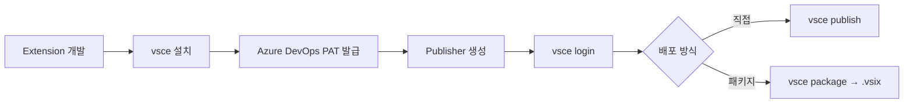

## 개요

VS Code Extension을 Marketplace에 배포하려면 `@vscode/vsce` 패키지를 사용한다. Azure DevOps PAT 발급부터 Publisher 생성, 패키징, 배포까지의 전체 워크플로우를 정리한다.



## 1단계: vsce 설치

vsce는 VS Code Extension의 패키징과 배포를 담당하는 CLI 도구다.

```bash
npm install -g @vscode/vsce
```

주요 커맨드 세 가지:
- `vsce login` — 퍼블리셔 계정으로 로그인
- `vsce publish` — Marketplace에 직접 배포
- `vsce package` — `.vsix` 정적 파일로 패키징

## 2단계: Azure DevOps PAT 발급

VS Code Marketplace는 Azure DevOps를 통해 인증한다.

1. [Azure DevOps](https://dev.azure.com/)에 가입/로그인
2. Personal Access Token(PAT) 생성
   - **중요**: VS Code Marketplace에 대한 `Manage` 권한을 반드시 부여
   - 발급된 토큰은 다시 조회할 수 없으므로 안전하게 보관

## 3단계: Publisher 생성 및 로그인

1. [VS Code Marketplace](https://marketplace.visualstudio.com/)에서 `Publish extensions` → `Create publisher`
2. Publisher 이름 설정 후 생성
3. CLI에서 로그인:

```bash
vsce login <publisherName>
# PAT 입력 프롬프트가 나타남
```

## 4단계: package.json 필수 필드

```json
{
  "name": "my-extension",
  "displayName": "My Extension",
  "publisher": "my-publisher",
  "version": "0.0.1",
  "engines": {
    "vscode": "^1.84.0"
  }
}
```

위 필드 중 하나라도 누락되면 배포가 실패한다.

## 5단계: 배포

```bash
# Marketplace에 직접 배포
vsce publish

# 또는 .vsix 파일로 패키징 후 수동 배포
vsce package
```

`vsce package`로 생성된 `.vsix` 파일은 Marketplace 웹에서 수동 업로드하거나, `code --install-extension my-extension.vsix`로 로컬 설치할 수 있다.

## 인사이트

Azure DevOps와 VS Code Marketplace가 별개 시스템이라 첫 설정 시 혼란스러울 수 있다. 핵심은 PAT 발급(Azure DevOps) → Publisher 생성(Marketplace) → 로그인(vsce CLI) → 배포 순서다. 한번 세팅해두면 이후에는 `vsce publish`만으로 원클릭 배포가 가능하고, CI/CD 파이프라인에 통합하여 태그 푸시 시 자동 배포도 구성할 수 있다.
