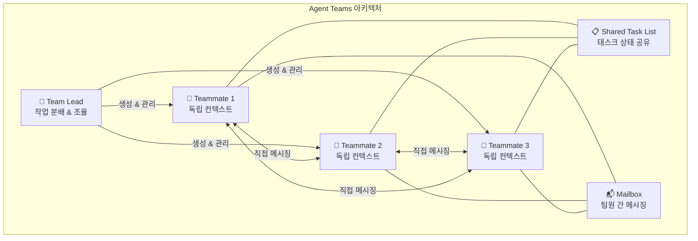
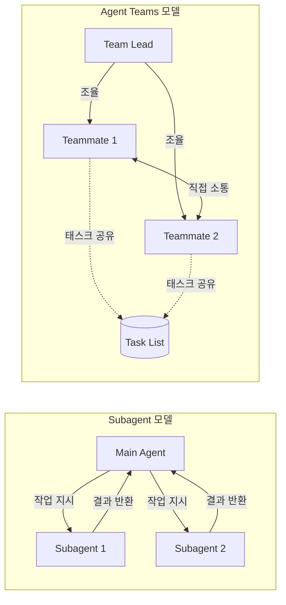
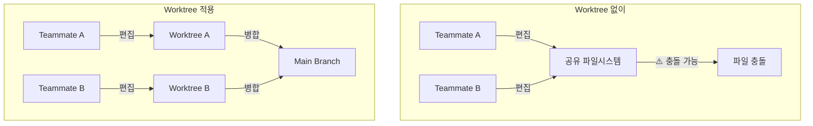

## 개요

Claude Code의 Agent Teams는 여러 Claude Code 인스턴스를 하나의 팀으로 묶어 병렬 작업을 수행하는 실험적 기능이다. 기존 Subagent가 단일 세션 내에서 결과만 돌려보내는 구조였다면, Agent Teams는 팀원끼리 직접 메시지를 주고받고, 공유 태스크 리스트를 통해 자율적으로 작업을 조율한다. 오늘은 Agent Teams의 아키텍처, Subagent와의 차이점, 그리고 실전 활용 패턴을 정리한다.



## Agent Teams vs Subagent — 핵심 차이점

Agent Teams와 Subagent는 둘 다 작업을 병렬화하지만, 동작 방식이 근본적으로 다르다.

**Subagent**는 메인 세션 내부에서 실행되는 경량 헬퍼다. 작업을 수행한 뒤 결과를 메인 에이전트에 보고하는 것이 전부다. Subagent끼리는 서로 대화할 수 없고, 작업 중간에 발견한 내용을 공유할 수도 없다. 메인 에이전트가 모든 중개 역할을 한다.

**Agent Teams**는 완전히 독립된 Claude Code 인스턴스들로 구성된다. 각 팀원은 자신만의 컨텍스트 윈도우를 가지며, 공유 태스크 리스트를 통해 작업을 자율적으로 선택(claim)한다. 핵심은 **팀원 간 직접 커뮤니케이션**이 가능하다는 것이다. 특정 팀원에게 메시지를 보낼 수도 있고, 전체 팀에 브로드캐스트할 수도 있다.

| 항목 | Subagent | Agent Teams |
|---|---|---|
| **컨텍스트** | 독립 컨텍스트, 결과만 반환 | 독립 컨텍스트, 완전 자율 |
| **커뮤니케이션** | 메인 에이전트에만 보고 | 팀원 간 직접 메시징 |
| **조율 방식** | 메인 에이전트가 전부 관리 | 공유 태스크 리스트 + 자율 조율 |
| **적합한 작업** | 결과만 필요한 단순 작업 | 토론과 협업이 필요한 복잡한 작업 |
| **토큰 비용** | 낮음 (요약된 결과만 반환) | 높음 (각 팀원이 별도 인스턴스) |



## 팀 설정과 활성화

Agent Teams는 기본적으로 비활성화되어 있다. `settings.json`에서 환경변수를 설정하면 활성화된다:

```json
{
  "env": {
    "CLAUDE_CODE_EXPERIMENTAL_AGENT_TEAMS": "1"
  }
}
```

활성화 후에는 자연어로 팀 구성을 요청하면 된다:

```text
CLI 도구의 UX, 기술 아키텍처, 반론을 각각 담당하는
3명의 팀원으로 에이전트 팀을 구성해줘.
```

### 디스플레이 모드

- **In-process**: 메인 터미널에서 모든 팀원이 실행. `Shift+Down`으로 팀원 전환. 별도 설정 불필요.
- **Split panes**: tmux 또는 iTerm2에서 각 팀원이 독립된 패널. 모든 작업 상태를 동시에 확인 가능.

`settings.json`에서 모드를 설정한다:

```json
{
  "teammateMode": "tmux"
}
```

## 실전 활용 패턴

### 1. 병렬 코드 리뷰

단일 리뷰어는 한 번에 한 가지 유형의 이슈에 집중하기 마련이다. 리뷰 관점을 독립된 도메인으로 분리하면 보안, 성능, 테스트 커버리지를 동시에 철저히 검토할 수 있다:

```text
PR #142를 리뷰할 에이전트 팀을 만들어줘. 3명의 리뷰어:
- 보안 취약점 전문
- 성능 영향 분석
- 테스트 커버리지 검증
각자 리뷰 후 결과를 보고하도록.
```

### 2. 경쟁 가설 디버깅

원인이 불분명한 버그에서 단일 에이전트는 하나의 설명을 찾으면 멈추는 경향이 있다. Agent Teams로 서로 다른 가설을 동시에 탐구하고 **상호 반박**하게 하면, 살아남는 이론이 실제 원인일 가능성이 훨씬 높다:

```text
앱이 한 번의 메시지 후 종료되는 문제 조사.
5명의 팀원을 생성해서 각각 다른 가설을 탐구하되,
과학적 토론처럼 서로의 이론을 반박하도록 해줘.
```

### 3. 크로스레이어 기능 개발

프론트엔드, 백엔드, 테스트가 동시에 변경되어야 하는 작업에서 각 레이어를 별도 팀원이 담당한다. 파일 충돌을 방지하기 위해 각 팀원이 담당하는 파일 세트를 명확히 분리하는 것이 중요하다.

## Worktree와의 결합

Agent Teams의 팀원들은 기본적으로 같은 파일시스템을 공유한다. 서로 다른 파일을 편집하면 문제없지만, 같은 파일을 동시에 수정하면 충돌이 발생할 수 있다. 이때 **Git Worktree**를 결합하면 각 팀원이 독립된 파일시스템 복사본에서 작업하게 된다:



에이전트 정의에서 `isolation: worktree`를 설정하면 팀원마다 별도의 worktree가 생성된다.

## 비용과 운영 팁

Agent Teams는 팀원 수에 비례하여 토큰을 소비한다. 3명의 팀원이면 단일 세션 대비 약 3~4배의 토큰을 사용한다. Plan mode에서 실행하면 약 7배까지 증가할 수 있다.

비용을 관리하면서 효과를 극대화하는 전략:

- **팀원에게 Sonnet 모델 사용**: 비용과 성능의 균형. Opus는 리드에게만 할당.
- **3~5명으로 시작**: 대부분의 워크플로우에서 최적. 팀원당 5~6개 태스크가 적정.
- **완료 후 즉시 정리**: 유휴 팀원도 토큰을 소비. `Clean up the team` 명령으로 정리.
- **Spawn 프롬프트에 충분한 컨텍스트 제공**: 팀원은 리드의 대화 히스토리를 상속하지 않으므로, 작업에 필요한 맥락을 프롬프트에 포함해야 한다.

## 빠른 링크

- [Claude Code Agent Teams 공식 문서](https://code.claude.com/docs/en/agent-teams) — 설정, 명령어, 제한사항 상세
- [Claude Code Agent Teams Complete Guide (claudefa.st)](https://claudefa.st/blog/guide/agents/agent-teams) — 2026년 최신 가이드
- [Worktree + Agent Teams 병행 가이드](https://claudefa.st/blog/guide/development/worktree-guide) — 파일시스템 격리 전략

## 인사이트

Agent Teams는 단순한 병렬 실행이 아니라, 에이전트 간 **소통과 자율 조율**이라는 새로운 차원을 추가한 기능이다. Subagent가 "일꾼에게 지시하고 결과를 받는" 위계적 모델이라면, Agent Teams는 "동료들이 함께 문제를 토론하고 해결하는" 협업 모델에 가깝다. 특히 경쟁 가설 디버깅 패턴은 단일 에이전트의 확증 편향(confirmation bias)을 극복하는 효과적인 전략이다. 아직 실험 단계이고 세션 재개가 안 되는 등 제약이 있지만, 복잡한 코드베이스에서 병렬 탐색이 필요한 작업에는 상당한 가치를 제공한다. Worktree와 결합하면 파일 충돌 없이 완전한 병렬 개발이 가능하므로, 대규모 리팩토링이나 멀티레이어 기능 구현에서 특히 유용하다.
