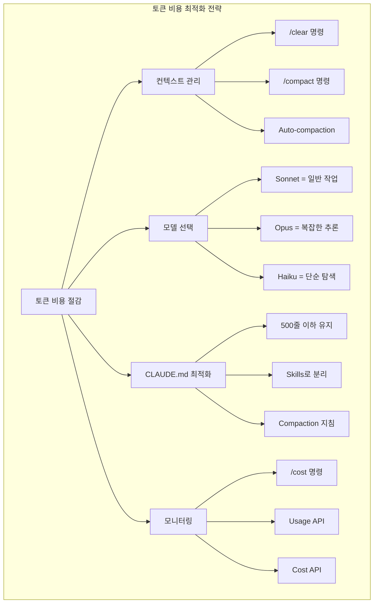
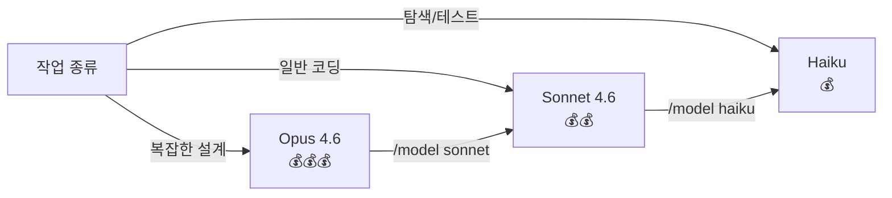
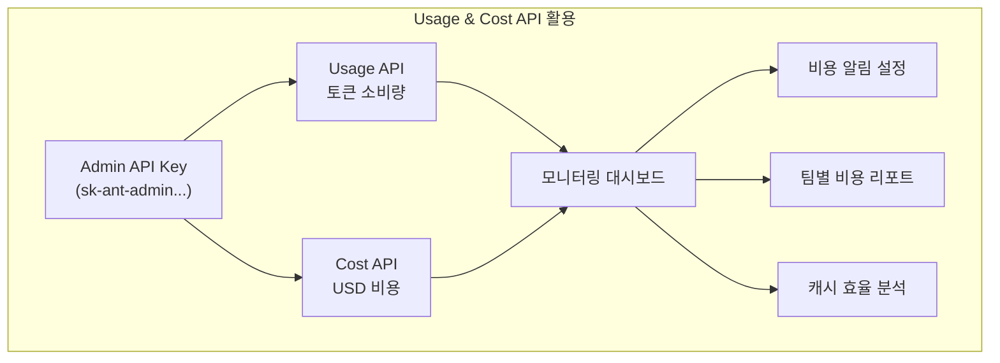

## 개요

Claude Code는 개발자당 평균 하루 $6, 월 $100~200 정도의 토큰 비용이 발생한다. 그런데 사용 방식에 따라 이 비용은 크게 달라진다. 컨텍스트 관리, 모델 선택, CLAUDE.md 최적화, 그리고 Usage & Cost API를 활용한 모니터링까지 — 체계적인 전략으로 토큰 소비를 50~80% 줄일 수 있다. 이 글에서는 Claude Code의 비용 구조를 이해하고, 실전에서 바로 적용할 수 있는 최적화 기법들을 정리한다.



## 비용이 발생하는 구조 이해하기

Claude Code의 토큰 비용은 **컨텍스트 크기에 비례**한다. Claude가 처리하는 컨텍스트가 클수록 메시지당 비용이 올라간다. 대화가 길어질수록, 참조하는 파일이 많을수록, MCP 서버가 많을수록 컨텍스트가 커진다.

Claude Code는 자동으로 두 가지 최적화를 수행한다:

- **Prompt Caching**: 시스템 프롬프트 같은 반복 콘텐츠의 비용을 자동 절감
- **Auto-compaction**: 컨텍스트 한도에 접근하면 대화 히스토리를 자동 요약

그러나 이것만으로는 부족하다. 사용자가 적극적으로 관리해야 진짜 절약이 된다.

## 전략 1: 컨텍스트를 적극적으로 관리하기

가장 큰 토큰 낭비는 **불필요한 컨텍스트 축적**에서 온다.

### `/clear` — 작업 전환 시 필수

관련 없는 작업으로 넘어갈 때는 반드시 `/clear`로 컨텍스트를 초기화한다. 이전 대화의 오래된 컨텍스트는 이후 모든 메시지에서 토큰을 낭비한다.

```text
/rename auth-refactoring    # 현재 세션에 이름 붙이기
/clear                       # 컨텍스트 초기화
# 새 작업 시작
```

나중에 해당 세션이 필요하면 `/resume`으로 돌아갈 수 있다.

### `/compact` — 10~15회 대화마다

대화가 길어지면 `/compact`로 히스토리를 압축한다. 옵션으로 보존할 내용을 지정할 수 있다:

```text
/compact Focus on code samples and API usage
```

CLAUDE.md에서 compaction 동작을 커스터마이징하는 것도 가능하다:

```markdown
# Compact instructions
When you are using compact, please focus on test output and code changes
```

### `/cost` — 실시간 비용 모니터링

현재 세션의 토큰 사용량을 `/cost`로 확인한다. 상태줄에 지속적으로 표시하려면 statusline 설정을 변경한다.

## 전략 2: 모델을 적재적소에 배치하기

모든 작업에 Opus를 쓸 필요가 없다.

| 모델 | 적합한 작업 | 비용 |
|---|---|---|
| **Opus** | 복잡한 아키텍처 결정, 다단계 추론 | 높음 |
| **Sonnet** | 일반 코딩 작업 (대부분의 경우) | 중간 |
| **Haiku** | 파일 탐색, 테스트 실행, 단순 질문 | 낮음 (~80% 저렴) |

세션 중간에 `/model`로 전환하고, `/config`에서 기본값을 설정한다. Subagent에는 `model: haiku`를 지정해서 단순 작업에 비용을 아낀다.



### Extended Thinking 조정

확장 사고(Extended Thinking)는 기본 31,999 토큰 예산으로 활성화되어 있다. 사고 토큰은 출력 토큰으로 과금되므로, 단순한 작업에서는 불필요한 비용이다:

- `/model`에서 Opus 4.6의 노력 수준(effort level)을 낮추기
- `/config`에서 사고 기능 비활성화
- `MAX_THINKING_TOKENS=8000`으로 예산 낮추기

## 전략 3: CLAUDE.md를 날씬하게 유지하기

CLAUDE.md는 세션 시작 시 전체가 컨텍스트에 로드된다. PR 리뷰 절차, 데이터베이스 마이그레이션 가이드 같은 특정 워크플로우 지침이 들어있으면, 관련 없는 작업을 할 때도 그 토큰이 매 턴마다 과금된다.

### Skills로 분리하기

CLAUDE.md에서 전문 지침을 **Skills**로 분리하면 호출될 때만 로드된다:

```text
CLAUDE.md (필수 사항만, ~500줄 이하)
├── 프로젝트 아키텍처 요약
├── 핵심 코딩 컨벤션
└── 자주 쓰는 명령어

.claude/skills/ (필요할 때만 로드)
├── pr-review/       # PR 리뷰 절차
├── db-migration/    # DB 마이그레이션 가이드
└── deploy/          # 배포 프로세스
```

### MCP 서버 오버헤드 줄이기

각 MCP 서버는 유휴 상태에서도 도구 정의를 컨텍스트에 추가한다. `/context`로 현재 컨텍스트 점유 상황을 확인하고:

- 사용하지 않는 MCP 서버는 `/mcp`에서 비활성화
- `gh`, `aws` 같은 CLI 도구를 MCP 서버 대신 선호 (컨텍스트 오버헤드 없음)
- 도구 검색 임계값을 `ENABLE_TOOL_SEARCH=auto:5`로 낮추기

## 전략 4: 작업 패턴 최적화

### Plan Mode 활용

`Shift+Tab`으로 Plan Mode에 진입하면 Claude가 코드베이스를 탐색하고 접근 방식을 제안한다. 초기 방향이 틀렸을 때 비용이 큰 재작업을 방지할 수 있다.

### 조기 방향 수정

Claude가 잘못된 방향으로 가면 `Escape`로 즉시 중단. `/rewind` 또는 `Escape` 두 번으로 이전 체크포인트로 복원한다.

### Subagent에 무거운 작업 위임

테스트 실행, 문서 가져오기, 로그 파일 처리 같은 대량 출력 작업은 Subagent에 위임한다. 상세 출력은 Subagent 컨텍스트에 남고, 요약만 메인 대화로 돌아온다.

## 전략 5: Usage & Cost API로 조직 비용 관리

개인 사용을 넘어 팀 전체의 비용을 추적하려면 Anthropic의 Admin API를 활용한다.

### Usage API — 토큰 소비량 추적

모델별 일일 토큰 사용량을 조회하는 예시:

```bash
curl "https://api.anthropic.com/v1/organizations/usage_report/messages?\
starting_at=2026-03-01T00:00:00Z&\
ending_at=2026-03-03T00:00:00Z&\
group_by[]=model&\
bucket_width=1d" \
  --header "anthropic-version: 2023-06-01" \
  --header "x-api-key: $ADMIN_API_KEY"
```

주요 기능:
- 1분/1시간/1일 단위로 시계열 집계
- 모델, 워크스페이스, API 키, 서비스 티어별 필터링
- Uncached input, cached input, cache creation, output 토큰 추적
- Data residency(추론 지역) 및 Fast Mode 추적

### Cost API — USD 비용 추적

워크스페이스별 비용을 조회한다:

```bash
curl "https://api.anthropic.com/v1/organizations/cost_report?\
starting_at=2026-03-01T00:00:00Z&\
ending_at=2026-03-03T00:00:00Z&\
group_by[]=workspace_id&\
group_by[]=description" \
  --header "anthropic-version: 2023-06-01" \
  --header "x-api-key: $ADMIN_API_KEY"
```



### 파트너 솔루션

직접 대시보드를 구축하지 않아도 Datadog, Grafana Cloud, CloudZero 같은 플랫폼이 기성 통합을 제공한다. Claude Code 사용자별 비용 분석이 필요하면 **Claude Code Analytics API**가 별도로 존재한다.

## 빠른 링크

- [Claude Code 비용 관리 공식 문서](https://code.claude.com/docs/ko/costs) — 한국어 공식 가이드
- [Usage and Cost API 문서](https://platform.claude.com/docs/en/build-with-claude/usage-cost-api) — Admin API 상세
- [Claude Code Token Optimization (GitHub)](https://github.com/affaan-m/everything-claude-code/blob/main/docs/token-optimization.md) — 커뮤니티 최적화 팁 모음

## 인사이트

Claude Code 토큰 최적화의 핵심은 "컨텍스트를 작게 유지하는 것"이라는 단순한 원칙으로 수렴된다. `/clear`로 작업 단위를 분리하고, CLAUDE.md를 Skills로 분산시키며, 모델을 작업 복잡도에 맞게 선택하는 — 이 세 가지만 실천해도 대부분의 비용 낭비를 막을 수 있다. 팀 레벨에서는 Usage & Cost API가 토큰 소비 패턴을 가시화해주므로, 캐싱 효율을 측정하고 예산 초과 알림을 설정하는 데 활용할 수 있다. 특히 2026년 2월에 추가된 Data Residency와 Fast Mode 추적 기능은 엔터프라이즈 환경에서 규정 준수와 성능 모니터링에 유용하다. 결국 좋은 습관(작업 전환 시 clear, 10~15회 대화마다 compact, 모호한 프롬프트 대신 구체적인 지시)이 어떤 설정보다 효과적인 비용 절감 도구다.
