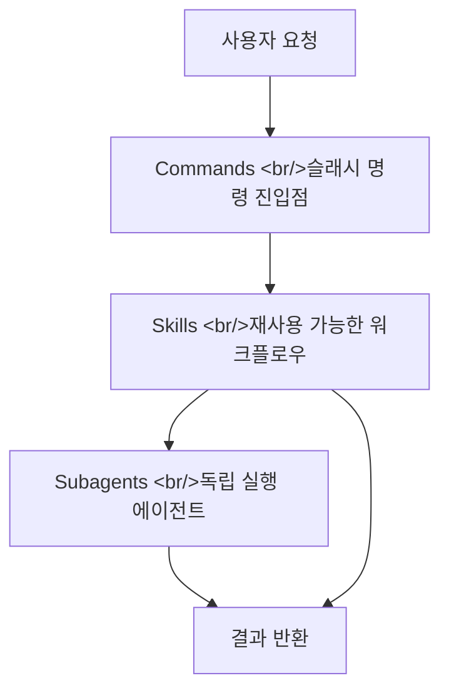
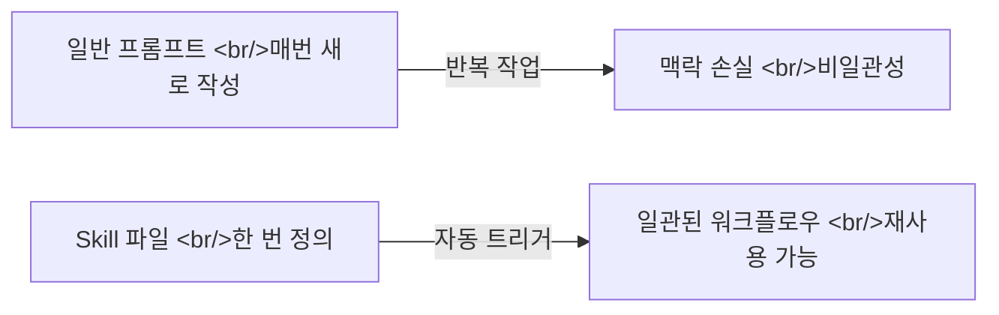
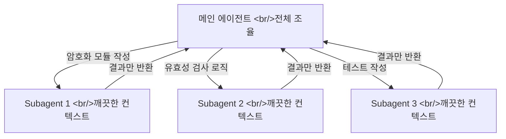
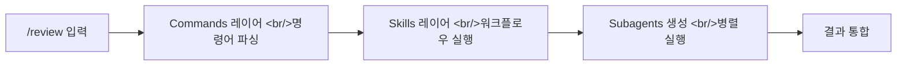
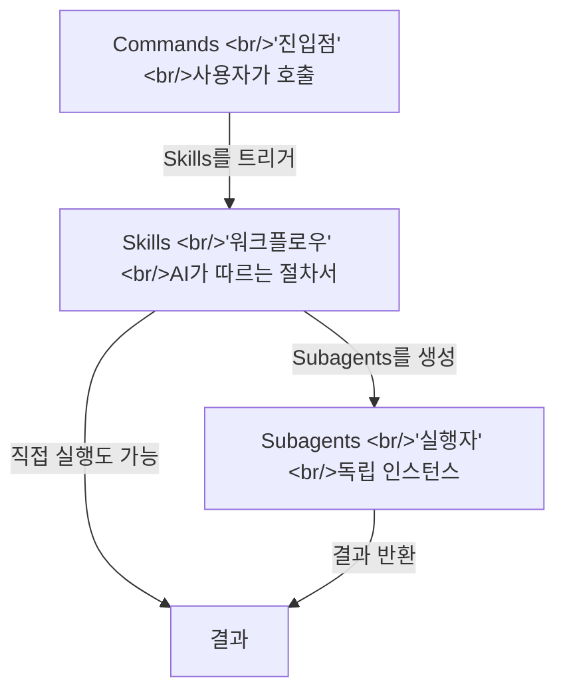

## 개요

Claude Code를 처음 쓰면 그냥 채팅하듯 명령을 던진다. 그런데 조금만 써보면 느끼게 된다 — "이건 뭔가 더 있는 것 같은데." 실제로 Claude Code는 단순한 AI 채팅창이 아니라, **Skills, Subagents, Commands** 세 가지 핵심 레이어로 이루어진 에이전트 프레임워크다. 이 세 개념을 모르면 Claude Code를 절반의 성능으로만 쓰는 셈이다.



## Skills — AI에게 '업무 매뉴얼'을 건네는 방법

### Skills란 무엇인가

Skills는 Claude Code에 주입하는 **재사용 가능한 워크플로우 정의서**다. 마크다운(`.md`) 파일 하나가 곧 하나의 Skill이다. Claude가 특정 상황에서 어떻게 행동해야 하는지, 어떤 순서로 작업을 처리해야 하는지를 자연어로 기술한다.

일반적인 프롬프트와의 차이가 중요하다. 프롬프트는 매번 새로 입력해야 하지만, Skill은 한 번 설치하면 조건이 맞을 때 **자동으로 트리거**된다. "기능 추가해줘"라고 했을 때 AI가 알아서 브레인스토밍 → 계획 수립 → 구현 → 리뷰 순서를 밟는 것, 이게 Skill이 작동하는 방식이다.



### Skill 파일 구조

```
.claude/
└── skills/
    └── my-skill/
        └── SKILL.md
```

SKILL.md 안에는 이 Skill이 언제 발동해야 하는지(`description`), 그리고 어떤 절차로 실행해야 하는지(`instructions`)를 담는다. 예시:

```markdown
---
name: code-review
description: PR 코드 리뷰 요청 시 자동 실행
---

## 리뷰 절차
1. 변경된 파일 목록 확인
2. 보안 취약점 체크
3. 성능 이슈 분석
4. 개선 제안 작성
```

### Skills 마켓플레이스

개인이 Skills를 직접 만들 수도 있지만, 이미 잘 만들어진 Skills 생태계가 존재한다. 대표적인 것이 **[obra/superpowers](https://github.com/obra/superpowers)** (⭐69k)다. Claude Code에 설치하면 브레인스토밍, 계획 수립, TDD 구현, 코드 리뷰까지의 전체 엔지니어링 워크플로우가 자동화된다.

```bash
# Claude Code에서 마켓플레이스 추가 및 설치
/plugin marketplace add obra/superpowers-marketplace
/plugin install superpowers@superpowers-marketplace
```

## Subagents — AI가 AI를 부리는 구조

### Subagent의 핵심 아이디어

Subagent는 메인 Claude Code 세션이 **별도의 Claude 인스턴스를 생성해 특정 작업을 위임**하는 구조다. 마치 선임 개발자가 "이 모듈은 네가 담당해"라며 팀원에게 작업을 나눠주는 것과 같다.

단순히 작업을 분리하는 것 이상의 의미가 있다. Subagent는 **완전히 독립된 컨텍스트 윈도우**를 갖는다. 메인 세션의 누적된 맥락, 이전 실패, 엉킨 히스토리로부터 자유롭다. 덕분에 '환각(hallucination)' 가능성이 현저히 줄어든다.



### Subagent 만드는 법

Claude Code의 Task 도구를 사용하면 Subagent를 생성할 수 있다. Skill 파일 내부에서 다음과 같이 명시한다:

```markdown
## Subagent 실행
각 모듈을 독립된 Subagent에게 할당:
- 인증 모듈: Task 도구로 별도 에이전트 실행
- DB 레이어: Task 도구로 별도 에이전트 실행
각 Subagent는 결과만 메인에 보고한다.
```

### 추천 Subagent 활용 패턴

| 패턴 | 설명 | 효과 |
|---|---|---|
| **병렬 모듈 구현** | 독립적인 파일/모듈을 동시에 개발 | 개발 속도 2~3배 향상 |
| **리뷰 전문화** | 보안·성능·스타일을 각각 다른 에이전트가 담당 | 편향 없는 철저한 리뷰 |
| **컨텍스트 초기화** | 복잡한 버그를 깨끗한 눈으로 재탐색 | 확증 편향 극복 |
| **장시간 작업 격리** | 메인 세션 오염 없이 실험적 작업 수행 | 안전한 탐색 |

> **Subagent vs Agent Teams 차이**: Subagent는 결과만 반환하는 일방향 구조다. Agent Teams (실험적 기능)는 팀원끼리 직접 대화하는 양방향 협업 구조다. 복잡도와 비용도 Agent Teams가 훨씬 높다.

## Commands — 슬래시 명령어로 진입점 만들기

### Commands란

Commands는 사용자가 직접 `/명령어` 형식으로 호출할 수 있는 **슬래시 명령어**다. 내부적으로 특정 Skill을 실행하거나, 복잡한 프롬프트를 단일 명령어로 캡슐화한다.

```
.claude/
└── commands/
    └── review.md    # /review 명령어 정의
    └── deploy.md    # /deploy 명령어 정의
```

### Command 파일 구조

```markdown
# /review — PR 코드 리뷰 실행

## 실행 내용
1. 현재 브랜치의 변경사항 분석
2. 보안·성능·스타일 순서로 리뷰
3. 개선 제안을 마크다운으로 정리

$ARGUMENTS 변수로 추가 옵션을 받을 수 있음
```

### 기본 제공 Commands vs 커스텀 Commands

Claude Code는 기본적으로 `/help`, `/clear`, `/compact` 같은 Commands를 제공한다. 이외에 `.claude/commands/` 디렉토리에 직접 만든 `.md` 파일이 커스텀 Command가 된다. Superpowers 같은 플러그인을 설치하면 `/brainstorm`, `/write-plan`, `/execute-plan` 같은 Commands가 추가된다.



## 세 개념의 관계 정리



세 레이어는 이렇게 연결된다:

1. **Commands**: 사용자의 요청을 받는 창구. `/review`를 입력하면 Commands 레이어가 어떤 Skill을 실행할지 결정한다.
2. **Skills**: AI가 따르는 업무 매뉴얼. 어떤 순서로, 어떤 원칙으로 작업할지를 정의한다.
3. **Subagents**: 실제 실행 단위. Skills가 복잡한 작업을 위임할 때 생성되는 독립 에이전트들이다.

## 빠른 링크

- [obra/superpowers GitHub](https://github.com/obra/superpowers) — ⭐69k, Claude Code 최강 Skills 모음
- [Claude Code 공식 Skills 문서](https://code.claude.com/docs/en/skills) — Skills 파일 형식 레퍼런스
- [코딩알려주는누나: Claude Code 3대 개념 영상](https://www.youtube.com/watch?v=2eqPBLgVH0U) — 25분 실전 튜토리얼

## 인사이트

Skills, Subagents, Commands는 단순한 기능 목록이 아니라 **Claude Code를 도구에서 시스템으로 격상시키는 아키텍처**다. 매번 "이렇게 해줘"라고 프롬프트를 쓰는 것과, 한 번 Skill을 정의해 두고 자동으로 실행되게 하는 것은 개발 생산성에서 차원이 다른 결과를 만든다. 특히 Subagent의 '깨끗한 컨텍스트' 개념은 AI 환각 문제를 구조적으로 해결하는 우아한 접근이다. 작업마다 새로운 관점으로 시작하는 에이전트는 이전 실패에 갇히지 않는다. Commands는 이 복잡한 체계에 단순한 진입점을 만들어주는 UX 레이어다 — 복잡한 파이프라인을 `/deploy` 한 단어로 실행할 수 있다는 것 자체가 이 시스템의 완성도를 보여준다.
