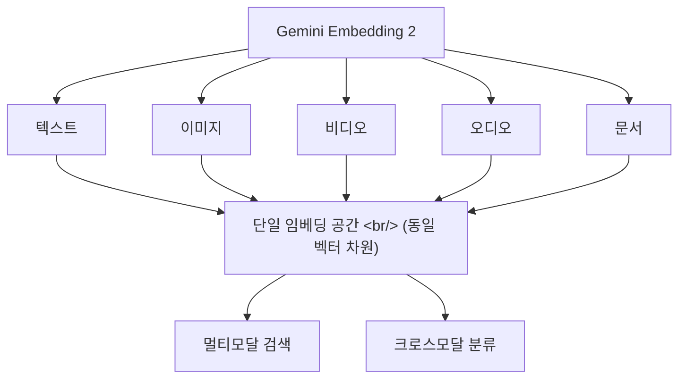

## 개요

Google DeepMind가 2026년 3월 10일 [Gemini Embedding 2](https://blog.google/innovation-and-ai/models-and-research/gemini-models/gemini-embedding-2/)를 공개했다. 텍스트, 이미지, 비디오, 오디오, 문서를 **단일 임베딩 공간**에 매핑하는 최초의 네이티브 멀티모달 임베딩 모델이다.

## 새로운 모달리티와 유연한 차원

기존 임베딩 모델들은 텍스트만 처리하거나, 멀티모달이더라도 별도의 인코더를 사용했다. Gemini Embedding 2는 네이티브하게 여러 모달리티를 하나의 벡터 공간으로 매핑한다.

이는 "고양이 사진"으로 검색하면 고양이가 등장하는 비디오 클립, 고양이 소리가 담긴 오디오, "고양이"라는 텍스트가 포함된 문서를 모두 찾을 수 있다는 뜻이다.

## SOTA 성능

Google은 Gemini Embedding 2가 여러 벤치마크에서 최고 수준(state-of-the-art)의 성능을 달성했다고 발표했다. 텍스트-텍스트 검색뿐 아니라 크로스모달 검색에서도 강력한 성능을 보여준다.

## 활용 시나리오

### 멀티모달 RAG

기존 RAG(Retrieval-Augmented Generation) 파이프라인은 텍스트 문서만 검색 대상으로 삼았다. Gemini Embedding 2를 사용하면 이미지, 비디오, 오디오까지 검색 대상에 포함할 수 있어, 진정한 멀티모달 RAG가 가능해진다.

### 미디어 라이브러리 검색

대규모 미디어 아카이브에서 텍스트 쿼리로 이미지/비디오를 검색하거나, 이미지로 유사한 비디오를 찾는 등의 크로스모달 검색이 가능하다.

### 콘텐츠 분류

다양한 형태의 콘텐츠를 하나의 분류 체계로 정리할 수 있다. 텍스트 레이블과 이미지/오디오 콘텐츠를 같은 공간에서 비교하므로 별도의 분류 모델이 필요 없다.

## 인사이트

멀티모달 임베딩은 검색과 RAG의 게임 체인저가 될 수 있다. 지금까지 "이미지 검색"과 "텍스트 검색"은 완전히 별개의 파이프라인이었는데, 단일 임베딩 공간이 이 경계를 허문다. 특히 RAG 파이프라인에서 PDF 내 이미지, 프레젠테이션 슬라이드, 화이트보드 사진 등을 텍스트와 동일하게 검색할 수 있게 되면, 기업 지식 관리 시스템의 커버리지가 크게 확장될 것이다. Public preview로 출시되었으므로 바로 테스트해볼 수 있다.
