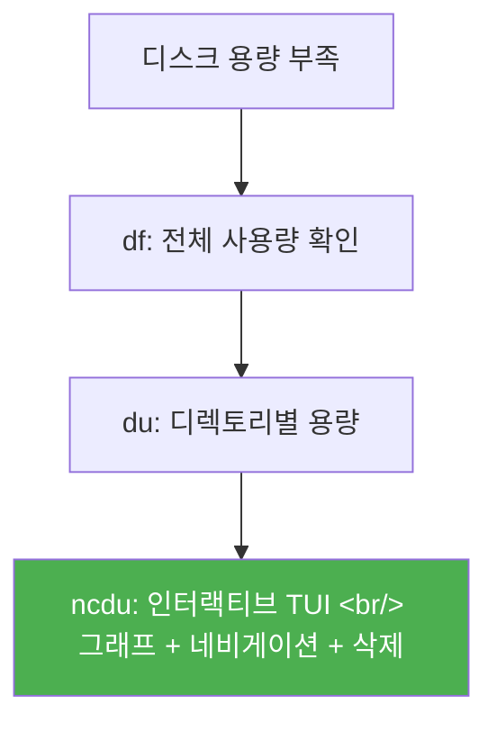

## 개요

EC2 인스턴스의 디스크 용량이 부족해질 때, `df`와 `du` 명령만으로는 어떤 디렉토리가 용량을 많이 차지하는지 파악하기 어렵다. [ncdu](https://dev.yorhel.nl/ncdu)는 ncurses 기반 TUI로 디스크 사용량을 시각적으로 분석해주는 도구다.



## 설치

```bash
# Ubuntu/Debian
sudo apt-get install ncdu

# CentOS/RHEL
yum install -y ncdu

# macOS
brew install ncdu
```

## 기본 사용법

```bash
# 현재 디렉토리 분석
ncdu

# 특정 경로 분석
ncdu /var/log

# 전체 디스크 분석
ncdu /
```

실행하면 스캔 후 그래픽 막대와 함께 디렉토리/파일의 트리 구조가 표시된다. 어디에서 용량을 많이 사용하는지 직관적으로 파악할 수 있다.

## 주요 조작

| 키 | 동작 |
|----|------|
| 방향키 | 디렉토리 탐색 |
| Enter | 하위 디렉토리 진입 |
| `i` | 선택 항목 상세 정보 |
| `d` | 선택 항목 삭제 (확인 필요) |
| `?` / `Shift+?` | 도움말 |
| `q` | 종료 |

## df, du와의 차이

| 도구 | 장점 | 단점 |
|------|------|------|
| `df` | 파티션별 전체 사용량 즉시 확인 | 어떤 디렉토리가 문제인지 모름 |
| `du` | 디렉토리별 용량 계산 | 출력이 길고 정렬이 번거로움 |
| `ncdu` | 인터랙티브 TUI, 즉시 정렬, 삭제 가능 | 별도 설치 필요 |

## 인사이트

서버 디스크 관리에서 ncdu는 `htop`이 프로세스 관리에 하는 것과 같은 역할을 한다 — 기본 명령어(`df`, `du`)로 할 수 있는 일이지만, TUI로 인터랙티브하게 탐색할 수 있다는 것만으로 효율이 크게 달라진다. 특히 EC2처럼 디스크 용량이 제한된 환경에서 갑자기 디스크가 가득 찼을 때, ncdu 하나면 원인 파악부터 정리까지 터미널을 벗어나지 않고 처리할 수 있다.
