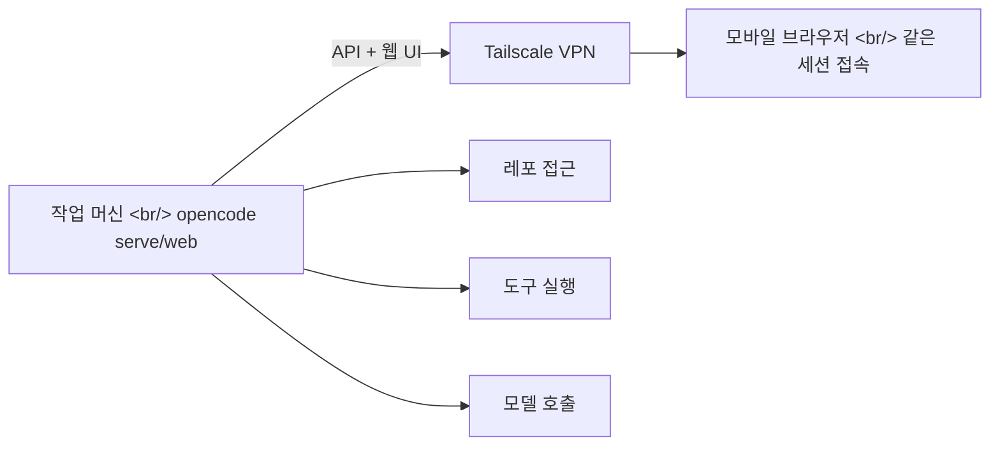

## 개요

"집 PC에서 하던 OpenCode 작업을 밖에서 그대로 이어서 하고 싶다." SSH는 번거롭고 모바일로는 더 답답한 상황에서, [opencode serve/web](https://tilnote.io/pages/699fc2a3e2c6450408637dac)이 해결책이 될 수 있다.

## 핵심 개념: "TUI가 본체가 아니라, 서버가 본체"

opencode의 아키텍처에서 중요한 관점 전환이 있다. TUI(터미널 UI)는 단순히 서버에 접속하는 클라이언트일 뿐, 실제 작업의 "본체"는 서버(백엔드)다. 이 관점을 이해하면 원격 개발이 자연스러워진다.

## opencode web

급할 때 가장 편한 방법이다. API 서버와 웹 UI를 함께 올려주기 때문에, 별도 앱이나 SSH 없이도 폰 브라우저만 열면 "방금 하던 그 화면"으로 들어갈 수 있다.

무거운 작업(레포 접근, 도구 실행, 모델 호출)은 서버 머신이 처리하고, 모바일 기기는 입력과 화면만 담당한다.

## opencode serve

`opencode serve`는 "화면 없는 백엔드"를 띄우는 명령이다. 웹 UI 없이 API 서버만 실행되므로, 커스텀 클라이언트를 연결하거나 자동화 파이프라인에서 사용할 수 있다.

## 보안: Tailscale + 비밀번호

포트를 직접 열지 않고 Tailscale VPN을 통해 접속하는 것이 권장된다. Tailscale 네트워크 내에서만 접근 가능하므로 외부 노출 위험이 없다.

## 인사이트

AI 코딩 도구의 "서버-클라이언트 분리" 패턴이 점점 일반화되고 있다. GitHub Codespaces, code-server, 그리고 이제 opencode까지 — "무거운 연산은 서버, 인터랙션은 클라이언트"라는 아키텍처가 AI 코딩에서도 자연스럽게 자리잡고 있다. 특히 모바일에서 AI 에이전트에게 간단한 지시를 내릴 수 있다는 점은, 개발 워크플로우의 시간적 제약을 크게 줄여줄 수 있다.
