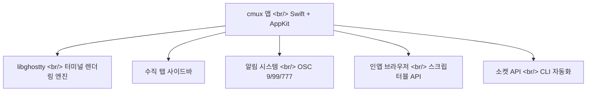
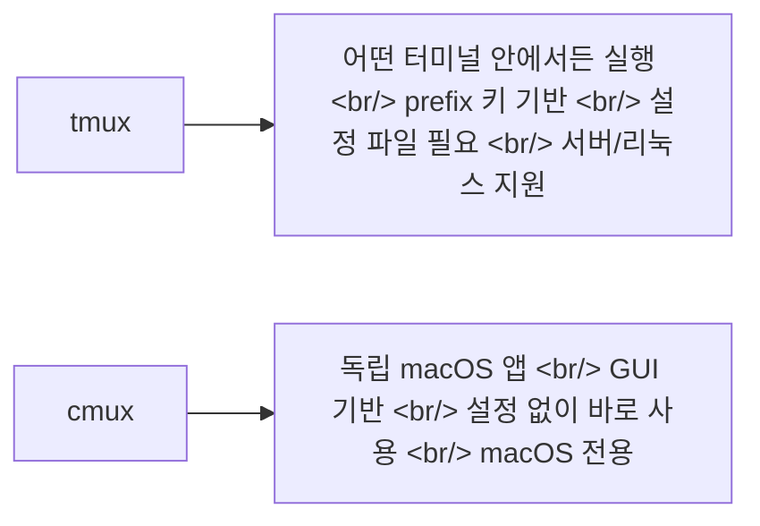

## 개요

AI 코딩 에이전트를 3~4개씩 동시에 돌리다 보면, 터미널 창이 폭발한다. iTerm2 탭이 15개, tmux 세션이 8개 — 어떤 에이전트가 입력을 기다리는지 찾느라 시간을 소모한다. [cmux](https://www.cmux.dev/)는 이 문제를 정면으로 해결하기 위해 설계된 macOS 네이티브 터미널이다.

<!--more-->

## 아키텍처: Ghostty 위의 새로운 레이어

cmux는 Ghostty의 **포크가 아니다**. libghostty를 라이브러리로 사용하는 별도의 앱이다 — WebKit을 사용하는 앱들이 Safari의 포크가 아닌 것과 같은 관계다. Mitchell Hashimoto(Ghostty + HashiCorp 창시자) 본인이 "또 하나의 libghostty 기반 프로젝트"라며 긍정적으로 언급했다.

GPU 가속 렌더링은 Ghostty에서 그대로 가져오므로 속도는 동일하다. 그 위에 cmux만의 레이어가 올라간다.

## 핵심 기능

### 수직 탭

사이드바에 탭이 수직으로 배치된다. 각 탭에는 git 브랜치, 작업 디렉토리, 포트, 알림 텍스트가 표시된다. Firefox의 수직 탭을 터미널에 적용한 것과 유사한 UX다.

### 알림 링

에이전트가 주의를 필요로 할 때:
1. **패인 알림 링**: 해당 패인 주변에 링이 표시
2. **사이드바 뱃지**: 읽지 않은 알림 카운트
3. **알림 팝오버**: 앱 내 알림
4. **macOS 데스크톱 알림**: 시스템 알림

표준 터미널 이스케이프 시퀀스(OSC 9/99/777)를 사용하므로 별도 설정 없이 동작한다. Claude Code hooks로도 트리거할 수 있다.

### 인앱 브라우저

터미널 옆에 브라우저를 분할 배치할 수 있다. PR 페이지나 문서를 브라우저에 띄워놓고, 옆에서 Claude Code가 작업하는 형태다. 스크립터블 API로 자동화도 가능하다.

### 분할 패인

수평/수직 분할을 각 탭 내에서 지원한다. tmux의 분할 기능과 유사하지만 GUI로 관리한다.

## tmux와의 차이

| 구분 | tmux | cmux |
|------|------|------|
| 플랫폼 | 어디서든 (SSH 포함) | macOS 전용 |
| UI | TUI (텍스트) | 네이티브 GUI |
| 설정 | `.tmux.conf` 필수 | 설정 없이 바로 사용 |
| 내장 브라우저 | 없음 | 있음 (스크립터블) |
| 알림 | 없음 (recon 같은 도구 필요) | 내장 |
| 에이전트 호환 | 모든 에이전트 | 모든 에이전트 |

## 커뮤니티 반응

Google DeepMind Research Director Edward Grefenstette, Dagster 창시자 Nick Schrock, HashiCorp 창시자 Mitchell Hashimoto 등이 긍정적 피드백을 남겼다. 일본 개발자 커뮤니티에서도 "Warp → Ghostty → cmux"로 이동했다는 반응이 나오고 있다.

실제 사용 후기에서 가장 많이 언급되는 워크플로우:
> "수직 탭 하나에 WIP 작업 하나. 안에서 Claude Code 한쪽, 브라우저에 PR과 리소스 한쪽. 작업 전환이 자연스럽다."

## 설치

무료이며, GitHub에서 소스 코드를 확인할 수 있다. macOS에서만 동작한다.

## 인사이트

cmux의 포지션은 명확하다 — tmux의 기능성을 macOS 네이티브 UX로 포장하고, AI 에이전트 워크플로우에 최적화한 것이다. 특히 알림 시스템은 "에이전트가 입력을 기다리고 있다"는 사실을 놓치지 않게 해주는데, 이것은 동시에 여러 에이전트를 돌리는 워크플로우에서 가장 큰 마찰 포인트였다. Ghostty의 libghostty를 라이브러리로 활용한다는 아키텍처 결정도 흥미롭다 — 터미널 렌더링이라는 어려운 문제를 해결된 것으로 취급하고, 그 위의 UX 레이어에 집중할 수 있게 해준다.
