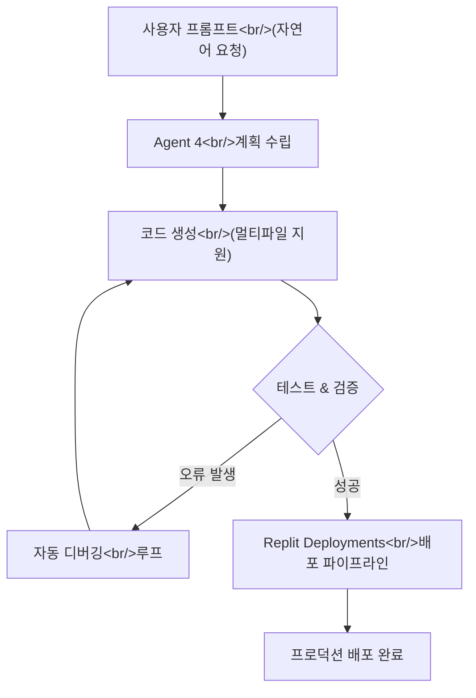

## 개요

Replit이 자사 AI 코딩 에이전트의 4번째 메이저 버전인 **Replit Agent 4**를 출시했다. 개발 유튜브 채널 **개발동생**이 공개한 리뷰 영상(제목: *"Replit Agent 4 is finally here! | This is the biggest update ever!"*)에서도 이 업데이트를 "역대급"이라 표현할 만큼 전면적인 개선이 이루어졌다. 코드 생성 품질, 멀티파일 프로젝트 처리, 디버깅 자동화, 배포 파이프라인 통합까지 — Replit Agent 4가 무엇이 달라졌는지 정리한다.

<!--more-->

---

## 빠른 링크

| 항목 | 링크 |
|------|------|
| 개발동생 YouTube 리뷰 영상 | [Replit Agent 4 is finally here! \| This is the biggest update ever!](https://www.youtube.com/@개발동생) |
| Replit 공식 사이트 | [replit.com](https://replit.com) |

---

## Replit Agent 4란?

Replit Agent는 자연어 프롬프트만으로 앱을 생성·수정·배포해주는 AI 코딩 에이전트다. 기존 버전들이 간단한 스크립트나 단일 파일 수준의 작업에 집중했다면, Agent 4는 **실제 프로덕션 수준의 멀티파일 프로젝트**를 자율적으로 다룰 수 있도록 설계되었다.

Replit 계정이 있다면 누구나 사용할 수 있으며, 별도의 로컬 설치 없이 브라우저에서 바로 작동한다.

---

## 주요 변경 사항

### 1. 코드 생성 품질 향상

Agent 4는 이전 버전 대비 코드 생성의 **정확성과 일관성**이 크게 개선되었다. 단순한 보일러플레이트 생성을 넘어, 컨텍스트를 더 깊이 이해하고 프로젝트 전체 구조에 맞는 코드를 작성한다.

- 더 정확한 함수·클래스 생성
- 라이브러리 버전 호환성 자동 고려
- 코드 스타일 일관성 유지

### 2. 멀티파일 프로젝트 처리

기존 Agent의 가장 큰 한계 중 하나였던 **멀티파일 프로젝트 처리 능력**이 전면 개선되었다. 파일 간 의존성을 파악하고, import 구조를 자동으로 정리하며, 변경 사항이 다른 파일에 미치는 영향을 사전에 분석한다.

### 3. 디버깅 자동화

오류 발생 시 Agent가 자율적으로 원인을 분석하고 수정 코드를 제안한다. 이전에는 에러 메시지를 그대로 출력하거나 불완전한 수정안을 제시하는 경우가 많았지만, Agent 4는 **반복적인 디버그 루프**를 스스로 돌며 문제를 해결한다.

### 4. 자율적인 태스크 완료

"로그인 기능이 있는 웹 앱을 만들어줘"처럼 고수준 지시만으로도 Agent가 계획을 세우고, 단계별로 실행하며, 완성된 결과물을 전달한다. 사용자의 중간 개입 없이 **end-to-end 태스크 완료**가 가능해졌다.

### 5. 배포 파이프라인 통합

코드 작성에서 그치지 않고, Replit의 **Deployments** 기능과 긴밀하게 통합되었다. 에이전트가 작성한 코드를 바로 프로덕션 환경에 배포하는 흐름이 한층 자연스러워졌다.

---

## Replit Agent 4 워크플로우

---

## 기존 버전과의 비교

| 기능 | Agent 3 | Agent 4 |
|------|---------|---------|
| 멀티파일 처리 | 제한적 | 전면 지원 |
| 디버깅 자동화 | 수동 개입 필요 | 자율 루프 |
| 배포 통합 | 별도 단계 | 원클릭 통합 |
| 태스크 자율성 | 단계별 확인 필요 | End-to-end 완료 |
| 접근성 | 유료 플랜 | 전체 사용자 |

---

## 정리

Replit Agent 4는 "AI가 코드를 도와준다"는 수준에서 "AI가 앱을 만들어준다"는 수준으로 넘어가는 전환점처럼 보인다. 멀티파일 프로젝트 처리와 자율적인 디버그 루프는 기존 에이전트들의 한계를 실질적으로 극복한 개선이다.

빠른 프로토타이핑이나 사이드 프로젝트를 진행하는 개발자라면 한 번쯤 직접 써볼 만한 업데이트다. 개발동생 채널의 리뷰 영상도 실제 사용 시연과 함께 이 변화를 잘 짚어주고 있으니 함께 참고하길 권한다.
