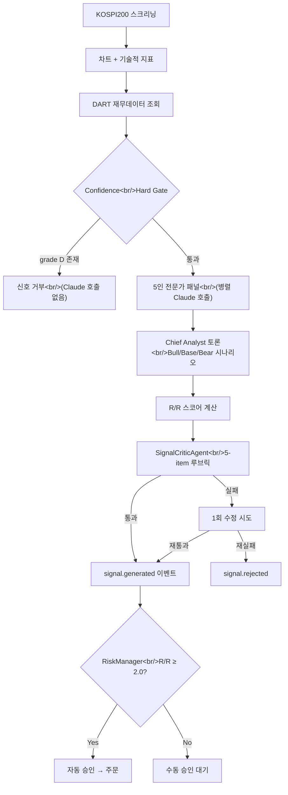
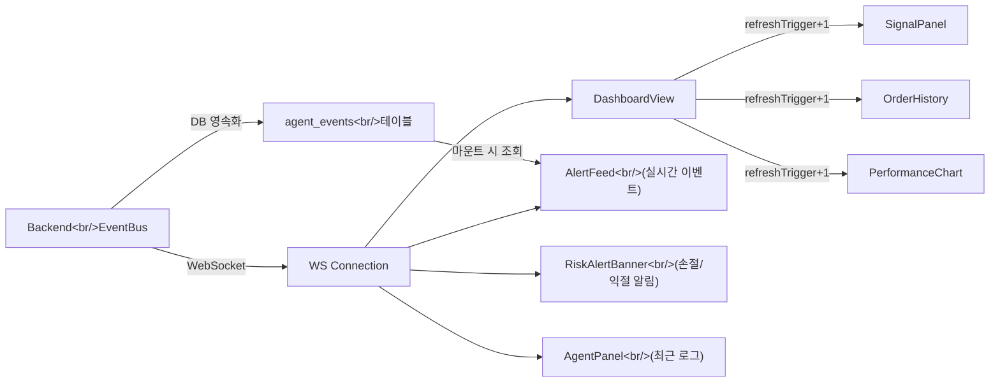

## 개요

[이전 글: #3 — TradingAgents 분석](/posts/2026-03-17-trading-agents/)에서 오픈소스 TradingAgents 레포를 분석했다. 그 과정에서 우리 에이전트에 빠진 것들이 눈에 들어왔다 — 재무제표 기반 펀더멘털 분석, 투자 신호 품질 검증, 시나리오 기반 R/R(Risk/Reward) 스코어링, 그리고 리치 리포트 출력. 이번 글에서는 이 네 가지 갭을 모두 메우는 과정을 기록한다.

3개 세션, 총 20시간 넘게 작업했다. 37개 커밋, 25개 파일 신규 생성, 65개 파일 변경. 설계 → 스펙 리뷰 → 구현 플랜 → Subagent 기반 TDD 실행 → 머지 → 프론트엔드 디버깅 → 대시보드 리액티비티 개선까지 한 사이클을 돌았다.

<!--more-->

## 1. 갭 분석 — 우리에게 없는 것

`kipeum86/stock-analysis-agent` 레포와 비교하면서 정리한 기능 갭 테이블:

| 기능 | stock-analysis-agent | 우리 trading-agent |
|---|---|---|
| 펀더멘털 데이터 (DART API) | PER, EPS, 매출 등 | 기술적 분석만 |
| 데이터 신뢰도 등급 | A/B/C/D 검증 | 없음 |
| 시나리오 프레임워크 | Bull/Base/Bear + 확률 | 없음 |
| R/R 스코어 공식 | 정량적 계산 | 없음 |
| 비평가(Critic) 에이전트 | 7-item 품질 루브릭 | 없음 |
| 리치 HTML 리포트 | KPI 타일, 차트 | 플레인 텍스트 |

반면 우리 쪽 강점은 — 실시간 주문 실행, 리스크 관리(손절/익절), 이벤트 기반 멀티 에이전트 오케스트레이션, WebSocket 푸시. 읽기 전용 리서치 툴 vs 실행 가능한 트레이딩 시스템이라는 근본적 차이가 있다.

목표는 명확했다: **A) DART 펀더멘털 연동 → B) 신호 품질 검증 (비평가 + R/R) → C) 리치 대시보드**. Vertical Slice 접근법으로 한 종목이 전체 파이프라인을 관통하는 것부터 만들기로 했다.

## 2. DART 재무제표 연동

### DartClient 설계

금감원 전자공시시스템(DART) OpenAPI를 래핑하는 `DartClient` 서비스를 만들었다. 핵심 설계 결정들:

- **`DART_API_KEY`는 선택적** — 없으면 `enabled=False`로 모든 필드를 grade D 처리. 이러면 confidence hard gate에서 즉시 reject되어 Claude API 비용 낭비 없이 신호가 차단된다.
- **Corp code 캐싱** — DART는 종목코드가 아닌 8자리 고유번호를 쓴다. `corpCode.xml` 엔드포인트에서 전체 매핑을 받아 SQLite `dart_corp_codes` 테이블에 캐싱. 하루에 한 번만 갱신.
- **일일 재무 캐시** — 같은 종목 재무데이터를 하루 안에 중복 호출하지 않도록 `dart_cache` 테이블 도입.

```python
class DartClient:
    def __init__(self):
        self.enabled = bool(settings.dart_api_key)
        self.base_url = "https://opendart.fss.or.kr/api"

    async def fetch(self, stock_code: str) -> dict:
        if not self.enabled:
            return {"financials": None, "confidence_grades": {
                "dart_revenue": "D", "dart_operating_profit": "D",
                "dart_per": "D", "dart_eps": "D",
            }}
        corp_code = await self._resolve_corp_code(stock_code)
        # fnlttSinglAcntAll 엔드포인트로 최근 4분기 재무제표 조회
        ...
```

### Confidence Grading

모든 데이터 소스에 신뢰도 등급을 매긴다:

```python
class DataConfidence(Enum):
    A = "A"  # 공시 원본, 산술 검증 완료
    B = "B"  # 2개 이상 소스, 5% 이내 오차
    C = "C"  # 단일 소스, 미검증
    D = "D"  # 데이터 없음 — hard gate 트리거
```

**Hard gate**: `current_price`, `volume`, `dart_revenue`, `dart_operating_profit`, `dart_per` 중 하나라도 grade D면 신호 생성 자체를 중단한다. "모르는 건 추측하지 않는다"가 원칙이다.

## 3. 신호 파이프라인 — 5인 전문가 → 비평가 → R/R 게이트

기존 4인 전문가 패널(기술적, 거시경제, 심리, 리스크)에 **기본적분석가**를 5번째로 추가했다. DART 데이터를 주 입력으로 받아 매출 성장 추세, 영업이익률, PER/PBR 밸류에이션, 부채비율을 분석한다.



### R/R 스코어링

기존 `confidence: float` 필드를 시나리오 기반 구조로 교체했다:

```python
class Scenario(BaseModel):
    label: str          # "강세" / "기본" / "약세"
    price_target: float
    upside_pct: float   # 현재가 대비 %
    probability: float  # 0.0–1.0, 3개 합 = 1.0

class SignalAnalysis(BaseModel):
    bull: Scenario
    base: Scenario
    bear: Scenario
    rr_score: float     # (bull.upside × bull.prob + base.upside × base.prob)
                        #  / |bear.upside × bear.prob|
    variant_view: str   # 시장 컨센서스가 놓치고 있는 포인트

def compute_rr_score(bull, base, bear) -> float:
    upside = bull.upside_pct * bull.probability + base.upside_pct * base.probability
    downside = abs(bear.upside_pct * bear.probability)
    return upside / downside if downside > 0 else 0.0
```

`RiskManager`의 자동 승인 게이트에 `min_rr_score` 조건을 추가했다. R/R ≥ 2.0이고 `critic_result == "pass"`일 때만 자동 승인이 가능하다.

### SignalCriticAgent

신호 생성 직후, 이벤트 발행 전에 비평가가 5개 항목을 검사한다:

| # | 검사 항목 | 통과 조건 |
|---|---|---|
| 1 | 시나리오 완전성 | 3개 시나리오 존재, 확률 합 1.0 ±0.01 |
| 2 | 데이터 신뢰도 | 핵심 필드에 grade D 없음 |
| 3 | R/R 산술 검증 | 계산된 R/R과 선언된 R/R이 5% 이내 |
| 4 | 전문가 이견 반영 | 최소 1인의 비주류 의견이 토론에 포함 |
| 5 | Variant view 구체성 | 일반적 리스크 문장이 아닌 구체적 데이터 포인트 참조 |

항목 1-3은 프로그래밍적으로 검사(Claude 호출 없음), 4-5만 Claude 루브릭 검사를 수행한다. 실패 시 Chief에게 피드백을 주입해 1회 수정 기회를 준다. 2차 실패 시 `signal.rejected`로 드롭.

### Chief 토론 업데이트

5인 체제에 맞춰 consensus 기준도 변경:
- `bullish_count >= 4` → `"우세"` (≥80%)
- `bullish_count == 3` → `"과반수"` (60%)
- `bullish_count <= 2` → `"분열"`

## 4. DB 스키마 확장

`signals` 테이블에 7개 컬럼을 추가하고, `agent_events` 테이블을 새로 만들었다:

```sql
-- 기존 DB에 ALTER TABLE로 마이그레이션 (column already exists면 무시)
ALTER TABLE signals ADD COLUMN scenarios_json TEXT;
ALTER TABLE signals ADD COLUMN variant_view TEXT;
ALTER TABLE signals ADD COLUMN rr_score REAL;
ALTER TABLE signals ADD COLUMN expert_stances_json TEXT;
ALTER TABLE signals ADD COLUMN dart_fundamentals_json TEXT;
ALTER TABLE signals ADD COLUMN confidence_grades_json TEXT;
ALTER TABLE signals ADD COLUMN critic_result TEXT;

-- 에이전트 이벤트 영속화
CREATE TABLE IF NOT EXISTS agent_events (
    id INTEGER PRIMARY KEY AUTOINCREMENT,
    event_type TEXT NOT NULL,
    agent_name TEXT,
    data_json TEXT,
    timestamp DATETIME DEFAULT (datetime('now'))
);
```

`risk_config` 테이블에는 `min_rr_score` (기본값 2.0)과 `require_critic_pass` (기본값 true) 행을 시드했다.

## 5. 대시보드 리액티비티와 ReportViewer

### WebSocket 기반 실시간 갱신

기존 대시보드는 마운트 시 한 번만 데이터를 가져왔다. WebSocket 이벤트가 들어와도 UI가 반응하지 않았다. 이를 개선했다:



**핵심 변경**: `DashboardView`에서 WS 메시지 수신 시 `refreshTrigger` state를 증가시키고, 각 패널 컴포넌트가 이 prop 변경을 감지해 데이터를 다시 fetch한다. `RiskAlertBanner`는 `signal.stop_loss`와 `signal.take_profit` 이벤트를 감지해 상단에 경고 배너를 표시한다.

### Agent Events 영속화

기존에는 에이전트 이벤트가 메모리에만 있어서 서버 재시작 시 사라졌다. `event_bus.py`에서 이벤트 발행 시 fire-and-forget으로 DB에 저장하고, `AlertFeed` 마운트 시 DB에서 최근 이벤트를 불러온 뒤 WS 실시간 이벤트와 병합한다.

### ReportViewer

기존 `ReportList`를 완전히 교체하는 새 컴포넌트를 만들었다:

- **KPI 타일 행**: 총 수익률, 승률, 평균 R/R, 총 거래 수
- **거래 테이블**: 종목별 매수/매도 내역과 수익률
- **신호 그리드**: 시나리오 카드와 전문가 스탠스
- **Narrative 섹션**: 마크다운 리포트 본문

백엔드에서는 `report_generator.py`가 `summary_json`을 구조화된 형태로 생성하고, `reports.py` 라우터의 `_enrich_report()`가 JSON 컬럼을 파싱해 프론트엔드에 전달한다.

## 6. 삽질 기록

### `import type`을 빠뜨리면 React가 백지가 된다

머지 후 대시보드가 완전히 하얗게 됐다. 에러 바운더리가 없어서 아무 단서도 없었다. Playwright로 브라우저 콘솔을 확인해서야 원인을 찾았다:

```
Uncaught SyntaxError: The requested module does not provide an export named 'Scenario'
```

TypeScript의 `interface`는 컴파일 타임에 지워진다. 그런데 세 컴포넌트가 모두 `import { Scenario } from '../../types'`로 런타임 import를 하고 있었다. 수정은 간단했다:

```typescript
// Before — runtime import of a type-only construct
import { Scenario } from '../../types';

// After — properly erased at compile time
import type { Scenario } from '../../types';
```

세 파일(`SignalCard.tsx`, `ScenarioChart.tsx`, `FundamentalsKPI.tsx`) 모두 같은 패턴. Error boundary가 없는 상태에서 한 컴포넌트의 crash가 전체 페이지를 날려버리는 건 mermaid에서 한 다이어그램 오류가 전체를 숨기는 것과 같은 패턴이다.

### 9시간 전? — UTC 타임스탬프 파싱 문제

대시보드의 모든 시간이 "9시간 전"으로 표시됐다. SQLite `datetime('now')`는 UTC 문자열을 `Z` 접미사 없이 `"2026-03-17 01:55:01"` 형태로 저장한다. JavaScript `new Date()`는 이걸 로컬 타임존으로 해석해서 KST(UTC+9) 환경에서 9시간 차이가 발생했다.

```typescript
// frontend/src/utils/time.ts — 모든 컴포넌트에서 공유하는 UTC 파서
export function parseUTC(timestamp: string): Date {
  const ts = timestamp.endsWith('Z') || timestamp.includes('+')
    ? timestamp
    : timestamp + 'Z';
  return new Date(ts);
}
```

`AgentPanel`, `AlertFeed`, `OrderHistory`, `PerformanceChart`, `ReportViewer`, `RiskAlertBanner` 6개 컴포넌트에서 `new Date(timestamp)`를 `parseUTC(timestamp)`로 일괄 교체했다.

## 7. 커밋 로그

3세션에 걸친 37개 커밋 요약:

| 단계 | 커밋 수 | 내용 |
|---|---|---|
| 설계 | 3 | 스펙 문서 작성, 리뷰 반영, 구현 플랜 |
| Phase A: DART | 4 | `DataConfidence` enum, `Scenario`/`SignalAnalysis` 모델, DB 스키마, `DartClient` |
| Phase B: 품질 | 4 | Chief 토론 업데이트, `SignalCriticAgent`, DART+hard gate 연결, critic 루프 연결 |
| Phase C: UI | 4 | R/R 게이트, signals API 확장, React 컴포넌트 3종, `import type` 수정 |
| 머지 | 1 | feature branch → main (1,493줄 삽입, 25파일) |
| 대시보드 | 7 | 설계 스펙, 구현 플랜, WS 리프레시, `RiskAlertBanner`, 이벤트 영속화, `AgentPanel` 로그 |
| 리포트 | 6 | `ReportSummary` 타입, `getReport` API, `summary_json` 계산, `ReportViewer`, CSS, `ReportList` 삭제 |
| 수정 | 4 | `confidence_grades_json` 파싱, Reports 탭 네비게이션, AgentPanel 레이아웃, UTC 파싱 |
| 기타 | 4 | `.gitignore`, 플랜 문서, 기타 |

## 8. 인사이트

### Vertical Slice가 통합 문제를 일찍 드러낸다

DART → 전문가 → Chief → Critic → R/R 게이트 → UI를 한 종목으로 먼저 관통시키니, `import type` 문제라든가 `confidence_grades_json` 누락 같은 통합 이슈가 머지 직후 바로 드러났다. 레이어별로 완성했다면 나중에 훨씬 큰 디버깅 비용이 들었을 것이다.

### 비평가 에이전트의 프로그래밍적 검사가 LLM 비용을 절약한다

5개 루브릭 중 3개(시나리오 완전성, 데이터 신뢰도, R/R 산술)는 Claude 호출 없이 순수 코드로 검증한다. 나머지 2개만 LLM이 판단한다. "LLM에게 산술을 시키지 마라"는 원칙 — 계산은 코드가, 판단은 LLM이.

### 시간 다루기는 항상 함정이다

SQLite의 `datetime('now')`가 `Z` 없이 UTC를 저장하는 건 문서화된 동작이지만, 프론트엔드에서 `new Date()`로 파싱할 때 로컬로 해석되는 건 매번 빠지는 함정이다. `parseUTC()` 유틸리티를 한 번 만들어두고 모든 컴포넌트에서 일관되게 사용하는 게 정답이었다.

### 다음 할 일

- Error boundary 추가 — 컴포넌트 하나의 crash가 전체 페이지를 죽이지 않도록
- DART API rate limiting — 현재 단순 daily cache만 있는데, 다중 종목 동시 스캔 시 호출 제한 대응 필요
- 실제 마켓 스캐너 실행 후 critic rejection 비율 확인 — 루브릭이 너무 엄격하면 유용한 신호까지 차단할 수 있다
