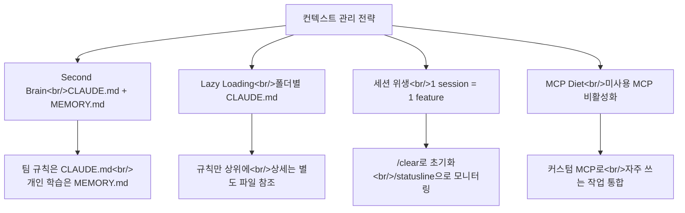
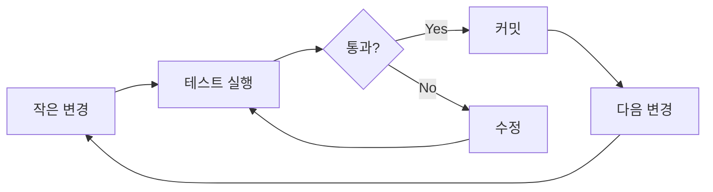
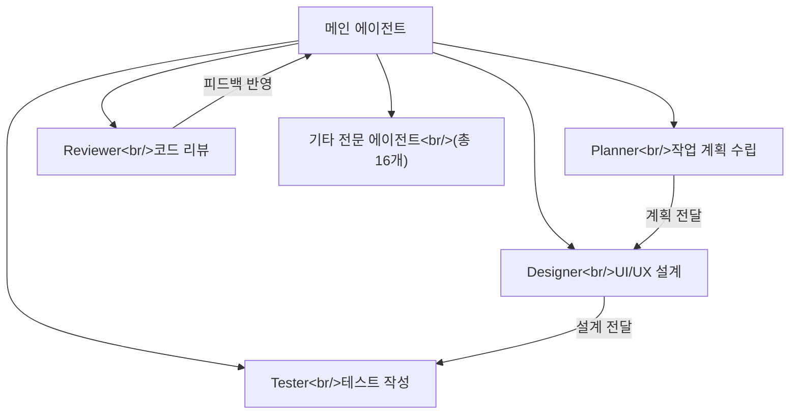

## 개요

Claude Code를 설치하고 기본 사용법을 익힌 뒤, 실제 프로젝트에서 생산성을 끌어올리려면 **컨텍스트 관리**와 **워크플로우 설계**라는 두 축을 잡아야 한다. 이 글에서는 두 편의 영상을 기반으로 실전에서 바로 적용할 수 있는 전략과 패턴을 정리한다.

첫 번째 영상은 메타 엔지니어가 정리한 **컨텍스트 관리와 실전 워크플로우 20분 총정리**([영상 링크](https://www.youtube.com/watch?v=DCsv0rKKrN4))로, Second Brain 구축부터 TDD 기반 개발, Cross-AI 비평까지 다룬다. 두 번째 영상은 Anthropic 해커톤 우승자 Afan Mustafa의 **Claude Code 10가지 꿀팁**([영상 링크](https://www.youtube.com/watch?v=QhZJyg47JW0))으로, GitHub 스타 7만 이상을 달성한 실전 노하우를 초급-중급-고급 단계로 풀어낸다.

두 영상의 핵심 메시지는 같다. **Claude Code의 성능은 얼마나 좋은 컨텍스트를 주느냐에 달려 있고, 그 컨텍스트를 체계적으로 관리하는 시스템이 곧 생산성이다.**

<!--more-->

## 컨텍스트 관리의 핵심 원칙

### Second Brain — 지식을 구조화하라

Claude Code와 작업하면서 발견한 패턴, 해결책, 의사결정을 로컬 markdown 파일에 기록해두는 전략이다. 이전에는 수동으로 관리했지만, 현재는 `/memory` 명령으로 자동화되었다.

| 파일 | 역할 | 범위 |
|------|------|------|
| `CLAUDE.md` | 팀 공유 규칙, 코딩 컨벤션, 아키텍처 결정 | 프로젝트 전체 |
| `MEMORY.md` | 개인 선호, 반복 실수 패턴, 학습 내용 | 개인 |
| `TODO.md` | 세션 간 작업 연속성 유지 | 세션 단위 |

핵심은 **CLAUDE.md에 모든 것을 넣지 않는 것**이다. 규칙(rule)만 넣고, 상세 내용은 별도 파일로 분리한 뒤 참조하게 한다. 이것이 **Lazy Loading** 패턴이다.

### Lazy Loading — 필요할 때만 로드하라

CLAUDE.md가 비대해지면 매 세션마다 불필요한 토큰이 소모된다. 대신 폴더별 CLAUDE.md를 활용한다.

```
project/
├── CLAUDE.md              # 전체 규칙 (간결하게)
├── apps/
│   └── api/
│       └── CLAUDE.md      # API 서버 전용 규칙
├── web/
│   └── CLAUDE.md          # 프론트엔드 전용 규칙
└── docs/
    └── architecture.md    # 참조용 상세 문서
```

Claude가 특정 폴더에서 작업할 때 해당 폴더의 CLAUDE.md만 자동으로 로드된다. 이를 영상에서는 **Progressive Disclosure**라고 표현한다 — 정보를 단계적으로 노출하는 것이다.

### 세션 위생 — 하나의 세션, 하나의 기능

컨텍스트 윈도우는 유한하다. Afan Mustafa는 이를 **"Context is milk"**라고 표현했다 — 시간이 지나면 상한다. 핵심 원칙은 다음과 같다.

- **한 세션 = 한 기능**. 작업이 바뀌면 `/clear`로 컨텍스트를 초기화한다
- **적절한 시점에 compact**한다. 컨텍스트가 70~80% 차면 자동 또는 수동으로 압축
- **/statusline**으로 현재 토큰 사용량을 상시 모니터링한다

### MCP 관리 — 사용하지 않는 도구는 끄라

MCP(Model Context Protocol) 서버가 많을수록 시스템 프롬프트가 비대해진다. 두 영상 모두 같은 조언을 한다: **사용하지 않는 MCP는 비활성화하라.** 이를 "System Prompt Diet"라고 부른다. 자주 쓰는 작업은 커스텀 MCP로 만들어 토큰 효율을 높인다.



추가로, 아키텍처 문서를 Mermaid 다이어그램으로 작성하면 자연어보다 토큰 효율이 높다. 무거운 작업(예: CSV 파싱)은 스크립트로 오프로드하고 결과만 Claude에게 돌려주는 것도 토큰 절약에 효과적이다.

## 실전 워크플로우 패턴

### Plan 모드 — 먼저 설계하고, 그 다음 구현하라

두 영상 모두 **Plan 모드를 먼저 실행하라**고 강조한다. 계획 세션과 구현 세션을 분리하는 것이 핵심이다.

1. Plan 모드에서 구현 방향과 파일 구조를 잡는다
2. Claude의 사고 과정을 읽고, 잘못된 가정이 있으면 일찍 잡는다 (Escape로 중단 가능)
3. 계획이 확정되면 별도 세션에서 구현을 시작한다

**Cross-AI 비평**도 유용하다. Claude의 계획을 ChatGPT나 Gemini에 넘겨서 다른 관점의 피드백을 받는 방식이다. 각 모델의 강점이 다르기 때문에 맹점을 보완할 수 있다.

### TDD 기반 스마트 코딩

메타 엔지니어가 강조한 반복 루프는 다음과 같다.



- 변경 단위를 작게 유지한다
- 매 변경 후 테스트를 돌린다
- 통과하면 바로 커밋한다
- 에러가 발생하면 **로그를 직접 붙여넣는다** — 사람이 해석해서 전달하면 정보가 손실된다

### WAT Framework

NetworkChuck가 제안한 **WAT(Workflow-Agent-Tools)** 프레임워크는 Claude Code 활용의 구조를 잡는 틀이다.

- **Workflow** — 작업의 흐름과 단계를 정의한다
- **Agent** — 각 단계를 수행할 에이전트(Claude 세션)를 배치한다
- **Tools** — 에이전트가 사용할 도구(MCP, 스크립트 등)를 구성한다

작업 복잡도가 올라갈수록 이 프레임워크로 역할을 분리하면 각 세션의 컨텍스트를 깔끔하게 유지할 수 있다.

### 모델 선택 전략

모든 작업에 Opus를 쓸 필요는 없다. Afan Mustafa는 작업 난이도에 따라 모델을 바꾸라고 조언한다.

| 모델 | 적합한 작업 |
|------|------------|
| Haiku | 단순 리팩토링, 포맷 변경, 반복 작업 |
| Sonnet | 일반 코딩, 버그 수정, 문서 작성 |
| Opus | 복잡한 아키텍처 설계, 멀티파일 리팩토링, 어려운 디버깅 |

참조 코드를 제공하는 것도 중요하다. "이 파일의 패턴을 따라서 구현해줘"라고 하면 Claude가 기존 코드 스타일을 일관되게 유지한다.

## 고급 활용: 서브에이전트와 자동화

### 서브에이전트 — 전문화된 16개의 에이전트

Afan Mustafa는 Claude Code 내에서 **16개의 전문 서브에이전트**를 운영한다. 각 에이전트가 특정 역할에 특화되어 있다.



서브에이전트를 활용하면 각 역할의 컨텍스트를 독립적으로 유지할 수 있고, 메인 에이전트가 오케스트레이션만 담당하므로 복잡한 프로젝트도 체계적으로 진행할 수 있다.

### Git Worktrees — 병렬 작업의 핵심

`git worktree`를 사용하면 하나의 레포에서 여러 브랜치를 동시에 체크아웃할 수 있다. 각 worktree에서 별도의 Claude Code 세션을 띄워 **병렬로 기능을 개발**한다.

```bash
# worktree 생성
git worktree add ../project-feature-a feature-a
git worktree add ../project-feature-b feature-b

# 각 worktree에서 독립적인 Claude Code 세션 실행
cd ../project-feature-a && claude
cd ../project-feature-b && claude
```

서로 충돌하지 않는 기능이라면 동시에 개발을 진행하고, 완료 후 main에 머지하는 방식이다.

### Hooks — 자동 학습 시스템

Claude Code의 Hook 기능으로 세션 라이프사이클에 자동화를 걸 수 있다.

| Hook | 타이밍 | 활용 예시 |
|------|--------|----------|
| `session_start` | 세션 시작 시 | TODO.md 자동 로드, 이전 세션 컨텍스트 복원 |
| `pre_compact` | 컨텍스트 압축 전 | 중요 정보를 MEMORY.md에 저장 |
| `stop` | 세션 종료 시 | 작업 진행 상황을 TODO.md에 기록 |

이 Hook들을 조합하면 **세션 간 학습이 자동으로 누적되는 시스템**을 구축할 수 있다. 매번 수동으로 컨텍스트를 설정하는 수고를 줄이고, Claude가 프로젝트에 대해 점점 더 많이 "기억"하게 된다.

## 빠른 링크

- [메타 엔지니어의 클로드코드 완벽 가이드 — 실전편](https://www.youtube.com/watch?v=DCsv0rKKrN4) — 컨텍스트 관리, TDD 워크플로우, Cross-AI 비평
- [Claude Code 10가지 꿀팁 — Anthropic 해커톤 우승자](https://www.youtube.com/watch?v=QhZJyg47JW0) — Progressive Disclosure, 서브에이전트, Git Worktrees, Hooks

## 인사이트

두 영상을 관통하는 인사이트는 **"Claude Code는 도구가 아니라 시스템이다"**라는 점이다. 단순히 프롬프트를 잘 쓰는 것을 넘어, 지식 관리(CLAUDE.md, MEMORY.md), 세션 설계(Plan-Implement 분리, /clear), 도구 최적화(MCP Diet), 자동화(Hooks, 서브에이전트)까지 아우르는 **개발 시스템**을 구축해야 한다.

특히 인상적인 것은 두 영상의 출발점이 다른데도 결론이 수렴한다는 점이다. 메타 엔지니어는 대규모 팀 환경에서, Afan Mustafa는 개인 해커톤 프로젝트에서 출발했지만, 둘 다 **컨텍스트 효율성**과 **작업 단위의 분리**를 최우선으로 꼽는다. 이는 Claude Code의 컨텍스트 윈도우라는 물리적 제약이 만들어낸 자연스러운 수렴이다.

실천 우선순위를 정한다면: 먼저 CLAUDE.md를 정리하고 폴더별로 분리하라. 그 다음 Plan 모드를 습관화하라. 마지막으로 서브에이전트와 Hooks로 자동화를 확장하라. 한 번에 모두 적용하려 하지 말고, 한 단계씩 워크플로우에 녹여가는 것이 핵심이다.
