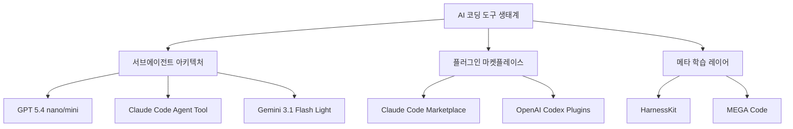
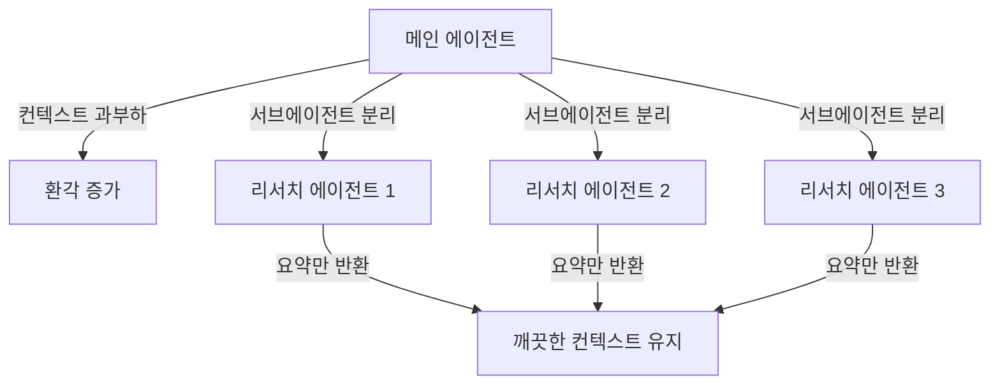
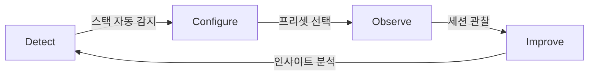

## 개요

AI 코딩 도구 생태계가 빠르게 진화하고 있다. GPT 5.4 nano/mini의 서브에이전트 특화 출시, Claude Code와 OpenAI Codex의 플러그인 마켓플레이스 경쟁, 그리고 세션 데이터에서 스스로 학습하는 메타 학습 레이어까지 — 오늘 탐색한 내용을 정리한다.

<!--more-->



---

## 서브에이전트 시대의 도래

Cole Medin의 YouTube 영상 [The Subagent Era Is Officially Here](https://www.youtube.com/watch?v=GX_EsbcXfw8)는 AI 코딩 도구의 핵심 트렌드를 명확하게 짚어준다.

### 작고, 빠르고, 저렴한 모델의 부상

OpenAI가 GPT 5.4 mini/nano를 출시하면서 처음으로 **"서브에이전트용으로 설계됨"**을 공식 헤드라인에 명시했다. 성능 비교가 인상적이다:

| 모델 | 처리량 | 입력 비용 (1M tokens) | 출력 비용 (1M tokens) |
|------|--------|----------------------|----------------------|
| Claude Haiku 4.5 | 53 tok/s | $1.00 | $5.00 |
| GPT 5.4 nano | 188 tok/s | $0.20 | $1.00 |

GPT 5.4 nano는 Haiku 4.5보다 강력하면서 가격은 1/5, 처리량은 3.5배다. Google도 **Gemini 3.1 Flash Light**를 "intelligence at scale" 용도로 출시하며 같은 방향을 가리킨다.

### Context Rot과 서브에이전트의 필요성



서브에이전트의 핵심 가치는 **context rot 방지**다. LLM에 컨텍스트를 과도하게 넣으면 환각이 증가하고 정보 추출 능력이 저하된다. 서브에이전트로 리서치를 분리하면 메인 에이전트의 컨텍스트를 깨끗하게 유지할 수 있다.

Cole Medin의 실전 팁이 실용적이다:
- **리서치에만 서브에이전트 사용** — 코드베이스 분석, 웹 검색 등
- **구현(implementation)에는 사용하지 말 것** — 프론트/백/DB를 서브에이전트로 나누면 서로 소통 불가로 환각 다발
- 실제 버그 수정 시 3개의 탐색용 서브에이전트를 병렬 실행: 웹 리서치 1개, 프론트엔드 분석 1개, 백엔드 분석 1개

현재 모든 주요 AI 코딩 도구가 서브에이전트를 내장하고 있다: Claude Code(최초 도입), OpenAI Codex, Gemini CLI(실험적), GitHub Copilot, Cursor, Open Code.

---

## Claude Code 플러그인 마켓플레이스

[공식 문서](https://code.claude.com/docs/en/plugin-marketplaces)를 통해 Claude Code의 플러그인 생태계가 본격적으로 구축되고 있음을 확인했다.

### 마켓플레이스 구조

`marketplace.json` 파일이 플러그인 카탈로그 역할을 한다. 플러그인의 구성요소는 5가지: **commands, agents, hooks, MCP servers, LSP servers**. 소스 타입도 다양하다:

- 상대경로 (`./`)
- GitHub repo
- Git URL
- Git subdirectory (monorepo용 sparse clone)
- npm 패키지

설치는 간단하다:
```bash
/plugin marketplace add https://github.com/org/marketplace.git
/plugin install plugin-name@marketplace-name
```

**strict mode**로 plugin.json이 컴포넌트 정의의 권위를 갖고, **release channels**로 버전 관리, **managed marketplace restrictions**로 팀 제한도 가능하다.

### OpenAI Codex의 대응

[OpenAI Codex](https://github.com/openai/codex/releases)도 빠르게 대응하고 있다. 최신 안정 버전 0.116.0의 주요 변경:

- **플러그인 설치 시스템 개선**: 누락 플러그인 자동 설치 프롬프트, suggestion allowlist
- **userpromptsubmit 훅 추가**: 프롬프트 실행 전 차단/수정 가능 (Claude Code의 훅 시스템과 동일 개념)
- **서브에이전트 정책 공유**: `share execpolicy by default` — 서브에이전트 간 권한 정책 공유

GitHub stars 66.9K, 알파 버전 0.117.0-alpha.8까지 진행 중으로 릴리스 속도가 매우 빠르다.

---

## 메타 학습 레이어: HarnessKit과 MEGA Code

단순한 도구를 넘어 **세션 데이터에서 학습하여 스스로 개선하는** 메타 레이어가 등장하고 있다.

### HarnessKit — Zero-Token 관찰과 적응형 가드레일

[HarnessKit](https://github.com/ice-ice-bear/harnesskit)은 Claude Code 플러그인으로, "vibe coder"(AI 보조 코딩 초보자)를 위한 적응형 하네스다. 4단계 루프를 따른다:



특이한 점은 **모든 관찰 훅이 bash + jq로 실행**되어 LLM 토큰 비용이 0이라는 것이다. beginner/intermediate/advanced 프리셋으로 경험 수준별 가드레일을 자동 조정하고, 11개 슬래시 커맨드(`/harnesskit:setup`, `/harnesskit:insights`, `/harnesskit:prd` 등)를 제공한다.

### MEGA Code — Self-evolving AI Coding Infrastructure

[MEGA Code](https://www.megacode.ai/)는 더 정교한 접근을 취한다. 핵심 개념 2가지:

- **Skills**: 세션 로그에서 자동 추출된 재사용 가능한 노하우 (diff -> Skill)
- **Strategies**: 반복 수정 패턴에서 추출된 의사결정 가이드

3-Layer 아키텍처가 야심적이다:
1. **Layer 1** (현재): Auto Skills & Strategies Generation + Eureka (VS Code 확장)
2. **Layer 2** (예정): Wisdom Graph — 기술/전략의 원자 수준 모듈화
3. **Layer 3** (예정): Offline Optimization + Compound Intelligence

벤치마크에 따르면 토큰 사용량이 1/5로 줄고(169K vs 897K baseline), 구조적 품질은 3배 향상된다.

---

## 빠른 링크

- [Claude Tuner](https://claudetuner.com/dashboard/) — Claude Code 사용량 데이터 추적/분석 대시보드
- [Dynamous AI Transformation Workshop](https://dynamous.ai/#/ai-transformation-workshop) — Cole Medin + Lior Weinstein 공동 무료 라이브 이벤트 (2026-04-02, PIV Loop 방법론)
- [Bitbucket: mindai/hybrid-image-search-demo](https://bitbucket.org/mindai/hybrid-image-search-demo/src/main/) — 하이브리드 이미지 검색 데모 프로젝트

---

## 인사이트

오늘 탐색한 내용을 관통하는 3가지 흐름이 명확하다. 첫째, **서브에이전트 아키텍처가 표준이 되었다**. OpenAI가 모델 출시 헤드라인에 "서브에이전트용"을 명시한 것은 이 패러다임이 실험이 아닌 산업 표준임을 선언한 것이다. 둘째, **플러그인 생태계 경쟁이 본격화**되었다. Claude Code와 OpenAI Codex 모두 VS Code Extensions이나 npm처럼 본격적인 마켓플레이스를 구축하며 서드파티 생태계를 키우고 있다. 셋째, **메타 학습 레이어가 차별화 포인트**가 되고 있다. HarnessKit의 "Observe → Improve"와 MEGA Code의 "Skills/Strategies 자동 추출"은 단순 도구를 넘어 에이전트가 사용자와 함께 성장하는 시스템을 지향한다. AI 코딩 도구의 경쟁 축이 "더 똑똑한 모델"에서 "더 스마트한 생태계"로 이동하고 있다.
