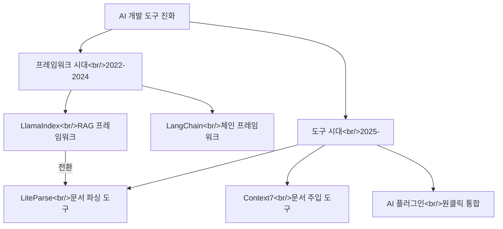

## 개요

AI 개발 도구 생태계의 흐름을 다루는 두 편의 YouTube 영상을 분석했다. [LiteParse](https://www.youtube.com/watch?v=_lpYx03VVBM)는 LlamaIndex 팀이 오픈소스로 공개한 로컬 문서 파서인데, 더 중요한 것은 이를 통해 LlamaIndex가 "프레임워크 시대는 끝났다"고 선언한 배경이다. [별 11만개 AI 플러그인](https://www.youtube.com/watch?v=jw23empkqGg)은 코드 한 줄로 AI 기능을 통합하는 플러그인 생태계를 소개한다. 관련 포스트: [Context7 deep dive](/posts/2026-03-20-context7/), [Claude Code 마켓플레이스 비교](/posts/2026-03-20-claude-code-marketplaces/)

<!--more-->

---

## LiteParse — 문서 파싱의 새로운 접근

### LlamaIndex의 전략적 전환

LiteParse를 이해하려면 LlamaIndex의 역사를 먼저 알아야 한다. Jerry Liu가 2022년 11월에 만든 LlamaIndex는 **최초의 본격적인 RAG 프레임워크**였다. 문서 인덱싱, 검색, 답변 생성을 하나의 프레임워크 안에서 추상화하여, RAG 파이프라인을 쉽게 구축할 수 있게 했다.

하지만 영상에서 지적하듯, 프레임워크 시대에는 근본적인 문제가 있었다:
- 추상화 레이어가 너무 빠르게 변해서 문서가 따라가지 못함
- 프레임워크 내부의 복잡성이 디버깅을 어렵게 만듦
- AI 모델 자체가 빠르게 발전하면서 프레임워크의 추상화가 오히려 제약이 됨

LlamaIndex가 LiteParse를 내놓은 것은 **프레임워크를 포기하고 도구에 집중**하겠다는 전략적 선언이다. "모든 것을 감싸는 프레임워크" 대신 "하나의 문제를 잘 해결하는 도구"를 만들겠다는 것이다.

### LiteParse가 해결하는 문제

코딩 에이전트는 Python 수천 줄을 거뜬히 쓰지만, PDF나 문서를 주면 유용한 맥락이 사라진다:
- **테이블이 평탄화**됨 — 구조 정보 손실
- **차트가 사라짐** — 시각적 데이터 무시
- **숫자가 환각**함 — OCR 오류
- **PyPDF 등의 우회 방법**이 불안정

LiteParse는 **로컬에서 실행되는 문서 파서**로, PDF, DOCX 등의 문서에서 테이블 구조, 차트, 코드 블록을 정확하게 추출한다. 외부 API 의존 없이 로컬에서 동작하므로 프라이버시 문제도 없다.

### 프레임워크 vs 도구

| 구분 | 프레임워크 (LlamaIndex RAG) | 도구 (LiteParse) |
|------|---------------------------|-----------------|
| 범위 | 전체 RAG 파이프라인 | 문서 파싱만 |
| 추상화 | 높음 (인덱스, 검색, 생성) | 낮음 (입력 → 파싱 결과) |
| 유연성 | 프레임워크 방식에 종속 | 아무 파이프라인에 연결 가능 |
| 디버깅 | 추상화 뒤에 숨겨짐 | 입출력이 명확 |
| 유지보수 | 빈번한 breaking changes | 안정적 인터페이스 |

이 전환은 AI 생태계 전반의 흐름과 일치한다. Context7이 "LLM에게 최신 문서를 주입하는 도구"로 성공한 것도, Claude Code 마켓플레이스가 "하나의 기능에 특화된 플러그인"으로 성장하는 것도 같은 맥락이다.

---

## 11만 스타 AI 플러그인

[별 11만개 받은 AI 플러그인, 코드 한 줄이면 끝](https://www.youtube.com/watch?v=jw23empkqGg) 영상에서는 GitHub에서 11만 스타를 기록한 AI 플러그인을 소개한다.

### 원클릭 통합의 가치

핵심 가치는 **진입 장벽 제거**다. AI 기능을 서비스에 추가하려면 원래:
1. 모델 선택, API 키 발급
2. SDK 설치, 클라이언트 초기화
3. 프롬프트 설계, 에러 처리
4. 스트리밍, 레이트 리밋 관리

이 모든 과정을 코드 한 줄로 줄이는 것이 플러그인의 목표다. 11만 스타는 이 접근의 수요를 증명한다.

### 플러그인 생태계의 성장

이 트렌드는 더 넓은 맥락에서 봐야 한다:
- **Claude Code 마켓플레이스** — 개발 워크플로우 플러그인
- **VS Code Extensions** — 에디터 내 AI 통합
- **MCP (Model Context Protocol)** — 표준화된 도구 프로토콜
- **npm/pip AI 패키지** — 코드 레벨 통합

모두 "AI 기능을 최소한의 코드로 통합"이라는 같은 방향을 가리키고 있다.

---

## 인사이트

LlamaIndex의 "프레임워크에서 도구로" 전환은 단순한 기업 전략이 아니라 AI 개발 생태계의 구조적 변화를 반영한다. 2022-2024년은 "모든 것을 감싸는 프레임워크"의 시대였지만, 2025년부터는 "하나를 잘 하는 도구"의 시대가 되고 있다. LiteParse(문서 파싱), Context7(문서 주입), MCP(도구 프로토콜) 모두 이 방향이다. 11만 스타 AI 플러그인의 성공은 개발자들이 원하는 것이 "강력한 프레임워크"가 아니라 "즉시 쓸 수 있는 도구"라는 것을 숫자로 보여준다. 현재 HarnessKit과 log-blog도 이 "도구 시대"의 산물이다 — 프레임워크가 아닌, 특정 문제를 잘 해결하는 플러그인으로 설계했다.
