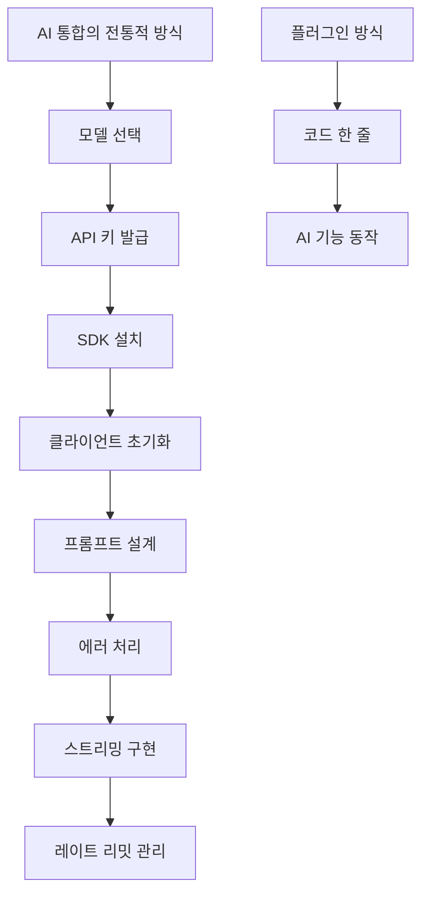
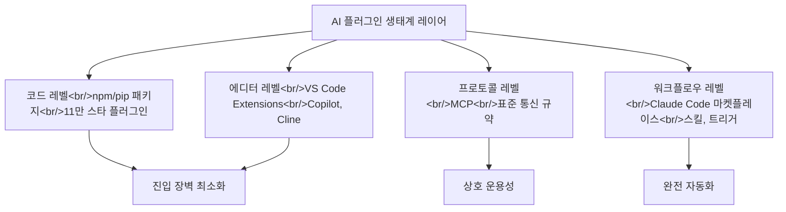

## 개요

YouTube 영상 [별 11만개 받은 AI 플러그인, 코드 한 줄이면 끝](https://www.youtube.com/watch?v=jw23empkqGg)을 분석했다. GitHub에서 11만 스타를 기록한 AI 플러그인이 보여주는 것은 단순한 인기가 아니라, 개발자들이 AI 통합에서 원하는 것이 "강력한 프레임워크"가 아니라 "즉시 쓸 수 있는 한 줄"이라는 시장 신호다. 관련 포스트: [Claude Code 마켓플레이스 비교](/posts/2026-03-20-claude-code-marketplaces/)

<!--more-->

---

## 11만 스타의 의미

GitHub에서 11만 스타는 React(233k), Vue(210k) 같은 메이저 프레임워크 급이다. AI 플러그인이 이 수준의 관심을 받았다는 것은, AI 통합의 진입 장벽이 개발자들에게 얼마나 큰 페인 포인트였는지를 보여준다.

### 기존 AI 통합의 복잡성

서비스에 AI 기능을 추가하려면 원래 이런 과정이 필요하다:

1. **모델 선택** — GPT-4, Claude, Gemini 중 어떤 것을 쓸지
2. **API 키 발급** — 각 서비스의 개발자 콘솔에서 키 생성
3. **SDK 설치** — `openai`, `anthropic`, `google-generativeai` 등
4. **클라이언트 초기화** — 인증, 기본 설정
5. **프롬프트 설계** — 시스템 프롬프트, 사용자 메시지 구조화
6. **에러 처리** — 레이트 리밋, 타임아웃, 잘못된 응답
7. **스트리밍** — 실시간 응답을 위한 SSE 처리
8. **레이트 리밋 관리** — 요청 속도 제어, 재시도 로직

이 모든 과정을 코드 한 줄로 줄이는 것이 플러그인의 목표다. 11만 스타는 이 접근의 수요를 숫자로 증명한다.

---

## 플러그인 생태계의 레이어

AI 플러그인 생태계는 여러 레이어에서 동시에 성장하고 있다:

### 코드 레벨 — npm/pip 패키지

가장 기본적인 레이어. `npm install ai-plugin`이나 `pip install ai-tool` 한 줄로 프로젝트에 AI 기능을 추가한다. 11만 스타 플러그인이 이 레이어에 해당한다.

### 에디터 레벨 — VS Code Extensions

개발 환경 안에서 AI를 사용하는 레이어. GitHub Copilot, Cline, Continue 등이 에디터 내에서 코드 생성, 리뷰, 설명을 제공한다. 플러그인 마켓플레이스를 통해 한 번의 클릭으로 설치된다.

### 프로토콜 레벨 — MCP

Model Context Protocol은 AI 도구 간의 **표준화된 통신 규약**이다. 플러그인이 아닌 프로토콜이라는 점에서 한 단계 위의 추상화다. 어떤 AI 모델이든, 어떤 도구든 MCP를 통해 연결할 수 있다.

### 워크플로우 레벨 — Claude Code 마켓플레이스

개발 워크플로우 전체를 자동화하는 레이어. 스킬, 플러그인, 트리거를 조합하여 복잡한 작업을 자동화한다. [마켓플레이스 비교 포스트](/posts/2026-03-20-claude-code-marketplaces/)에서 다룬 것처럼, 다양한 마켓플레이스가 경쟁하고 있다.

---

## 플러그인 성공의 조건

11만 스타를 달성한 플러그인에서 배울 수 있는 성공 조건:

**1. 즉시 동작** — 설치 후 추가 설정 없이 바로 사용 가능해야 한다. README의 "Getting Started"가 3단계 이내.

**2. 단일 책임** — 하나의 기능을 완벽하게. "AI 기능 추가"라는 하나의 목표에 집중.

**3. 제로 러닝 커브** — 기존에 알고 있는 패턴으로 사용 가능. 새로운 개념을 학습하지 않아도 됨.

**4. 점진적 복잡성** — 한 줄로 시작하되, 고급 사용자를 위한 커스터마이징 옵션 제공.

이 조건들은 현재 HarnessKit과 log-blog 플러그인을 설계할 때도 적용한 원칙이다.

---

## 인사이트

11만 스타가 말해주는 것은 명확하다 — 개발자들은 AI를 "이해"하고 싶은 것이 아니라 "사용"하고 싶다. 프레임워크가 "AI를 이해하고 제어하라"는 접근이라면, 플러그인은 "그냥 써라"는 접근이다. 코드 레벨, 에디터 레벨, 프로토콜 레벨, 워크플로우 레벨에서 동시에 진행되는 이 플러그인화는 AI가 전기처럼 보이지 않는 인프라가 되어가는 과정이다. [LiteParse 포스트](/posts/2026-03-30-ai-dev-tools/)에서 다룬 "프레임워크에서 도구로"의 전환과 같은 맥락에서, 플러그인은 그 도구를 가장 쉽게 전달하는 방법이다.
