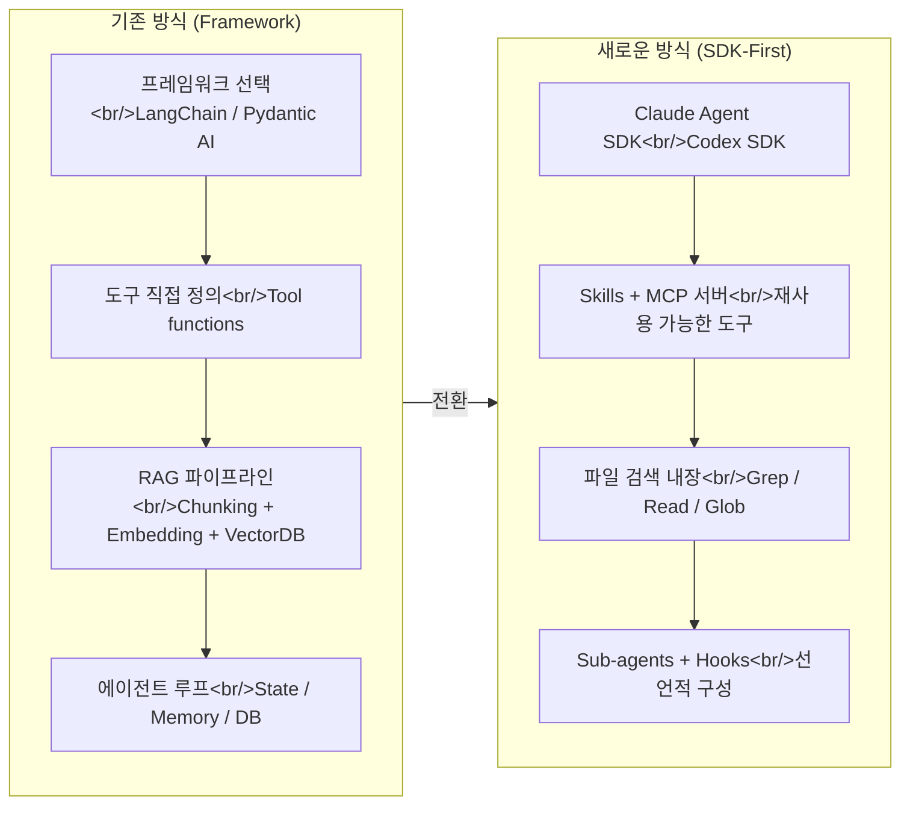

2024~2025년까지 AI 에이전트를 만들려면 프레임워크 선택부터 RAG 파이프라인, 상태 관리까지 직접 구축해야 했다. 하지만 2026년 현재, Claude Agent SDK와 Codex SDK 같은 "batteries-included" SDK가 등장하면서 에이전트 구축의 출발점 자체가 바뀌고 있다. 이번 포스트에서는 에이전트 아키텍처의 Old vs New 패러다임, 코딩 에이전트에 시각적 논증 능력을 부여하는 Excalidraw 스킬, 그리고 비개발자도 자기만의 AI 비서를 만들 수 있는 NotebookLM 활용법을 정리한다.

<!--more-->

## 1. Old vs New: 에이전트 구축 패러다임의 전환

### 기존 방식 (2024~2025)

전통적인 에이전트 구축 흐름은 다음과 같았다:

1. **프레임워크 선택** — LangChain, LangGraph, Pydantic AI, N8N 등에서 하나를 고른다
2. **도구 정의** — 파일 시스템 접근, 이메일 조회 등 에이전트 capability를 직접 구현한다
3. **RAG 구성** — chunking, embedding, retrieval 전략을 설계하고 벡터 DB에 연결한다
4. **에이전트 루프 구축** — 상태 관리, 대화 기록 저장, 메모리 시스템까지 직접 배선한다

이 방식의 핵심 문제는 **glue code가 너무 많다**는 것이다. DB 테이블 설계, 세션 관리, ingestion pipeline 등 에이전트의 "지능"과 무관한 인프라 코드가 전체 코드베이스의 상당 부분을 차지했다.

### 새로운 방식: SDK-First

Claude Agent SDK나 Codex SDK를 기반으로 구축하면 상황이 완전히 달라진다:

- **대화 기록 관리**가 SDK에 내장되어 있어 별도 DB 불필요
- **파일 검색 도구**(Grep, Read 등)가 이미 포함되어 있어 소규모 지식 베이스에 RAG가 불필요
- **Skills**와 **MCP 서버**로 도구를 재사용 가능한 형태로 추가
- **Sub-agent**, **Hooks**, **권한 설정**까지 단일 TypeScript/Python 파일에서 선언적으로 구성

실제로 Claude Agent SDK를 사용하면 이전보다 **더 많은 기능을 더 적은 코드로** 구현할 수 있다. Second Brain 시스템처럼 메모리 구축, 일일 리플렉션, 통합 관리까지 하나의 SDK 위에서 동작한다.

### 아키텍처 비교



### 언제 프레임워크가 여전히 필요한가?

SDK-First가 만능은 아니다. 다음 세 가지 한계가 명확하다:

| 기준 | SDK (Claude Agent SDK 등) | 프레임워크 (Pydantic AI 등) |
|---|---|---|
| **속도** | 추론 오버헤드로 느림 (10초+) | Sub-second 응답 가능 |
| **비용** | 토큰 소모 큼, 다수 사용자 시 API 비용 폭증 | 직접 제어로 비용 최적화 |
| **제어권** | 대화 기록/관찰성 제한적 | 모든 것을 직접 관리 |

**판단 기준은 두 가지다:**

1. **누가 쓰는가?** — 본인만 쓰면 SDK, 다수가 프로덕션에서 쓰면 프레임워크
2. **속도/규모 요구사항은?** — 지연 허용이면 SDK, 빠른 응답이 필수면 프레임워크

실무적으로는 **SDK로 프로토타이핑** 후 검증된 워크플로를 **프레임워크로 이식**하는 패턴이 가장 현실적이다. Skills와 MCP 서버는 양쪽 모두에서 재사용 가능하므로 전환 비용이 낮다.

### RAG는 죽었는가?

결론부터 말하면 **아니다** — 하지만 역할이 바뀌었다.

- **소규모 코드/문서**: 파일 검색(Grep)이 semantic search를 능가한다는 것이 증명됨 (LlamaIndex 연구)
- **대규모 지식 베이스**: 여전히 벡터 DB 기반 RAG가 필요 — 수천 개 문서를 Grep으로 탐색하는 건 비현실적
- **Skills가 RAG를 대체하는 영역**: 코드 컨텍스트 작업에서 `skill.md`가 chunking + embedding을 대체. 에이전트가 필요할 때 스킬을 로드하면 충분

핵심은 "RAG냐 아니냐"가 아니라, **지식의 규모와 접근 패턴에 맞는 검색 전략을 선택**하는 것이다.

## 2. Excalidraw 다이어그램 스킬: 코딩 에이전트의 시각적 논증

### 문제: 코딩 에이전트는 시각적이지 않다

Claude Code 같은 코딩 에이전트에게 "이걸 시각적으로 설명해줘"라고 하면, 대부분 단순한 박스 나열에 그친다. 색상, 레이아웃, 정보 계층 같은 시각적 의사결정은 LLM이 가장 어려워하는 영역 중 하나다.

### 해결: Excalidraw Skill

Cole Medin이 공개한 Excalidraw 다이어그램 스킬은 이 문제를 체계적으로 해결한다. 구조는 다음과 같다:

```
.claude/skills/excalidraw-diagram/
├── skill.md              # 핵심 워크플로 + 프롬프트
├── reference/
│   ├── color-palette.json  # 브랜드 컬러 시스템
│   └── element-templates/  # 재사용 가능한 도형 템플릿
└── render.py             # PNG 렌더링 (검증용)
```

### 워크플로

1. **아이디어 입력** — PDF, 코드베이스, YouTube 스크립트 등 어떤 소스든 가능
2. **깊이 평가** — 단순 다이어그램이면 한 번에, 복잡하면 섹션별 분할 (32K 토큰 제한 대응)
3. **패턴 매핑** — 필요한 도형, 텍스트, 화살표를 구조화
4. **JSON 생성** — Excalidraw 호환 JSON 파일 출력
5. **검증 루프** — PNG로 렌더링 후 스크린샷을 보고 2~4회 자체 수정

### 핵심 철학: Visual Argumentation

`skill.md`에 내장된 두 가지 검증 질문이 품질을 결정한다:

- **"시각적 구조가 개념의 동작을 반영하는가?"**
- **"이 다이어그램에서 구체적으로 배울 수 있는 것이 있는가?"**

설명 텍스트를 모두 제거해도 다이어그램의 구조만으로 논점이 전달되어야 한다는 원칙이다.

### 렌더링 옵션

- **excalidraw.com** — 무료, 브라우저에서 바로 JSON 로드
- **Obsidian Excalidraw 플러그인** — 노트와 다이어그램을 같은 vault에서 관리

첫 결과물이 완벽하지는 않지만, LLM이 색상/위치/레이아웃까지 모든 미세 결정을 내려야 하는 작업 특성상 당연하다. 중요한 것은 **2~3회 반복으로 실전 수준의 다이어그램에 도달**할 수 있다는 점이다.

## 3. NotebookLM 실전 활용법 12가지

Google NotebookLM은 **자신의 데이터로 커스텀 AI 비서를 만드는 도구**다. 개발자에게는 "코드 없는 RAG"라고 이해하면 정확하다 — 문서를 업로드하면 그 문서만을 기반으로 답변하는 AI가 만들어진다.

### 주요 활용 사례

| # | 활용법 | 설명 |
|---|---|---|
| 1 | **맞춤형 AI 비서** | 업무 매뉴얼, 사내 문서를 소스로 올려 팀 전용 Q&A 봇 구축 |
| 2 | **Deep Research** | 주제에 대한 소스를 자동 수집하고 종합 리포트 생성 |
| 3 | **소스 신뢰성 평가** | 업로드된 소스 간 교차 검증으로 정보 신뢰도 판단 |
| 4 | **회의록 분석** | 녹음 파일 업로드 후 핵심 결정사항과 액션 아이템 추출 |
| 5 | **논문 리뷰** | 여러 논문을 소스로 등록하고 핵심 논점 비교 분석 |
| 6 | **학습 가이드 생성** | 교재/강의 자료 기반 퀴즈와 요약 자동 생성 |
| 7 | **오디오 오버뷰** | 소스 내용을 팟캐스트 형식 오디오로 변환 |
| 8 | **계약서 분석** | 법률 문서의 핵심 조항과 리스크 포인트 추출 |
| 9 | **경쟁사 분석** | 여러 경쟁사 보고서를 소스로 등록해 비교 매트릭스 생성 |
| 10 | **이력서/자기소개서** | 직무기술서 + 자기 경력 소스로 맞춤형 지원서 초안 작성 |
| 11 | **블로그/콘텐츠 기획** | 리서치 소스를 등록하고 구조화된 콘텐츠 아웃라인 생성 |
| 12 | **프로젝트 문서화** | 기존 문서를 종합해 프로젝트 위키 형태로 재구성 |

### 소스 신뢰성 평가 프로세스

NotebookLM의 가장 강력한 기능 중 하나는 **소스 기반 답변**이다. hallucination을 줄이기 위해 업로드된 소스 범위 내에서만 답변하며, 답변에 인용 출처를 표시한다. 이를 활용한 신뢰성 평가 흐름:

1. 같은 주제에 대해 **서로 다른 출처의 문서 3~5개** 업로드
2. 핵심 주장에 대해 "이 주장을 지지하는 소스와 반박하는 소스를 정리해줘" 요청
3. 소스 간 **일치/불일치 영역**을 파악하여 정보 신뢰도 판단

### 무료 vs Pro

| 구분 | 무료 | Pro (Google One AI Premium) |
|---|---|---|
| 노트북 수 | 제한적 | 확장 |
| 소스 업로드 | 기본 | 대용량 지원 |
| 오디오 오버뷰 | 사용 가능 | 커스텀 옵션 추가 |
| 핵심 기능 | **대부분 무료로 사용 가능** | 고급 기능 추가 |

직장인 기준으로 **무료 티어만으로도 충분히 실전 활용이 가능**하다는 것이 핵심이다.

## 인사이트

**에이전트 구축의 본질이 변하고 있다.** "어떤 프레임워크를 쓸까?"에서 "에이전트에게 어떤 Skills를 줄까?"로 질문이 이동했다. SDK가 인프라를 추상화하면서, 개발자의 시간은 glue code가 아니라 **에이전트의 능력 설계**에 집중된다.

세 가지 영상에서 공통으로 드러나는 패턴:

1. **선언적 도구 구성의 승리** — Skills, MCP 서버, 소스 업로드 모두 "이것을 할 수 있다"를 선언하는 방식이다. 절차적으로 에이전트 루프를 짜는 시대에서 벗어나고 있다.
2. **검증 루프가 핵심 차별점** — Excalidraw 스킬의 자체 렌더링 검증, Stripe Minions의 결정론적 lint/test 노드, NotebookLM의 소스 기반 인용 — 모두 "AI가 만들고 시스템이 검증"하는 구조다.
3. **RAG는 사라지는 게 아니라 민주화되고 있다** — 개발자는 파일 검색과 Skills로 RAG를 대체하고, 비개발자는 NotebookLM으로 코드 없이 동일한 효과를 얻는다. 기술의 형태가 바뀌었을 뿐, "내 데이터로 AI를 특화시킨다"는 핵심 개념은 오히려 더 넓은 사용자층에 도달하고 있다.

---

**참고 영상:**
- [Everything You Thought About Building AI Agents is Wrong](https://www.youtube.com/watch?v=gmaHRwijOXs) — Cole Medin
- [Build BEAUTIFUL Diagrams with Claude Code (Full Workflow)](https://www.youtube.com/watch?v=m3fqyXZ4k4I) — Cole Medin
- [직장인이라면 지금 당장 써야 할 무료 AI | 노트북LM 실전 활용법 12가지](https://www.youtube.com/watch?v=eeJz8HAyTk0)
